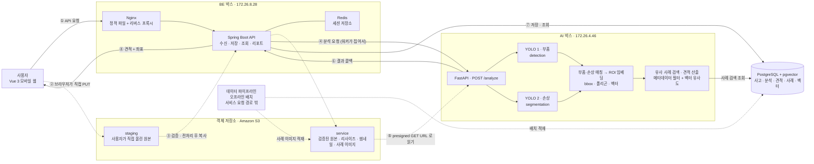

# 기술 아키텍처

이미지 분석 견적 서비스 — 요청 흐름과 저장소 경계

작성 2026-09-18 · 기준 커밋 `173afa0` · 저장소 코드 대조 완료

---

## 전체 구성


위 PNG 는 편집 원본 SVG 에서 그대로 내보낸 것이다. 둘은 같은 그림이다.

편집 가능한 원본: [technology-architecture.svg](./technology-architecture.svg)

```bash
npx svgexport Docs/Architecture/technology-architecture.svg Docs/Architecture/technology-architecture.png 2000:1300
```

> [!NOTE]
> 서버 종류(EC2 / Lightsail)는 아직 확정되지 않았다. **코드 검증 결과** 표를 함께 본다.

아래는 같은 구성을 코드에 맞춰 다시 그린 것이다.



---

## 구성요소

### Frontend

Vue 3.5.13 · vue-router 4.5 · Pinia 3.0 · Vite 6.2 · axios. **모바일 웹 SPA 이고 네이티브
앱은 없다** (네이티브 프로젝트도 PWA manifest 도 없다). TypeScript 를 쓰지 않는다.

화면 25개 · 라우트 31개 · 스토어 5개(`accidents` · `app` · `auth` · `checklist` · `vehicles`).

빌드 산출물은 정적 파일이고 Nginx 가 서빙한다. 진행 상태는 **폴링**으로 갱신한다 — SSE·
WebSocket 을 쓰지 않는다.

### Reverse Proxy

Nginx. **호스트에 설치돼 있고 컨테이너가 아니다** — CI 가 `systemctl reload nginx` 로
재적용한다. 정적 파일(`/var/www/a307`)을 서빙하고 `/api/**` 를 백엔드로 넘긴다.

### Backend

Java 21 · Spring Boot 4.1.1 · Spring Security(OAuth2 카카오·구글) · Spring Data JPA.
**MyBatis 를 쓰지 않는다.**

컨트롤러 33개 · API 매핑 97개 · 관리자 API 34개 · 내부 API 1개.

스키마는 `ddl-auto=validate` 이고 **마이그레이션 SQL 을 사람이 적용한다** — Flyway·Liquibase
가 없다. 어긋나면 그 API 만이 아니라 앱 전체가 기동하지 않는다.

비동기 작업은 **DB 폴링 워커 7개**가 처리한다. `@Scheduled` 로 주기마다 `QUEUED` 행을 보고
조건부 UPDATE 로 선점하므로, 인스턴스가 여러 개여도 한 건을 한 번만 집는다.

```
AnalysisRequestWorker  EstimateValidationWorker  EstimatePdfWorker  ValidationPdfWorker
RepairChecklistWorker  RepairQuestionWorker      EstimateNarrativeWorker
```

### Redis

**세션 저장소 전용이다.** `spring.session.data.redis.*` 만 설정돼 있고
(`namespace=a307:session`), `RedisTemplate` · `@Cacheable` · `RedisConnection` 을 쓰는 자바
코드가 **0건**이다.

**작업 큐가 아니다.** 큐는 PostgreSQL `analysis_job` 테이블이다. Redis 가 죽으면 로그인이
풀릴 뿐 분석은 계속 돈다.

### AI Server

Python · FastAPI 0.115.12 · uvicorn. 엔드포인트 5개 —
`/health` · `/inference` · `/search` · `/estimate` · `/analyze`.

`ANALYSIS_PROFILE` 로 목·실제를 가른다(기본 `production`).

YOLO **2모델**: 부품 detection(`damage_part_best-35ep.pt`) · 손상 segmentation
(`damage_best-60ep.pt`). 매칭 결과에서 ROI 를 떠 768차원 임베딩을 만들고 pgvector 로
유사 사례를 찾아 견적을 낸다.

**DB 는 읽기만 한다** — `vector_repository.py` 에 INSERT/UPDATE/DELETE 가 0건이다.
**S3 에 직접 접근하지 않는다** — boto3 의존성이 없고, 백엔드가 준 presigned GET URL 로
이미지를 HTTP 로 받는다.

### Database

PostgreSQL 16 + pgvector. 서비스 테이블 43개(정본 `Docs/Erd/A307_ddl_final.sql`)와
파이프라인 스테이징 5개(`aihub_*`, `pipeline/sql/003_aihub_staging.sql`)가 있다.

분석 좌표는 `analysis_image_result.detections` JSONB, 임베딩은 `vector(768)` 열이다.

### Object Storage

Amazon S3 **버킷 2개**.

| 버킷 | 쓰임 | 수명 |
| --- | --- | --- |
| `staging` | 브라우저가 presigned PUT 으로 직접 올리는 격리 구역 | 7일 뒤 자동 삭제 (설정은 저장소 밖) |
| `service` | 검증 통과본 · 리사이즈 · 썸네일 · 프로필 · 견적 문서 · PDF | 유지 |

업로드는 3단계다. URL 발급(`POST …/images/upload-urls`) → 브라우저가 S3 에 PUT →
완료 통보(`POST …/images`). 완료 통보 때 서버가 검증·전처리하고 `service` 로 복사한다.

**오버레이 이미지를 만들지 않는다.** 좌표 JSON 을 내려보내고 화면이 직접 그린다.

### Data Pipeline

오프라인 배치다. 백엔드가 호출하지 않는다. AI-Hub 원천을 표준 코드로 정규화해
수리 사례와 ROI 임베딩을 DB·S3 에 적재한다.

`shared/vision/` 를 AI 서버와 공유해 ROI·임베딩 계산이 양쪽에서 같은 결과를 내게 한다.

---

## 주요 요청 흐름

사용자 요청은 **분석 요청에서 한 번 끊긴다.** 화면이 기다리지 않는다.

1. `POST /api/accidents/{id}/analysis` — 작업을 `QUEUED` 로 만들고 **즉시 202**
2. `AnalysisRequestWorker` 가 폴링해 집어가고 AI 에 `POST /analyze`
3. AI 도 **즉시 202** 로 답하고 백그라운드로 추론
4. 끝나면 AI 가 `POST /internal/analysis-jobs/{jobId}/result` 로 결과를 보낸다
   (0 · 1 · 5 · 20초 네 번 시도)
5. 화면은 `GET /api/accidents/{id}/analysis` 를 폴링해 진행률을 본다

**양방향 통신이라 사설 IP 가 서로 닿아야 한다.**

```
BE(172.26.8.28) → AI(172.26.4.46:8000)      POST /analyze
AI(172.26.4.46) → BE(172.26.8.28:8080)      POST /internal/analysis-jobs/{id}/result
```

두 방향 모두 `X-Internal-Token` 을 쓴다. 백엔드 변수명은 `INTERNAL_API_TOKEN`, AI 쪽은
`AI_INTERNAL_TOKEN` 으로 다르지만 **값은 같아야 한다.**

AI → BE 방향이 막히면 증상이 "10분 동안 분석 중" 뿐이라 원인 찾기가 가장 어렵다.
10분은 `app.analysis-request.processing-timeout` 이고, 그 뒤 `ABANDONED` 로 끝난다.

### 유사 사례 검색 — 3단계로 넓힌다

`vector_repository.py` 가 좁은 쪽부터 시도하고 결과가 모자라면 넓힌다.

| 단계 | 조건 | 의미 |
| --- | --- | --- |
| `MODEL` | `repair_case.model_id` 일치 | 동일 차종 사례 |
| `PRICE_TIER` | `repair_case.price_tier` 일치 | 같은 가격대로 넓힘 |
| `ALL` | 조건 없음 | 전체 |

요청자의 가격대는 `vehicle_model.price_tier` 에서 매 요청마다 조회한다. 캐시가 없으므로
DB 값을 고치면 다음 검색부터 반영된다 — AI 서버 재배포가 필요 없다. 가격대가 없으면
추측하지 않고 `PRICE_TIER` 단계를 건너뛴다.

---

## 서비스 간 통신

| 출발 | 도착 | 프로토콜 | Endpoint | 데이터 | 동기 여부 |
| --- | --- | --- | --- | --- | --- |
| 브라우저 | Nginx → Spring | HTTPS | `/api/**` | JSON | 동기 |
| 브라우저 | S3 `staging` | HTTPS | presigned PUT | 이미지 바이트 | 동기 |
| Spring | S3 | HTTPS (SDK) | — | 검증·복사·삭제 | 동기 |
| Spring | FastAPI | HTTP (사설망) | `POST /analyze` | 이미지 presigned GET URL · 차량 정보 · callbackUrl | **비동기** (202) |
| FastAPI | S3 `service` | HTTPS | presigned GET | 이미지 바이트 | 동기 |
| FastAPI | PostgreSQL | psycopg | — | 사례·벡터 **읽기만** | 동기 |
| FastAPI | Spring | HTTP (사설망) | `POST /internal/analysis-jobs/{jobId}/result` | 분석·견적 결과 | **비동기** (재시도 0·1·5·20초) |
| Spring | Redis | RESP | — | 세션 | 동기 |
| Spring | PostgreSQL | JDBC | — | 전부 | 동기 |
| Spring | GMS(LLM) | HTTPS | `/v1/chat/completions` 등 | 요약·체크리스트·질문 | 동기 (워커 안에서) |
| 파이프라인 | PostgreSQL · S3 | — | — | 사례·임베딩·이미지 적재 | 오프라인 |

---

## 데이터 저장 경계

| 데이터 | 생성 주체 | 저장 위치 | 조회 주체 |
| --- | --- | --- | --- |
| 회원 · 차량 · 사고 | Backend | PostgreSQL | Backend |
| 세션 | Backend | Redis | Backend |
| 업로드 원본 | 브라우저 | S3 `staging` (7일) | Backend |
| 검증본 · 리사이즈 · 썸네일 | Backend | S3 `service` | Backend · **AI(presigned GET)** |
| 분석 작업 상태 | Backend | PostgreSQL `analysis_job` | Backend |
| 분석 단계 | Backend | PostgreSQL `analysis_stage` | Backend |
| 손상 부위 · 좌표 | AI → Backend(콜백) | PostgreSQL `damaged_part` · `analysis_image_result` | Backend |
| 견적 · 견적 항목 | AI → Backend(콜백) | PostgreSQL `estimate` · `estimate_item` | Backend |
| 체크리스트 · 정비소 질문 | Backend(LLM) | PostgreSQL | Backend |
| PDF | Backend | S3 `service` | Backend |
| 수리 사례 · ROI 임베딩 | **파이프라인** | PostgreSQL (`vector(768)`) · S3 | **AI (읽기)** |

---

## 코드 검증 결과

| 이미지 표현 | 실제 구현 | 코드 근거 | 비고 |
| --- | --- | --- | --- |
| `React Web / App` | **Vue 3.5.13, 앱 없음** | `frontend/package.json`, 네이티브·PWA 파일 없음 | **SVG·PNG 둘 다 고쳤다** |
| Redis `작업 큐 · 상태 캐시` | **세션 저장소 전용** | `spring.session.data.redis.*`. `RedisTemplate`·`@Cacheable` 0건 | 큐는 `analysis_job` 테이블 |
| `EC2 1` · `EC2 2` | **확인 필요** | 저장소에 IaC 가 없다 | 문서끼리 어긋난다(아래) |
| 워커 6개 | **7개** | `find -name "*Worker.java"` | `-537` 이 `EstimateNarrativeWorker` 추가 |
| AI 가 S3 를 읽는다 | **presigned GET URL 경유** | `AnalysisRequestPayload.Image.url`, boto3 의존성 0 | SDK 직접 접근이 아니다 |
| S3 버킷 둘 | `staging` · `service` | `app.object-storage.*-bucket` | 정확 |
| 브라우저 직접 PUT | presigned 3단계 | `AccidentImageController:44,58` | 정확 |
| AI 가 DB 에 쓴다 | **쓰지 않는다** | `vector_repository.py` 쓰기 0건 | 정확 |
| 오버레이 이미지 | **없다. 좌표 JSON** | `analysis_image_result.detections` | 정확 |
| YOLO 2모델 | 부품 detect · 손상 segment | `AI/server/app/core/config.py:41,43` | 정확 |
| 파이프라인이 요청 경로 밖 | 백엔드가 호출하지 않는다 | 호출 코드 0건 | 정확 |
| 콜백 재시도 | 0 · 1 · 5 · 20초 | `CALLBACK_RETRY_DELAYS` | 정확 |
| pgvector | `vector(768)` | `A307_ddl_final.sql:410` | 정확 |

흐름 ①~⑧ 의 항목별 판정은
[문서-코드 정합성 감사 §3-1](../audit/문서-코드-정합성.md) 에 있다.

---

## 확인하지 못한 내용

- **서버 종류와 대수.** 이 문서는 이전 판에서 Lightsail 이라고 적었으나,
  `인프라 실행 교본.md` 는 `EC2 2대`, `Docs/AI/AI 서버 API 명세.md` 는 `EC2 2`,
  `application.properties` 주석은 "배포 EC2 IAM 역할" 이라고 적고 있다.
  **저장소에 IaC 가 없어 코드로 판정할 수 없다.** 콘솔을 본 사람이 정하고 네 곳을 함께 고쳐야 한다.
- **S3 `staging` 7일 lifecycle.** `application.properties` 주석에만 있고 버킷 설정은
  저장소 밖이다.
- **AI 서버 실제 기동.** 이 환경에 `fastapi` 가 설치돼 있지 않아 import 검사조차 하지 못했다.
- ~~**PNG 재내보내기.**~~ 2026-09-18 해결했다. `npx svgexport` 로 SVG 에서 PNG 를 다시
  내보냈고 두 파일이 같은 그림이다.
