# A307 바른견적 — 백엔드 DB ERD

> 생성일 **2026-09-16** · 기준 커밋 `0416f39` (branch `develop`) · 작업 트리 스냅샷 **08:28–08:45**
>
> ⚠ **조사 중 다른 세션이 이 저장소를 편집하고 있었습니다.** 08:38 에 `schema-h2.sql` · `SchemaConformityTest.java` 가
> 바뀌고 `backend/src/main/java/com/ssafy/a307/batch/` 패키지(관리자 배치 조회 기능)가 추가됐습니다 — 모두 미커밋입니다.
> 아래 수치는 **08:45 시점**으로 맞췄습니다. **정본 DDL 은 이 기간에 변하지 않았습니다**
> (`Docs/Erd/A307_ddl_final.sql` · 2026-09-15 10:50 · md5 `329a7372e648585ccc44094e263e8d77` · 42테이블).
> 따라서 컬럼 명세·FK·관계·인덱스는 그대로 유효하고, 바뀐 것은 H2 커버리지 관련 수치뿐입니다.
> 근거는 저장소의 정본 DDL·마이그레이션·엔티티·네이티브 쿼리·테스트 스키마이며, 운영 DB 에 접속해 확인한 것이 아닙니다.
> **이 문서는 애플리케이션 코드와 DB 스키마를 변경하지 않습니다.** 기존 `Docs/Erd/` 산출물도 삭제·수정하지 않았습니다.

## 0. 먼저 — 이 저장소는 MyBatis 를 쓰지 않습니다

작업 지시는 MyBatis Mapper XML 을 1순위 근거로 삼도록 했지만, 저장소에 **Mapper XML 0건 · `mybatis` 의존성 0건**입니다.
`backend/build.gradle:23` 이 `spring-boot-starter-data-jpa` 를 쓰고 `spring.jpa.hibernate.ddl-auto=validate` 로 기동합니다.
그래서 근거 우선순위를 다음과 같이 바꿔 적용했습니다.

| 순위 | 지시서 | 이 저장소에 실제로 적용한 것 |
|---|---|---|
| 1 | 운영/현재 migration·DDL | `Docs/Erd/A307_ddl_final.sql` (정본) + `Docs/Erd/migrations/*.sql` 9건 |
| 2 | MyBatis Mapper XML | **없음** → 네이티브 `@Query` 38건의 SQL |
| 3 | Entity·Domain | `@Entity` 33개 클래스 |
| 4 | Repository·Service | Spring Data JPA 파생 쿼리 |
| 5 | 테스트 스키마 | `backend/src/test/resources/schema-h2.sql` (33테이블) |
| 6 | 기존 DB 문서 | `Docs/Erd/*.md`, `바른견적_ERD.png` |

정본 DDL 이 1순위인 근거는 저장소가 스스로 그렇게 선언하기 때문입니다 — `schema-h2.sql` 머리말이
"정본은 `Docs/Erd/A307_ddl_final.sql` 이다" 라고 적고, `SchemaConformityTest` 가 둘을 컬럼·NULL·CHECK 단위로 대조합니다.

## 1. 요약

| 항목 | 값 |
|---|---|
| 전체 테이블 | **42** |
| 전체 컬럼 | **399** |
| 물리 FK 제약 | **51** |
| ├ ON DELETE CASCADE | 27 |
| ├ ON DELETE RESTRICT | 16 |
| └ ON DELETE SET NULL | 8 |
| 필수 관계 (FK NOT NULL) | 37 |
| 선택 관계 (FK NULL 허용) | 14 |
| 1:N 관계 | 47 |
| 1:0..1 관계 | 4 |
| N:M 중간 테이블 | 0 (해당 없음) |
| 논리 전용 관계 (FK 없음) | 4 |
| 인덱스 | 38 (부분 인덱스 13 · 그중 UNIQUE 5) |
| JPA 엔티티 클래스 | 33 (매핑 테이블 32 — `estimate` 는 `Estimate`·`EstimateReadModel` 2개가 매핑) |
| H2 테스트 스키마 테이블 | 33 |
| 정본에만 있고 H2 에 없는 테이블 | 9 (`SchemaConformityTest.KNOWN_MISSING_TABLES`) |

**N:M 관계는 없습니다.** 42개 테이블 어디에도 두 부모를 잇기만 하는 순수 연결 테이블이 없고,
`repair_case_roi_embedding` 처럼 FK 를 셋 가진 테이블도 자체 PK 와 속성(`embedding`, `confidence`)을 가진 실체 테이블입니다.

## 2. 전체 ERD

전체 42테이블 한 장입니다. 가독성을 위해 **PK·FK·UNIQUE 참여 컬럼과 상태 컬럼만** 표시했습니다 —
전체 컬럼은 4장 명세표에, 표현할 수 없는 CHECK·복합 제약은 각 테이블 아래 설명에 있습니다.
점선(`..`)은 물리 FK 가 없는 논리 관계입니다.

```mermaid
erDiagram
    part_code ||--o{ part_name_mapping : "part_code"
    member ||--o{ terms_agreement : "member_id"
    member ||--o{ vehicle : "member_id"
    vehicle_model ||--o{ vehicle : "model_id"
    vehicle ||--o{ accident : "vehicle_id"
    accident ||--o{ accident_image : "accident_id"
    accident_image ||--o{ accident_image_asset : "image_id"
    accident ||--o{ analysis_job : "accident_id"
    analysis_job ||--o{ analysis_stage : "job_id"
    analysis_job ||--o{ analysis_image_result : "job_id"
    accident_image ||--o{ analysis_image_result : "image_id"
    analysis_job ||--o{ damaged_part : "job_id"
    part_code ||--o{ damaged_part : "part_code"
    vehicle_model |o--o{ repair_case : "model_id"
    repair_case ||--o{ repair_case_item : "case_id"
    part_code |o--o{ repair_case_item : "part_code"
    batch_job_execution ||--o{ data_validation_error : "batch_job_execution_id"
    repair_case ||--o{ repair_case_image : "case_id"
    repair_case_image ||--o{ repair_case_damage_feature : "case_image_id"
    feature_pipeline_version ||--o{ repair_case_damage_feature : "pipeline_version_id"
    part_code |o--o{ repair_case_damage_feature : "part_code"
    repair_case_image ||--o{ repair_case_roi_embedding : "case_image_id"
    embedding_model_version ||--o{ repair_case_roi_embedding : "model_version_id"
    repair_case_damage_feature ||--o{ repair_case_roi_embedding : "damage_feature_id"
    repair_case_image ||--o{ repair_case_image_part_annotation : "case_image_id"
    part_code ||--o{ repair_case_image_part_annotation : "part_code"
    analysis_job ||--o{ estimate : "job_id"
    estimate ||--o{ estimate_item : "estimate_id"
    damaged_part ||--o{ estimate_item : "damaged_part_id"
    estimate ||--o{ estimate_report : "estimate_id"
    part_code |o--o{ repair_method_rule : "part_code"
    member |o--o{ estimate_validation_rule : "changed_by"
    member ||--o{ estimate_validation : "member_id"
    accident ||--o{ estimate_validation : "accident_id"
    estimate |o--o{ estimate_validation : "estimate_id"
    estimate_validation_rule |o--o{ estimate_validation : "rule_version"
    estimate_validation ||--o{ estimate_validation_item : "validation_id"
    part_code |o--o{ estimate_validation_item : "part_code"
    estimate_validation ||--o{ estimate_validation_report : "validation_id"
    estimate_validation ||--o{ estimate_validation_question : "validation_id"
    estimate_validation_item |o--o{ estimate_validation_question : "validation_item_id"
    member |o--o{ audit_log : "actor_member_id"
    accident ||--o| repair_checklist : "accident_id"
    repair_checklist ||--o{ repair_checklist_item : "checklist_id"
    repair_checklist_common_item |o--o{ repair_checklist_item : "common_code"
    accident ||--o| repair_question : "accident_id"
    repair_question ||--o{ repair_question_item : "question_id"
    part_code |o--o{ repair_question_item : "part_code"
    accident ||--o| accident_review : "accident_id"
    analysis_job |o--o{ accident_review : "reviewed_job_id"
    member |o--o{ accident_review : "reviewer_member_id"
    vehicle_model ||..o{ accident : "snapshot_model_id (논리)"
    feature_pipeline_version ||..o{ analysis_job : "pipeline_version_id (논리)"
    part_code ||..o{ repair_cost_stat : "part_code (논리)"
    accident ||..o{ repair_case : "external_ref (논리)"

    member {
        bigserial member_id PK
        varchar provider UK
        varchar provider_user_id UK
        varchar status
    }
    terms_agreement {
        bigserial agreement_id PK
        bigint member_id FK
    }
    vehicle_model {
        bigserial model_id PK
        varchar manufacturer UK
        varchar model_name UK
        boolean is_active
    }
    vehicle {
        bigserial vehicle_id PK
        bigint member_id FK
        bigint model_id FK
    }
    accident {
        bigserial accident_id PK
        bigint vehicle_id FK
    }
    accident_image {
        bigserial image_id PK
        bigint accident_id FK
    }
    accident_image_asset {
        bigserial asset_id PK
        bigint image_id FK
        varchar variant UK
    }
    analysis_job {
        bigserial job_id PK
        bigint accident_id FK
        varchar status
    }
    analysis_stage {
        bigserial stage_id PK
        bigint job_id FK
        varchar stage UK
        varchar status
    }
    analysis_image_result {
        bigserial result_id PK
        bigint job_id FK
        bigint image_id FK
    }
    damaged_part {
        bigserial damaged_part_id PK
        bigint job_id FK
        varchar part_code FK
    }
    estimate {
        bigserial estimate_id PK
        bigint job_id FK
        smallint version UK
    }
    estimate_item {
        bigserial estimate_item_id PK
        bigint estimate_id FK
        bigint damaged_part_id FK
    }
    estimate_notice {
        varchar code PK
        boolean is_active
    }
    estimate_report {
        bigserial report_id PK
        bigint estimate_id FK
        varchar report_no UK
        varchar status
    }
    estimate_validation {
        bigserial validation_id PK
        bigint member_id FK
        bigint accident_id FK
        bigint estimate_id FK
        varchar status
        integer rule_version FK
    }
    estimate_validation_item {
        bigserial validation_item_id PK
        bigint validation_id FK
        smallint line_no UK
        varchar part_code FK
    }
    estimate_validation_report {
        bigint validation_id PK
        varchar status
    }
    estimate_validation_question {
        bigserial question_id PK
        bigint validation_id FK
        bigint validation_item_id FK
        varchar source_flag UK
        smallint display_order UK
    }
    estimate_validation_rule {
        integer rule_version PK
        bigint changed_by FK
    }
    repair_checklist_common_item {
        varchar code PK
        boolean is_active
    }
    repair_checklist {
        bigserial checklist_id PK
        bigint accident_id FK
        varchar status
    }
    repair_checklist_item {
        bigserial item_id PK
        bigint checklist_id FK
        varchar source
        varchar common_code FK
    }
    repair_question {
        bigserial question_id PK
        bigint accident_id FK
        varchar status
    }
    repair_question_item {
        bigserial item_id PK
        bigint question_id FK
        varchar source
        varchar part_code FK
    }
    accident_review {
        bigserial review_id PK
        bigint accident_id FK
        varchar status
        bigint reviewed_job_id FK
        bigint reviewer_member_id FK
    }
    part_code {
        varchar part_code PK
        boolean is_active
        varchar code_scope
    }
    part_name_mapping {
        varchar raw_name PK
        varchar part_code FK
    }
    repair_code {
        varchar code_type PK
        varchar code PK
        boolean is_active
    }
    repair_method_rule {
        bigserial rule_id PK
        varchar part_code FK
        boolean is_active
    }
    audit_log {
        bigserial audit_log_id PK
        bigint actor_member_id FK
    }
    repair_case {
        bigserial case_id PK
        varchar source UK
        varchar external_ref UK
        bigint model_id FK
    }
    repair_case_item {
        bigserial case_item_id PK
        bigint case_id FK
        varchar source_item_key UK
        varchar part_code FK
        varchar line_type
    }
    repair_case_image {
        bigserial case_image_id PK
        bigint case_id FK
        varchar source_image_ref UK
    }
    repair_case_damage_feature {
        bigserial damage_feature_id PK
        bigint case_image_id FK
        bigint pipeline_version_id FK
        smallint roi_index UK
        varchar part_code FK
    }
    repair_case_roi_embedding {
        bigserial roi_embedding_id PK
        bigint case_image_id FK
        bigint model_version_id FK
        bigint damage_feature_id FK
    }
    repair_case_image_part_annotation {
        bigserial case_image_part_annotation_id PK
        bigint case_image_id FK
        varchar part_code FK
        varchar source_annotation_ref UK
    }
    embedding_model_version {
        bigserial model_version_id PK
        varchar model_name UK
        varchar version UK
        boolean is_active
    }
    feature_pipeline_version {
        bigserial pipeline_version_id PK
        varchar pipeline_name UK
        varchar version UK
        boolean is_active
    }
    repair_cost_stat {
        bigserial stat_id PK
        varchar car_class UK
        varchar part_code UK
        varchar damage_type UK
        varchar repair_method UK
        varchar source UK
    }
    batch_job_execution {
        bigserial batch_job_execution_id PK
        varchar status
    }
    data_validation_error {
        bigserial data_validation_error_id PK
        bigint batch_job_execution_id FK
    }
```

## 3. 도메인별 ERD

도메인은 `backend/src/main/java/com/ssafy/a307/` 의 패키지 구조와 정본 DDL 의 절 구분을 따랐습니다.
**공통 테이블은 전체 ERD 에 한 번만 정의**하고, 도메인 ERD 에서 바깥 테이블은 PK 만 표시해 연결만 보입니다.


### 회원·인증

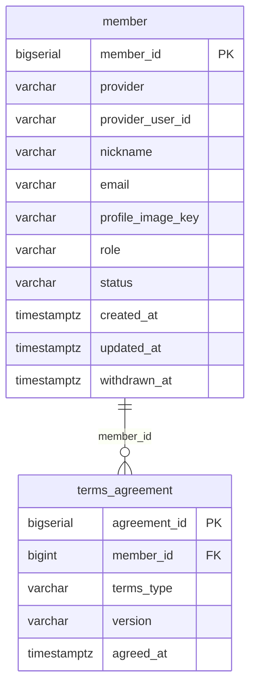

### 차량

> 바깥 도메인 테이블 `member` 는 연결만 보이도록 PK 만 표시합니다.

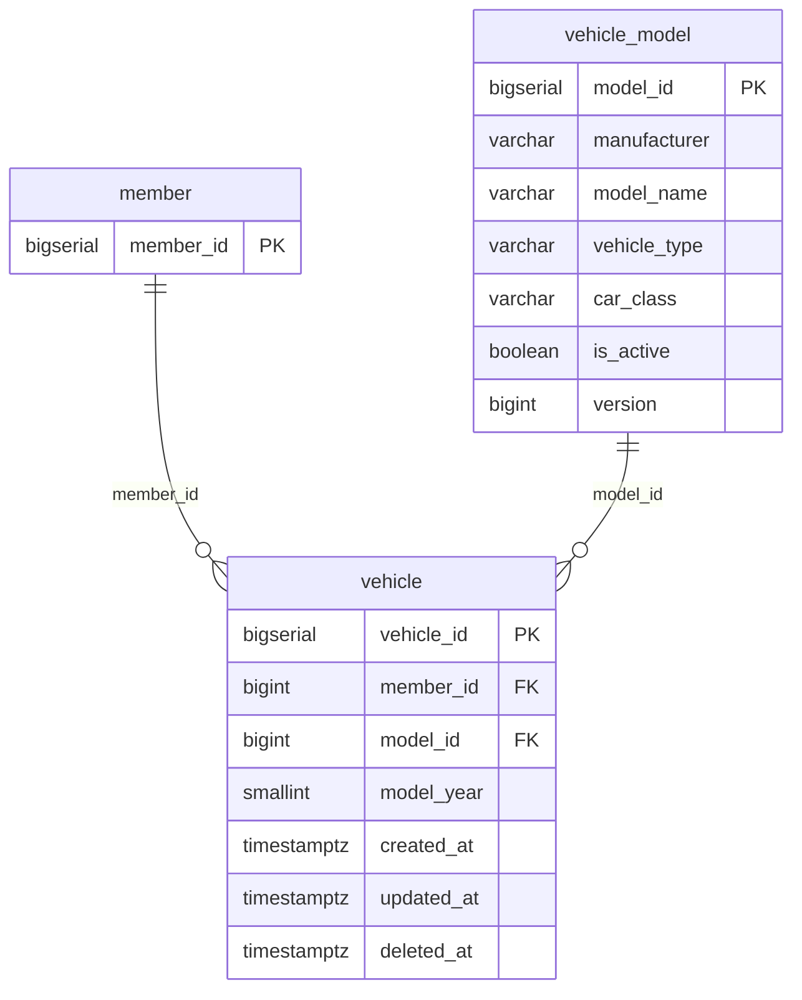

### 사고·이미지

> 바깥 도메인 테이블 `vehicle`, `vehicle_model` 는 연결만 보이도록 PK 만 표시합니다.

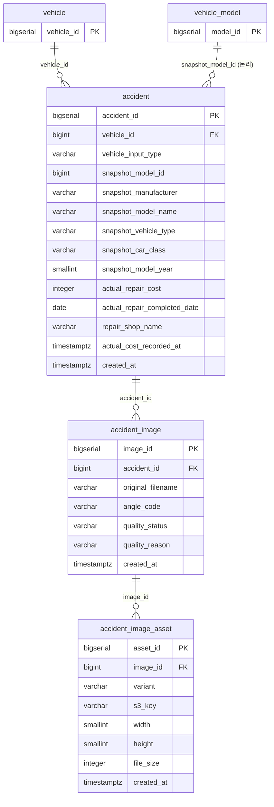

### 분석

> 바깥 도메인 테이블 `accident`, `accident_image`, `feature_pipeline_version`, `part_code` 는 연결만 보이도록 PK 만 표시합니다.

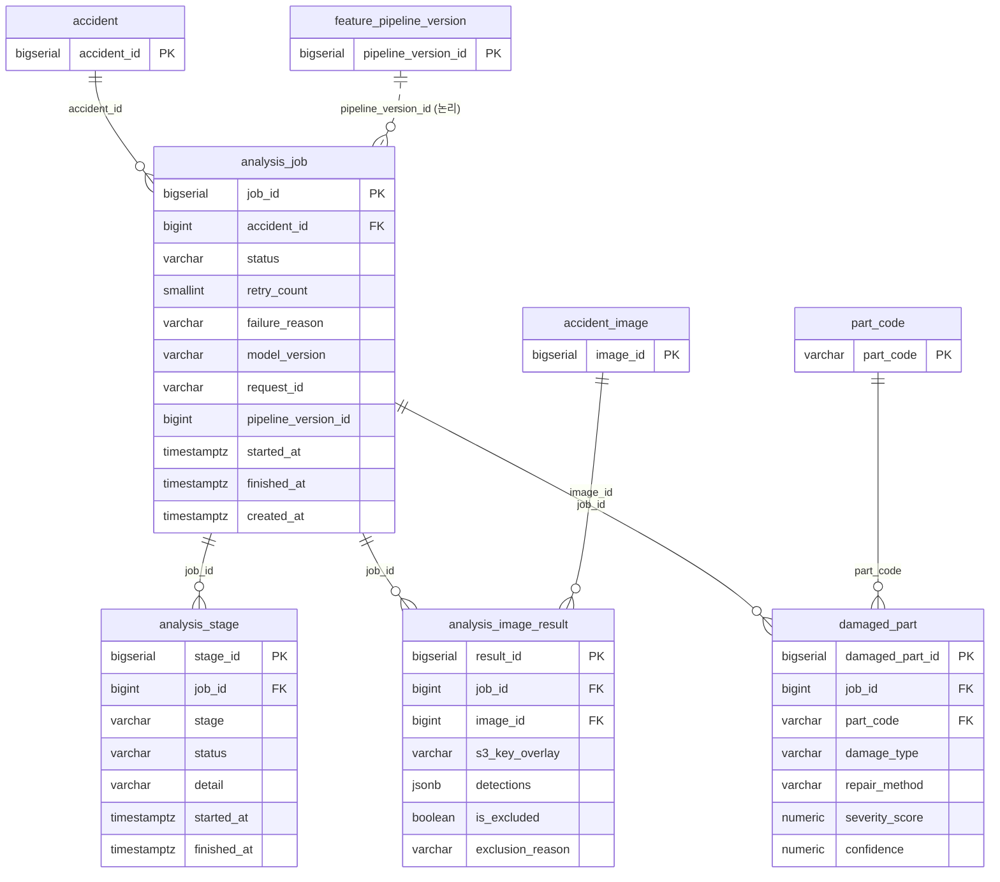

### 예상 견적

> 바깥 도메인 테이블 `analysis_job`, `damaged_part` 는 연결만 보이도록 PK 만 표시합니다.

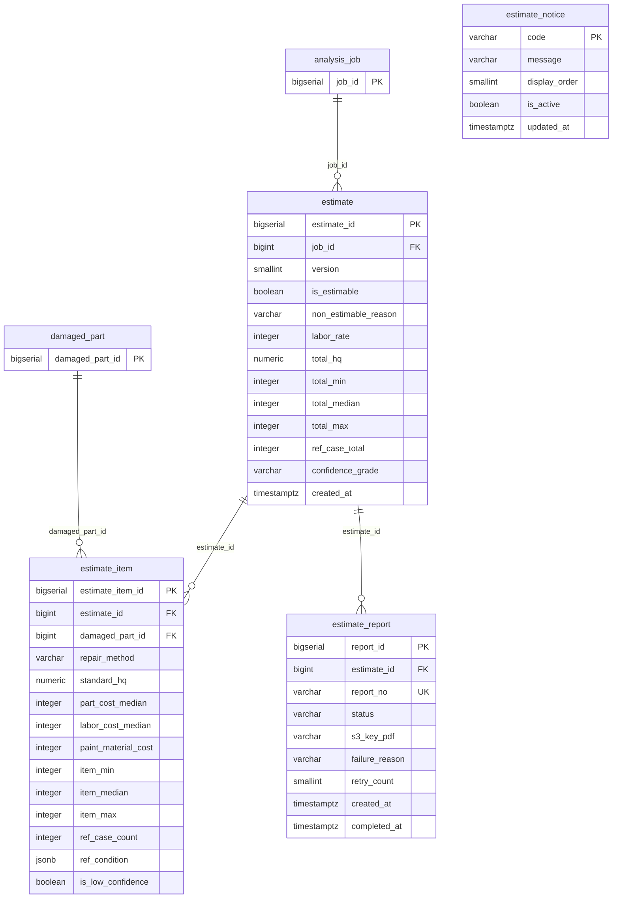

### 견적서 검증

> 바깥 도메인 테이블 `accident`, `estimate`, `member`, `part_code` 는 연결만 보이도록 PK 만 표시합니다.

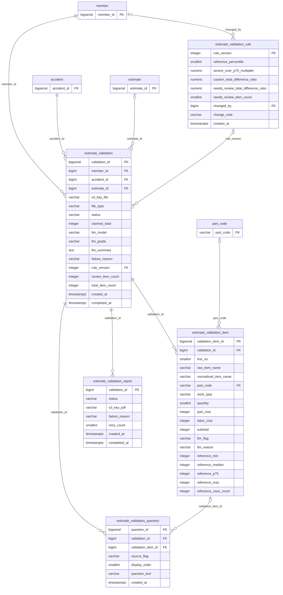

### 정비 체크리스트·확인 질문

> 바깥 도메인 테이블 `accident`, `part_code` 는 연결만 보이도록 PK 만 표시합니다.

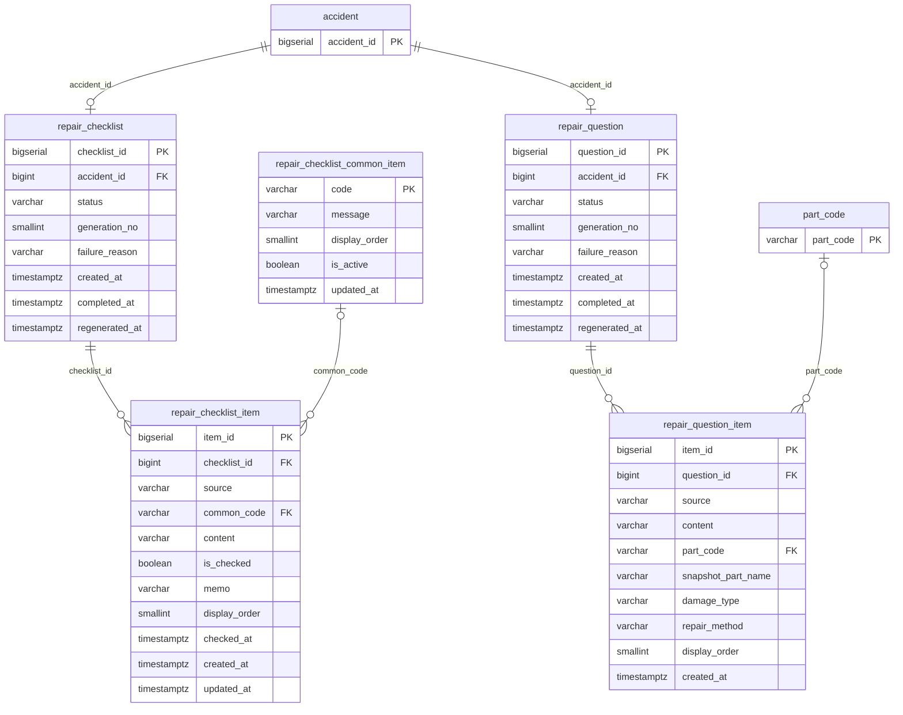

### 사고 데이터 검수

> 바깥 도메인 테이블 `accident`, `analysis_job`, `member` 는 연결만 보이도록 PK 만 표시합니다.

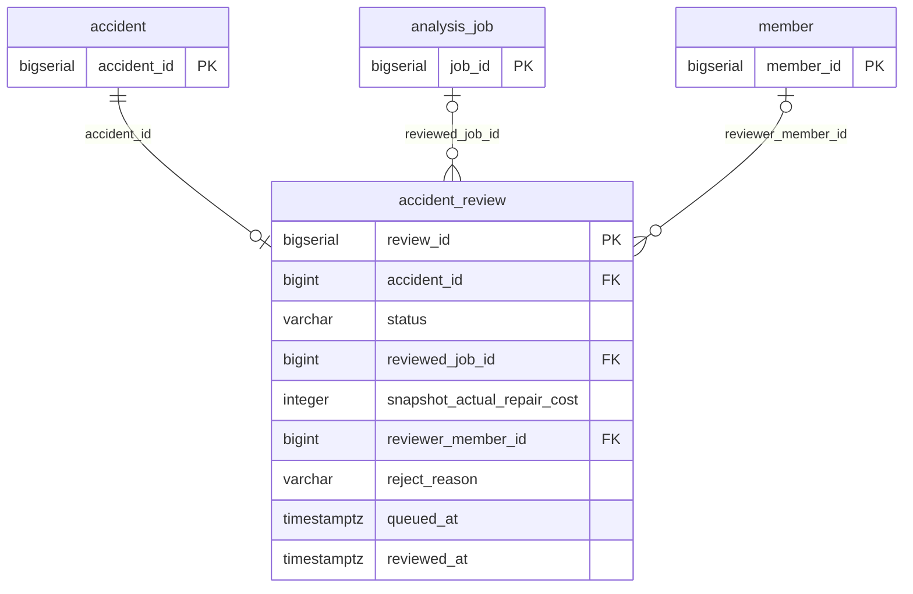

### 기준정보·관리자 마스터

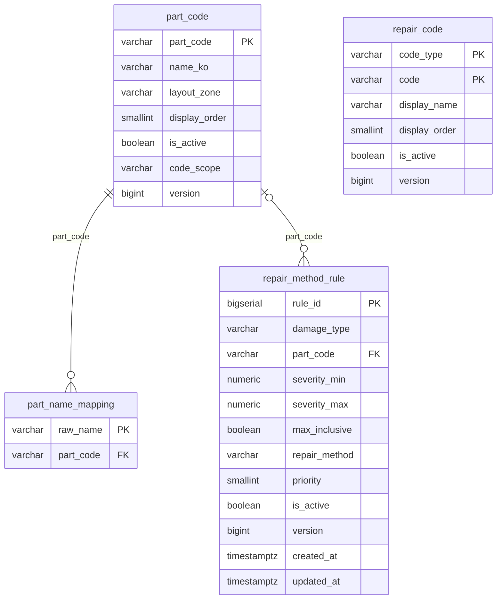

### 감사 로그

> 바깥 도메인 테이블 `member` 는 연결만 보이도록 PK 만 표시합니다.

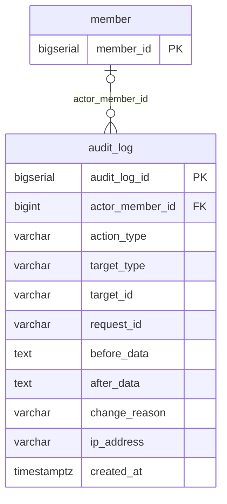

### 사례 코퍼스·유사도 검색 (파이프라인 소유)

> 바깥 도메인 테이블 `accident`, `part_code`, `vehicle_model` 는 연결만 보이도록 PK 만 표시합니다.

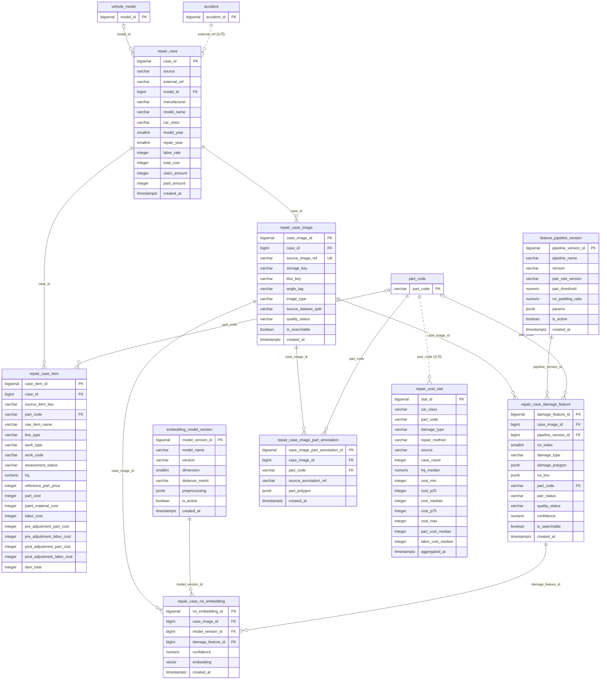

### 배치 실행 이력

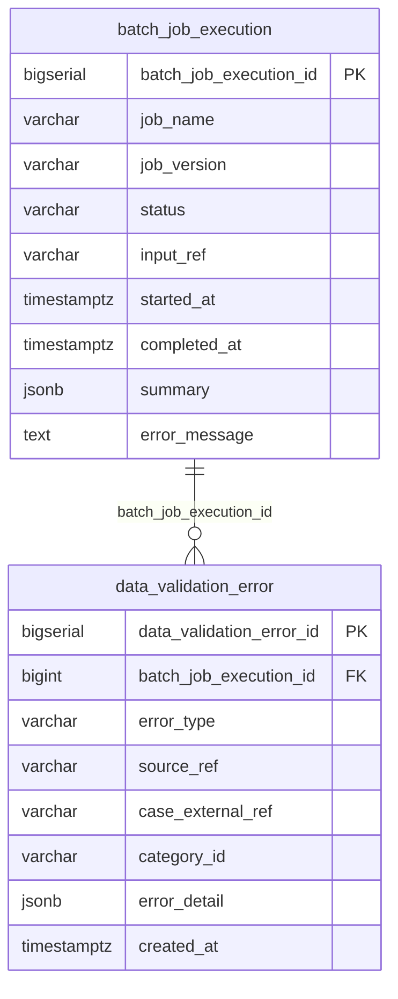


## 4. 전체 테이블 목록

| # | 테이블 | 도메인 | 컬럼 | PK | 나가는 FK | 들어오는 FK | H2 | 백엔드 접근 |
|---|---|---|---|---|---|---|---|---|
| 1 | `member` | 회원·인증 | 11 | `member_id` | 0 | 6 | O | JPA 엔티티 |
| 2 | `terms_agreement` | 회원·인증 | 5 | `agreement_id` | 1 | 0 | O | JPA 엔티티 |
| 3 | `vehicle_model` | 차량 | 7 | `model_id` | 0 | 2 | O | JPA 엔티티 |
| 4 | `vehicle` | 차량 | 7 | `vehicle_id` | 2 | 1 | O | JPA 엔티티 |
| 5 | `accident` | 사고·이미지 | 14 | `accident_id` | 1 | 6 | O | JPA 엔티티 |
| 6 | `accident_image` | 사고·이미지 | 7 | `image_id` | 1 | 2 | O | JPA 엔티티 |
| 7 | `accident_image_asset` | 사고·이미지 | 8 | `asset_id` | 1 | 0 | O | JPA 엔티티 |
| 8 | `analysis_job` | 분석 | 11 | `job_id` | 1 | 5 | O | JPA 엔티티 |
| 9 | `analysis_stage` | 분석 | 7 | `stage_id` | 1 | 0 | O | JPA 엔티티 |
| 10 | `analysis_image_result` | 분석 | 7 | `result_id` | 2 | 0 | O | JPA 엔티티 |
| 11 | `damaged_part` | 분석 | 7 | `damaged_part_id` | 2 | 1 | O | JPA 엔티티 |
| 12 | `estimate` | 예상 견적 | 13 | `estimate_id` | 1 | 3 | O | JPA 엔티티 |
| 13 | `estimate_item` | 예상 견적 | 14 | `estimate_item_id` | 2 | 0 | O | JPA 엔티티 |
| 14 | `estimate_notice` | 예상 견적 | 5 | `code` | 0 | 0 | O | JPA 엔티티 |
| 15 | `estimate_report` | 예상 견적 | 9 | `report_id` | 1 | 0 | X | 네이티브 쿼리 |
| 16 | `estimate_validation` | 견적서 검증 | 17 | `validation_id` | 4 | 3 | O | JPA 엔티티 |
| 17 | `estimate_validation_item` | 견적서 검증 | 18 | `validation_item_id` | 2 | 1 | O | JPA 엔티티 |
| 18 | `estimate_validation_report` | 견적서 검증 | 7 | `validation_id` | 1 | 0 | O | JPA 엔티티 |
| 19 | `estimate_validation_question` | 견적서 검증 | 7 | `question_id` | 2 | 0 | O | JPA 엔티티 |
| 20 | `estimate_validation_rule` | 견적서 검증 | 9 | `rule_version` | 1 | 1 | O | JPA 엔티티 |
| 21 | `repair_checklist_common_item` | 정비 체크리스트·확인 질문 | 5 | `code` | 0 | 1 | O | JPA 엔티티 |
| 22 | `repair_checklist` | 정비 체크리스트·확인 질문 | 8 | `checklist_id` | 1 | 1 | O | JPA 엔티티 |
| 23 | `repair_checklist_item` | 정비 체크리스트·확인 질문 | 11 | `item_id` | 2 | 0 | O | JPA 엔티티 |
| 24 | `repair_question` | 정비 체크리스트·확인 질문 | 8 | `question_id` | 1 | 1 | O | JPA 엔티티 |
| 25 | `repair_question_item` | 정비 체크리스트·확인 질문 | 10 | `item_id` | 2 | 0 | O | JPA 엔티티 |
| 26 | `accident_review` | 사고 데이터 검수 | 9 | `review_id` | 3 | 0 | O | JPA 엔티티 |
| 27 | `part_code` | 기준정보·관리자 마스터 | 7 | `part_code` | 0 | 8 | O | JPA 엔티티 |
| 28 | `part_name_mapping` | 기준정보·관리자 마스터 | 2 | `raw_name` | 1 | 0 | O | JPA 엔티티 |
| 29 | `repair_code` | 기준정보·관리자 마스터 | 6 | `code_type, code` | 0 | 0 | O | JPA 엔티티 |
| 30 | `repair_method_rule` | 기준정보·관리자 마스터 | 12 | `rule_id` | 1 | 0 | O | JPA 엔티티 |
| 31 | `audit_log` | 감사 로그 | 11 | `audit_log_id` | 1 | 0 | O | JPA 엔티티 |
| 32 | `repair_case` | 사례 코퍼스·유사도 검색 (파이프라인 소유) | 14 | `case_id` | 1 | 2 | X | 네이티브 쿼리 |
| 33 | `repair_case_item` | 사례 코퍼스·유사도 검색 (파이프라인 소유) | 19 | `case_item_id` | 2 | 0 | X | 네이티브 쿼리 |
| 34 | `repair_case_image` | 사례 코퍼스·유사도 검색 (파이프라인 소유) | 11 | `case_image_id` | 1 | 3 | X | 네이티브 쿼리 |
| 35 | `repair_case_damage_feature` | 사례 코퍼스·유사도 검색 (파이프라인 소유) | 13 | `damage_feature_id` | 3 | 1 | X | 없음 |
| 36 | `repair_case_roi_embedding` | 사례 코퍼스·유사도 검색 (파이프라인 소유) | 7 | `roi_embedding_id` | 3 | 0 | X | 없음 |
| 37 | `repair_case_image_part_annotation` | 사례 코퍼스·유사도 검색 (파이프라인 소유) | 6 | `case_image_part_annotation_id` | 2 | 0 | X | 없음 |
| 38 | `embedding_model_version` | 사례 코퍼스·유사도 검색 (파이프라인 소유) | 8 | `model_version_id` | 0 | 1 | X | 없음 |
| 39 | `feature_pipeline_version` | 사례 코퍼스·유사도 검색 (파이프라인 소유) | 9 | `pipeline_version_id` | 0 | 1 | X | 없음 |
| 40 | `repair_cost_stat` | 사례 코퍼스·유사도 검색 (파이프라인 소유) | 16 | `stat_id` | 0 | 0 | O | JPA 엔티티(읽기 전용) |
| 41 | `batch_job_execution` | 배치 실행 이력 | 9 | `batch_job_execution_id` | 0 | 1 | O | JPA 엔티티 |
| 42 | `data_validation_error` | 배치 실행 이력 | 8 | `data_validation_error_id` | 1 | 0 | O | 네이티브 쿼리 |

## 5. 테이블별 컬럼 명세

`AI` 열은 AUTO_INCREMENT(PostgreSQL `BIGSERIAL`)입니다. `허용값` 은 그 컬럼을 제한하는 `CHECK ... IN (...)` 의 값 목록입니다.
설명은 정본 DDL 의 해당 컬럼 주석을 옮긴 것이고, 주석이 없으면 비워 두었습니다 — **추측으로 채우지 않았습니다.**


### 회원·인증

#### `member`

소셜 로그인 회원. provider+provider_user_id 가 신원이고 탈퇴는 status·withdrawn_at 로 남긴다

- 접근 경로: JPA 엔티티 `Member`
- 컬럼 11개 · CHECK·복합 UNIQUE 제약 4개 (단일 컬럼 UNIQUE 는 아래 표의 UNIQUE 열)

| 컬럼 | 타입 | 길이/정밀도 | PK | FK | FK 대상 | NULL | UNIQUE | DEFAULT | AI | 허용값 | 설명 |
|---|---|---|---|---|---|---|---|---|---|---|---|
| `member_id` | BIGSERIAL | — | PK |  |  | N |  |  | Y |  |  |
| `provider` | VARCHAR | 20 |  |  |  | N |  |  |  | `KAKAO,GOOGLE` |  |
| `provider_user_id` | VARCHAR | 255 |  |  |  | N |  |  |  |  |  |
| `nickname` | VARCHAR | 12 |  |  |  | N |  |  |  |  |  |
| `email` | VARCHAR | 255 |  |  |  | Y |  |  |  |  |  |
| `profile_image_key` | VARCHAR | 500 |  |  |  | Y |  |  |  |  |  |
| `role` | VARCHAR | 20 |  |  |  | N |  | `'USER'` |  | `USER,ADMIN` |  |
| `status` | VARCHAR | 20 |  |  |  | N |  | `'ACTIVE'` |  | `ACTIVE,WITHDRAWN` |  |
| `created_at` | TIMESTAMPTZ | — |  |  |  | N |  | `now()` |  |  |  |
| `updated_at` | TIMESTAMPTZ | — |  |  |  | N |  | `now()` |  |  |  |
| `withdrawn_at` | TIMESTAMPTZ | — |  |  |  | Y |  |  |  |  |  |

- 복합 UNIQUE `uk_member_provider` — (provider, provider_user_id)
- CHECK `ck_member_provider` — `CHECK (provider IN ('KAKAO','GOOGLE'))`
- CHECK `ck_member_role` — `CHECK (role IN ('USER','ADMIN'))`
- CHECK `ck_member_status` — `CHECK (status IN ('ACTIVE','WITHDRAWN'))`

#### `terms_agreement`

약관 동의 이력. 가입 시 1회 쓰고 조회하지 않아 별도 인덱스가 없다

- 접근 경로: JPA 엔티티 `TermsAgreement`
- 컬럼 5개 · CHECK·복합 UNIQUE 제약 1개 (단일 컬럼 UNIQUE 는 아래 표의 UNIQUE 열)

| 컬럼 | 타입 | 길이/정밀도 | PK | FK | FK 대상 | NULL | UNIQUE | DEFAULT | AI | 허용값 | 설명 |
|---|---|---|---|---|---|---|---|---|---|---|---|
| `agreement_id` | BIGSERIAL | — | PK |  |  | N |  |  | Y |  |  |
| `member_id` | BIGINT | — |  | FK | `member.member_id` (RESTRICT) | N |  |  |  |  |  |
| `terms_type` | VARCHAR | 20 |  |  |  | N |  |  |  | `SERVICE,PRIVACY` |  |
| `version` | VARCHAR | 20 |  |  |  | N |  |  |  |  |  |
| `agreed_at` | TIMESTAMPTZ | — |  |  |  | N |  | `now()` |  |  |  |

- CHECK `ck_terms_type` — `CHECK (terms_type IN ('SERVICE','PRIVACY'))`

### 차량

#### `vehicle_model`

차종 마스터. 관리자가 수정하므로 version 으로 낙관적 잠금

- 접근 경로: JPA 엔티티 `VehicleModel`
- 컬럼 7개 · CHECK·복합 UNIQUE 제약 3개 (단일 컬럼 UNIQUE 는 아래 표의 UNIQUE 열)

| 컬럼 | 타입 | 길이/정밀도 | PK | FK | FK 대상 | NULL | UNIQUE | DEFAULT | AI | 허용값 | 설명 |
|---|---|---|---|---|---|---|---|---|---|---|---|
| `model_id` | BIGSERIAL | — | PK |  |  | N |  |  | Y |  |  |
| `manufacturer` | VARCHAR | 50 |  |  |  | N |  |  |  |  |  |
| `model_name` | VARCHAR | 100 |  |  |  | N |  |  |  |  |  |
| `vehicle_type` | VARCHAR | 20 |  |  |  | N |  |  |  | `SEDAN,SUV,VAN,TRUCK` |  |
| `car_class` | VARCHAR | 20 |  |  |  | N |  |  |  | `CityCar,Compact,Mid-size,Full-size` |  |
| `is_active` | BOOLEAN | — |  |  |  | N |  | `TRUE` |  |  |  |
| `version` | BIGINT | — |  |  |  | N |  | `0` |  |  | 관리자 동시 수정의 lost update 방지. JPA @Version 이 UPDATE 조건에 넣는다. |

- 복합 UNIQUE `uk_vm` — (manufacturer, model_name)
- CHECK `ck_vm_type` — `CHECK (vehicle_type IN ('SEDAN','SUV','VAN','TRUCK'))`
- CHECK `ck_vm_class` — `CHECK (car_class IN ('CityCar','Compact','Mid-size','Full-size'))`

#### `vehicle`

회원 보유 차량. 폐차·매각은 deleted_at 소프트 삭제

- 접근 경로: JPA 엔티티 `Vehicle`
- 컬럼 7개 · CHECK·복합 UNIQUE 제약 1개 (단일 컬럼 UNIQUE 는 아래 표의 UNIQUE 열)

| 컬럼 | 타입 | 길이/정밀도 | PK | FK | FK 대상 | NULL | UNIQUE | DEFAULT | AI | 허용값 | 설명 |
|---|---|---|---|---|---|---|---|---|---|---|---|
| `vehicle_id` | BIGSERIAL | — | PK |  |  | N |  |  | Y |  |  |
| `member_id` | BIGINT | — |  | FK | `member.member_id` (RESTRICT) | N |  |  |  |  |  |
| `model_id` | BIGINT | — |  | FK | `vehicle_model.model_id` (RESTRICT) | N |  |  |  |  |  |
| `model_year` | SMALLINT | — |  |  |  | N |  |  |  |  |  |
| `created_at` | TIMESTAMPTZ | — |  |  |  | N |  | `now()` |  |  |  |
| `updated_at` | TIMESTAMPTZ | — |  |  |  | N |  | `now()` |  |  |  |
| `deleted_at` | TIMESTAMPTZ | — |  |  |  | Y |  |  |  |  | 폐차·매각 시 목록에서 숨김. 사고 이력의 차종 표시와 재분석을 위해 행은 보존 |

- CHECK `ck_v_year` — `CHECK (model_year BETWEEN 1980 AND 2100)`

### 사고·이미지

#### `accident`

사고 접수 건. member_id 를 두지 않고 vehicle 을 거친다. snapshot_* 이 접수 시점 차량 조건을 보존

- 접근 경로: JPA 엔티티 `Accident`
- 컬럼 14개 · CHECK·복합 UNIQUE 제약 5개 (단일 컬럼 UNIQUE 는 아래 표의 UNIQUE 열)

| 컬럼 | 타입 | 길이/정밀도 | PK | FK | FK 대상 | NULL | UNIQUE | DEFAULT | AI | 허용값 | 설명 |
|---|---|---|---|---|---|---|---|---|---|---|---|
| `accident_id` | BIGSERIAL | — | PK |  |  | N |  |  | Y |  |  |
| `vehicle_id` | BIGINT | — |  | FK | `vehicle.vehicle_id` (RESTRICT) | N |  |  |  |  | member_id 없음: accident → vehicle → member 로 도달 가능한 이행적 종속. 직접 보관하면 차량 주인과 사고 주인이 어긋나도 DB 가 막지 못함 |
| `vehicle_input_type` | VARCHAR | 10 |  |  |  | N |  |  |  | `REGISTERED,DIRECT` | 접수 당시 차량 정보. 차량/마스터 수정·소프트 삭제와 무관하게 과거 조건을 보존 |
| `snapshot_model_id` | BIGINT | — |  |  |  | N |  |  |  |  |  |
| `snapshot_manufacturer` | VARCHAR | 50 |  |  |  | N |  |  |  |  |  |
| `snapshot_model_name` | VARCHAR | 100 |  |  |  | N |  |  |  |  |  |
| `snapshot_vehicle_type` | VARCHAR | 20 |  |  |  | N |  |  |  | `SEDAN,SUV,VAN,TRUCK` |  |
| `snapshot_car_class` | VARCHAR | 20 |  |  |  | N |  |  |  | `CityCar,Compact,Mid-size,Full-size` |  |
| `snapshot_model_year` | SMALLINT | — |  |  |  | N |  |  |  |  |  |
| `actual_repair_cost` | INTEGER | — |  |  |  | Y |  |  |  |  |  |
| `actual_repair_completed_date` | DATE | — |  |  |  | Y |  |  |  |  |  |
| `repair_shop_name` | VARCHAR | 100 |  |  |  | Y |  |  |  |  |  |
| `actual_cost_recorded_at` | TIMESTAMPTZ | — |  |  |  | Y |  |  |  |  |  |
| `created_at` | TIMESTAMPTZ | — |  |  |  | N |  | `now()` |  |  |  |

- CHECK `ck_ac_input_type` — `CHECK (vehicle_input_type IN ('REGISTERED','DIRECT'))`
- CHECK `ck_ac_vehicle_type` — `CHECK (snapshot_vehicle_type IN ('SEDAN','SUV','VAN','TRUCK'))`
- CHECK `ck_ac_car_class` — `CHECK (snapshot_car_class IN ('CityCar','Compact','Mid-size','Full-size'))`
- CHECK `ck_ac_model_year` — `CHECK (snapshot_model_year BETWEEN 1980 AND 2100)`
- CHECK `ck_ac_cost` — `CHECK (actual_repair_cost IS NULL OR actual_repair_cost > 0)`

#### `accident_image`

사고 사진 원본 메타

- 접근 경로: JPA 엔티티 `AccidentImage`
- 컬럼 7개 · CHECK·복합 UNIQUE 제약 1개 (단일 컬럼 UNIQUE 는 아래 표의 UNIQUE 열)

| 컬럼 | 타입 | 길이/정밀도 | PK | FK | FK 대상 | NULL | UNIQUE | DEFAULT | AI | 허용값 | 설명 |
|---|---|---|---|---|---|---|---|---|---|---|---|
| `image_id` | BIGSERIAL | — | PK |  |  | N |  |  | Y |  |  |
| `accident_id` | BIGINT | — |  | FK | `accident.accident_id` (CASCADE) | N |  |  |  |  |  |
| `original_filename` | VARCHAR | 255 |  |  |  | N |  |  |  |  |  |
| `angle_code` | VARCHAR | 20 |  |  |  | Y |  |  |  |  |  |
| `quality_status` | VARCHAR | 20 |  |  |  | N |  | `'PASS'` |  | `PASS,WARN` |  |
| `quality_reason` | VARCHAR | 100 |  |  |  | Y |  |  |  |  |  |
| `created_at` | TIMESTAMPTZ | — |  |  |  | N |  | `now()` |  |  |  |

- CHECK `ck_ai_quality` — `CHECK (quality_status IN ('PASS','WARN'))`

#### `accident_image_asset`

사진 변형(원본·리사이즈·썸네일·블러)을 행으로. OVERLAY 는 제외

- 접근 경로: JPA 엔티티 `AccidentImageAsset`
- 컬럼 8개 · CHECK·복합 UNIQUE 제약 3개 (단일 컬럼 UNIQUE 는 아래 표의 UNIQUE 열)

| 컬럼 | 타입 | 길이/정밀도 | PK | FK | FK 대상 | NULL | UNIQUE | DEFAULT | AI | 허용값 | 설명 |
|---|---|---|---|---|---|---|---|---|---|---|---|
| `asset_id` | BIGSERIAL | — | PK |  |  | N |  |  | Y |  |  |
| `image_id` | BIGINT | — |  | FK | `accident_image.image_id` (CASCADE) | N |  |  |  |  |  |
| `variant` | VARCHAR | 20 |  |  |  | N |  |  |  | `ORIGINAL,RESIZED,THUMBNAIL,BLURRED` |  |
| `s3_key` | VARCHAR | 500 |  |  |  | N |  |  |  |  |  |
| `width` | SMALLINT | — |  |  |  | Y |  |  |  |  |  |
| `height` | SMALLINT | — |  |  |  | Y |  |  |  |  |  |
| `file_size` | INTEGER | — |  |  |  | Y |  |  |  |  |  |
| `created_at` | TIMESTAMPTZ | — |  |  |  | N |  | `now()` |  |  |  |

- 복합 UNIQUE `uk_aia` — (image_id, variant)
- CHECK `ck_aia_var` — `CHECK (variant IN ('ORIGINAL','RESIZED','THUMBNAIL','BLURRED'))`
- CHECK `ck_aia_size` — `CHECK (file_size IS NULL OR file_size <= 20971520)`

### 분석

#### `analysis_job`

AI 분석 실행 단위. 사고당 진행 중 1건(ux_job_inflight)

- 접근 경로: JPA 엔티티 `AnalysisJob`
- 컬럼 11개 · CHECK·복합 UNIQUE 제약 2개 (단일 컬럼 UNIQUE 는 아래 표의 UNIQUE 열)

| 컬럼 | 타입 | 길이/정밀도 | PK | FK | FK 대상 | NULL | UNIQUE | DEFAULT | AI | 허용값 | 설명 |
|---|---|---|---|---|---|---|---|---|---|---|---|
| `job_id` | BIGSERIAL | — | PK |  |  | N |  |  | Y |  |  |
| `accident_id` | BIGINT | — |  | FK | `accident.accident_id` (CASCADE) | N |  |  |  |  |  |
| `status` | VARCHAR | 20 |  |  |  | N |  | `'QUEUED'` |  | `QUEUED,PROCESSING,COMPLETED,FAILED` |  |
| `retry_count` | SMALLINT | — |  |  |  | N |  | `0` |  |  |  |
| `failure_reason` | VARCHAR | 50 |  |  |  | Y |  |  |  |  |  |
| `model_version` | VARCHAR | 50 |  |  |  | Y |  |  |  |  |  |
| `request_id` | VARCHAR | 64 |  |  |  | Y |  |  |  |  | AI callback 멱등성. 같은 requestId 재수신 시 견적 버전을 더 만들지 않는다. 작업당 하나이며 재분석 시 덮어쓴다 (S15P21A307-155). |
| `pipeline_version_id` | BIGINT | — |  |  |  | Y |  |  |  |  | AI 가 분석에 쓴 버전 조합 식별자. model_version 문자열만으로는 되짚을 수 없다. FK 를 걸지 않는다 — feature_pipeline_version 은 파이프라인이 따로 적재한다. |
| `started_at` | TIMESTAMPTZ | — |  |  |  | Y |  |  |  |  |  |
| `finished_at` | TIMESTAMPTZ | — |  |  |  | Y |  |  |  |  |  |
| `created_at` | TIMESTAMPTZ | — |  |  |  | N |  | `now()` |  |  |  |

- CHECK `ck_aj_status` — `CHECK (status IN ('QUEUED','PROCESSING','COMPLETED','FAILED'))`
- CHECK `ck_aj_retry` — `CHECK (retry_count BETWEEN 0 AND 3)`

#### `analysis_stage`

화면의 4단계 진행 표시

- 접근 경로: JPA 엔티티 `AnalysisStage`
- 컬럼 7개 · CHECK·복합 UNIQUE 제약 3개 (단일 컬럼 UNIQUE 는 아래 표의 UNIQUE 열)

| 컬럼 | 타입 | 길이/정밀도 | PK | FK | FK 대상 | NULL | UNIQUE | DEFAULT | AI | 허용값 | 설명 |
|---|---|---|---|---|---|---|---|---|---|---|---|
| `stage_id` | BIGSERIAL | — | PK |  |  | N |  |  | Y |  |  |
| `job_id` | BIGINT | — |  | FK | `analysis_job.job_id` (CASCADE) | N |  |  |  |  |  |
| `stage` | VARCHAR | 20 |  |  |  | N |  |  |  | `PREPROCESS,DETECT,MATCH,ESTIMATE` |  |
| `status` | VARCHAR | 20 |  |  |  | N |  | `'PENDING'` |  | `PENDING,RUNNING,DONE,FAILED` |  |
| `detail` | VARCHAR | 100 |  |  |  | Y |  |  |  |  |  |
| `started_at` | TIMESTAMPTZ | — |  |  |  | Y |  |  |  |  |  |
| `finished_at` | TIMESTAMPTZ | — |  |  |  | Y |  |  |  |  |  |

- 복합 UNIQUE `uk_as` — (job_id, stage)
- CHECK `ck_as_stage` — `CHECK (stage  IN ('PREPROCESS','DETECT','MATCH','ESTIMATE'))`
- CHECK `ck_as_status` — `CHECK (status IN ('PENDING','RUNNING','DONE','FAILED'))`

#### `analysis_image_result`

이미지별 분석 결과. detections 원문(JSONB)을 계약 표기 그대로 보관

- 접근 경로: JPA 엔티티 `AnalysisImageResult`
- 컬럼 7개 · CHECK·복합 UNIQUE 제약 2개 (단일 컬럼 UNIQUE 는 아래 표의 UNIQUE 열)

| 컬럼 | 타입 | 길이/정밀도 | PK | FK | FK 대상 | NULL | UNIQUE | DEFAULT | AI | 허용값 | 설명 |
|---|---|---|---|---|---|---|---|---|---|---|---|
| `result_id` | BIGSERIAL | — | PK |  |  | N |  |  | Y |  |  |
| `job_id` | BIGINT | — |  | FK | `analysis_job.job_id` (CASCADE) | N |  |  |  |  |  |
| `image_id` | BIGINT | — |  | FK | `accident_image.image_id` (CASCADE) | N |  |  |  |  |  |
| `s3_key_overlay` | VARCHAR | 500 |  |  |  | Y |  |  |  |  | 오버레이 폐기(2026-09-11)로 쓰지 않는다. NULL 로 둔다. |
| `detections` | JSONB | — |  |  |  | Y |  |  |  |  | 프론트가 원본 위에 손상 영역을 다시 그릴 좌표. AI 가 준 detections[] 를 키 이름· 구조 그대로 넣는다(pairStatus·searchability 포함). 구조를 DDL 로 강제하… |
| `is_excluded` | BOOLEAN | — |  |  |  | N |  | `FALSE` |  |  |  |
| `exclusion_reason` | VARCHAR | 50 |  |  |  | Y |  |  |  | `NOT_VEHICLE,RATIO_BELOW_THRESHOLD` |  |

- 복합 UNIQUE `uk_air` — (job_id, image_id)
- CHECK `ck_air_reason` — `CHECK (exclusion_reason IS NULL OR exclusion_reason IN ('NOT_VEHICLE','RATIO_BELOW_THRESHOLD'))`

#### `damaged_part`

부위별 손상 판정. job+part_code 유일

- 접근 경로: JPA 엔티티 `DamagedPart`
- 컬럼 7개 · CHECK·복합 UNIQUE 제약 3개 (단일 컬럼 UNIQUE 는 아래 표의 UNIQUE 열)

| 컬럼 | 타입 | 길이/정밀도 | PK | FK | FK 대상 | NULL | UNIQUE | DEFAULT | AI | 허용값 | 설명 |
|---|---|---|---|---|---|---|---|---|---|---|---|
| `damaged_part_id` | BIGSERIAL | — | PK |  |  | N |  |  | Y |  |  |
| `job_id` | BIGINT | — |  | FK | `analysis_job.job_id` (CASCADE) | N |  |  |  |  |  |
| `part_code` | VARCHAR | 50 |  | FK | `part_code.part_code` (RESTRICT) | N |  |  |  |  |  |
| `damage_type` | VARCHAR | 20 |  |  |  | N |  |  |  | `Scratched,Separated,Crushed,Breakage` |  |
| `repair_method` | VARCHAR | 20 |  |  |  | Y |  |  |  | `coating,sheet_metal,exchange,repair` | NULL 허용. 후보가 둘인 손상(Separated·Crushed·Breakage)은 심각도 파생 규칙 (S15P21A307-196)이 서기 전까지 확정할 수 없다. 값이 있을 때는 CHECK 가… |
| `severity_score` | NUMERIC | 6,2 |  |  |  | Y |  |  |  |  |  |
| `confidence` | NUMERIC | 5,4 |  |  |  | N |  |  |  |  |  |

- 복합 UNIQUE `uk_dp` — (job_id, part_code)
- CHECK `ck_dp_damage` — `CHECK (damage_type   IN ('Scratched','Separated','Crushed','Breakage'))`
- CHECK `ck_dp_method` — `CHECK (repair_method IN ('coating','sheet_metal','exchange','repair'))`

### 예상 견적

#### `estimate`

예상 견적 머리. job+version 유일

- 접근 경로: JPA 엔티티 `Estimate / EstimateReadModel`
- 컬럼 13개 · CHECK·복합 UNIQUE 제약 2개 (단일 컬럼 UNIQUE 는 아래 표의 UNIQUE 열)

| 컬럼 | 타입 | 길이/정밀도 | PK | FK | FK 대상 | NULL | UNIQUE | DEFAULT | AI | 허용값 | 설명 |
|---|---|---|---|---|---|---|---|---|---|---|---|
| `estimate_id` | BIGSERIAL | — | PK |  |  | N |  |  | Y |  |  |
| `job_id` | BIGINT | — |  | FK | `analysis_job.job_id` (CASCADE) | N |  |  |  |  |  |
| `version` | SMALLINT | — |  |  |  | N |  | `1` |  |  |  |
| `is_estimable` | BOOLEAN | — |  |  |  | N |  | `TRUE` |  |  |  |
| `non_estimable_reason` | VARCHAR | 100 |  |  |  | Y |  |  |  |  |  |
| `labor_rate` | INTEGER | — |  |  |  | Y |  |  |  |  |  |
| `total_hq` | NUMERIC | 7,2 |  |  |  | Y |  |  |  |  |  |
| `total_min` | INTEGER | — |  |  |  | Y |  |  |  |  |  |
| `total_median` | INTEGER | — |  |  |  | Y |  |  |  |  |  |
| `total_max` | INTEGER | — |  |  |  | Y |  |  |  |  |  |
| `ref_case_total` | INTEGER | — |  |  |  | Y |  |  |  |  |  |
| `confidence_grade` | VARCHAR | 10 |  |  |  | Y |  |  |  | `HIGH,MEDIUM,LOW` |  |
| `created_at` | TIMESTAMPTZ | — |  |  |  | N |  | `now()` |  |  |  |

- 복합 UNIQUE `uk_est` — (job_id, version)
- CHECK `ck_est_grade` — `CHECK (confidence_grade IS NULL OR confidence_grade IN ('HIGH','MEDIUM','LOW'))`

#### `estimate_item`

부위별 견적 행

- 접근 경로: JPA 엔티티 `EstimateItem`
- 컬럼 14개 · CHECK·복합 UNIQUE 제약 1개 (단일 컬럼 UNIQUE 는 아래 표의 UNIQUE 열)

| 컬럼 | 타입 | 길이/정밀도 | PK | FK | FK 대상 | NULL | UNIQUE | DEFAULT | AI | 허용값 | 설명 |
|---|---|---|---|---|---|---|---|---|---|---|---|
| `estimate_item_id` | BIGSERIAL | — | PK |  |  | N |  |  | Y |  |  |
| `estimate_id` | BIGINT | — |  | FK | `estimate.estimate_id` (CASCADE) | N |  |  |  |  |  |
| `damaged_part_id` | BIGINT | — |  | FK | `damaged_part.damaged_part_id` (CASCADE) | N |  |  |  |  |  |
| `repair_method` | VARCHAR | 20 |  |  |  | N |  |  |  | `coating,sheet_metal,exchange,repair` |  |
| `standard_hq` | NUMERIC | 6,2 |  |  |  | Y |  |  |  |  |  |
| `part_cost_median` | INTEGER | — |  |  |  | Y |  |  |  |  |  |
| `labor_cost_median` | INTEGER | — |  |  |  | Y |  |  |  |  |  |
| `paint_material_cost` | INTEGER | — |  |  |  | Y |  |  |  |  | 도장 재료비. 리포트가 공임과 나눠 보여 주며 repair_case_item 과 표현을 맞춘다. 도장이 없는 작업에는 값이 없다 — 0 으로 채우면 "도장했는데 0원" 과 구분되지 않는다. |
| `item_min` | INTEGER | — |  |  |  | N |  |  |  |  |  |
| `item_median` | INTEGER | — |  |  |  | N |  |  |  |  |  |
| `item_max` | INTEGER | — |  |  |  | N |  |  |  |  |  |
| `ref_case_count` | INTEGER | — |  |  |  | N |  |  |  |  |  |
| `ref_condition` | JSONB | — |  |  |  | N |  |  |  |  |  |
| `is_low_confidence` | BOOLEAN | — |  |  |  | N |  | `FALSE` |  |  |  |

- CHECK `ck_ei_method` — `CHECK (repair_method IN ('coating','sheet_metal','exchange','repair'))`

#### `estimate_notice`

견적 화면·리포트 공통 고지 문구 마스터. 관리자 API 없이 psql UPDATE

- 접근 경로: JPA 엔티티 `EstimateNoticeContent`
- 컬럼 5개 · CHECK·복합 UNIQUE 제약 0개 (단일 컬럼 UNIQUE 는 아래 표의 UNIQUE 열)

| 컬럼 | 타입 | 길이/정밀도 | PK | FK | FK 대상 | NULL | UNIQUE | DEFAULT | AI | 허용값 | 설명 |
|---|---|---|---|---|---|---|---|---|---|---|---|
| `code` | VARCHAR | 30 | PK |  |  | N |  |  |  |  |  |
| `message` | VARCHAR | 500 |  |  |  | N |  |  |  |  |  |
| `display_order` | SMALLINT | — |  |  |  | N |  | `0` |  |  |  |
| `is_active` | BOOLEAN | — |  |  |  | N |  | `TRUE` |  |  |  |
| `updated_at` | TIMESTAMPTZ | — |  |  |  | N |  | `now()` |  |  |  |

#### `estimate_report`

견적 PDF 생성 작업. 견적과 생명주기가 다르다

- 접근 경로: EstimatePdfRepository (네이티브 INSERT·UPDATE·SELECT)
- 컬럼 9개 · CHECK·복합 UNIQUE 제약 3개 (단일 컬럼 UNIQUE 는 아래 표의 UNIQUE 열)

| 컬럼 | 타입 | 길이/정밀도 | PK | FK | FK 대상 | NULL | UNIQUE | DEFAULT | AI | 허용값 | 설명 |
|---|---|---|---|---|---|---|---|---|---|---|---|
| `report_id` | BIGSERIAL | — | PK |  |  | N |  |  | Y |  |  |
| `estimate_id` | BIGINT | — |  | FK | `estimate.estimate_id` (CASCADE) | N |  |  |  |  |  |
| `report_no` | VARCHAR | 24 |  |  |  | N | Y |  |  |  |  |
| `status` | VARCHAR | 20 |  |  |  | N |  | `'QUEUED'` |  | `COMPLETED,FAILED` |  |
| `s3_key_pdf` | VARCHAR | 500 |  |  |  | Y |  |  |  |  |  |
| `failure_reason` | VARCHAR | 200 |  |  |  | Y |  |  |  |  |  |
| `retry_count` | SMALLINT | — |  |  |  | N |  | `0` |  |  |  |
| `created_at` | TIMESTAMPTZ | — |  |  |  | N |  | `now()` |  |  |  |
| `completed_at` | TIMESTAMPTZ | — |  |  |  | Y |  |  |  |  |  |

- CHECK `ck_er_status` — `CHECK (status IN ('QUEUED','PROCESSING','COMPLETED','FAILED'))`
- CHECK `ck_er_retry` — `CHECK (retry_count BETWEEN 0 AND 3)`
- CHECK `ck_er_done` — `CHECK (completed_at IS NULL OR status IN ('COMPLETED','FAILED'))`

### 견적서 검증

#### `estimate_validation`

업로드한 견적서 검증 작업

- 접근 경로: JPA 엔티티 `EstimateValidation`
- 컬럼 17개 · CHECK·복합 UNIQUE 제약 5개 (단일 컬럼 UNIQUE 는 아래 표의 UNIQUE 열)

| 컬럼 | 타입 | 길이/정밀도 | PK | FK | FK 대상 | NULL | UNIQUE | DEFAULT | AI | 허용값 | 설명 |
|---|---|---|---|---|---|---|---|---|---|---|---|
| `validation_id` | BIGSERIAL | — | PK |  |  | N |  |  | Y |  |  |
| `member_id` | BIGINT | — |  | FK | `member.member_id` (RESTRICT) | N |  |  |  |  |  |
| `accident_id` | BIGINT | — |  | FK | `accident.accident_id` (CASCADE) | N |  |  |  |  |  |
| `estimate_id` | BIGINT | — |  | FK | `estimate.estimate_id` (SET NULL) | Y |  |  |  |  |  |
| `s3_key_file` | VARCHAR | 500 |  |  |  | Y |  |  |  |  |  |
| `file_type` | VARCHAR | 10 |  |  |  | N |  |  |  | `IMAGE,PDF,MANUAL` |  |
| `status` | VARCHAR | 20 |  |  |  | N |  | `'QUEUED'` |  | `COMPLETED,FAILED` |  |
| `claimed_total` | INTEGER | — |  |  |  | Y |  |  |  |  |  |
| `llm_model` | VARCHAR | 50 |  |  |  | Y |  |  |  |  |  |
| `llm_grade` | VARCHAR | 20 |  |  |  | Y |  |  |  | `APPROPRIATE,CAUTION,NEEDS_REVIEW` |  |
| `llm_summary` | TEXT | — |  |  |  | Y |  |  |  |  |  |
| `failure_reason` | VARCHAR | 200 |  |  |  | Y |  |  |  |  |  |
| `rule_version` | INTEGER | — |  | FK | `estimate_validation_rule.rule_version` (SET NULL) | Y |  |  |  |  | 이 검증이 어떤 이상 탐지 규칙 버전으로 판정됐는지. 규칙이 바뀌어도 과거 결과는 다시 계산되지 않으므로, 근거를 되짚으려면 버전이 남아야 한다. 컬럼 생성 이전 검증은 알 수 없어 NULL 이다. |
| `review_item_count` | INTEGER | — |  |  |  | N |  | `0` |  |  |  |
| `total_item_count` | INTEGER | — |  |  |  | N |  | `0` |  |  |  |
| `created_at` | TIMESTAMPTZ | — |  |  |  | N |  | `now()` |  |  |  |
| `completed_at` | TIMESTAMPTZ | — |  |  |  | Y |  |  |  |  |  |

- CHECK `ck_ev_status` — `CHECK (status    IN ('QUEUED','PROCESSING','COMPLETED','FAILED'))`
- CHECK `ck_ev_type` — `CHECK (file_type IN ('IMAGE','PDF','MANUAL'))`
- CHECK `ck_ev_grade` — `CHECK (llm_grade IS NULL OR llm_grade IN ('APPROPRIATE','CAUTION','NEEDS_REVIEW'))`
- CHECK `ck_ev_file` — `CHECK ((file_type = 'MANUAL' AND s3_key_file IS NULL) OR    (file_type <> 'MANUAL' AND s3_key_file IS NOT NULL))`
- CHECK `ck_ev_done` — `CHECK (completed_at IS NULL OR status IN ('COMPLETED','FAILED'))`

#### `estimate_validation_item`

견적서 항목별 비교표

- 접근 경로: JPA 엔티티 `EstimateValidationItem`
- 컬럼 18개 · CHECK·복합 UNIQUE 제약 1개 (단일 컬럼 UNIQUE 는 아래 표의 UNIQUE 열)

| 컬럼 | 타입 | 길이/정밀도 | PK | FK | FK 대상 | NULL | UNIQUE | DEFAULT | AI | 허용값 | 설명 |
|---|---|---|---|---|---|---|---|---|---|---|---|
| `validation_item_id` | BIGSERIAL | — | PK |  |  | N |  |  | Y |  |  |
| `validation_id` | BIGINT | — |  | FK | `estimate_validation.validation_id` (CASCADE) | N |  |  |  |  |  |
| `line_no` | SMALLINT | — |  |  |  | N |  |  |  |  |  |
| `raw_item_name` | VARCHAR | 200 |  |  |  | N |  |  |  |  |  |
| `normalized_item_name` | VARCHAR | 100 |  |  |  | Y |  |  |  |  |  |
| `part_code` | VARCHAR | 50 |  | FK | `part_code.part_code` (SET NULL) | Y |  |  |  |  |  |
| `work_type` | VARCHAR | 20 |  |  |  | Y |  |  |  |  |  |
| `quantity` | SMALLINT | — |  |  |  | N |  | `1` |  |  |  |
| `part_cost` | INTEGER | — |  |  |  | Y |  |  |  |  |  |
| `labor_cost` | INTEGER | — |  |  |  | Y |  |  |  |  |  |
| `subtotal` | INTEGER | — |  |  |  | Y |  |  |  |  |  |
| `llm_flag` | VARCHAR | 30 |  |  |  | Y |  |  |  |  |  |
| `llm_reason` | VARCHAR | 300 |  |  |  | Y |  |  |  |  |  |
| `reference_min` | INTEGER | — |  |  |  | Y |  |  |  |  |  |
| `reference_median` | INTEGER | — |  |  |  | Y |  |  |  |  |  |
| `reference_p75` | INTEGER | — |  |  |  | Y |  |  |  |  |  |
| `reference_max` | INTEGER | — |  |  |  | Y |  |  |  |  |  |
| `reference_case_count` | INTEGER | — |  |  |  | Y |  |  |  |  |  |

- 복합 UNIQUE `uk_evi` — (validation_id, line_no)

#### `estimate_validation_report`

검증 결과 PDF. PK 가 곧 FK 라 검증당 최대 1건

- 접근 경로: JPA 엔티티 `EstimateValidationReport`
- 컬럼 7개 · CHECK·복합 UNIQUE 제약 3개 (단일 컬럼 UNIQUE 는 아래 표의 UNIQUE 열)

| 컬럼 | 타입 | 길이/정밀도 | PK | FK | FK 대상 | NULL | UNIQUE | DEFAULT | AI | 허용값 | 설명 |
|---|---|---|---|---|---|---|---|---|---|---|---|
| `validation_id` | BIGINT | — | PK | FK | `estimate_validation.validation_id` (CASCADE) | N |  |  |  |  |  |
| `status` | VARCHAR | 20 |  |  |  | N |  | `'QUEUED'` |  | `COMPLETED,FAILED` |  |
| `s3_key_pdf` | VARCHAR | 500 |  |  |  | Y |  |  |  |  |  |
| `failure_reason` | VARCHAR | 200 |  |  |  | Y |  |  |  |  |  |
| `retry_count` | SMALLINT | — |  |  |  | N |  | `0` |  |  |  |
| `created_at` | TIMESTAMPTZ | — |  |  |  | N |  | `now()` |  |  |  |
| `completed_at` | TIMESTAMPTZ | — |  |  |  | Y |  |  |  |  |  |

- CHECK `ck_evr_status` — `CHECK (status IN ('QUEUED','PROCESSING','COMPLETED','FAILED'))`
- CHECK `ck_evr_retry` — `CHECK (retry_count BETWEEN 0 AND 3)`
- CHECK `ck_evr_done` — `CHECK (completed_at IS NULL OR status IN ('COMPLETED','FAILED'))`

#### `estimate_validation_question`

검증 완료 시 만든 질문 스냅샷

- 접근 경로: JPA 엔티티 `EstimateValidationQuestion`
- 컬럼 7개 · CHECK·복합 UNIQUE 제약 2개 (단일 컬럼 UNIQUE 는 아래 표의 UNIQUE 열)

| 컬럼 | 타입 | 길이/정밀도 | PK | FK | FK 대상 | NULL | UNIQUE | DEFAULT | AI | 허용값 | 설명 |
|---|---|---|---|---|---|---|---|---|---|---|---|
| `question_id` | BIGSERIAL | — | PK |  |  | N |  |  | Y |  |  |
| `validation_id` | BIGINT | — |  | FK | `estimate_validation.validation_id` (CASCADE) | N |  |  |  |  |  |
| `validation_item_id` | BIGINT | — |  | FK | `estimate_validation_item.validation_item_id` (CASCADE) | Y |  |  |  |  |  |
| `source_flag` | VARCHAR | 30 |  |  |  | N |  |  |  |  |  |
| `display_order` | SMALLINT | — |  |  |  | N |  |  |  |  |  |
| `question_text` | VARCHAR | 500 |  |  |  | N |  |  |  |  |  |
| `created_at` | TIMESTAMPTZ | — |  |  |  | N |  | `now()` |  |  |  |

- 복합 UNIQUE `uk_evq_item_flag` — (validation_item_id, source_flag)
- 복합 UNIQUE `uk_evq_order` — (validation_id, display_order)

#### `estimate_validation_rule`

이상 탐지 임계값. 행 불변, 최신은 rule_version 최대값

- 접근 경로: JPA 엔티티 `EstimateValidationRule`
- 컬럼 9개 · CHECK·복합 UNIQUE 제약 6개 (단일 컬럼 UNIQUE 는 아래 표의 UNIQUE 열)

| 컬럼 | 타입 | 길이/정밀도 | PK | FK | FK 대상 | NULL | UNIQUE | DEFAULT | AI | 허용값 | 설명 |
|---|---|---|---|---|---|---|---|---|---|---|---|
| `rule_version` | INTEGER | — | PK |  |  | N |  |  |  |  |  |
| `reference_percentile` | SMALLINT | — |  |  |  | N |  |  |  |  |  |
| `severe_over_p75_multiplier` | NUMERIC | 5,2 |  |  |  | N |  |  |  |  |  |
| `caution_total_difference_ratio` | NUMERIC | 5,4 |  |  |  | N |  |  |  |  |  |
| `needs_review_total_difference_ratio` | NUMERIC | 5,4 |  |  |  | N |  |  |  |  |  |
| `needs_review_item_count` | SMALLINT | — |  |  |  | N |  |  |  |  |  |
| `changed_by` | BIGINT | — |  | FK | `member.member_id` (SET NULL) | Y |  |  |  |  |  |
| `change_note` | VARCHAR | 200 |  |  |  | Y |  |  |  |  |  |
| `created_at` | TIMESTAMPTZ | — |  |  |  | N |  | `now()` |  |  |  |

- CHECK `ck_evr_version` — `CHECK (rule_version >= 1)`
- CHECK `ck_evr_pct` — `CHECK (reference_percentile BETWEEN 1 AND 100)`
- CHECK `ck_evr_mult` — `CHECK (severe_over_p75_multiplier > 1.0)`
- CHECK `ck_evr_caution` — `CHECK (caution_total_difference_ratio >= 0)`
- CHECK `ck_evr_review` — `CHECK (needs_review_total_difference_ratio >= caution_total_difference_ratio)`
- CHECK `ck_evr_count` — `CHECK (needs_review_item_count >= 1)`

### 정비 체크리스트·확인 질문

#### `repair_checklist_common_item`

공통 확인 항목 마스터 6종

- 접근 경로: JPA 엔티티 `RepairChecklistCommonItem`
- 컬럼 5개 · CHECK·복합 UNIQUE 제약 0개 (단일 컬럼 UNIQUE 는 아래 표의 UNIQUE 열)

| 컬럼 | 타입 | 길이/정밀도 | PK | FK | FK 대상 | NULL | UNIQUE | DEFAULT | AI | 허용값 | 설명 |
|---|---|---|---|---|---|---|---|---|---|---|---|
| `code` | VARCHAR | 30 | PK |  |  | N |  |  |  |  |  |
| `message` | VARCHAR | 500 |  |  |  | N |  |  |  |  |  |
| `display_order` | SMALLINT | — |  |  |  | N |  | `0` |  |  |  |
| `is_active` | BOOLEAN | — |  |  |  | N |  | `TRUE` |  |  |  |
| `updated_at` | TIMESTAMPTZ | — |  |  |  | N |  | `now()` |  |  |  |

#### `repair_checklist`

정비 체크리스트 머리. 사고당 1건

- 접근 경로: JPA 엔티티 `RepairChecklist`
- 컬럼 8개 · CHECK·복합 UNIQUE 제약 4개 (단일 컬럼 UNIQUE 는 아래 표의 UNIQUE 열)

| 컬럼 | 타입 | 길이/정밀도 | PK | FK | FK 대상 | NULL | UNIQUE | DEFAULT | AI | 허용값 | 설명 |
|---|---|---|---|---|---|---|---|---|---|---|---|
| `checklist_id` | BIGSERIAL | — | PK |  |  | N |  |  | Y |  |  |
| `accident_id` | BIGINT | — |  | FK | `accident.accident_id` (CASCADE) | N | Y |  |  |  |  |
| `status` | VARCHAR | 20 |  |  |  | N |  | `'QUEUED'` |  | `COMPLETED,FAILED` | 생성 상태 (S15P21A307-460 · -461). 화면이 말하는 대기·완료·실패는 여기서 QUEUED+PROCESSING · COMPLETED · FAILED 로 대응한다. 네 값 표기는 an… |
| `generation_no` | SMALLINT | — |  |  |  | N |  | `1` |  |  | 재생성 추적 (S15P21A307-486). 재생성은 "기존 항목 교체" 라서 머리를 새로 만들지 않는다. 몇 번째 생성분인지는 이 값으로만 남는다. |
| `failure_reason` | VARCHAR | 200 |  |  |  | Y |  |  |  |  |  |
| `created_at` | TIMESTAMPTZ | — |  |  |  | N |  | `now()` |  |  |  |
| `completed_at` | TIMESTAMPTZ | — |  |  |  | Y |  |  |  |  |  |
| `regenerated_at` | TIMESTAMPTZ | — |  |  |  | Y |  |  |  |  |  |

- CHECK `ck_rcl_status` — `CHECK (status IN ('QUEUED','PROCESSING','COMPLETED','FAILED'))`
- CHECK `ck_rcl_done` — `CHECK (completed_at IS NULL OR status IN ('COMPLETED','FAILED'))`
- CHECK `ck_rcl_generation` — `CHECK (generation_no >= 1)`
- CHECK `ck_rcl_regen` — `CHECK (regenerated_at IS NULL OR generation_no > 1)`

#### `repair_checklist_item`

체크리스트 항목. AI·COMMON·USER 가 한 목록에 섞인다

- 접근 경로: JPA 엔티티 `RepairChecklistItem`
- 컬럼 11개 · CHECK·복합 UNIQUE 제약 5개 (단일 컬럼 UNIQUE 는 아래 표의 UNIQUE 열)

| 컬럼 | 타입 | 길이/정밀도 | PK | FK | FK 대상 | NULL | UNIQUE | DEFAULT | AI | 허용값 | 설명 |
|---|---|---|---|---|---|---|---|---|---|---|---|
| `item_id` | BIGSERIAL | — | PK |  |  | N |  |  | Y |  |  |
| `checklist_id` | BIGINT | — |  | FK | `repair_checklist.checklist_id` (CASCADE) | N |  |  |  |  |  |
| `source` | VARCHAR | 20 |  |  |  | N |  |  |  | `AI,COMMON,USER` |  |
| `common_code` | VARCHAR | 30 |  | FK | `repair_checklist_common_item.code` (RESTRICT) | Y |  |  |  |  | 공통 항목일 때만 채운다. 문안은 content 에 복사해 두므로 마스터 문구가 나중에 바뀌어도 이미 만들어진 체크리스트는 그대로 남는다 — accident 의 스냅샷 컬럼과 같은 방식이다. |
| `content` | VARCHAR | 500 |  |  |  | N |  |  |  |  |  |
| `is_checked` | BOOLEAN | — |  |  |  | N |  | `FALSE` |  |  |  |
| `memo` | VARCHAR | 500 |  |  |  | Y |  |  |  |  | 메모 (S15P21A307-482 · -483). 두 제목이 메모를 말하고 -482 스토리 문장만 빠뜨렸다. 스키마라서 안전한 쪽을 택했다 — 안 쓰면 NULL 로 두면 되지만, 없는 컬럼은 나중에… |
| `display_order` | SMALLINT | — |  |  |  | N |  | `0` |  |  |  |
| `checked_at` | TIMESTAMPTZ | — |  |  |  | Y |  |  |  |  |  |
| `created_at` | TIMESTAMPTZ | — |  |  |  | N |  | `now()` |  |  |  |
| `updated_at` | TIMESTAMPTZ | — |  |  |  | N |  | `now()` |  |  |  |

- 복합 UNIQUE `uk_rcli_common` — (checklist_id, common_code)
- CHECK `uk_rcli_common` — `checklist_id, common_code)`
- CHECK `ck_rcli_source` — `CHECK (source IN ('AI','COMMON','USER'))`
- CHECK `ck_rcli_link` — `CHECK ((source =  'COMMON' AND common_code IS NOT NULL) OR (source <> 'COMMON' AND common_code IS NULL))`
- CHECK `ck_rcli_checked` — `checked CHECK (checked_at IS NULL OR is_checked = TRUE)`

#### `repair_question`

정비소 확인 질문 머리. 사고당 1건

- 접근 경로: JPA 엔티티 `RepairQuestion`
- 컬럼 8개 · CHECK·복합 UNIQUE 제약 4개 (단일 컬럼 UNIQUE 는 아래 표의 UNIQUE 열)

| 컬럼 | 타입 | 길이/정밀도 | PK | FK | FK 대상 | NULL | UNIQUE | DEFAULT | AI | 허용값 | 설명 |
|---|---|---|---|---|---|---|---|---|---|---|---|
| `question_id` | BIGSERIAL | — | PK |  |  | N |  |  | Y |  |  |
| `accident_id` | BIGINT | — |  | FK | `accident.accident_id` (CASCADE) | N | Y |  |  |  |  |
| `status` | VARCHAR | 20 |  |  |  | N |  | `'QUEUED'` |  | `COMPLETED,FAILED` | 상태 어휘와 CHECK 네 개는 repair_checklist 와 글자까지 같다. 화면이 말하는 대기·완료·실패는 QUEUED+PROCESSING · COMPLETED · FAILED 로 대응한다. |
| `generation_no` | SMALLINT | — |  |  |  | N |  | `1` |  |  | 재생성은 "기존 질문 교체" 라서 머리를 새로 만들지 않고 이 값만 올린다. |
| `failure_reason` | VARCHAR | 200 |  |  |  | Y |  |  |  |  |  |
| `created_at` | TIMESTAMPTZ | — |  |  |  | N |  | `now()` |  |  |  |
| `completed_at` | TIMESTAMPTZ | — |  |  |  | Y |  |  |  |  |  |
| `regenerated_at` | TIMESTAMPTZ | — |  |  |  | Y |  |  |  |  |  |

- CHECK `ck_rq_status` — `CHECK (status IN ('QUEUED','PROCESSING','COMPLETED','FAILED'))`
- CHECK `ck_rq_done` — `CHECK (completed_at IS NULL OR status IN ('COMPLETED','FAILED'))`
- CHECK `ck_rq_generation` — `CHECK (generation_no >= 1)`
- CHECK `ck_rq_regen` — `CHECK (regenerated_at IS NULL OR generation_no > 1)`

#### `repair_question_item`

질문 항목. 근거(부품·판정)를 값으로 복사해 둔다

- 접근 경로: JPA 엔티티 `RepairQuestionItem`
- 컬럼 10개 · CHECK·복합 UNIQUE 제약 5개 (단일 컬럼 UNIQUE 는 아래 표의 UNIQUE 열)

| 컬럼 | 타입 | 길이/정밀도 | PK | FK | FK 대상 | NULL | UNIQUE | DEFAULT | AI | 허용값 | 설명 |
|---|---|---|---|---|---|---|---|---|---|---|---|
| `item_id` | BIGSERIAL | — | PK |  |  | N |  |  | Y |  |  |
| `question_id` | BIGINT | — |  | FK | `repair_question.question_id` (CASCADE) | N |  |  |  |  |  |
| `source` | VARCHAR | 20 |  |  |  | N |  |  |  | `AI,USER` | repair_checklist_item 은 'AI','COMMON','USER' 인데 여기는 COMMON 이 빠진 두 값이다. 참조할 공통 문안 마스터가 없으니 COMMON 은 FK 없는 유령 값이… |
| `content` | VARCHAR | 500 |  |  |  | N |  |  |  |  | 그대로 복사해 쓰는 완성된 문장이다 — -476 이 개별 복사와 전체 복사를 요구하므로 조각으로 쪼개 두고 화면에서 조립하게 만들지 않는다. 길이는 repair_checklist_item.conte… |
| `part_code` | VARCHAR | 50 |  | FK | `part_code.part_code` (RESTRICT) | Y |  |  |  |  | ── 근거: 어느 부품·판정에서 나온 질문인가 (-510 본문 "질문 항목 … 근거") ── damaged_part 를 FK 로 가리키지 않는다. 저 테이블은 job_id 에 매여 있어 사고 한 건… |
| `snapshot_part_name` | VARCHAR | 50 |  |  |  | Y |  |  |  |  | 생성 시점의 part_code.name_ko 사본. 마스터가 이름을 고쳐도 이미 만들어진 질문 문안 ("리어 도어는 …") 과 근거 표시가 어긋나지 않는다 — accident 의 snapshot_*… |
| `damage_type` | VARCHAR | 20 |  |  |  | Y |  |  |  | `Scratched,Separated,Crushed,Breakage` | damaged_part 의 두 판정을 그대로 복사한다. 값 목록도 ck_dp_damage · ck_dp_method 와 같다. 셋 다 NULL 이면 부품에 매이지 않은 질문이다 ("순정 외 부품 사… |
| `repair_method` | VARCHAR | 20 |  |  |  | Y |  |  |  | `coating,sheet_metal,exchange,repair` |  |
| `display_order` | SMALLINT | — |  |  |  | N |  | `0` |  |  |  |
| `created_at` | TIMESTAMPTZ | — |  |  |  | N |  | `now()` |  |  | updated_at 이 없다. 체크리스트 항목은 완료 체크·메모로 바뀌지만 질문 항목을 고치는 기능은 없다 — 재생성은 행을 갈아 끼운다. 쓰이지 않을 컬럼을 now() 로 채워 두지 않는다. |

- CHECK `ck_rqi_source` — `CHECK (source IN ('AI','USER'))`
- CHECK `ck_rqi_damage` — `CHECK (damage_type   IN ('Scratched','Separated','Crushed','Breakage'))`
- CHECK `ck_rqi_method` — `CHECK (repair_method IN ('coating','sheet_metal','exchange','repair'))`
- CHECK `ck_rqi_basis` — `CHECK ((part_code IS NULL) = (snapshot_part_name IS NULL))`
- CHECK `ck_rqi_part` — `CHECK (part_code IS NOT NULL OR (damage_type IS NULL AND repair_method IS NULL))`

### 사고 데이터 검수

#### `accident_review`

서비스 사고의 재학습 데이터 편입 판정. 사고당 1건

- 접근 경로: JPA 엔티티 `AccidentReview`
- 컬럼 9개 · CHECK·복합 UNIQUE 제약 4개 (단일 컬럼 UNIQUE 는 아래 표의 UNIQUE 열)

| 컬럼 | 타입 | 길이/정밀도 | PK | FK | FK 대상 | NULL | UNIQUE | DEFAULT | AI | 허용값 | 설명 |
|---|---|---|---|---|---|---|---|---|---|---|---|
| `review_id` | BIGSERIAL | — | PK |  |  | N |  |  | Y |  |  |
| `accident_id` | BIGINT | — |  | FK | `accident.accident_id` (CASCADE) | N | Y |  |  |  |  |
| `status` | VARCHAR | 20 |  |  |  | N |  | `'PENDING'` |  | `PENDING,APPROVED,REJECTED` | PENDING · APPROVED · REJECTED. 생성·분석 상태 열거형들(analysis_job · repair_checklist)이 네 값인 것과 달리 여기는 셋이다 — 사람이 판정하는 일… |
| `reviewed_job_id` | BIGINT | — |  | FK | `analysis_job.job_id` (SET NULL) | Y |  |  |  |  | 관리자가 본 분석 결과가 어느 실행분이었나. 재분석하면 damaged_part 가 통째로 바뀌므로 이 값이 없으면 "무엇을 승인했는지" 를 나중에 되짚을 수 없다. ON DELETE SET NULL… |
| `snapshot_actual_repair_cost` | INTEGER | — |  |  |  | Y |  |  |  |  | 승인 시점의 실제 수리비 사본. 이 값이 재학습 데이터셋에 실린다(-353). 사용자가 나중에 금액을 고치면 승인받지 않은 값이 흘러가므로, 적재 쪽이 이 사본과 accident.actual_rep… |
| `reviewer_member_id` | BIGINT | — |  | FK | `member.member_id` (SET NULL) | Y |  |  |  |  | 누가 판정했나. 탈퇴해도 판정 자체는 남는다 — audit_log.actor_member_id 와 같은 형태다. 그래서 이 열을 status 와 CHECK 로 묶지 않았다. 묶으면 회원 삭제가 제약… |
| `reject_reason` | VARCHAR | 500 |  |  |  | Y |  |  |  |  | 반려 사유 (S15P21A307-352). 반려일 때만 있고, 반려가 아니면 없다 — ck_ar_reject 가 양방향으로 강제한다. 승인에 사유를 받지 않는 이유는 열 이름이 말하는 그대로다. |
| `queued_at` | TIMESTAMPTZ | — |  |  |  | N |  | `now()` |  |  |  |
| `reviewed_at` | TIMESTAMPTZ | — |  |  |  | Y |  |  |  |  |  |

- CHECK `ck_ar_status` — `CHECK (status IN ('PENDING','APPROVED','REJECTED'))`
- CHECK `ck_ar_done` — `CHECK ((status =  'PENDING') = (reviewed_at IS NULL))`
- CHECK `ck_ar_reject` — `CHECK ((status =  'REJECTED') = (reject_reason IS NOT NULL))`
- CHECK `ck_ar_cost` — `CHECK (snapshot_actual_repair_cost IS NULL OR snapshot_actual_repair_cost > 0)`

### 기준정보·관리자 마스터

#### `part_code`

부품 코드 마스터. AI 라벨 32종과 견적 확장 코드를 code_scope 로 구분

- 접근 경로: JPA 엔티티 `PartCode`
- 컬럼 7개 · CHECK·복합 UNIQUE 제약 2개 (단일 컬럼 UNIQUE 는 아래 표의 UNIQUE 열)

| 컬럼 | 타입 | 길이/정밀도 | PK | FK | FK 대상 | NULL | UNIQUE | DEFAULT | AI | 허용값 | 설명 |
|---|---|---|---|---|---|---|---|---|---|---|---|
| `part_code` | VARCHAR | 50 | PK |  |  | N |  |  |  |  |  |
| `name_ko` | VARCHAR | 50 |  |  |  | N |  |  |  |  |  |
| `layout_zone` | VARCHAR | 20 |  |  |  | N |  |  |  | `FRONT,REAR,SIDE_L,SIDE_R,TOP,UNDER` |  |
| `display_order` | SMALLINT | — |  |  |  | N |  | `0` |  |  |  |
| `is_active` | BOOLEAN | — |  |  |  | N |  | `TRUE` |  |  |  |
| `code_scope` | VARCHAR | 20 |  |  |  | N |  | `'EXTENDED'` |  | `AI_LABEL,EXTENDED` | AI 핵심 라벨 32종과 견적 전용 확장 코드를 가르는 명시적 속성. 예전에는 display_order(1~32 vs 101~) 로만 구분됐는데 그것은 표시 순서일 뿐이라 관리자가 순서를 바꾸면 구… |
| `version` | BIGINT | — |  |  |  | N |  | `0` |  |  |  |

- CHECK `ck_pc_zone` — `CHECK (layout_zone IN ('FRONT','REAR','SIDE_L','SIDE_R','TOP','UNDER'))`
- CHECK `ck_pc_scope` — `CHECK (code_scope  IN ('AI_LABEL','EXTENDED'))`

#### `part_name_mapping`

견적서 원문 부품명 → 표준 부품 코드 정규화 사전

- 접근 경로: JPA 엔티티 `PartNameMapping`
- 컬럼 2개 · CHECK·복합 UNIQUE 제약 0개 (단일 컬럼 UNIQUE 는 아래 표의 UNIQUE 열)

| 컬럼 | 타입 | 길이/정밀도 | PK | FK | FK 대상 | NULL | UNIQUE | DEFAULT | AI | 허용값 | 설명 |
|---|---|---|---|---|---|---|---|---|---|---|---|
| `raw_name` | VARCHAR | 200 | PK |  |  | N |  |  |  |  |  |
| `part_code` | VARCHAR | 50 |  | FK | `part_code.part_code` (RESTRICT) | N |  |  |  |  |  |

#### `repair_code`

수리 방식·손상 유형의 표시명 마스터. 코드 자체는 불변

- 접근 경로: JPA 엔티티 `RepairCode`
- 컬럼 6개 · CHECK·복합 UNIQUE 제약 1개 (단일 컬럼 UNIQUE 는 아래 표의 UNIQUE 열)

| 컬럼 | 타입 | 길이/정밀도 | PK | FK | FK 대상 | NULL | UNIQUE | DEFAULT | AI | 허용값 | 설명 |
|---|---|---|---|---|---|---|---|---|---|---|---|
| `code_type` | VARCHAR | 20 | PK |  |  | N |  |  |  | `REPAIR_METHOD,DAMAGE_TYPE` |  |
| `code` | VARCHAR | 20 | PK |  |  | N |  |  |  |  |  |
| `display_name` | VARCHAR | 50 |  |  |  | N |  |  |  |  |  |
| `display_order` | SMALLINT | — |  |  |  | N |  | `0` |  |  |  |
| `is_active` | BOOLEAN | — |  |  |  | N |  | `TRUE` |  |  |  |
| `version` | BIGINT | — |  |  |  | N |  | `0` |  |  |  |

- CHECK `ck_rcode_type` — `CHECK (code_type IN ('REPAIR_METHOD','DAMAGE_TYPE'))`

#### `repair_method_rule`

심각도 구간 → 수리 방식 판정 규칙

- 접근 경로: JPA 엔티티 `RepairMethodRule`
- 컬럼 12개 · CHECK·복합 UNIQUE 제약 3개 (단일 컬럼 UNIQUE 는 아래 표의 UNIQUE 열)

| 컬럼 | 타입 | 길이/정밀도 | PK | FK | FK 대상 | NULL | UNIQUE | DEFAULT | AI | 허용값 | 설명 |
|---|---|---|---|---|---|---|---|---|---|---|---|
| `rule_id` | BIGSERIAL | — | PK |  |  | N |  |  | Y |  |  |
| `damage_type` | VARCHAR | 20 |  |  |  | N |  |  |  | `Scratched,Separated,Crushed,Breakage` |  |
| `part_code` | VARCHAR | 50 |  | FK | `part_code.part_code` (RESTRICT) | Y |  |  |  |  |  |
| `severity_min` | NUMERIC | 6,2 |  |  |  | N |  |  |  |  |  |
| `severity_max` | NUMERIC | 6,2 |  |  |  | N |  |  |  |  |  |
| `max_inclusive` | BOOLEAN | — |  |  |  | N |  | `FALSE` |  |  |  |
| `repair_method` | VARCHAR | 20 |  |  |  | N |  |  |  | `coating,sheet_metal,exchange,repair` |  |
| `priority` | SMALLINT | — |  |  |  | N |  | `0` |  |  |  |
| `is_active` | BOOLEAN | — |  |  |  | N |  | `TRUE` |  |  |  |
| `version` | BIGINT | — |  |  |  | N |  | `0` |  |  |  |
| `created_at` | TIMESTAMPTZ | — |  |  |  | N |  | `now()` |  |  |  |
| `updated_at` | TIMESTAMPTZ | — |  |  |  | N |  | `now()` |  |  |  |

- CHECK `ck_rmr_range` — `CHECK (severity_min < severity_max)`
- CHECK `ck_rmr_damage` — `CHECK (damage_type   IN ('Scratched','Separated','Crushed','Breakage'))`
- CHECK `ck_rmr_method` — `CHECK (repair_method IN ('coating','sheet_metal','exchange','repair'))`

### 감사 로그

#### `audit_log`

관리자 행위 감사 기록. target 은 (target_type, target_id) 다형 참조

- 접근 경로: JPA 엔티티 `AuditLog`
- 컬럼 11개 · CHECK·복합 UNIQUE 제약 0개 (단일 컬럼 UNIQUE 는 아래 표의 UNIQUE 열)

| 컬럼 | 타입 | 길이/정밀도 | PK | FK | FK 대상 | NULL | UNIQUE | DEFAULT | AI | 허용값 | 설명 |
|---|---|---|---|---|---|---|---|---|---|---|---|
| `audit_log_id` | BIGSERIAL | — | PK |  |  | N |  |  | Y |  |  |
| `actor_member_id` | BIGINT | — |  | FK | `member.member_id` (SET NULL) | Y |  |  |  |  |  |
| `action_type` | VARCHAR | 50 |  |  |  | N |  |  |  |  |  |
| `target_type` | VARCHAR | 50 |  |  |  | N |  |  |  |  |  |
| `target_id` | VARCHAR | 100 |  |  |  | N |  |  |  |  |  |
| `request_id` | VARCHAR | 64 |  |  |  | Y |  |  |  |  |  |
| `before_data` | TEXT | — |  |  |  | Y |  |  |  |  | JSONB 가 아니라 TEXT 다 — 정정. 이 두 컬럼은 검색 조건으로 쓰지 않기로 했고(필터는 행위자·대상·기간뿐), JSONB 의 이점은 인덱스와 연산자뿐이다. 그런데 Java 쪽은 평범한 S… |
| `after_data` | TEXT | — |  |  |  | Y |  |  |  |  |  |
| `change_reason` | VARCHAR | 500 |  |  |  | Y |  |  |  |  | 관리자가 적은 변경 사유. nullable 이다 — 지금 사유를 필수로 받는 경로는 부품명 매핑의 등록·수정·삭제뿐이고, NOT NULL 로 잠그면 아직 받지 않는 경로가 전부 깨진다. |
| `ip_address` | VARCHAR | 45 |  |  |  | Y |  |  |  |  | INET 이 아니라 VARCHAR(45) 다 — 같은 이유. IPv6 최대 표기 길이가 45자다. |
| `created_at` | TIMESTAMPTZ | — |  |  |  | N |  | `now()` |  |  |  |

### 사례 코퍼스·유사도 검색 (파이프라인 소유)

#### `repair_case`

수리 사례 코퍼스. AI-Hub 2종과 서비스 유래(SERVICE)를 함께 담는다

- 접근 경로: SimilarCaseRepository · RepairCaseDetailRepository (네이티브 SELECT)
- 컬럼 14개 · CHECK·복합 UNIQUE 제약 3개 (단일 컬럼 UNIQUE 는 아래 표의 UNIQUE 열)

| 컬럼 | 타입 | 길이/정밀도 | PK | FK | FK 대상 | NULL | UNIQUE | DEFAULT | AI | 허용값 | 설명 |
|---|---|---|---|---|---|---|---|---|---|---|---|
| `case_id` | BIGSERIAL | — | PK |  |  | N |  |  | Y |  |  |
| `source` | VARCHAR | 20 |  |  |  | N |  |  |  | `AIHUB_AS,AIHUB_SC,SERVICE` |  |
| `external_ref` | VARCHAR | 50 |  |  |  | Y |  |  |  |  |  |
| `model_id` | BIGINT | — |  | FK | `vehicle_model.model_id` (SET NULL) | Y |  |  |  |  |  |
| `manufacturer` | VARCHAR | 50 |  |  |  | Y |  |  |  |  |  |
| `model_name` | VARCHAR | 100 |  |  |  | Y |  |  |  |  |  |
| `car_class` | VARCHAR | 20 |  |  |  | N |  |  |  | `CityCar,Compact,Mid-size,Full-size` |  |
| `model_year` | SMALLINT | — |  |  |  | Y |  |  |  |  |  |
| `repair_year` | SMALLINT | — |  |  |  | Y |  |  |  |  |  |
| `labor_rate` | INTEGER | — |  |  |  | Y |  |  |  |  |  |
| `total_cost` | INTEGER | — |  |  |  | Y |  |  |  |  |  |
| `claim_amount` | INTEGER | — |  |  |  | Y |  |  |  |  |  |
| `paid_amount` | INTEGER | — |  |  |  | Y |  |  |  |  |  |
| `created_at` | TIMESTAMPTZ | — |  |  |  | N |  | `now()` |  |  |  |

- 복합 UNIQUE `uk_rc` — (source, external_ref)
- CHECK `ck_rc_src` — `CHECK (source    IN ('AIHUB_AS','AIHUB_SC','SERVICE'))`
- CHECK `ck_rc_class` — `CHECK (car_class IN ('CityCar','Compact','Mid-size','Full-size'))`

#### `repair_case_item`

사례 견적 행. line_type 으로 4종 구분

- 접근 경로: SimilarCaseRepository · RepairCaseDetailRepository (네이티브 SELECT)
- 컬럼 19개 · CHECK·복합 UNIQUE 제약 6개 (단일 컬럼 UNIQUE 는 아래 표의 UNIQUE 열)

| 컬럼 | 타입 | 길이/정밀도 | PK | FK | FK 대상 | NULL | UNIQUE | DEFAULT | AI | 허용값 | 설명 |
|---|---|---|---|---|---|---|---|---|---|---|---|
| `case_item_id` | BIGSERIAL | — | PK |  |  | N |  |  | Y |  |  |
| `case_id` | BIGINT | — |  | FK | `repair_case.case_id` (CASCADE) | N |  |  |  |  |  |
| `source_item_key` | VARCHAR | 100 |  |  |  | N |  |  |  |  | 원천 견적 배열 순번. 재실행 시 같은 항목을 upsert하는 멱등 키다. |
| `part_code` | VARCHAR | 50 |  | FK | `part_code.part_code` (RESTRICT) | Y |  |  |  |  | ANCILLARY 행은 부품이 아니라 부대 비용이라 표준 부품 코드가 없다. 검색 대상 행 종류(WORK/PART_PRICE/REFERENCE_PRICE)는 ck_rci_part_code로 NOT… |
| `raw_item_name` | VARCHAR | 500 |  |  |  | Y |  |  |  |  |  |
| `line_type` | VARCHAR | 20 |  |  |  | N |  | `'WORK'` |  | `PART_PRICE,REFERENCE_PRICE` | 행 종류. 출처(AIHUB_AS / AIHUB_SC)를 몰라도 해석되도록 4종으로 나눈다. WORK            공임이 붙는 수리 작업. 정산 포함 PART_PRICE      손해사정에 반… |
| `work_type` | VARCHAR | 20 |  |  |  | Y |  |  |  |  |  |
| `work_code` | VARCHAR | 30 |  |  |  | Y |  |  |  | `TOWING,RESCUE` |  |
| `assessment_status` | VARCHAR | 20 |  |  |  | Y |  |  |  | `APPROVED,NOT_APPROVED` | 손해사정 상태. `불인정`은 작업 유형이 아니라 손해사정 결과라 line_type이 아닌 여기에 둔다. NULL / APPROVED / NOT_APPROVED 원천이 `작업` 필드를 `불인정`으로… |
| `hq` | NUMERIC | 6,2 |  |  |  | Y |  |  |  |  |  |
| `reference_part_price` | INTEGER | — |  |  |  | Y |  |  |  |  |  |
| `part_cost` | INTEGER | — |  |  |  | Y |  |  |  |  |  |
| `paint_material_cost` | INTEGER | — |  |  |  | Y |  |  |  |  | 원천 `부품가격`은 `작업=도장`인 행에서 부품비가 아니라 도장 재료비이고, 정산상 공임 측 `재료대`에 들어간다. part_cost와 합치면 부품 비용 통계가 틀어지므로 분리한다. |
| `labor_cost` | INTEGER | — |  |  |  | Y |  |  |  |  |  |
| `pre_adjustment_part_cost` | INTEGER | — |  |  |  | Y |  |  |  |  |  |
| `pre_adjustment_labor_cost` | INTEGER | — |  |  |  | Y |  |  |  |  |  |
| `post_adjustment_part_cost` | INTEGER | — |  |  |  | Y |  |  |  |  |  |
| `post_adjustment_labor_cost` | INTEGER | — |  |  |  | Y |  |  |  |  |  |
| `item_total` | INTEGER | — |  |  |  | Y |  |  |  |  |  |

- 복합 UNIQUE `uk_rci_source_item` — (case_id, source_item_key)
- CHECK `ck_rci_line_type` — `CHECK (line_type IN ('WORK','PART_PRICE','REFERENCE_PRICE','ANCILLARY'))`
- CHECK `ck_rci_assessment` — `CHECK ( assessment_status IS NULL OR assessment_status IN ('APPROVED','NOT_APPROVED') )`
- CHECK `ck_rci_part_code` — `CHECK (line_type = 'ANCILLARY' OR part_code IS NOT NULL)`
- CHECK `ck_rci_work_code` — `CHECK ( work_code IS NULL OR work_code IN ( 'COATING','REPAIR','SHEET_METAL','EXCHANGE','REMOVE_INSTALL','OVERHAUL', 'OVERHAUL_HALF','OVERHAUL_THIRD','OVERHAUL_…`
- CHECK `ck_rci_work` — `CHECK ( (line_type IN ('PART_PRICE','REFERENCE_PRICE') AND work_type IS NULL AND work_code IS NULL) OR (line_type = 'ANCILLARY' AND work_code IN ('TOWING','RESC…`

#### `repair_case_image`

사례 이미지

- 접근 경로: SimilarCaseRepository · RepairCaseDetailRepository (네이티브 SELECT)
- 컬럼 11개 · CHECK·복합 UNIQUE 제약 2개 (단일 컬럼 UNIQUE 는 아래 표의 UNIQUE 열)

| 컬럼 | 타입 | 길이/정밀도 | PK | FK | FK 대상 | NULL | UNIQUE | DEFAULT | AI | 허용값 | 설명 |
|---|---|---|---|---|---|---|---|---|---|---|---|
| `case_image_id` | BIGSERIAL | — | PK |  |  | N |  |  | Y |  |  |
| `case_id` | BIGINT | — |  | FK | `repair_case.case_id` (CASCADE) | N |  |  |  |  |  |
| `source_image_ref` | VARCHAR | 255 |  |  |  | N | Y |  |  |  |  |
| `storage_key` | VARCHAR | 500 |  |  |  | N |  |  |  |  | AI-Hub: repair-cases/{source}/{external_ref}/{source_image_id}/{variant}.{ext} source_image_id는 원본 파일명 숫자 접두를… |
| `blur_key` | VARCHAR | 500 |  |  |  | Y |  |  |  |  |  |
| `angle_tag` | VARCHAR | 20 |  |  |  | Y |  |  |  |  |  |
| `image_type` | VARCHAR | 20 |  |  |  | N |  |  |  | `DAMAGE,DAMAGE_PART` | DAMAGE_PART는 주 검색 ROI 원본, DAMAGE는 선택적 시각 참고 이미지다. |
| `source_dataset_split` | VARCHAR | 20 |  |  |  | Y |  |  |  | `TRAIN,VALIDATION` | AI-Hub의 물리 split. 서비스 DEV/DEMO/EVAL subset과 다른 축이다. |
| `quality_status` | VARCHAR | 20 |  |  |  | Y |  |  |  |  |  |
| `is_searchable` | BOOLEAN | — |  |  |  | N |  | `TRUE` |  |  |  |
| `created_at` | TIMESTAMPTZ | — |  |  |  | N |  | `now()` |  |  |  |

- CHECK `ck_rcimg_type` — `CHECK (image_type IN ('DAMAGE', 'DAMAGE_PART'))`
- CHECK `ck_rcimg_source_split` — `CHECK (source_dataset_split IS NULL OR source_dataset_split IN ('TRAIN', 'VALIDATION'))`

#### `repair_case_damage_feature`

사례 이미지의 손상 ROI feature

- 접근 경로: 백엔드 소비자 없음 (파이프라인 전용)
- 컬럼 13개 · CHECK·복합 UNIQUE 제약 3개 (단일 컬럼 UNIQUE 는 아래 표의 UNIQUE 열)

| 컬럼 | 타입 | 길이/정밀도 | PK | FK | FK 대상 | NULL | UNIQUE | DEFAULT | AI | 허용값 | 설명 |
|---|---|---|---|---|---|---|---|---|---|---|---|
| `damage_feature_id` | BIGSERIAL | — | PK |  |  | N |  |  | Y |  |  |
| `case_image_id` | BIGINT | — |  | FK | `repair_case_image.case_image_id` (CASCADE) | N |  |  |  |  |  |
| `pipeline_version_id` | BIGINT | — |  | FK | `feature_pipeline_version.pipeline_version_id` (RESTRICT) | N |  |  |  |  |  |
| `roi_index` | SMALLINT | — |  |  |  | N |  |  |  |  |  |
| `damage_type` | VARCHAR | 20 |  |  |  | N |  |  |  | `SCRATCHED,SEPARATED,CRUSHED,BREAKAGE` |  |
| `damage_polygon` | JSONB | — |  |  |  | N |  |  |  |  |  |
| `roi_box` | JSONB | — |  |  |  | N |  |  |  |  |  |
| `part_code` | VARCHAR | 50 |  | FK | `part_code.part_code` (RESTRICT) | Y |  |  |  |  |  |
| `pair_status` | VARCHAR | 20 |  |  |  | N |  |  |  | `PAIRED,UNPAIRED,AMBIGUOUS` |  |
| `quality_status` | VARCHAR | 20 |  |  |  | N |  |  |  |  |  |
| `confidence` | NUMERIC | 5,4 |  |  |  | Y |  |  |  |  |  |
| `is_searchable` | BOOLEAN | — |  |  |  | N |  | `TRUE` |  |  |  |
| `created_at` | TIMESTAMPTZ | — |  |  |  | N |  | `now()` |  |  |  |

- 복합 UNIQUE `uk_rcdf` — (case_image_id, pipeline_version_id, roi_index)
- CHECK `ck_rcdf_type` — `CHECK (damage_type IN ('SCRATCHED','SEPARATED','CRUSHED','BREAKAGE'))`
- CHECK `ck_rcdf_pair` — `CHECK (pair_status IN ('PAIRED','UNPAIRED','AMBIGUOUS'))`

#### `repair_case_roi_embedding`

ROI 임베딩 vector(768). pgvector HNSW 인덱스

- 접근 경로: 백엔드 소비자 없음 (파이프라인 전용)
- 컬럼 7개 · CHECK·복합 UNIQUE 제약 1개 (단일 컬럼 UNIQUE 는 아래 표의 UNIQUE 열)

| 컬럼 | 타입 | 길이/정밀도 | PK | FK | FK 대상 | NULL | UNIQUE | DEFAULT | AI | 허용값 | 설명 |
|---|---|---|---|---|---|---|---|---|---|---|---|
| `roi_embedding_id` | BIGSERIAL | — | PK |  |  | N |  |  | Y |  |  |
| `case_image_id` | BIGINT | — |  | FK | `repair_case_image.case_image_id` (CASCADE) | N |  |  |  |  |  |
| `model_version_id` | BIGINT | — |  | FK | `embedding_model_version.model_version_id` (RESTRICT) | N |  |  |  |  |  |
| `damage_feature_id` | BIGINT | — |  | FK | `repair_case_damage_feature.damage_feature_id` (CASCADE) | N |  |  |  |  |  |
| `confidence` | NUMERIC | 5,4 |  |  |  | Y |  |  |  |  |  |
| `embedding` | vector | 768 |  |  |  | N |  |  |  |  |  |
| `created_at` | TIMESTAMPTZ | — |  |  |  | N |  | `now()` |  |  |  |

- 복합 UNIQUE `uk_roi` — (damage_feature_id, model_version_id)

#### `repair_case_image_part_annotation`

부품 영역 라벨

- 접근 경로: 백엔드 소비자 없음 (파이프라인 전용)
- 컬럼 6개 · CHECK·복합 UNIQUE 제약 1개 (단일 컬럼 UNIQUE 는 아래 표의 UNIQUE 열)

| 컬럼 | 타입 | 길이/정밀도 | PK | FK | FK 대상 | NULL | UNIQUE | DEFAULT | AI | 허용값 | 설명 |
|---|---|---|---|---|---|---|---|---|---|---|---|
| `case_image_part_annotation_id` | BIGSERIAL | — | PK |  |  | N |  |  | Y |  |  |
| `case_image_id` | BIGINT | — |  | FK | `repair_case_image.case_image_id` (CASCADE) | N |  |  |  |  |  |
| `part_code` | VARCHAR | 50 |  | FK | `part_code.part_code` (RESTRICT) | N |  |  |  |  |  |
| `source_annotation_ref` | VARCHAR | 255 |  |  |  | N |  |  |  |  |  |
| `part_polygon` | JSONB | — |  |  |  | Y |  |  |  |  |  |
| `created_at` | TIMESTAMPTZ | — |  |  |  | N |  | `now()` |  |  |  |

- 복합 UNIQUE `uk_rcipa_source` — (case_image_id, source_annotation_ref)

#### `embedding_model_version`

임베딩 모델 버전. 활성 1건(ux_emv_active)

- 접근 경로: 백엔드 소비자 없음 (파이프라인 전용)
- 컬럼 8개 · CHECK·복합 UNIQUE 제약 3개 (단일 컬럼 UNIQUE 는 아래 표의 UNIQUE 열)

| 컬럼 | 타입 | 길이/정밀도 | PK | FK | FK 대상 | NULL | UNIQUE | DEFAULT | AI | 허용값 | 설명 |
|---|---|---|---|---|---|---|---|---|---|---|---|
| `model_version_id` | BIGSERIAL | — | PK |  |  | N |  |  | Y |  |  |
| `model_name` | VARCHAR | 100 |  |  |  | N |  |  |  |  |  |
| `version` | VARCHAR | 50 |  |  |  | N |  |  |  |  |  |
| `dimension` | SMALLINT | — |  |  |  | N |  |  |  |  |  |
| `distance_metric` | VARCHAR | 20 |  |  |  | N |  | `'cosine'` |  | `cosine,l2,ip` |  |
| `preprocessing` | JSONB | — |  |  |  | Y |  |  |  |  |  |
| `is_active` | BOOLEAN | — |  |  |  | N |  | `FALSE` |  |  |  |
| `created_at` | TIMESTAMPTZ | — |  |  |  | N |  | `now()` |  |  |  |

- 복합 UNIQUE `uk_emv` — (model_name, version)
- CHECK `ck_emv_metric` — `CHECK (distance_metric IN ('cosine','l2','ip'))`
- CHECK `ck_emv_dim` — `CHECK (dimension = 768)`

#### `feature_pipeline_version`

feature 파이프라인 버전. 활성 1건(ux_fpv_active)

- 접근 경로: 백엔드 소비자 없음 (파이프라인 전용)
- 컬럼 9개 · CHECK·복합 UNIQUE 제약 1개 (단일 컬럼 UNIQUE 는 아래 표의 UNIQUE 열)

| 컬럼 | 타입 | 길이/정밀도 | PK | FK | FK 대상 | NULL | UNIQUE | DEFAULT | AI | 허용값 | 설명 |
|---|---|---|---|---|---|---|---|---|---|---|---|
| `pipeline_version_id` | BIGSERIAL | — | PK |  |  | N |  |  | Y |  |  |
| `pipeline_name` | VARCHAR | 100 |  |  |  | N |  |  |  |  |  |
| `version` | VARCHAR | 50 |  |  |  | N |  |  |  |  |  |
| `pair_rule_version` | VARCHAR | 50 |  |  |  | N |  |  |  |  |  |
| `pair_threshold` | NUMERIC | 3,2 |  |  |  | N |  |  |  |  |  |
| `roi_padding_ratio` | NUMERIC | 3,2 |  |  |  | Y |  |  |  |  |  |
| `params` | JSONB | — |  |  |  | Y |  |  |  |  |  |
| `is_active` | BOOLEAN | — |  |  |  | N |  | `FALSE` |  |  |  |
| `created_at` | TIMESTAMPTZ | — |  |  |  | N |  | `now()` |  |  |  |

- 복합 UNIQUE `uk_fpv` — (pipeline_name, version)

#### `repair_cost_stat`

수리비 통계 집계 결과. FK·CHECK 가 없다

- 접근 경로: JPA 엔티티 `RepairCostStatReadModel`
- 컬럼 16개 · CHECK·복합 UNIQUE 제약 1개 (단일 컬럼 UNIQUE 는 아래 표의 UNIQUE 열)

| 컬럼 | 타입 | 길이/정밀도 | PK | FK | FK 대상 | NULL | UNIQUE | DEFAULT | AI | 허용값 | 설명 |
|---|---|---|---|---|---|---|---|---|---|---|---|
| `stat_id` | BIGSERIAL | — | PK |  |  | N |  |  | Y |  |  |
| `car_class` | VARCHAR | 20 |  |  |  | N |  |  |  |  |  |
| `part_code` | VARCHAR | 50 |  |  |  | N |  |  |  |  |  |
| `damage_type` | VARCHAR | 20 |  |  |  | N |  |  |  |  |  |
| `repair_method` | VARCHAR | 20 |  |  |  | N |  |  |  |  |  |
| `source` | VARCHAR | 20 |  |  |  | N |  |  |  |  |  |
| `case_count` | INTEGER | — |  |  |  | N |  |  |  |  |  |
| `hq_median` | NUMERIC | 6,2 |  |  |  | Y |  |  |  |  |  |
| `cost_min` | INTEGER | — |  |  |  | N |  |  |  |  |  |
| `cost_p25` | INTEGER | — |  |  |  | N |  |  |  |  |  |
| `cost_median` | INTEGER | — |  |  |  | N |  |  |  |  |  |
| `cost_p75` | INTEGER | — |  |  |  | N |  |  |  |  |  |
| `cost_max` | INTEGER | — |  |  |  | N |  |  |  |  |  |
| `part_cost_median` | INTEGER | — |  |  |  | Y |  |  |  |  |  |
| `labor_cost_median` | INTEGER | — |  |  |  | Y |  |  |  |  |  |
| `aggregated_at` | TIMESTAMPTZ | — |  |  |  | N |  | `now()` |  |  |  |

- 복합 UNIQUE `uk_rcs` — (car_class, part_code, damage_type, repair_method, source)

### 배치 실행 이력

#### `batch_job_execution`

검색 적재 배치 실행 이력

- 접근 경로: JPA 엔티티 `BatchJobExecution` + `BatchJobExecutionRepository` — **2026-09-16 추가, 미커밋**
- 컬럼 9개 · CHECK·복합 UNIQUE 제약 1개 (단일 컬럼 UNIQUE 는 아래 표의 UNIQUE 열)

| 컬럼 | 타입 | 길이/정밀도 | PK | FK | FK 대상 | NULL | UNIQUE | DEFAULT | AI | 허용값 | 설명 |
|---|---|---|---|---|---|---|---|---|---|---|---|
| `batch_job_execution_id` | BIGSERIAL | — | PK |  |  | N |  |  | Y |  |  |
| `job_name` | VARCHAR | 100 |  |  |  | N |  |  |  |  |  |
| `job_version` | VARCHAR | 100 |  |  |  | Y |  |  |  |  |  |
| `status` | VARCHAR | 20 |  |  |  | N |  | `'RUNNING'` |  | `RUNNING,SUCCEEDED,PARTIAL,FAILED` |  |
| `input_ref` | VARCHAR | 500 |  |  |  | Y |  |  |  |  |  |
| `started_at` | TIMESTAMPTZ | — |  |  |  | N |  | `now()` |  |  |  |
| `completed_at` | TIMESTAMPTZ | — |  |  |  | Y |  |  |  |  |  |
| `summary` | JSONB | — |  |  |  | Y |  |  |  |  |  |
| `error_message` | TEXT | — |  |  |  | Y |  |  |  |  |  |

- CHECK `ck_bje_status` — `CHECK (status IN ('RUNNING', 'SUCCEEDED', 'PARTIAL', 'FAILED'))`

#### `data_validation_error`

배치가 격리한 원천 오류

- 접근 경로: `DataValidationErrorRepository` 네이티브 SELECT (`select count(*) from data_validation_error` 등) — **2026-09-16 추가, 미커밋**. 전용 엔티티는 없다
- 컬럼 8개 · CHECK·복합 UNIQUE 제약 0개 (단일 컬럼 UNIQUE 는 아래 표의 UNIQUE 열)

| 컬럼 | 타입 | 길이/정밀도 | PK | FK | FK 대상 | NULL | UNIQUE | DEFAULT | AI | 허용값 | 설명 |
|---|---|---|---|---|---|---|---|---|---|---|---|
| `data_validation_error_id` | BIGSERIAL | — | PK |  |  | N |  |  | Y |  |  |
| `batch_job_execution_id` | BIGINT | — |  | FK | `batch_job_execution.batch_job_execution_id` (RESTRICT) | N |  |  |  |  |  |
| `error_type` | VARCHAR | 50 |  |  |  | N |  |  |  |  |  |
| `source_ref` | VARCHAR | 500 |  |  |  | Y |  |  |  |  |  |
| `case_external_ref` | VARCHAR | 100 |  |  |  | Y |  |  |  |  |  |
| `category_id` | VARCHAR | 100 |  |  |  | Y |  |  |  |  |  |
| `error_detail` | JSONB | — |  |  |  | N |  | `'{}'::jsonb` |  |  |  |
| `created_at` | TIMESTAMPTZ | — |  |  |  | N |  | `now()` |  |  |  |


## 6. 관계 설명

### 6-1. 물리 FK 51개 전수

`ON UPDATE` 는 정본 DDL 어디에도 명시돼 있지 않습니다 — PostgreSQL 기본값 `NO ACTION` 입니다.
PK 가 전부 `BIGSERIAL` 대리키이거나 불변 코드라 갱신 경로가 없어서 문제되지 않습니다.

| 부모 | 자식 | FK 컬럼 | 관계 | 필수/선택 | ON DELETE | ON UPDATE |
|---|---|---|---|---|---|---|
| `accident` | `accident_image` | `accident_id` | 1:N | 필수 | CASCADE | NO ACTION (미지정) |
| `accident` | `accident_review` | `accident_id` | 1:0..1 | 필수 | CASCADE | NO ACTION (미지정) |
| `accident` | `analysis_job` | `accident_id` | 1:N | 필수 | CASCADE | NO ACTION (미지정) |
| `accident` | `estimate_validation` | `accident_id` | 1:N | 필수 | CASCADE | NO ACTION (미지정) |
| `accident` | `repair_checklist` | `accident_id` | 1:0..1 | 필수 | CASCADE | NO ACTION (미지정) |
| `accident` | `repair_question` | `accident_id` | 1:0..1 | 필수 | CASCADE | NO ACTION (미지정) |
| `accident_image` | `accident_image_asset` | `image_id` | 1:N | 필수 | CASCADE | NO ACTION (미지정) |
| `accident_image` | `analysis_image_result` | `image_id` | 1:N | 필수 | CASCADE | NO ACTION (미지정) |
| `analysis_job` | `accident_review` | `reviewed_job_id` | 1:N | 선택 | SET NULL | NO ACTION (미지정) |
| `analysis_job` | `analysis_image_result` | `job_id` | 1:N | 필수 | CASCADE | NO ACTION (미지정) |
| `analysis_job` | `analysis_stage` | `job_id` | 1:N | 필수 | CASCADE | NO ACTION (미지정) |
| `analysis_job` | `damaged_part` | `job_id` | 1:N | 필수 | CASCADE | NO ACTION (미지정) |
| `analysis_job` | `estimate` | `job_id` | 1:N | 필수 | CASCADE | NO ACTION (미지정) |
| `batch_job_execution` | `data_validation_error` | `batch_job_execution_id` | 1:N | 필수 | RESTRICT | NO ACTION (미지정) |
| `damaged_part` | `estimate_item` | `damaged_part_id` | 1:N | 필수 | CASCADE | NO ACTION (미지정) |
| `embedding_model_version` | `repair_case_roi_embedding` | `model_version_id` | 1:N | 필수 | RESTRICT | NO ACTION (미지정) |
| `estimate` | `estimate_item` | `estimate_id` | 1:N | 필수 | CASCADE | NO ACTION (미지정) |
| `estimate` | `estimate_report` | `estimate_id` | 1:N | 필수 | CASCADE | NO ACTION (미지정) |
| `estimate` | `estimate_validation` | `estimate_id` | 1:N | 선택 | SET NULL | NO ACTION (미지정) |
| `estimate_validation` | `estimate_validation_item` | `validation_id` | 1:N | 필수 | CASCADE | NO ACTION (미지정) |
| `estimate_validation` | `estimate_validation_question` | `validation_id` | 1:N | 필수 | CASCADE | NO ACTION (미지정) |
| `estimate_validation` | `estimate_validation_report` | `validation_id` | 1:N | 필수 | CASCADE | NO ACTION (미지정) |
| `estimate_validation_item` | `estimate_validation_question` | `validation_item_id` | 1:N | 선택 | CASCADE | NO ACTION (미지정) |
| `estimate_validation_rule` | `estimate_validation` | `rule_version` | 1:N | 선택 | SET NULL | NO ACTION (미지정) |
| `feature_pipeline_version` | `repair_case_damage_feature` | `pipeline_version_id` | 1:N | 필수 | RESTRICT | NO ACTION (미지정) |
| `member` | `accident_review` | `reviewer_member_id` | 1:N | 선택 | SET NULL | NO ACTION (미지정) |
| `member` | `audit_log` | `actor_member_id` | 1:N | 선택 | SET NULL | NO ACTION (미지정) |
| `member` | `estimate_validation` | `member_id` | 1:N | 필수 | RESTRICT | NO ACTION (미지정) |
| `member` | `estimate_validation_rule` | `changed_by` | 1:N | 선택 | SET NULL | NO ACTION (미지정) |
| `member` | `terms_agreement` | `member_id` | 1:N | 필수 | RESTRICT | NO ACTION (미지정) |
| `member` | `vehicle` | `member_id` | 1:N | 필수 | RESTRICT | NO ACTION (미지정) |
| `part_code` | `damaged_part` | `part_code` | 1:N | 필수 | RESTRICT | NO ACTION (미지정) |
| `part_code` | `estimate_validation_item` | `part_code` | 1:N | 선택 | SET NULL | NO ACTION (미지정) |
| `part_code` | `part_name_mapping` | `part_code` | 1:N | 필수 | RESTRICT | NO ACTION (미지정) |
| `part_code` | `repair_case_damage_feature` | `part_code` | 1:N | 선택 | RESTRICT | NO ACTION (미지정) |
| `part_code` | `repair_case_image_part_annotation` | `part_code` | 1:N | 필수 | RESTRICT | NO ACTION (미지정) |
| `part_code` | `repair_case_item` | `part_code` | 1:N | 선택 | RESTRICT | NO ACTION (미지정) |
| `part_code` | `repair_method_rule` | `part_code` | 1:N | 선택 | RESTRICT | NO ACTION (미지정) |
| `part_code` | `repair_question_item` | `part_code` | 1:N | 선택 | RESTRICT | NO ACTION (미지정) |
| `repair_case` | `repair_case_image` | `case_id` | 1:N | 필수 | CASCADE | NO ACTION (미지정) |
| `repair_case` | `repair_case_item` | `case_id` | 1:N | 필수 | CASCADE | NO ACTION (미지정) |
| `repair_case_damage_feature` | `repair_case_roi_embedding` | `damage_feature_id` | 1:N | 필수 | CASCADE | NO ACTION (미지정) |
| `repair_case_image` | `repair_case_damage_feature` | `case_image_id` | 1:N | 필수 | CASCADE | NO ACTION (미지정) |
| `repair_case_image` | `repair_case_image_part_annotation` | `case_image_id` | 1:N | 필수 | CASCADE | NO ACTION (미지정) |
| `repair_case_image` | `repair_case_roi_embedding` | `case_image_id` | 1:N | 필수 | CASCADE | NO ACTION (미지정) |
| `repair_checklist` | `repair_checklist_item` | `checklist_id` | 1:N | 필수 | CASCADE | NO ACTION (미지정) |
| `repair_checklist_common_item` | `repair_checklist_item` | `common_code` | 1:N | 선택 | RESTRICT | NO ACTION (미지정) |
| `repair_question` | `repair_question_item` | `question_id` | 1:N | 필수 | CASCADE | NO ACTION (미지정) |
| `vehicle` | `accident` | `vehicle_id` | 1:N | 필수 | RESTRICT | NO ACTION (미지정) |
| `vehicle_model` | `repair_case` | `model_id` | 1:N | 선택 | SET NULL | NO ACTION (미지정) |
| `vehicle_model` | `vehicle` | `model_id` | 1:N | 필수 | RESTRICT | NO ACTION (미지정) |

### 6-2. 삭제 정책이 세 갈래인 이유

| 정책 | 개수 | 쓰이는 곳 | 뜻 |
|---|---|---|---|
| `CASCADE` | 27 | 사고 → 이미지·분석·견적·체크리스트·질문·검수 | **소유 관계.** 부모가 사라지면 존재 이유가 없는 자식 |
| `RESTRICT` | 16 | 마스터(`part_code`·`member`·`vehicle_model`) 참조 | **마스터 보호.** 참조가 남아 있으면 삭제를 막는다 |
| `SET NULL` | 8 | `audit_log.actor_member_id`, `accident_review.reviewed_job_id`, `estimate_validation.estimate_id` 등 | **기록 보존.** 참조 대상이 사라져도 기록 자체는 남아야 한다 |

회원 탈퇴가 `RESTRICT` 인 것은 의도입니다 — `member` 를 실제로 지우는 경로가 없고,
탈퇴는 `status='WITHDRAWN'` + `withdrawn_at` 로 남깁니다.

### 6-3. 소프트 삭제·상태 보존 컬럼

| 테이블 | 컬럼 | 방식 |
|---|---|---|
| `vehicle` | `deleted_at` | 소프트 삭제. 목록 조회는 `deleted_at IS NULL`, 부분 인덱스 `ix_vehicle_member` 가 그 조건을 담는다 |
| `member` | `status` + `withdrawn_at` | 탈퇴 상태 전이. 행은 남는다 |
| `part_code`·`vehicle_model`·`repair_code`·`repair_method_rule`·`estimate_notice`·`repair_checklist_common_item` | `is_active` | 비활성 토글. 삭제 경로 자체가 없다 |
| `repair_case_image`·`repair_case_damage_feature` | `is_searchable` | 검색 제외 플래그 |
| `analysis_image_result` | `is_excluded` + `exclusion_reason` | 분석 제외 사유 보존 |

**어느 테이블에도 `deleted`/`del_yn` 같은 불리언 소프트 삭제 플래그는 없습니다.**

### 6-4. 스냅샷으로 과거를 보존하는 곳

부모가 바뀌어도 과거 화면이 재현되도록 값을 복사해 두는 자리입니다. 정본 DDL 이 그때마다 근거를 주석으로 남겼습니다.

| 테이블 | 스냅샷 컬럼 | 원본 |
|---|---|---|
| `accident` | `snapshot_model_id`, `snapshot_manufacturer`, `snapshot_model_name`, `snapshot_vehicle_type`, `snapshot_car_class`, `snapshot_model_year` | `vehicle` → `vehicle_model` |
| `repair_question_item` | `snapshot_part_name`, `damage_type`, `repair_method` | `part_code.name_ko`, `damaged_part` |
| `repair_checklist_item` | `content` (공통 항목일 때) | `repair_checklist_common_item.message` |
| `accident_review` | `snapshot_actual_repair_cost`, `reviewed_job_id` | `accident.actual_repair_cost`, `analysis_job` |

## 7. 물리적 FK 와 논리적 관계의 차이

전체 ERD 에서 **실선은 실제 FK 제약**, **점선(`..`)은 코드·규약으로만 성립하는 논리 관계**입니다.

| 부모 | 자식 | 연결 컬럼 | FK 를 걸지 않은 근거 |
|---|---|---|---|
| `vehicle_model` | `accident` | `snapshot_model_id` | 정본 DDL 주석: "접수 당시 차량 정보. 차량/마스터 수정·소프트 삭제와 무관하게 과거 조건을 보존". FK 를 걸면 마스터 삭제가 과거 사고를 잠근다 |
| `feature_pipeline_version` | `analysis_job` | `pipeline_version_id` | 정본 DDL 주석: "FK 를 걸지 않는다 — `feature_pipeline_version` 은 파이프라인이 따로 적재한다". 백엔드와 파이프라인의 적재 시점이 달라 FK 가 순서를 강제하면 분석이 막힌다 |
| `part_code` | `repair_cost_stat` | `part_code` | **DDL 에 근거 주석이 없습니다.** `repair_cost_stat` 은 FK 도 CHECK 도 하나도 없는 유일한 테이블입니다 → 8장 확인 필요 |
| `accident` | `repair_case` | `external_ref` | `pipeline/jobs/load_service_accidents.py:53,143` 가 `external_ref = 'svc-' \|\| accident_id` 로 적재. 서비스 DB 와 사례 코퍼스를 잇는 유일한 고리이며 문자열 규약이라 FK 로 표현할 수 없다 |

### 7-1. FK 가 아니라 다형 참조인 곳

`audit_log` 는 `(target_type, target_id)` 두 컬럼으로 대상을 가리킵니다. `target_id` 가 `VARCHAR(100)` 이라 FK 를 걸 수 없습니다.

```
target_type ∈ VEHICLE_MODEL · PART_CODE · PART_NAME_MAPPING · REPAIR_CODE
            · REPAIR_METHOD_RULE · ESTIMATE_VALIDATION_RULE · ACCIDENT_REVIEW   (AuditTargetType)
```

`AuditTargetType` 의 7개 값은 **DB CHECK 로 강제되지 않습니다** — `audit_log.action_type`·`target_type` 에 CHECK 가 없습니다.
정본 DDL 이 `accident_review` 를 근거로 들며 "`target_id` 는 FK 없는 VARCHAR 다" 라고 명시적으로 적어 두었습니다.

### 7-2. 마스터가 없는 코드 컬럼

| 컬럼 | 검증 위치 | DB 제약 |
|---|---|---|
| `accident_image.angle_code` | `ShootingAngleCodes` (발급 시점, 위반 시 400 `UNKNOWN_ANGLE_CODE`) | **없음.** 마이그레이션 주석: "CHECK 제약을 걸지 않는다 — 촬영 가이드가 바뀔 때마다 DDL 을 고쳐야 한다" |
| `repair_cost_stat.car_class`·`damage_type`·`repair_method`·`source` | 파이프라인 집계 로직 | **없음** |
| `estimate_validation_item.work_type` | `WorkType` enum | 없음 |
| `analysis_job.request_id` | AI 콜백 멱등 키 | 부분 UNIQUE 인덱스 `ux_aj_request` |


## 8. 인덱스

38개 전수입니다. **부분 인덱스 13개**(`WHERE` 절 있음)는 큐·활성 행만 담아 크기를 억제하는 설계이며,
그중 **5개는 UNIQUE 부분 인덱스**로 "진행 중 1건" 같은 업무 규칙을 DB 가 강제합니다.

| 인덱스 | 테이블 | 컬럼 | 종류 | 방식 | 부분 조건 (WHERE) |
|---|---|---|---|---|---|
| `ix_vehicle_member` | `vehicle` | `member_id` | — | btree | `deleted_at IS NULL` |
| `ix_accident_vehicle` | `accident` | `vehicle_id, created_at DESC` | — | btree | — |
| `ix_img_accident` | `accident_image` | `accident_id` | — | btree | — |
| `ix_job_accident` | `analysis_job` | `accident_id, created_at DESC` | — | btree | — |
| `ix_job_queue` | `analysis_job` | `status, created_at` | — | btree | `status IN ('QUEUED','PROCESSING')` |
| `ix_ei_estimate` | `estimate_item` | `estimate_id` | — | btree | — |
| `ix_er_estimate` | `estimate_report` | `estimate_id, created_at DESC` | — | btree | — |
| `ix_er_queue` | `estimate_report` | `status, created_at` | — | btree | `status IN ('QUEUED','PROCESSING')` |
| `ix_rci_search` | `repair_case_item` | `part_code, work_type` | — | btree | — |
| `ix_rci_case` | `repair_case_item` | `case_id` | — | btree | — |
| `ix_dve_batch` | `data_validation_error` | `batch_job_execution_id, created_at` | — | btree | — |
| `ix_dve_type` | `data_validation_error` | `error_type, created_at` | — | btree | — |
| `ix_dve_case_ref` | `data_validation_error` | `case_external_ref` | — | btree | — |
| `ix_rc_class` | `repair_case` | `car_class` | — | btree | — |
| `ix_rc_model` | `repair_case` | `model_id` | — | btree | `model_id IS NOT NULL` |
| `ix_rcimg_case` | `repair_case_image` | `case_id` | — | btree | — |
| `ix_rcdf_damage` | `repair_case_damage_feature` | `damage_type, pipeline_version_id` | — | btree | `is_searchable` |
| `ix_rcdf_part` | `repair_case_damage_feature` | `part_code, damage_type` | — | btree | `is_searchable` |
| `ix_rcdf_image` | `repair_case_damage_feature` | `case_image_id` | — | btree | — |
| `ux_fpv_active` | `feature_pipeline_version` | `is_active` | UNIQUE | btree | `is_active` |
| `ux_emv_active` | `embedding_model_version` | `is_active` | UNIQUE | btree | `is_active` |
| `ix_roi_hnsw` | `repair_case_roi_embedding` | `embedding vector_cosine_ops` | — | hnsw | — |
| `ix_rcipa_image` | `repair_case_image_part_annotation` | `case_image_id` | — | btree | — |
| `ix_ev_member` | `estimate_validation` | `member_id, created_at DESC` | — | btree | — |
| `ix_ev_accident` | `estimate_validation` | `accident_id, created_at DESC` | — | btree | — |
| `ix_ev_queue` | `estimate_validation` | `status, created_at` | — | btree | `status IN ('QUEUED','PROCESSING')` |
| `ix_evr_queue` | `estimate_validation_report` | `status, created_at` | — | btree | `status IN ('QUEUED','PROCESSING')` |
| `ix_audit_actor` | `audit_log` | `actor_member_id, created_at DESC` | — | btree | — |
| `ix_audit_target` | `audit_log` | `target_type, target_id, created_at DESC` | — | btree | — |
| `ix_audit_created` | `audit_log` | `created_at DESC` | — | btree | — |
| `ix_audit_action` | `audit_log` | `action_type, created_at DESC` | — | btree | — |
| `ix_rmr_lookup` | `repair_method_rule` | `damage_type, is_active, priority` | — | btree | — |
| `ux_job_inflight` | `analysis_job` | `accident_id` | UNIQUE | btree | `status IN ('QUEUED','PROCESSING')` |
| `ux_aj_request` | `analysis_job` | `request_id` | UNIQUE | btree | `request_id IS NOT NULL` |
| `ux_er_inflight` | `estimate_report` | `estimate_id` | UNIQUE | btree | `status IN ('QUEUED','PROCESSING')` |
| `ix_rcli_checklist` | `repair_checklist_item` | `checklist_id, display_order` | — | btree | — |
| `ix_rqi_question` | `repair_question_item` | `question_id, display_order` | — | btree | — |
| `ix_ar_queue` | `accident_review` | `status, queued_at` | — | btree | `status = 'PENDING'` |

### 8-1. 부분 UNIQUE 인덱스가 강제하는 업무 규칙

| 인덱스 | 규칙 |
|---|---|
| `ux_job_inflight` | 사고당 진행 중(`QUEUED`·`PROCESSING`) 분석은 **1건**. 중복 분석 요청을 DB 가 막는다 |
| `ux_aj_request` | 같은 AI `request_id` 콜백이 두 번 와도 견적 버전이 늘지 않는다 (멱등) |
| `ux_er_inflight` | 견적당 진행 중 PDF 생성 **1건** |
| `ux_fpv_active` | 활성 feature 파이프라인 버전 **1개** |
| `ux_emv_active` | 활성 임베딩 모델 버전 **1개** |

## 9. 코드와 기존 DB 문서가 불일치하는 항목

| # | 항목 | 문서/주석이 말하는 것 | 코드가 실제로 하는 것 | 위치 |
|---|---|---|---|---|
| 1 | `KNOWN_MISSING_TABLES` 9개의 성격 | "아직 **엔티티도 소비자도 없는** 도메인" | 9개 중 **4개는 백엔드 소비자가 있다** — `repair_case`·`repair_case_item`·`repair_case_image` 는 네이티브 SELECT, `estimate_report` 는 네이티브 **INSERT·UPDATE·SELECT**. 소비자가 정말 없는 것은 나머지 5개(`embedding_model_version`·`feature_pipeline_version`·`repair_case_damage_feature`·`repair_case_roi_embedding`·`repair_case_image_part_annotation`)뿐이다 | `SchemaConformityTest.java` javadoc, `schema-h2.sql` 머리말 |
| 2 | H2 누락으로 테스트 못 하는 범위 | 머리말이 **`repair_case` 계열 4개**만 경고 | `estimate_report` 도 H2 에 없어 `EstimatePdfRepository` 의 쿼리 10여 개가 테스트로 증명되지 않는다. 경고 목록에 없다 | `schema-h2.sql` 42–46행 |
| 3 | `바른견적_ERD.png` | 전체 ERD 그림 | **2026-09-03 파일**로 정본(09-15)보다 12일 낡았다. 그 사이 마이그레이션 9건이 들어갔다(체크리스트·질문·검수·분석단계·고지문구 등). 바이너리라 항목 단위 대조 불가 | `Docs/Erd/바른견적_ERD.png` |
| 4 | 지시서가 지정한 기존 문서 | `docs/backend-db/database-schema.md` 를 대조하라 | **그 파일은 존재하지 않는다.** 이번 작업이 `Docs/backend-db/` 를 처음 만들었다 | — |
| 5 | 지시서의 DB 접근 방식 | MyBatis Mapper XML 우선 | **MyBatis 미사용.** Spring Data JPA | `backend/build.gradle:23` |

### 9-1. 불일치가 아닌 것 — 확인했으나 문제없음

지시서가 검증을 요구한 항목 중, 언뜻 어긋나 보이지만 **정상인** 것들입니다.

| 항목 | 언뜻 보이는 문제 | 실제 |
|---|---|---|
| 손상 유형 표기 | `AnalysisDamageType.SCRATCHED` vs DDL `'Scratched'` | 불일치 아님. 엔티티 `DamagedPart.damageType` 은 `String` 이고 `AnalysisDamageType.columnValue()` 가 DDL 표기를 만든다. 이 프로젝트는 **표기가 세 벌**이다 — 모델 `scratched` / 파이프라인 `SCRATCHED` / DDL `'Scratched'`. 변환점을 enum 한 곳에만 둔 것이 의도 |
| 수리 방식 표기 | `AnalysisRepairMethod.COATING` vs DDL `'coating'` | 위와 같은 구조 |
| 차급 표기 | `CarClass.CITY_CAR` vs DDL `'CityCar'` | `CarClassConverter`(유일한 `AttributeConverter`)가 변환. `Mid-size` 는 하이픈 때문에 상수명으로 못 쓴다 |
| `estimate` 테이블에 엔티티 2개 | 중복 매핑처럼 보임 | 의도. `Estimate`(쓰기) 와 `EstimateReadModel`(읽기 전용) |
| `estimate_validation_report.validation_id` | FK 인데 PK | 1:0..1 을 PK 로 강제한 것. 검증당 리포트 최대 1건 |

## 10. 확인이 필요한 항목

추측으로 채우지 않고 남겨 둔 것들입니다.

| # | 항목 | 왜 확인이 필요한가 |
|---|---|---|
| 1 | `repair_cost_stat` 에 FK·CHECK 가 **0개** | 42개 테이블 중 유일하다. `part_code`·`car_class`·`damage_type`·`repair_method`·`source` 가 전부 무제약이라 오타 값이 들어가도 DB 가 막지 못한다. 집계 전용이라 의도적으로 뺀 것인지, 누락인지 DDL 주석에 근거가 없다 |
| 2 | `estimate_report` 를 H2 로 옮길지 | 네이티브 CRUD 소비자가 이미 있는데 테스트 스키마에 없다. `pg_advisory_xact_lock` 을 쓰는 쿼리가 있어 H2 로 그대로 옮기면 안 되는 부분이 섞여 있다 |
| 3 | `audit_log.action_type`·`target_type` 에 CHECK 없음 | `AuditActionType` 7값 · `AuditTargetType` 7값이 애플리케이션에만 있다. 다른 상태 컬럼은 전부 CHECK 가 있어 이 둘만 다르다 |
| 4 | `repair_question_item.source` 의 `USER` 값 | DDL 주석이 스스로 "⚠ 현재 USER 행을 만드는 경로는 없다" 고 적어 두었다 |
| 5 | `analysis_image_result.s3_key_overlay` | DDL 주석: "오버레이 폐기(2026-09-11)로 쓰지 않는다. NULL 로 둔다". 컬럼 제거 시점이 정해져 있지 않다 |
| 6 | 운영 DB 실제 적용 상태 | 이 문서는 저장소 파일만 근거로 합니다. 운영 DB 에 42테이블이 실제로 있는지는 확인하지 않았습니다 — `S15P21A307-503`(운영 DB 마이그레이션)이 아직 진행 중입니다. 대조 스크립트는 `Docs/Erd/migrations/check-applied.sql` 입니다 |
| 7 | `vehicle_model.vehicle_type` 의 값 범위 | DDL CHECK 는 `SEDAN·SUV·VAN·TRUCK` 4값인데 시드(`vehicle_model_seed.sql`)가 4값을 모두 쓰는지는 확인하지 않았습니다 |

## 11. 검증 결과

지시서 8장의 검증 항목을 그대로 수행한 결과입니다.

| 검증 항목 | 결과 |
|---|---|
| 모든 Mapper XML 의 테이블명이 ERD 에 존재 | **해당 없음** — Mapper XML 0건 |
| 네이티브 쿼리(38건)의 `FROM`·`JOIN` 테이블이 ERD 에 존재 | **통과** — 등장 테이블 전부 42개 안에 있음 |
| 모든 INSERT/UPDATE 컬럼이 명세에 존재 | **통과** — `ddl-auto=validate` 가 기동 시 엔티티↔스키마를 강제하고, 네이티브 INSERT 는 `estimate_report` 1건뿐이며 그 3컬럼(`estimate_id`·`report_no`·`status`) 모두 명세에 있음 |
| JOIN 컬럼과 관계가 ERD 에 반영 | **통과** — 네이티브 JOIN 조건은 모두 물리 FK 위에서 이뤄짐. FK 없이 JOIN 하는 쿼리는 발견되지 않음 |
| PK 없는 테이블 | **0건** — 42개 전부 PK 보유 (`repair_code` 만 복합 PK `(code_type, code)`) |
| 참조 대상이 없는 `*_id` 컬럼 | **4건**, 전부 7장에 논리 관계로 기록. 그 외 `provider_user_id`·`request_id`·`category_id` 는 외부 시스템 식별자라 참조 대상이 없는 것이 정상 |
| 코드에 있지만 문서에 빠진 테이블 | **0건** |
| 문서에 있지만 코드에서 안 쓰는 테이블 | **5건** — `embedding_model_version`·`feature_pipeline_version`·`repair_case_damage_feature`·`repair_case_roi_embedding`·`repair_case_image_part_annotation`. 백엔드 참조 0이며 **파이프라인(Python)이 소유**한다. 미사용이 아니라 소유자가 다르다. (`repair_case_roi_embedding` 은 `AdminPartCodeService` javadoc 에 이름만 언급될 뿐 쿼리는 없다) |
| 컬럼명 ↔ Java 필드명 매핑 | **통과** — `ddl-auto=validate` + `SchemaConformityTest` 가 기계적으로 보장. 모든 엔티티가 `@Table(name=...)`·`@Column(name=...)` 을 명시 |
| Enum 값 ↔ DB 저장 값 | **통과** — 9-1 참조. 표기가 다른 3건은 변환점이 코드에 있고 단일하다 |
| 생성일·수정일·삭제일 컬럼이 코드와 일치 | **통과** — 공통 베이스 엔티티나 JPA Auditing 을 쓰지 않고 테이블마다 `DEFAULT now()` 로 개별 선언. `@MappedSuperclass` 기반 공통 감사 컬럼은 이 저장소에 없음 |
| Mermaid 문법 오류 없이 렌더링 | **통과** — 이 문서의 mermaid 블록 **13개 전부**(전체 ERD 1 + 도메인 12)를 `@mermaid-js/mermaid-cli@11` 로 렌더해 실패 0. `erd.mmd` → `erd.svg` 도 생성됨 (652KB) |

## 12. 분석 범위와 한계

### 조사한 자료

| 구분 | 경로 | 건수 |
|---|---|---|
| 정본 DDL | `Docs/Erd/A307_ddl_final.sql` | 1,013줄 · 42테이블 |
| 마이그레이션 | `Docs/Erd/migrations/*.sql` | 9건 + `check-applied.sql` |
| 시드 SQL | `Docs/Erd/*_seed.sql`, `A307_migration_*.sql` | 5건 |
| JPA 엔티티 | `backend/src/main/java/**/entity/*.java` | 33개 클래스 |
| 네이티브 쿼리 | `@Query(nativeQuery = true)` | 38건 |
| 테스트 스키마 | `backend/src/test/resources/schema-h2.sql` | 33테이블 |
| 스키마 대조 테스트 | `backend/src/test/java/com/ssafy/a307/schema/SchemaConformityTest.java` | 1 |
| 기존 DB 문서 | `Docs/Erd/*.md` (4건), `바른견적_ERD.png` | 5 |
| 파이프라인 적재 | `pipeline/jobs/load_service_accidents.py` | 1 |

### 확인하지 않은 것

- **운영·개발 PostgreSQL 에 직접 접속하지 않았습니다.** 실제 적용 여부는 10장 6번 참조
- `AI/` 디렉터리는 조사 범위에 넣지 않았습니다 — DB 스키마를 정의하지 않습니다
- `frontend/` 는 DB 에 직접 접근하지 않아 제외했습니다
- `바른견적_ERD.png` 는 바이너리라 이 문서와 항목 단위로 대조하지 못했습니다

### 이 문서가 바꾸지 않은 것

애플리케이션 코드 · DB 스키마 · 정본 DDL · `schema-h2.sql` · 기존 `Docs/Erd/` 산출물 — **한 줄도 고치지 않았습니다.**
새로 만든 것은 `Docs/backend-db/` 아래 `erd.md` · `erd.mmd` · `erd.svg` 셋뿐입니다.

> 경로 주의: 지시서는 `docs/backend-db/` 를 지정했지만, Windows 는 대소문자를 구분하지 않아
> 기존 `Docs/` 와 충돌합니다. 저장소 관례에 맞춰 **`Docs/backend-db/`** 에 두었습니다.
