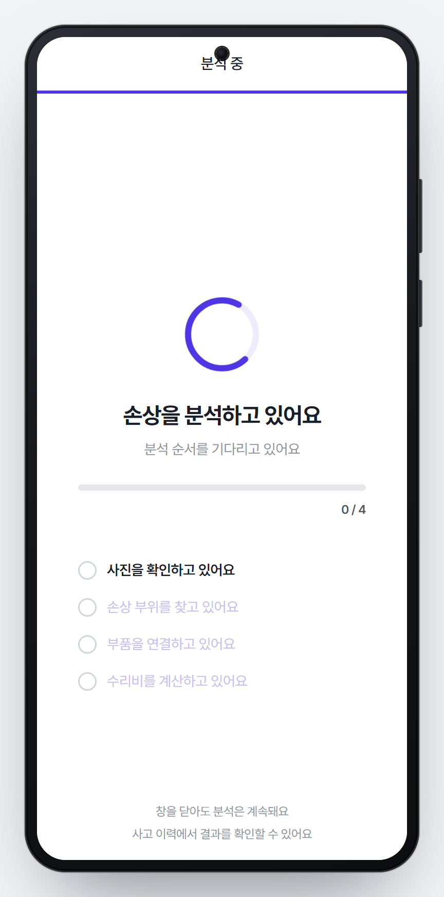
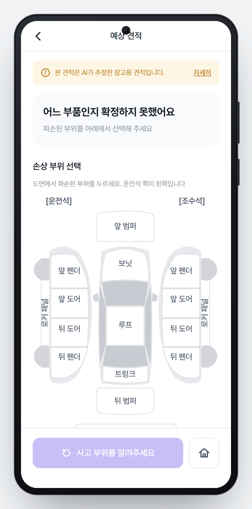
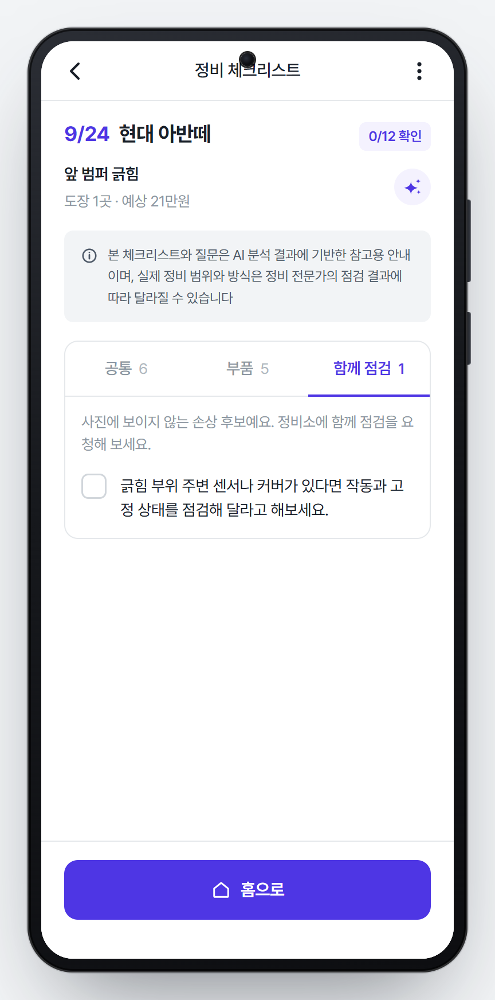
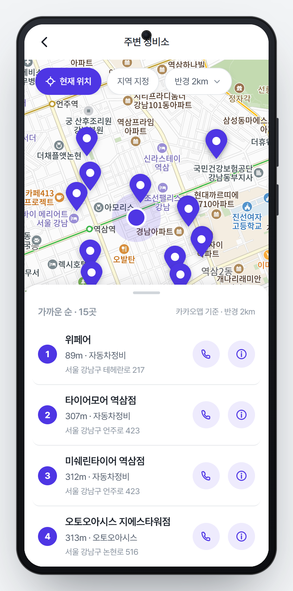
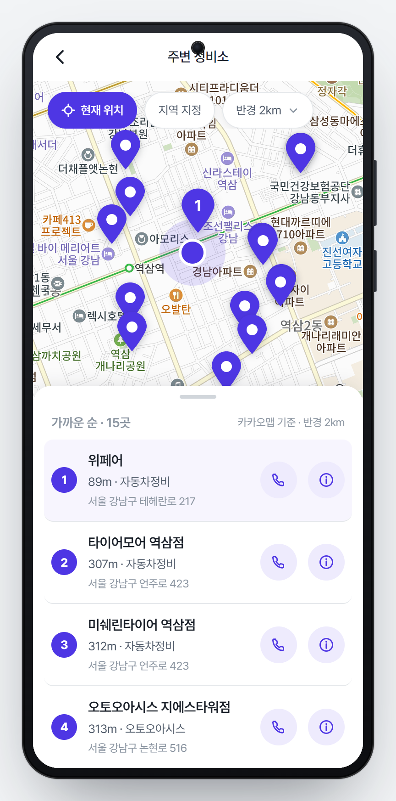
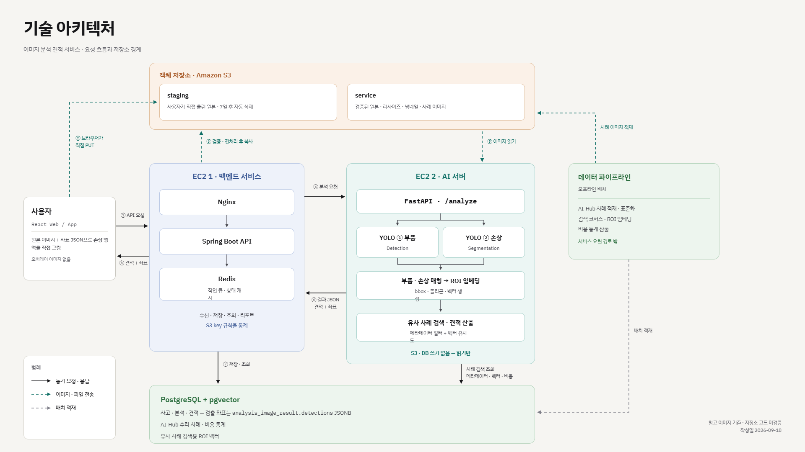

# 노카(NOCA) : 자동차 사고 운전자를 위한 AI 수리 견적 예측 서비스

> 사진 한 장으로 예상 수리비를 확인하고, 정비소에서 무엇을 물어봐야 하는지와 가까운 정비소 위치를 알려주는 모바일 웹 서비스
>
> SSAFY 15기 특화 프로젝트 · 팀 A307
>
> **배포 URL** <https://j15a307.p.ssafy.io>
>
> **영상 포트폴리오 URL** <https://youtu.be/RG-SpWU13Jw>


---

## 목차

1. [프로젝트 개요](#1-프로젝트-개요)
2. [프로젝트 진행 기간](#2-프로젝트-진행-기간)
3. [주요 기능](#3-주요-기능)
4. [개발 환경 및 기술 스택](#4-개발-환경-및-기술-스택)
5. [저장소 구조](#5-저장소-구조)
6. [설치 및 실행 방법](#6-설치-및-실행-방법)
7. [세부 기능 구현 원리](#7-세부-기능-구현-원리)
8. [프로젝트 설계 문서](#8-프로젝트-설계-문서)
9. [팀원 소개](#9-팀원-소개)

---

## 1. 프로젝트 개요

### 문제 상황

접촉 사고를 겪은 운전자는 정비소에 가기 전까지 **수리비가 얼마나 나올지 짐작하기 어렵습니다.** 견적서를 받아도 항목이 타당한지, 무엇을 확인해야 하는지 판단할 근거가 없어 정비소가 부르는 값을 그대로 받아들이게 됩니다. 사고 직후의 당황스러운 상황에서 이 정보 비대칭은 더 크게 느껴집니다.

### 서비스 소개

**노카(NOCA)** 는 손상 부위 사진 한 장으로 예상 수리비를 알려 주는 서비스입니다.

- 사진을 올리면 AI가 **어느 부품이 어떤 손상**을 입었는지 인식하고, 같은 차급의 실제 수리 사례 수만 건과 비교해 **예상 수리비 구간**(최소 · 중앙값 · 최대)을 산출합니다.
- 산출 근거를 담은 **리포트를 PDF**로 저장해 보관할 수 있습니다.
- 분석 결과를 바탕으로 정비소에서 **꼭 확인해야 할 항목**을 체크리스트로 만들어 주고, 현재 위치 주변의 **정비소를 지도**에서 찾아 줍니다.

### 타깃 사용자

| 사용자 | 필요 | 제공 서비스 |
|---|---|---|
| 경미한 접촉 사고를 겪은 일반 운전자 | 정비소 방문 전에 대략적인 수리비를 알고 싶음 | 사진 기반 예상 수리비 구간과 산정 근거 |
| 차량 정비 지식이 없는 초보 운전자 | 정비소에서 무엇을 물어봐야 할지 모름 | 사고별 정비 체크리스트와 AI 요약 |
| 낯선 곳에서 사고를 당한 운전자 | 가까운 정비소를 빨리 찾고 싶음 | 현재 위치 기반 정비소 지도와 연락처 |

## 2. 프로젝트 진행 기간

**2026. 8. 24 ~ 2026. 9. 28** (6주)

| 주차 | 기간 | 주요 작업 |
|---|---|---|
| 1주 | 8/24 ~ 8/30 | 기획 · 요구사항 명세 · 와이어프레임 · 데이터셋 조사 |
| 2주 | 8/31 ~ 9/6 | ERD · API 설계 · 프로젝트 골격 · AI-Hub 데이터 정규화 파이프라인 |
| 3주 | 9/7 ~ 9/13 | 소셜 로그인 · 사진 업로드 · YOLO 학습 · 수리 사례 corpus 적재 |
| 4주 | 9/14 ~ 9/20 | AI 분석 연동 · 견적 산정 · 리포트 PDF · 체크리스트 · 배포 파이프라인 |
| 5~6주 | 9/21 ~ 9/28 | 부위 선택 재분석 · UI 다듬기 · 통합 테스트 · 문서화 · 발표 준비 |

## 3. 주요 기능

### 3-1. 예상 수리 견적 확인

차량을 고르고 촬영 가이드에 따라 손상 부위 사진을 올리면, 분석이 끝난 뒤 예상 수리비와 인식된 손상 부위를 보여 줍니다.

<table>
  <tr>
    <td align="center"><br><sub>① 차량 선택</sub></td>
    <td align="center"><br><sub>② 사진 업로드</sub></td>
    <td align="center"><br><sub>③ 분석 진행</sub></td>
    <td align="center"><br><sub>④ 예상 견적</sub></td>
  </tr>
</table>

- **예상 수리비 구간**: 최소 ~ 최대 금액과 중앙값, 참조한 유사 사례 건수를 함께 보여 줍니다.
- **인식된 손상 부위**: 사진 위에 AI가 찾은 손상 영역(폴리곤)과 부품 박스를 그립니다. 부품 카드를 누르면 그 부위만 남고 "앞 범퍼 · 긁힘"처럼 부위와 파손 유형 라벨이 붙습니다.
- **부품별 내역**: 부품마다 수리 방법(도장 · 판금 · 교환)과 금액 구간을 카드로 정리합니다.

<table>
  <tr>
    <td align="center"><br><sub>부품 카드 선택 → 라벨 표시</sub></td>
    <td align="center"><br><sub>부품 미확정 시 도면에서 직접 선택</sub></td>
    <td align="center"><br><sub>리포트 미리보기</sub></td>
    <td align="center"><br><sub>산정 근거 · PDF 다운로드</sub></td>
  </tr>
</table>

- **부위 직접 선택**: 사진을 너무 가까이 찍어 AI가 부품을 확정하지 못하면 차량 평면도 버튼이 나타납니다. 사용자가 부위를 고르면 그 부품으로 다시 분석합니다.
- **리포트 · PDF**: 차량 정보, 사고 정보, 파손 이미지, 부품별 수리비, 산정 근거를 한 장의 리포트로 만들고 PDF로 내려받습니다.

### 3-2. 정비 체크리스트 제공

분석이 끝나면 사고 내용에 맞는 정비 체크리스트가 자동으로 만들어집니다. 정비소에 가서 하나씩 확인하며 체크할 수 있습니다.

<table>
  <tr>
    <td align="center"><br><sub>체크리스트 (공통)</sub></td>
    <td align="center"><br><sub>부품별 항목</sub></td>
    <td align="center"><br><sub>함께 점검 항목</sub></td>
    <td align="center"><br><sub>AI 한 줄 요약</sub></td>
  </tr>
</table>

- **세 가지 카테고리**: 어느 수리에나 해당하는 **공통** 항목, 견적에 나온 **부품별** 항목, 사진에 보이지 않지만 함께 점검을 요청할 **함께 점검** 항목으로 나뉩니다.
- **직접 관리**: 항목을 체크하거나 메모를 남기고, 필요한 항목을 직접 추가할 수 있습니다. 진행도(예: 3/12 확인)가 목록에 표시됩니다.
- **AI 한 줄 요약**: 사고 정보와 중점 확인 사항을 한눈에 볼 수 있습니다.

### 3-3. 주변 정비소 위치 찾기

현재 위치를 기준으로 가까운 정비소를 지도와 목록으로 보여 줍니다.

<table>
  <tr>
    <td align="center"><br><sub>현재 위치 기반 정비소 목록</sub></td>
    <td align="center"><br><sub>정비소 선택 → 지도 핀 강조</sub></td>
    <td align="center"><br><sub>홈 — 세 기능의 진입점</sub></td>
  </tr>
</table>

- **가까운 순 정렬**과 반경(1 · 2 · 5 · 10km) 변경, 시 · 군 · 구를 지정하는 지역 검색을 지원합니다.
- 카드를 누르면 지도가 해당 정비소로 이동하고 핀이 강조됩니다. 전화 걸기와 카카오맵 상세 정보(영업 시간 · 주소 · 로드뷰)로 바로 이어집니다.

## 4. 기술 스택 및 개발 환경

### 기술 스택

| 영역 | 기술 |
|---|---|
| **Frontend** | Vue 3.5 · Vite 6 · Pinia 3 · Vue Router 4 · axios · Kakao Maps JavaScript SDK |
| **Backend** | Java 21 · Spring Boot 4.1.1 · Spring Security (OAuth2 카카오 · 구글) · Spring Data JPA · Spring Session (Redis) · springdoc-openapi · Open HTML to PDF · Thymeleaf · AWS SDK v2 (S3) |
| **AI** | Python 3.12 · FastAPI 0.115 · Ultralytics YOLO (부품 탐지 · 손상 세그멘테이션) · DINOv2 (ROI 임베딩 768차원) · PyTorch 2.6 · transformers |
| **Database** | PostgreSQL 16 · pgvector (HNSW 코사인 인덱스) · Redis 7 |
| **Data** | Python 오프라인 파이프라인 (polars) — AI-Hub 차량 파손 데이터셋과 견적 원천을 표준 코드로 정규화해 수리 사례 corpus 적재 |
| **Infra** | AWS EC2 2대 · Docker · Nginx · Let's Encrypt · Amazon S3 (presigned URL 업로드) · GitLab CI/CD |
| **External** | 카카오 로그인 · 카카오 로컬 API · 카카오 지도 · Google 로그인 · SSAFY GMS (LLM 프록시, OpenAI gpt-5.4) |

### 개발 환경

| 구분 | 도구 · 버전 |
|---|---|
| Backend IDE | IntelliJ IDEA 2023.3.8 |
| Frontend · AI IDE | Visual Studio Code 1.138.0 |
| JVM | Java 21 (Eclipse Temurin, Gradle toolchain) |
| Node.js | v22 LTS (배포 서버 v22.23.2, npm 10.9) |
| Python | 3.12 |
| 형상 관리 | GitLab (SSAFY) · `feature/*` → `develop` → 자동 배포 |
| 이슈 관리 | Jira (S15P21A307) · 커밋 메시지에 이슈 키 표기 |

### 시스템 아키텍처

[](Docs/Architecture/technology-architecture.md)

- **BE 서버**: Nginx(정적 프론트 + API 프록시) · Spring Boot 컨테이너 · Redis 컨테이너
- **AI 서버**: FastAPI 컨테이너(YOLO · DINOv2) · PostgreSQL(pgvector) 컨테이너
- 백엔드는 분석 요청을 큐에 넣어 AI 서버에 보내고, AI 서버는 추론 → 유사 사례 검색 → 견적 산정을 마친 뒤 결과를 **콜백**으로 돌려줍니다. 사진은 브라우저가 S3에(presigned URL) 직접 올립니다.

## 5. 저장소 구조

```
S15P21A307/
├── frontend/              Vue 3 SPA (모바일 웹)
│   └── src/
│       ├── views/         화면 25개 (홈 · 차량 선택 · 촬영 가이드 · 업로드 · 분석 중 · 견적 · 리포트 · 체크리스트 · 정비소 지도 등)
│       ├── components/    공용 컴포넌트 (차 도면 CarDiagram, 검출 오버레이, 바텀시트 등)
│       ├── stores/        Pinia 스토어 (인증 · 차량 · 사고 · 체크리스트)
│       ├── lib/           API 클라이언트(axios) · 카카오 지도 · PDF 다운로드 훅
│       ├── data/          화면 표시 규칙 · 부품 코드 표 · 목업 데이터
│       └── router/        라우트 31개 + 로그인 가드
├── backend/               Spring Boot 서버
│   └── src/main/java/com/ssafy/a307/
│       ├── auth · member · vehicle      소셜 로그인 · 회원 · 차량
│       ├── accident                     사고 접수 · 사진 업로드(S3 presigned)
│       ├── analysis                     AI 분석 요청 · 콜백 수신 · 부위 확정 재분석
│       ├── estimate                     견적 조회 · 리포트 · PDF 생성
│       ├── repairchecklist              정비 체크리스트 생성(LLM) · 관리
│       ├── location                     카카오 로컬 API 프록시(주소 · 장소)
│       ├── repaircase · admin · guide   수리 사례 · 관리자 마스터 · 가이드
│       └── common · config · audit      공통 응답 · 보안 설정 · 감사 로그
├── AI/                    AI 추론 서버와 학습
│   ├── server/app/        FastAPI — /inference · /search · /estimate · /analyze
│   ├── training/          YOLO 학습 스크립트
│   └── models/            학습된 가중치 (부품 탐지 · 손상 세그멘테이션)
├── pipeline/              오프라인 데이터 파이프라인 (AI-Hub 원천 → 정규화 → corpus 적재 → 검증)
├── shared/vision/         파이프라인과 AI 서버가 함께 쓰는 모듈 (부품 · 손상 카탈로그, ROI, 임베딩)
├── Docs/                  설계 · 명세 · ERD · 와이어프레임 · 인수인계 문서
├── 통합_기술문서/           코드 기준으로 정리한 통합 기술문서 (아키텍처 · API · 데이터 · 인프라 · 운영)
├── exec/                  제출물 — 포팅 매뉴얼 · 외부 서비스 정보 · DB 스키마 덤프 · 시연 시나리오
├── docker-compose.yml     로컬 개발용 PostgreSQL(pgvector) + Redis
└── .gitlab-ci.yml         마이그레이션 가드 → 백엔드 · 프론트 · AI 배포 파이프라인
```

## 6. 설치 및 실행 방법

로컬에서 전체 서비스 서버를 띄우는 순서입니다. 운영 배포 절차와 환경변수 전체 목록은 [exec/포팅매뉴얼.md](exec/포팅매뉴얼.md)에 있습니다.

### 6-1. 데이터베이스 · Redis

```bash
docker compose up -d        # a307-db(127.0.0.1:5432, pgvector) · a307-redis(127.0.0.1:6379)
```

첫 기동에 `Docs/Erd/A307_ddl_final.sql`과 시드가 자동 적용됩니다(47 테이블). 이미 볼륨이 있고 스키마가 낡았으면 [Docs/Erd/migrations/](Docs/Erd/migrations)의 SQL을 순서대로 적용합니다. 무엇이 빠졌는지는 [check-applied.sql](Docs/Erd/migrations/check-applied.sql)이 알려 줍니다.

### 6-2. 백엔드

```bash
cd backend
cp .env.example .env         # DB 계정 · S3 버킷 · OAuth · GMS 키 등 (키는 커밋하지 않습니다)
./gradlew bootRun            # http://localhost:8080
```

`DB_USERNAME` · `DB_PASSWORD`만 필수입니다. 나머지 연동 키는 없어도 기동하고 해당 기능만 503으로 응답합니다.

### 6-3. 프론트엔드

```bash
cd frontend
cp .env.example .env.local   # VITE_API_BASE_URL · VITE_KAKAO_JS_KEY
npm ci
npm run dev                  # http://localhost:5173
```

휴대폰에서 LAN IP로 접속하거나 위치 권한을 테스트하려면 `npm run dev:https`를 씁니다. 백엔드 없이 화면만 보려면 `.env.local`에 `VITE_AUTH_GUARD=off`를 넣습니다(개발 전용).

### 6-4. AI 서버

```bash
pip install -r AI/requirements.txt -r AI/server/requirements.txt
uvicorn app.main:app --app-dir AI/server --port 8000
```

`AI_INTERNAL_TOKEN`(백엔드 `INTERNAL_API_TOKEN`과 같은 값) · `FEATURE_PIPELINE_VERSION_ID` · `DATABASE_URL`이 필요합니다. 컨테이너 정의는 [AI/server/Dockerfile](AI/server/Dockerfile)에 있습니다.

### 6-5. 빌드 · 테스트

```bash
cd backend && ./gradlew build      # 백엔드 테스트 포함
cd frontend && npm run build       # dist/ 생성
```

## 7. 세부 기능 구현 원리

### 7-1. 예상 수리 견적 — 사진에서 금액까지

```
사진 업로드 ─▶ 분석 요청(큐) ─▶ AI 서버 /analyze
                                  ├ ① 추론: YOLO 부품 탐지 + YOLO 손상 세그멘테이션 → 손상마다 부품 매칭
                                  ├ ② 검색: 손상 ROI를 DINOv2로 임베딩 → pgvector 코사인 검색(Top-K)
                                  ├ ③ 견적: 유사 사례의 수리비 분포 → p25 · 중앙값 · p75
                                  └ ④ 콜백 1회 → 백엔드가 견적 · 검출 결과 저장 → 화면 폴링으로 완료 감지
```

1. **업로드**: 브라우저가 백엔드에서 presigned URL을 받아 S3에 직접 올립니다. 서버는 완료 통보 때 실제 크기를 재검증하고 리사이즈 · 썸네일 파생본을 만듭니다.
2. **추론**: 두 개의 YOLO 모델을 씁니다. 부품 모델은 32종 부품(좌 · 우 구분), 손상 모델은 4종 손상(긁힘 · 찌그러짐 · 파손 · 이격)을 찾습니다. 손상 하나마다 같은 사진의 부품과 겹침을 계산해 "어느 부품의 어떤 손상"인지 정합니다. 손상은 찾았지만 부품을 확정하지 못하면 `PART_NOT_RESOLVED`로 응답하고, 화면은 차량 평면도를 띄워 사용자가 직접 고르게 한 뒤 그 부품으로 재분석합니다.
3. **유사 사례 검색**: 손상 부위만 잘라낸 ROI를 DINOv2로 768차원 벡터로 만들고, AI-Hub 수리 사례 93,964건(v2 검색 대상 사고 84,642건 · ROI 임베딩 711,073건)에서 pgvector HNSW 인덱스로 가장 가까운 사례를 찾습니다. 부품 · 손상 유형 · 차량 조건으로 먼저 거른 뒤, 사례가 부족하면 동일 차량 모델 → 가격대(price_tier) → 전체 순으로 조건을 완화합니다. 차급(car_class)은 비용 지수를 측정한 결과 구간이 완전히 겹쳐 완화축에서 제외했습니다.
4. **견적 산정**: 찾은 사례들의 수리비를 모아 부품별 p25 · 중앙값 · p75를 계산하고, 부품 합계로 예상 수리비 구간을 만듭니다. 수리 방법(도장 · 판금 · 교환)은 사례의 작업 조합에서 가져옵니다. 유효 사례가 기준 미만이면 금액을 내지 않고 `INSUFFICIENT_CASES`로 이유를 알려 줍니다.
5. **리포트 · PDF**: 백엔드가 Thymeleaf 템플릿으로 HTML 리포트를 만들고 Open HTML to PDF로 변환해 S3에 저장합니다. 생성은 워커가 비동기로 처리하고, 화면은 상태를 폴링하다 완료되면 다운로드합니다.

### 7-2. 정비 체크리스트 — 사고에 맞춘 확인 항목 생성

1. **자동 생성**: 견적이 산정되면 백엔드 이벤트 리스너가 체크리스트 생성을 큐에 넣고, 워커가 견적 항목(부위 · 손상 · 수리 방법)과 차량 정보를 프롬프트로 만들어 LLM(SSAFY GMS 경유 OpenAI)에 보냅니다.
2. **세 카테고리**: LLM 응답은 부품별(`PART`) 항목과 사진에 안 보이는 손상 후보(`HIDDEN`) 항목으로 나뉘어 저장되고, 여기에 마스터에 정의된 공통(`COMMON`) 항목(견적서 서면 수령, 부품 등급 확인, 작업 전후 사진 등)이 합쳐집니다.
3. **사용자 편집**: 체크 · 메모는 모든 항목에, 문안 수정 · 삭제는 사용자가 추가한 항목에만 허용합니다. 재생성하면 AI · 공통 항목만 새로 만들고 사용자 항목은 남깁니다.
4. **상태 폴링**: 목록 화면은 "생성 중"인 카드를 2초 간격으로 다시 조회해 완료되면 진행도 배지(n/N 확인)로 바꿉니다.

### 7-3. 주변 정비소 — 현재 위치 기반 검색

1. **위치 획득**: 브라우저 Geolocation API로 현재 좌표를 받습니다. 권한이 없거나 거부하면 시 · 도 / 시 · 군 · 구를 골라 지역 중심 좌표로 검색합니다(주소 → 좌표 변환은 백엔드의 카카오 로컬 API 프록시 경유).
2. **정비소 검색**: 카카오 지도 SDK의 장소 검색을 "자동차정비 · 공업사 · 카센터" 세 키워드로 호출해 합치고, 카테고리명으로 정비 업종만 걸러 거리순 15곳을 보여 줍니다. 지도 렌더링과 검색이 같은 SDK라 좌표가 어긋나지 않습니다.
3. **지도 연동**: 결과 시트가 펼쳐져 있으면 시트에 가리지 않는 지도 영역의 가운데로, 접혀 있으면 지도 전체의 가운데로 선택한 정비소를 옮깁니다. 선택한 핀만 번호를 표시하고 맨 앞으로 올립니다.
4. **연결**: 카드의 전화 버튼은 `tel:` 링크로, 정보 버튼은 카카오맵 상세 페이지로 이어집니다.

## 8. 프로젝트 설계 문서

| 문서 | 위치 |
|---|---|
| 요구사항 명세 | [Docs/Requirements/](Docs/Requirements) |
| 와이어프레임 (초기 시안 21장) | [Docs/Wireframe/](Docs/Wireframe) |
| 화면 디자인 (2026-09-12, UX-01 ~ UX-22) | [Docs/Design/Screens-2026-09-12/](Docs/Design/Screens-2026-09-12) |
| 기술 아키텍처 | [Docs/Architecture/technology-architecture.md](Docs/Architecture/technology-architecture.md) |
| ERD (그림) | [Docs/Erd/바른견적_ERD.png](Docs/Erd/바른견적_ERD.png) · [통합_기술문서/05_데이터/ERD.md](통합_기술문서/05_데이터/ERD.md) |
| 스키마 정본 (47 테이블) · 마이그레이션 | [Docs/Erd/A307_ddl_final.sql](Docs/Erd/A307_ddl_final.sql) · [Docs/Erd/migrations/](Docs/Erd/migrations) |
| 백엔드 API 명세서 | [Docs/Api/백엔드 API 명세서.md](<Docs/Api/백엔드 API 명세서.md>) · [통합_기술문서/06_API/API_전체_목록.md](통합_기술문서/06_API/API_전체_목록.md) |
| AI 서버 API 명세 · 백엔드 ↔ AI 연동 계약 | [Docs/AI/AI 서버 API 명세.md](<Docs/AI/AI 서버 API 명세.md>) · [Docs/Api/AI 연동 계약 (백엔드 ↔ AI 서버).md](<Docs/Api/AI 연동 계약 (백엔드 ↔ AI 서버).md>) |
| 데이터 파이프라인 · 벡터 검색 | [통합_기술문서/05_데이터/데이터_파이프라인.md](통합_기술문서/05_데이터/데이터_파이프라인.md) · [벡터_검색.md](통합_기술문서/05_데이터/벡터_검색.md) |
| AI 모델 구성 · 추론 파이프라인 | [통합_기술문서/04_AI/모델_구성.md](통합_기술문서/04_AI/모델_구성.md) · [추론_파이프라인.md](통합_기술문서/04_AI/추론_파이프라인.md) |
| 배포 · CI/CD · 롤백 | [통합_기술문서/08_배포_CICD/](통합_기술문서/08_배포_CICD) · [exec/포팅매뉴얼.md](exec/포팅매뉴얼.md) |
| 외부 서비스 정보 | [exec/외부서비스.md](exec/외부서비스.md) |
| 시연 시나리오 · 화면 캡처 | [exec/시연 시나리오/](<exec/시연 시나리오>) |
| 통합 기술문서 인덱스 | [통합_기술문서/README.md](통합_기술문서/README.md) · [Docs/README.md](Docs/README.md) |

## 9. 팀원 소개

| 이름 | 역할 | 담당 작업 |
|---|---|---|
| 김장환 | 팀장, PM, FE | 프로젝트 관리, 프론트엔드 서버 개발 |
| 강유진 | Data, FE | 견적 비용 산정 로직, 화면 UI 디자인 |
| 김경연 | AI, Data | 사고 이력 정보 적재, 유사 사례 검색 로직 |
| 김재원 | BE, Infra | 차량 등록, 사고 이력 관리, 정비 체크리스트 |
| 김희동 | AI | 손상 부위 및 손상 유형 탐지 모델 개발 |
| 서보영 | BE, Infra, 영상포폴제작 | 회원 관리, 견적 리포트(유사 사례 및 AI 분석), 주변 정비소 위치 |
