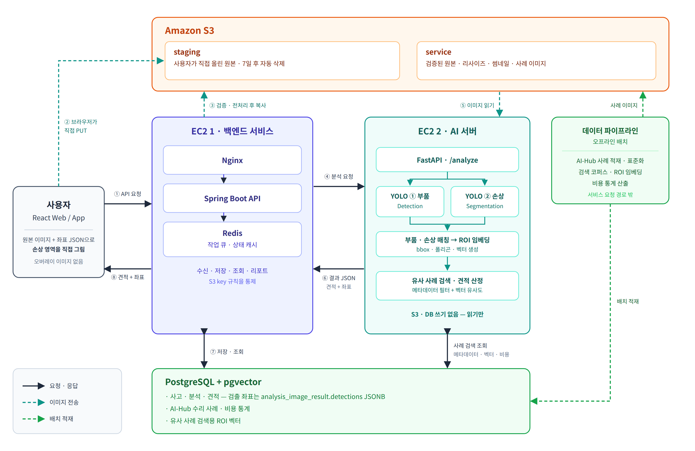

# 노카 (NOCA) — AI 차량 파손 견적

**정비소에 가기 전에 수리비를 먼저 알려 주는 서비스.** 사고 차량 사진을 올리면 손상 부위와
손상 유형을 인식해 유사 수리 사례로 예상 수리비를 추정하고, 정비소에서 받은 견적서를
그 기준과 대조해 확인할 항목을 짚어 준다.

SSAFY 15기 · 팀 A307 · 2026-08-25 ~ 2026-09-17 (git 첫 커밋 ~ 현재)



---

## 기술 스택

| 영역 | 스택 |
| --- | --- |
| **Frontend** | Vue 3.5 · Vite 6 · Pinia · Vue Router · axios (SPA, 모바일 웹 우선) |
| **Backend** | Java 21 · Spring Boot 4.1.1 · Spring Security (OAuth2 소셜 로그인) · Spring Data JPA · Redis 세션 · PostgreSQL 16 |
| **AI** | Python 3.12 · FastAPI · YOLO26-seg (Ultralytics, 손상·부품 2모델) · DINOv2 768d 임베딩 · pgvector 유사 검색 |
| **Data** | Python 데이터 파이프라인 — AI-Hub 차량파손 데이터셋·견적 원천을 표준 코드로 정규화해 수리 사례 DB 적재 |
| **Infra** | Docker · GitLab CI/CD (`.gitlab-ci.yml`) · EC2 · S3 (presigned URL 업로드) · LLM 은 SSAFY GMS 프록시 경유 |

## 저장소 구조

| 디렉터리 | 무엇이 있나 |
| --- | --- |
| `backend/` | Spring Boot 서버. `src/main/java` 498파일 · 컨트롤러 33개 · API 매핑 97개 |
| `frontend/` | Vue SPA. 화면 25개 · 공용 컴포넌트 10개 · 스토어 5개 |
| `AI/` | FastAPI 추론 서버(`server/`) · 학습 스크립트(`training/`) · 모델 가중치(`models/`) |
| `pipeline/` | 오프라인 데이터 파이프라인 (정규화 · 검증 · 적재) |
| `shared/` | 파이프라인과 AI 서버가 **같은 결과를 내야 하는** 공용 파이썬 모듈 (ROI · 임베딩 · 정규화) |
| `Docs/` | 설계·명세·데이터 노트 102개 → **[Docs/README.md](Docs/README.md) 가 안내판이다** |
| `docker-compose.yml` | 로컬 개발용 PostgreSQL(pgvector) + Redis. **애플리케이션은 여기 없다** |

---

## 어떻게 돌리나

아래 순서를 이 문서를 쓰면서 실제로 밟았다(2026-09-17, Windows 11).

### 1. 데이터베이스 · Redis

```bash
docker compose up -d          # a307-db(127.0.0.1:5432) · a307-redis(127.0.0.1:6379)
```

`Docs/Erd/A307_ddl_final.sql` 과 시드가 `docker-entrypoint-initdb.d` 로 마운트돼 있어
**볼륨이 비어 있는 첫 기동에만** 자동 적용된다(42 테이블).

> 🔴 **이미 볼륨이 있고 스키마가 낡았으면 백엔드가 기동하지 않는다.** `ddl-auto=validate` 라
> `Schema validation: missing column …` 로 멈춘다. 그때는
> [`Docs/Erd/migrations/`](Docs/Erd/migrations) 의 빠진 SQL 을 적용한다. 무엇이 빠졌는지는
> [`Docs/Erd/migrations/check-applied.sql`](Docs/Erd/migrations/check-applied.sql) 이 알려 준다.
> `docker compose down -v` 는 볼륨을 지워 처음부터 다시 만들지만 **로컬 데이터가 사라진다.**

### 2. 백엔드

```bash
cd backend
DB_USERNAME=a307 DB_PASSWORD=ssafy ./gradlew bootRun     # http://localhost:8080
```

`DB_USERNAME` · `DB_PASSWORD` 만 필수다(기본값을 두지 않았다). 값은 `docker-compose.yml` 의
기본 계정이다. 나머지 연동 키는 없어도 기동한다 — 해당 기능만 503 이 된다.
채울 목록은 [`backend/.env.example`](backend/.env.example) 에 있다. **키를 저장소에 커밋하지 않는다.**

```bash
curl http://localhost:8080/actuator/health     # {"status":"UP"}
./gradlew test                                 # 1614건 (아래 주의)
```

### 3. 프런트엔드

```bash
cd frontend
cp .env.example .env.local    # VITE_API_BASE_URL · 카카오 지도 JS 키
npm ci
npm run dev                   # http://localhost:5173
```

백엔드 없이 화면만 둘러보려면 `.env.local` 에 `VITE_AUTH_GUARD=off` 를 넣는다.

### 4. AI 서버 (선택)

```bash
pip install -r AI/requirements.txt -r AI/server/requirements.txt
uvicorn app.main:app --app-dir AI/server --port 8000
```

`torch==2.6.0+cu124` 를 포함한 무거운 의존성이라 **이 절차는 검증하지 못했다.**
컨테이너 정의는 [`AI/server/Dockerfile`](AI/server/Dockerfile), 환경변수는
[`AI/server/README.md`](AI/server/README.md) 에 있다. 모델 가중치는 저장소에 들어 있다.

---

## 지금 어디까지 됐나

**"구현했다" 와 "돌고 있다" 를 구분해 적는다.** 아래 기능 플래그 8개는 전부 기본 `false` 다
(`grep -E '^app\..*enabled=' backend/src/main/resources/application.properties`).
일곱 개는 환경변수로 켜고, `app.image-quality.enabled` 만 리터럴이라
`APP_IMAGEQUALITY_ENABLED` 로 덮어야 한다. **배포 파이프라인(`.gitlab-ci.yml`)이 켜는 것은
체크리스트·질문 워커 둘뿐이고**, 같은 자리에서 LLM 벤더를 OpenAI `gpt-5.4` 로 바꾼다.

| 기능 | 상태 | 근거 · 스위치 |
| --- | --- | --- |
| 소셜 로그인 · 회원 · 약관 | 구현 · **화면 연동** | 카카오/구글 OAuth2. 세션은 Redis |
| 차량 등록 · 목록 | 구현 · **화면 연동** | 차량 모델 마스터 기반 |
| 사고 접수 · 사진 업로드 | 구현 · **화면 연동** | S3 presigned. 버킷 미설정이면 503 |
| 사진 품질 판정 (흐림·해상도) | 구현 · **꺼짐** | `app.image-quality.enabled=false` |
| 분석 결과 · 견적 조회 · 리포트 | 구현 · **화면 연동** | `EstimateView` 는 `GET /api/estimates/{id}`, `ReportView` 는 `/report` 를 부른다 |
| AI 분석 요청 · 콜백 수신 | 구현 · **워커 꺼짐** | `ANALYSIS_REQUEST_WORKER_ENABLED` |
| AI 손상 인식 (`POST /inference`) | 구현 | YOLO 2모델 → 표준화 결과 |
| AI 유사 사례 검색 (`POST /search`) | 구현 | DINOv2 + pgvector. `FEATURE_PIPELINE_VERSION_ID` 없으면 503 |
| AI 수리비 산정 (`POST /estimate`) | 구현 | 수리 사례 DB 조회. 데이터 없으면 503 |
| AI 분석 오케스트레이션 (`POST /analyze`) | **목 프로파일까지** | `ANALYSIS_PROFILE=mock` 에서만 202. 기본값은 501. 목은 YOLO 추론은 실제로 하지만 `estimable: false` 로 답한다 |
| 견적서 검증 (OCR → 판정 → 리포트) | 구현 · **워커 꺼짐 · 화면 없음** | `ESTIMATE_WORKER_ENABLED` · 판정 임계값은 `estimate_validation_rule` 테이블이 정본. FE 에 `/api/estimate-validations` 호출 코드가 없다 |
| 검증 결과 PDF · 견적 PDF | 구현 · **꺼짐** | `VALIDATION_PDF_ENABLED` · `ESTIMATE_PDF_ENABLED` |
| LLM 요약 · 정비 체크리스트 · 정비소 질문 | 구현 · **기본 꺼짐** | `ESTIMATE_SUMMARY_ENABLED` · `REPAIR_CHECKLIST_WORKER_ENABLED` · `REPAIR_QUESTION_WORKER_ENABLED`. `GMS_KEY` 없으면 503 |
| LLM 벤더 `gpt-5.4` (OpenAI chat/completions) | 구현 · **GMS 직접 호출 확인** | 기본값은 Gemini. 배포 env 가 OpenAI 로 바꾼다. 2026-09-17 GMS 로 직접 호출해 `gpt-5.4-2026-03-05` 200 을 받았다. 앱을 거친 체크리스트 생성 완주는 아직 확인하지 않았다 |
| 정비소 검색 (주변·지도) | 구현 · **화면은 백엔드를 안 쓴다** | BE `GET /api/repair-shops` 는 있으나 `ShopsView` 는 `lib/kakao.js` 로 카카오 지도 SDK 를 브라우저에서 직접 호출한다 |
| 관리자 마스터 · 규칙 관리 (31 API) | 구현 · **화면 없음** | API·문서만 있고 관리자 UI 는 만들지 않았다 |
| 체크리스트 화면 연동 | 구현 · **화면 연동** | `lib/api.js` 에 조회·생성(POST)·재생성·항목 추가/체크/삭제 6개 함수가 있고, `stores/checklist.js` 를 `ChecklistView`·`ChecklistGeneratingView`·`ChecklistsView` 가 쓴다 |
| 정비소 질문 화면 | 구현 · **화면 없음** | BE `/api/accidents/{id}/repair-questions` 는 있으나 `lib/api.js` 에 호출 함수가 없다 |

**테스트** — `cd backend && ./gradlew test` 기준 **1614건**.

- 로컬 PostgreSQL 이 **꺼져 있으면**: 1574 통과 · 40 **건너뜀**(`@EnabledIf("localPostgresRunning")`)
- 로컬 PostgreSQL 이 **켜져 있으면**: 그 40건이 실제로 돌면서 **개발자의 로컬 DB 를 직접 쓴다.**
  DB 가 마이그레이션 한 건이라도 뒤처져 있으면 40건이 통째로 실패한다 — 2026-09-17 측정에서
  실제로 그랬다(`missing column [unresolved_parts]`). 테스트가 붉으면 **먼저 DB 최신 여부를 본다.**

---

## 더 읽을 곳

**[Docs/README.md](Docs/README.md)** — 문서 102개의 안내판. 스키마·API·AI 계약·데이터 노트로 가는 입구다.
담당 범위는 [Docs/담당 범위.md](<Docs/담당 범위.md>) 에 있다.
