# 노카(NOCA) 시연 가이드

AI 차량 파손 견적 서비스 **노카**의 시연 순서와 화면별 실행 방법을 정리한 문서입니다.
캡처는 실제 배포 서비스(https://j15a307.p.ssafy.io)에서 2026-09-24에 찍은 것이며, 모든 이미지는 이 폴더에 함께 있습니다.

---

## 0. 시연 준비

| 항목 | 내용 |
|---|---|
| 접속 주소 | https://j15a307.p.ssafy.io |
| 화면 | PC 브라우저로 열면 모바일 프레임(갤럭시 형태) 안에 앱이 표시됩니다. 오른쪽 위 **모바일 프레임** 스위치로 프레임을 끄고 켤 수 있습니다. |
| 계정 | 카카오 로그인. 시연 계정에 **현대 아반떼(2021)** 차량이 등록되어 있어야 합니다. |
| 사고 이력 | 시연 전 사고 이력을 비워 두면 흐름이 깔끔합니다. 사고 이력 화면 오른쪽 위 **⋮ → 이력 제거하기**로 정리합니다. |
| 사진 2장 | `아반떼 파손.png`(정상 분석용) · `아반떼 파손_1.png`(근접 촬영, 부품 미확정 유도용) — 업로드할 PC에 미리 준비합니다. |
| 위치 권한 | 주변 정비소 단계에서 브라우저 위치 권한 요청이 뜹니다. **허용**을 눌러 주세요. |
| 소요 시간 | 사진 분석은 실서비스에서 수 초 안에 끝납니다. 전체 시연은 약 5~7분입니다. |

> 시연에서 진행하는 분석은 실제로 실행되어 계정에 사고 이력이 남습니다. 리허설 뒤에는 이력을 다시 정리해 주세요.

---

## 1. 견적 받기 — 정상 사진

### 1-1. 홈 화면
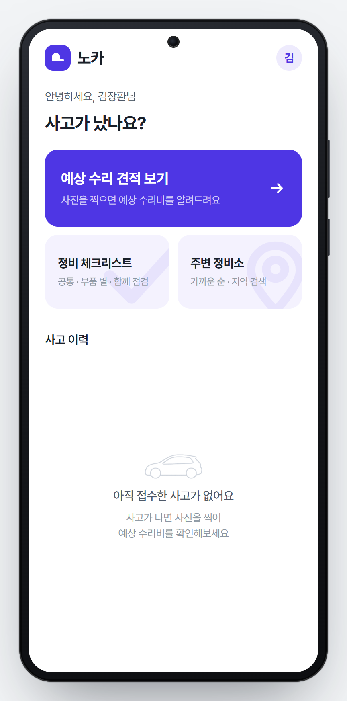

- **나레이션**: "이제 촬영한 이미지를 가지고 먼저 예상 수리 견적 확인을 진행해보겠습니다."
- **실행**: 화면 가운데 보라색 큰 카드 **예상 수리 견적 보기**를 클릭합니다.
- **확인 포인트**: 상단 인사말에 로그인한 사용자 이름이 표시됩니다. 아래에는 정비 체크리스트·주변 정비소 바로가기와 사고 이력이 있습니다.

### 1-2. 차량 선택 (1 / 4)
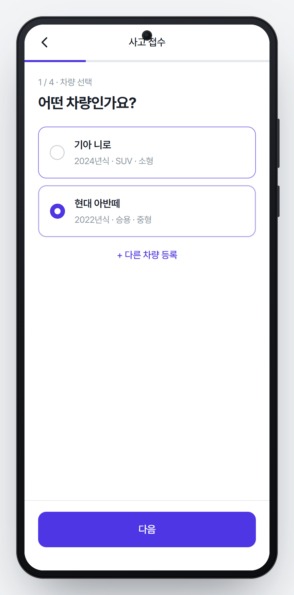

- **나레이션**: "먼저 사고 차량의 차종을 선택합니다. 사전에 사용자가 등록한 아반떼 차량을 선택하겠습니다."
- **실행**: 목록에서 **현대 아반떼** 카드를 클릭해 선택(보라색 테두리)한 뒤, 하단 **다음** 버튼을 클릭합니다.
- **확인 포인트**: 차량을 고르기 전에는 다음 버튼이 비활성입니다.

### 1-3. 촬영 가이드 (2 / 4)
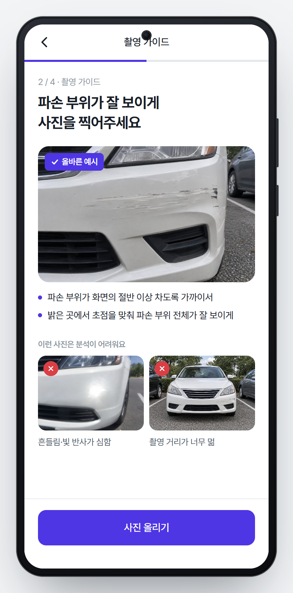

- **나레이션**: "다음으로 파손 부위 촬영을 위한 가이드를 확인합니다. 촬영 가이드를 통해 사용자가 이미지 분석에 적절한 각도와 거리에서 찍을 수 있도록 안내합니다."
- **실행**: 올바른 예시 사진과 "이런 사진은 분석이 어려워요" 두 장을 잠깐 보여 준 뒤, 하단 **사진 올리기** 버튼을 클릭합니다.

### 1-4. 사진 업로드 (3 / 4)
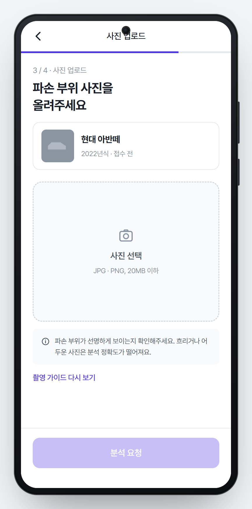
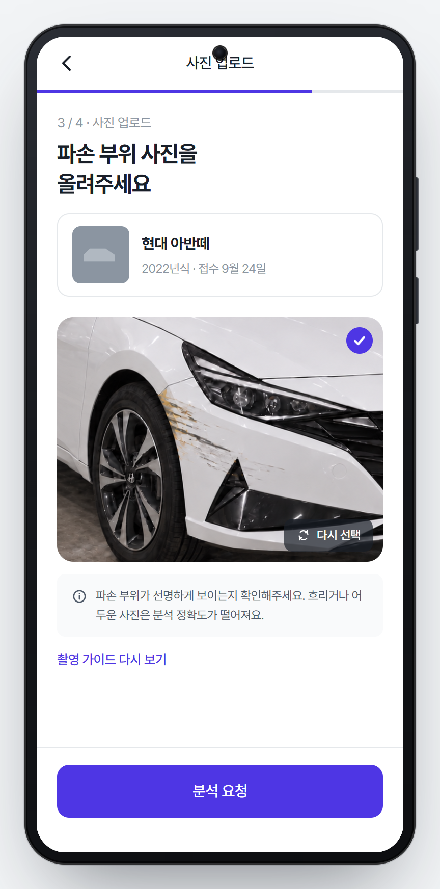

- **나레이션**: "이제 촬영한 사고 이미지를 업로드하고 분석 요청을 진행합니다."
- **실행**:
  1. 가운데 점선 상자 **사진 선택**을 클릭하고 `아반떼 파손.png`를 고릅니다.
  2. 업로드가 끝나면 사진 미리보기가 상자에 채워지고 하단 **분석 요청** 버튼이 활성화됩니다.
  3. **분석 요청**을 클릭합니다.
- **확인 포인트**: 위 카드에 선택한 차량(현대 아반떼 · 2021년식)이 표시됩니다.

### 1-5. 분석 중 (4 / 4)

- **나레이션**: "분석 요청을 누르면 파손 유형과 부위에 대한 정보를 추출하고, 앞에서 입력받은 차량 정보와 함께 유사 사례 검색을 통해 비용 산정이 진행됩니다."
- **실행**: 조작 없음. 4단계(사진 확인 → 손상 부위 → 부품 연결 → 수리비 계산)가 차례로 채워지고 완료되면 자동으로 견적 화면으로 넘어갑니다.
- **확인 포인트**: 실서비스는 수 초 안에 끝나므로 나레이션을 미리 시작하는 편이 좋습니다.

### 1-6. 예상 견적
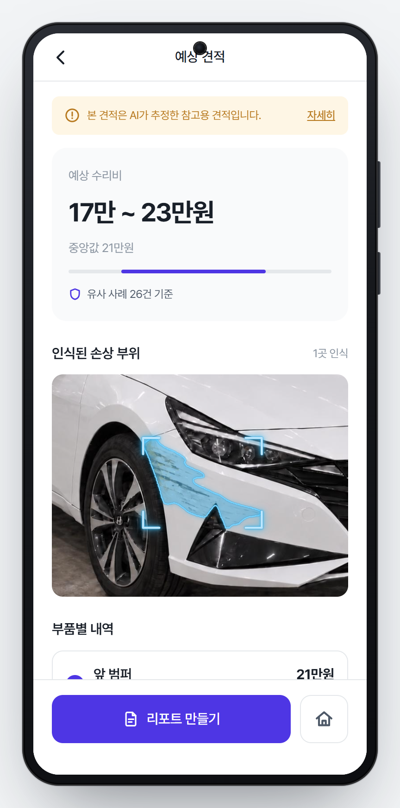

- **나레이션**: "이 사례의 경우에는 도장 작업이 필요하고, 17만원에서 23만원의 예상 수리비가 나왔습니다."
- **확인 포인트**:
  - 상단 카드: 예상 수리비 **17만 ~ 23만원**, 중앙값 21만원, 유사 사례 26건 기준
  - **인식된 손상 부위**: 사진 위에 파손 영역 폴리곤과 박스가 그려집니다(1곳 인식).

### 1-7. 부품 카드 클릭
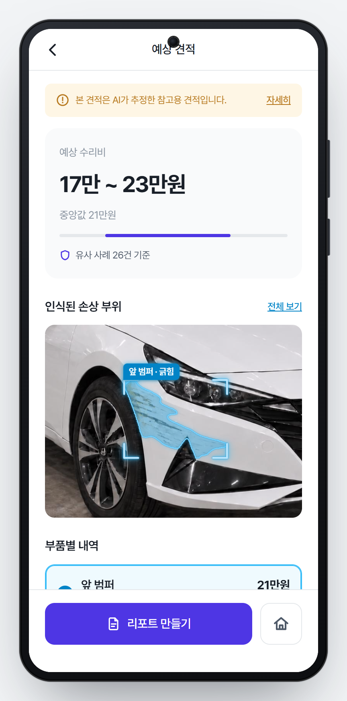
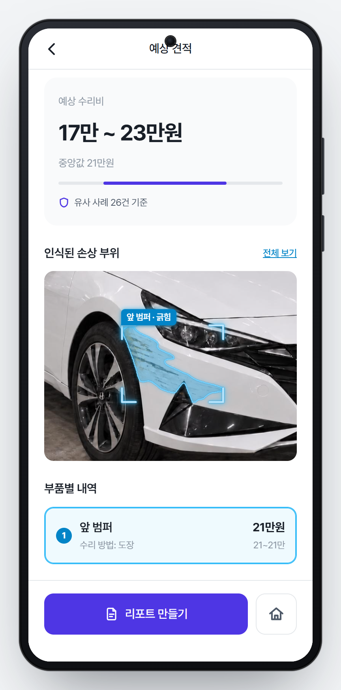

- **나레이션**: "하단의 부품 별 내역을 클릭하면 부품 정보와 파손 유형을 확인할 수 있습니다."
- **실행**: 화면을 아래로 내려 **부품별 내역**의 **① 앞 범퍼** 카드를 클릭합니다.
- **확인 포인트**:
  - 사진 위 라벨이 **"앞 범퍼 · 긁힘"**(부위 · 파손 유형)으로 표시되고, 다른 도형은 숨겨집니다.
  - 카드 둘째 줄에 **수리 방법: 도장**과 금액(21만원, 17~23만)이 보입니다.
  - 인식된 손상 부위 머리 오른쪽 **전체 보기**를 누르면 다시 전체 도형이 표시됩니다.

---

## 2. 리포트

### 2-1. 리포트 만들기
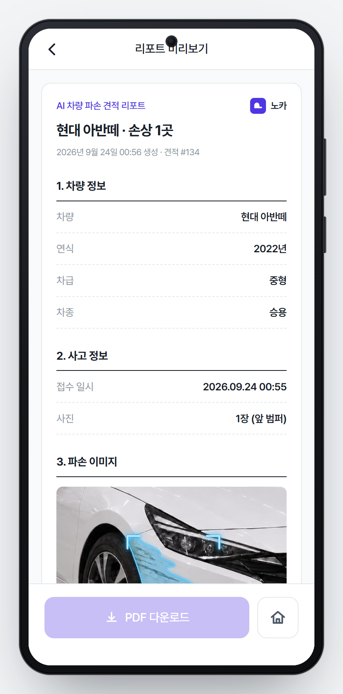

- **나레이션**: "하단의 리포트 만들기 버튼을 클릭하면 분석한 사고를 바탕으로…"
- **실행**: 견적 화면 하단 **리포트 만들기** 버튼을 클릭합니다. 짧은 생성 화면을 거쳐 리포트 미리보기로 이동합니다.
- **확인 포인트**: 상단에 **1. 차량 정보**(차량·연식·차급·차종)와 **2. 사고 정보**(접수 일시, 사진 1장 (앞 범퍼))가 표시됩니다.
- 참고: 한 번 리포트를 본 견적은 다음부터 버튼이 **리포트 보기**로 바뀌어 생성 화면 없이 바로 열립니다.

### 2-2. 스크롤 — 예상 수리비 · 산정 근거
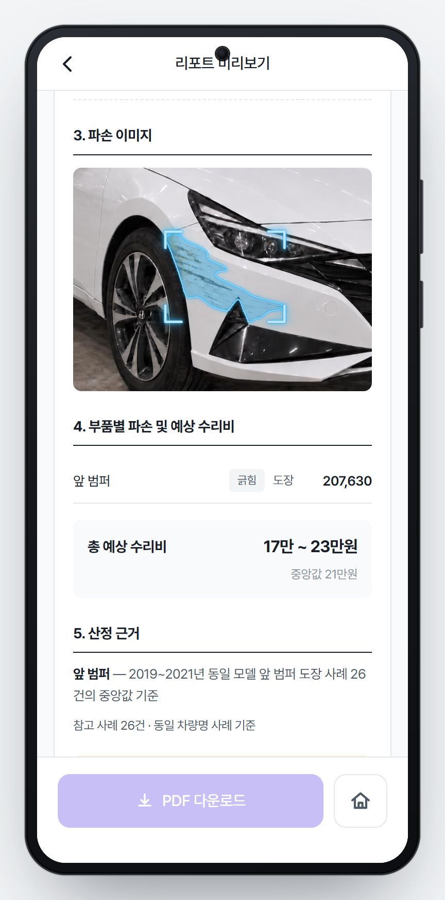
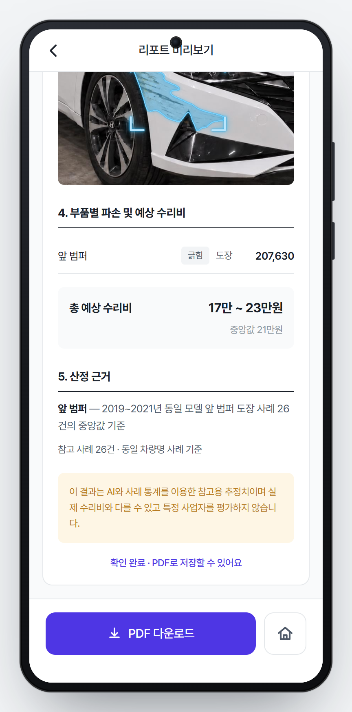

- **나레이션**: "…사고 정보, 예상 수리비, 산정 근거에 대한 정보를 리포트 형식으로 확인할 수 있고,"
- **실행**: 리포트 본문을 아래로 스크롤합니다.
- **확인 포인트**:
  - **3. 파손 이미지**: 인식 도형이 포함된 사진
  - **4. 부품별 파손 및 예상 수리비**: 앞 범퍼 · 긁힘 · 도장 · 금액, 총 예상 수리비
  - **5. 산정 근거**: 유사 사례 기준 설명과 하단 고지문

### 2-3. PDF 다운로드
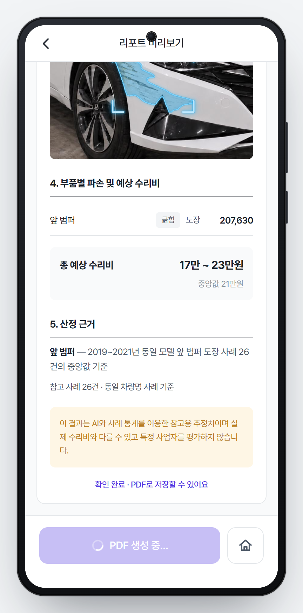

- **나레이션**: "PDF로 해당 리포트를 다운받아서 보관할 수 있습니다."
- **실행**: 하단 **PDF 다운로드** 버튼을 클릭합니다. 버튼이 **PDF 생성 중…**으로 바뀌고 몇 초 뒤 다운로드가 시작되며 "PDF 다운로드를 시작했어요" 안내가 뜹니다.
- **확인 포인트**: 받은 파일(`예상견적_R-20260924-0003.pdf`)을 열어 정비소에 보여 줄 리포트 형태를 잠깐 소개합니다. 이 폴더의 PDF를 미리 열어 두면 빠릅니다.

### 2-4. 홈으로
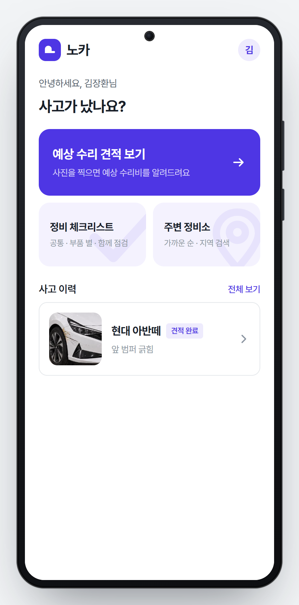

- **실행**: 하단 오른쪽 **홈 아이콘** 버튼을 클릭합니다.
- **확인 포인트**: 사고 이력에 방금 분석한 건이 **견적 완료** 배지와 "앞 범퍼 긁힘" 요약으로 보입니다.

---

## 3. 부품 미확정 — 근접 사진

### 3-1. 근접 사진 업로드
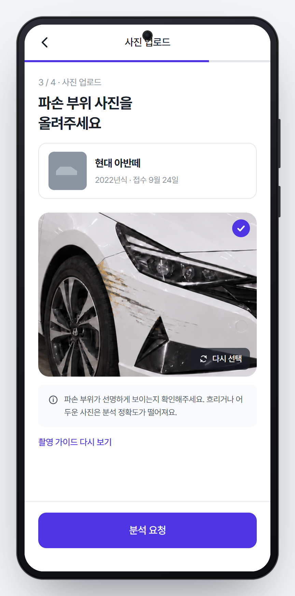
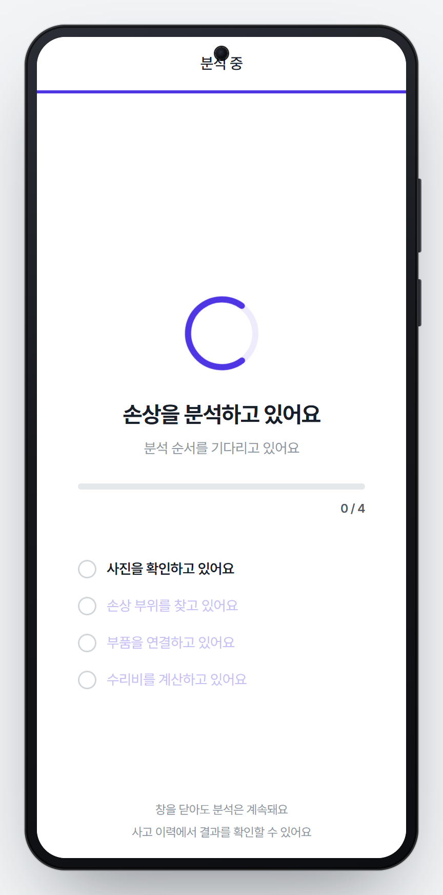

- **나레이션**: "만약에 사진을 너무 가까이 찍어서 정확한 파손 부위를 확인하기 어려운 경우에는 어떻게 될까요? 파손 부위를 좀 더 가까이 찍었다는 가정으로 이미지를 업로드해보겠습니다."
- **실행**: 홈 → **예상 수리 견적 보기** → **현대 아반떼** → **다음** → **사진 올리기**까지 빠르게 이동한 뒤, `아반떼 파손_1.png`를 올리고 **분석 요청**을 클릭합니다.

### 3-2. 손상 부위 선택 (차량 평면도)

- **나레이션**: "이 경우에는 사용자가 직접 손상 부위를 선택할 수 있도록 차량 평면도 형태의 버튼이 나타납니다."
- **확인 포인트**:
  - 상단 안내 **"어느 부품인지 확정하지 못했어요 / 파손된 부위를 아래에서 선택해 주세요"**
  - **손상 부위 선택** 도면: 가운데 열(앞 범퍼·보닛·루프·트렁크·뒤 범퍼)과 운전석·조수석 열(앞/뒤 펜더·앞/뒤 도어·로커 패널)
  - 도면 아래 **사이드미러/유리/휠/라이트** 버튼을 누르면 좌·우 → 카테고리 순으로 나머지 부품을 고를 수 있습니다.
  - 하단 버튼은 고르기 전 **사고 부위를 알려주세요**로 잠겨 있습니다.

### 3-3. 앞 범퍼 선택 → 다시 분석
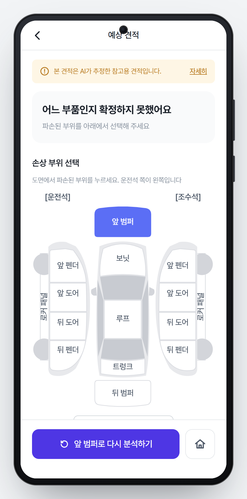
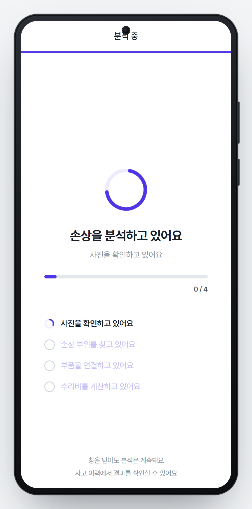

- **나레이션**: "사고 부위인 '앞 범퍼'를 선택하고 다시 분석을 진행해보겠습니다."
- **실행**: 도면 맨 위 **앞 범퍼** 칸을 클릭(보라색으로 채워짐)한 뒤, 하단 **앞 범퍼로 다시 분석하기** 버튼을 클릭합니다.
- **확인 포인트**: 같은 분석 중 화면을 거쳐 견적 화면으로 돌아옵니다.

### 3-4. 재분석 결과
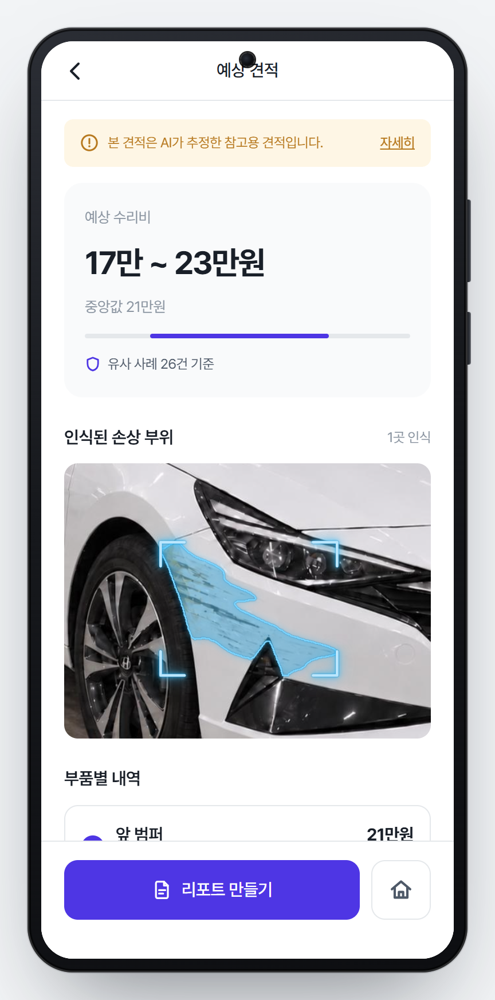

- **나레이션**: "재분석 결과 이전과 유사하게 예상 수리비 정보가 산정된 것을 확인할 수 있습니다."
- **확인 포인트**: 앞 범퍼 · 긁힘 · 도장, 17만 ~ 23만원으로 첫 사례와 같은 금액대입니다.

---

## 4. 정비 체크리스트

### 4-1. 체크리스트 목록
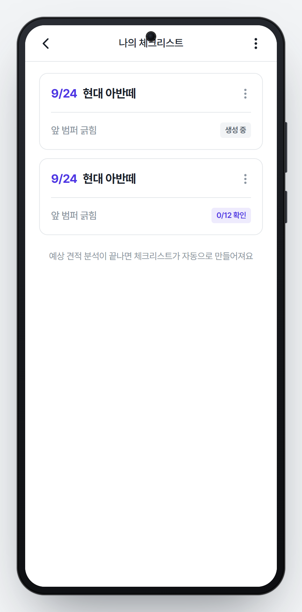

- **나레이션**: "사고 분석이 진행되면 동시에 정비 체크리스트가 생성됩니다. 이 체크리스트는 사용자가 정비소에 방문했을 때 중점적으로 확인하면 좋을 내용들을 안내합니다."
- **실행**: 홈으로 이동해 **정비 체크리스트** 카드를 클릭합니다.
- **확인 포인트**: 견적이 산정된 사고마다 카드가 있고, 오른쪽에 **n/N 확인** 진행 배지가 붙습니다. 생성 중이면 "생성 중" 배지가 뜨고 끝나면 자동으로 바뀝니다.

### 4-2. 체크리스트 상세
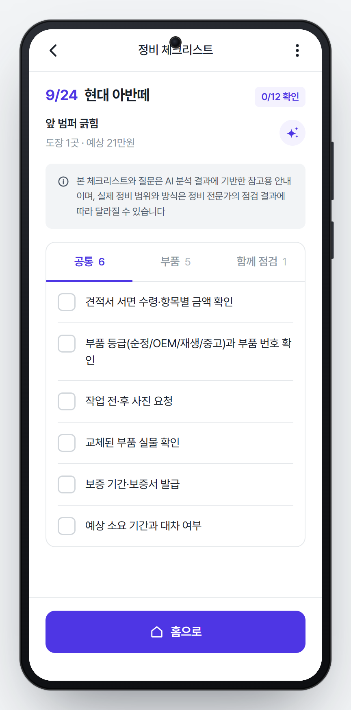

- **실행**: **현대 아반떼** 카드를 클릭합니다.
- **확인 포인트**: 상단에 날짜·차량명·**0/12 확인** 배지, 사고 요약("앞 범퍼 긁힘 / 도장 1곳 · 예상 21만원"), 참고용 고지, 그리고 탭(공통 6 · 부품 5 · 함께 점검 1)이 있습니다. 목록은 상자 안에서만 스크롤됩니다.

### 4-3. AI 한 줄 요약
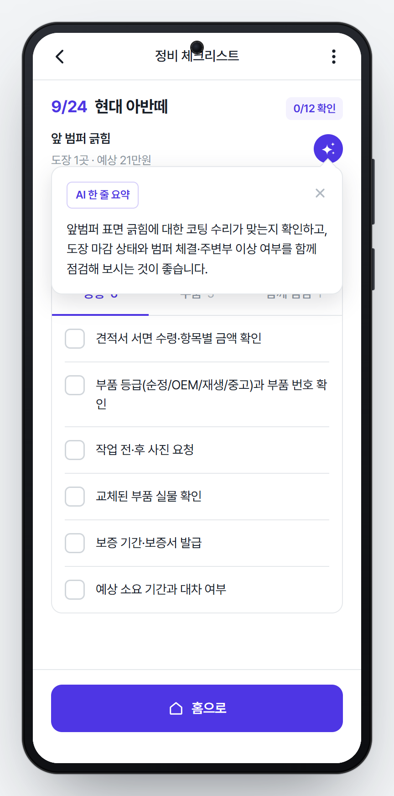

- **나레이션**: "체크리스트 화면에서는 우측 상단의 AI 한 줄 요약을 통해 사고 정보와 주요 확인 사항을 빠르게 확인할 수 있고,"
- **실행**: 요약 줄 오른쪽의 **반짝임(✦) 아이콘** 버튼을 클릭합니다. 말풍선이 열리며, 다시 누르거나 X를 누르면 닫힙니다.

### 4-4. 카테고리 탭
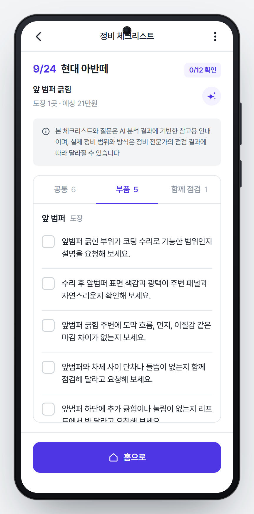

- **나레이션**: "아래에서는 카테고리 별로 나누어진 체크리스트를 확인할 수 있습니다."
- **실행**: 상자 상단 탭 **공통 → 부품 → 함께 점검**을 차례로 클릭합니다.
- **확인 포인트**:
  - **공통**: 견적서 수령, 부품 등급, 작업 전·후 사진 등 어느 수리에나 해당하는 항목
  - **부품**: 견적 부위(앞 범퍼)별로 묶인 AI 항목
  - **함께 점검**: 사진에 보이지 않지만 같이 점검을 요청할 손상 후보
  - 항목 왼쪽 체크박스를 누르면 확인 처리되어 상단 배지 숫자가 올라갑니다.

---

## 5. 주변 정비소

### 5-1. 위치 정보 동의
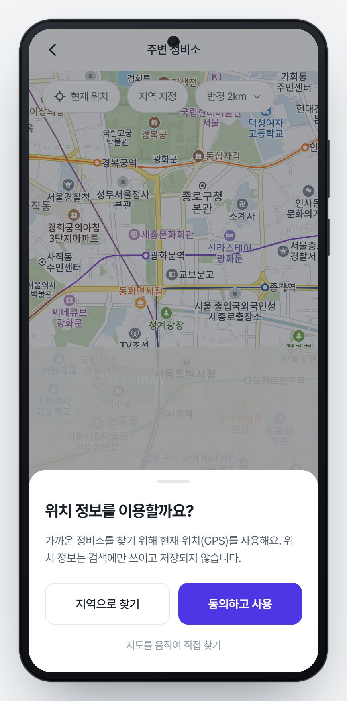

- **실행**: 홈으로 이동해 **주변 정비소** 카드를 클릭한 뒤, 안내 시트의 **동의하고 사용**을 클릭합니다. 브라우저 위치 권한 팝업이 뜨면 **허용**합니다.
- 참고: 위치 권한 없이 시연하려면 **지역으로 찾기**로 시·군·구를 지정할 수도 있습니다.

### 5-2. 정비소 목록

- **나레이션**: "마지막으로 현재 위치를 기반으로 가까운 정비소를 확인할 수 있고,"
- **실행**: 하단 시트의 정비소 카드 하나를 클릭합니다.
- **확인 포인트**:
  - 지도 위 보라색 핀은 정비소 위치, 가운데 원은 현재 위치입니다. 핀에는 번호가 없고, 카드나 핀을 고르면 그 핀에만 번호가 표시되며 맨 앞으로 올라옵니다.
  - 고른 정비소는 시트에 가리지 않는 지도 영역의 가운데로 이동합니다. 시트 머리를 아래로 끌어 접으면 지도 전체를 볼 수 있습니다.
  - 상단 칩: **현재 위치**(재검색) · **지역 지정** · **반경 2km**(1/2/5/10km 변경)

### 5-3. 정비소 상세 정보
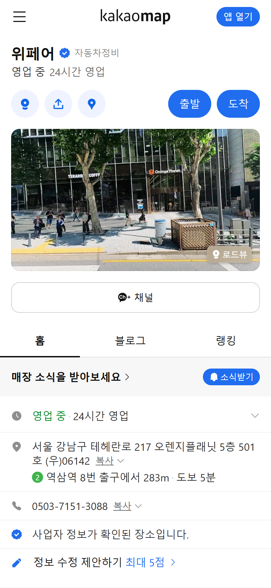

- **나레이션**: "정비소와 관련된 상세 정보를 확인할 수 있습니다."
- **실행**: 카드 오른쪽 **ⓘ(정보) 버튼**을 클릭합니다. 새 탭으로 카카오맵 상세 페이지(영업 시간·주소·전화·로드뷰)가 열립니다. 왼쪽 **전화 버튼**은 바로 통화로 연결됩니다.

---

## 파일 목록

| 파일 | 화면 |
|---|---|
| 01_랜딩.png | 로그인 전 랜딩 |
| 02_홈.png | 홈 |
| 03_차량선택_아반떼.png | 차량 선택 |
| 04_촬영가이드.png | 촬영 가이드 |
| 05_사진업로드_전.png / 06_사진업로드_완료.png | 사진 업로드 |
| 07_분석중.png | 분석 중 |
| 08_예상견적.png / 09_…라벨.png / 10_…부품별내역.png | 예상 견적 |
| 11_리포트_상단.png / 12_…예상수리비.png / 13_…산정근거.png | 리포트 미리보기 |
| 14_리포트_PDF생성중.png / 15_리포트_PDF다운로드.png | PDF 다운로드 |
| 16_홈_이력.png | 홈(이력 1건) |
| 17_사진업로드_근접사진.png / 18_분석중_근접.png | 근접 사진 업로드·분석 |
| 19_부위선택_도면.png / 20_부위선택_앞범퍼.png | 손상 부위 선택 |
| 21_재분석중.png / 22_재분석_예상견적.png | 재분석 |
| 23_체크리스트_목록.png ~ 27_체크리스트_함께점검탭.png | 정비 체크리스트 |
| 28_정비소_위치동의.png ~ 31_정비소_상세정보_카카오맵.png | 주변 정비소 |
| 예상견적_R-20260924-0003.pdf | 실제 생성된 리포트 PDF |
| 00_단계목록.md | 시나리오 문장·조작·파일 대응표 |
