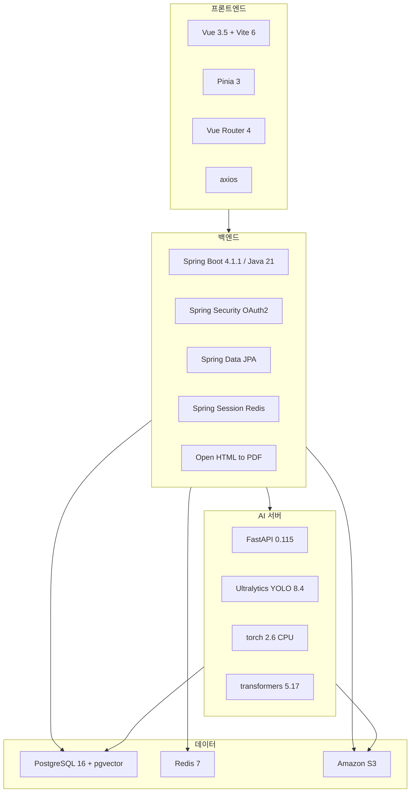

# 기술 스택

## 목적

각 기술을 **왜 썼는지** 와 **어디서 확인되는지** 를 함께 적는다. 버전은 빌드 파일에서 직접 읽은 값이다.

## 현재 구현

### 프론트엔드

| 기술 | 버전 | 근거 파일 | 쓰임 |
| --- | --- | --- | --- |
| Vue | ^3.5.13 | `frontend/package.json` | SPA 프레임워크 |
| Vite | ^6.2.0 | `frontend/package.json` | 개발 서버·번들러 |
| Pinia | ^3.0.1 | `frontend/package.json` | 상태 관리 |
| Vue Router | ^4.5.0 | `frontend/package.json` | 라우팅 |
| axios | ^1.20.0 | `frontend/package.json` | HTTP 클라이언트 |
| @vitejs/plugin-basic-ssl | ^2.3.0 | `frontend/package.json` | 로컬 https 개발 서버 |

`plugin-basic-ssl` 을 넣은 이유가 `frontend/vite.config.js` 주석에 적혀 있다 — 휴대폰에서 LAN IP 로
접속할 때 Geolocation API 가 https 를 요구하기 때문이다. `npm run dev:https` 로 켠다.

의존성이 5개뿐이다. UI 라이브러리·상태관리 부가 패키지·테스트 러너가 없다.

### 백엔드

| 기술 | 버전 | 근거 파일 |
| --- | --- | --- |
| Java | 21 (toolchain) | `backend/build.gradle` |
| Spring Boot | 4.1.1 | `backend/build.gradle` |
| Spring Security + OAuth2 Client | Boot 관리 | `backend/build.gradle` |
| Spring Session Data Redis | Boot 관리 | `backend/build.gradle` |
| Spring Data JPA | Boot 관리 | `backend/build.gradle` |
| springdoc-openapi | 3.1.0 | `backend/build.gradle` |
| AWS SDK v2 (S3) | BOM 2.29.52 | `backend/build.gradle` |
| Open HTML to PDF (PDFBox) | 1.0.10 | `backend/build.gradle` |
| Thymeleaf | Boot 관리 | `backend/build.gradle` |
| Lombok | Boot 관리 | `backend/build.gradle` |
| PostgreSQL JDBC | Boot 관리 | `backend/build.gradle` (runtimeOnly) |
| H2 | Boot 관리 | 테스트 런타임 전용 |

`build.gradle` 주석에 남은 판단 두 가지가 중요하다.

1. **의존성을 최소로 유지한다** — "이 저장소는 새 의존성을 넣지 않는 것을 관례로 지켜 왔다
   (GMS 호출도 RestClient 로 버텼다)". LLM 호출에 전용 SDK를 쓰지 않았다.
2. **PDF는 그 관례의 예외** — iText 7은 AGPL이라 팀 프로젝트에 끌어들이지 않고, LGPL인
   Open HTML to PDF를 골랐다. OpenPDF는 저수준 생성용, PDFBox 단독은 기존 PDF 조작용이라 맞지 않았다.

AWS 자격증명은 **기본 자격증명 체인**을 쓴다. 액세스 키를 설정 파일에 두지 않는다는 주석이
`build.gradle` 에 있다.

### AI 서버

| 기술 | 버전 | 근거 파일 |
| --- | --- | --- |
| Python | 3.12-slim | `AI/server/Dockerfile` |
| FastAPI | 0.115.12 | `AI/server/requirements.txt` |
| uvicorn[standard] | 0.34.2 | `AI/server/requirements.txt` |
| psycopg[binary] | 3.2.6 | `AI/server/requirements.txt` |
| transformers | 5.17.0 | `AI/server/requirements.txt` |
| torch | 2.6.0 (+cu124 → 배포는 CPU 휠) | `AI/requirements.txt`, `AI/server/Dockerfile` |
| torchvision | 0.21.0 | 동일 |
| ultralytics | 8.4.138 | `AI/requirements.txt` |
| numpy | 2.5.2 | `AI/requirements.txt` |
| opencv-python | 5.0.0.93 | `AI/requirements.txt` |
| pillow | 12.3.0 | `AI/requirements.txt` |
| polars | 1.44.1 | `AI/requirements.txt` |

`AI/requirements.txt` 는 CUDA 휠(`torch==2.6.0+cu124`)을 지정하지만, `AI/server/Dockerfile` 이
배포 이미지에서는 **CPU 휠로 바꿔 설치**한다. 이유가 주석에 있다 — 배포 대상 인스턴스에 GPU가 없고,
CUDA 휠을 넣으면 이미지가 6GB를 넘는데 실제로는 CPU로 돌기 때문이다.
`shared/vision/dinov2.py` 가 `"cuda" if torch.cuda.is_available() else "cpu"` 로 알아서 내려간다.

### 데이터베이스

| 기술 | 버전 | 근거 |
| --- | --- | --- |
| PostgreSQL | 16 | `docker-compose.yml` 의 `pgvector/pgvector:pg16` |
| pgvector | pg16 이미지 동봉 | `docker-compose.yml`, DDL의 `CREATE EXTENSION vector` |
| Redis | 7-alpine | `docker-compose.yml` |

Redis는 **Spring Session 저장소로만** 쓴다. 캐시 용도 코드는 확인되지 않았다
([캐싱 전략](../03_백엔드/캐싱_전략.md)).

### 인프라 · 배포

| 기술 | 근거 |
| --- | --- |
| Docker | `backend/Dockerfile`, `AI/server/Dockerfile`, `docker-compose.yml` |
| Nginx | `.gitlab-ci.yml` 의 `systemctl reload nginx`, `WEB_ROOT=/var/www/a307` |
| GitLab CI/CD | `.gitlab-ci.yml` (shell executor, 태그 `a307-deploy` · `a307-ai-deploy`) |
| Amazon S3 | `backend/build.gradle` 의 AWS SDK, `STORAGE_*_BUCKET` 환경변수 |
| SSAFY GMS | LLM 프록시. `GMS_PROVIDER` · `GMS_MODEL` · `GMS_OPENAI_API` 환경변수 |

Nginx **설정 파일은 저장소에 없다**. CI가 `systemctl reload nginx` 를 호출하는 것으로만 존재가
확인된다 ([Nginx 구성](../07_인프라/Nginx_구성.md)).

## 주요 구성 요소

## 설정 및 실행 방법

- 프론트엔드: `cd frontend && npm ci && npm run dev` (포트 5173)
- 백엔드: `cd backend && ./gradlew bootRun` — 로컬 DB·Redis는 `docker compose up -d`
- AI 서버: `uvicorn app.main:app --app-dir AI/server --host 0.0.0.0 --port 8000`

상세는 [실행 및 빌드](../02_프론트엔드/실행_및_빌드.md) · [실행 및 테스트](../03_백엔드/실행_및_테스트.md)에 있다.

## 관련 소스코드

- `frontend/package.json` · `frontend/vite.config.js`
- `backend/build.gradle`
- `AI/requirements.txt` · `AI/server/requirements.txt` · `AI/server/Dockerfile`
- `docker-compose.yml`
- `.gitlab-ci.yml`

## 근거 자료

빌드·의존성 파일을 직접 읽어 버전을 옮겼다. 추정한 버전은 없다.

## 확인 필요 항목

- **Nginx 버전과 설정** — 저장소에 설정 파일이 없어 확인하지 못함
- **운영 PostgreSQL 실제 버전** — `docker-compose.yml` 은 로컬용이다. 운영 컨테이너(`a307-db`)의 이미지 태그를 저장소 파일에서 확인하지 못함
- **프론트엔드 테스트 도구** — `package.json` 에 테스트 러너가 없다. 프론트 자동 테스트가 없는 것으로 추정
