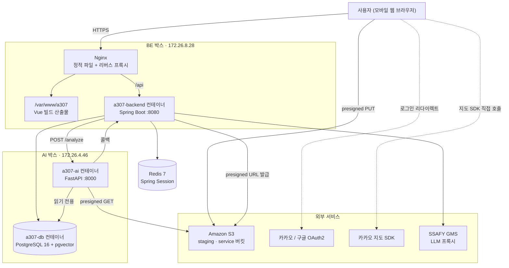

# 전체 시스템 구성

## 목적

서비스를 이루는 물리적·논리적 조각과 그 배치를 한 장에 담는다. 상세 흐름은
[시스템 아키텍처](../01_전체_아키텍처/시스템_아키텍처.md)에 있다.

## 현재 구현

시스템은 **서버 두 대**에 나뉘어 있다. `.gitlab-ci.yml` 의 배포 잡 두 개(`deploy` · `deploy-ai`)가
서로 다른 Runner 태그를 쓰는 것으로 확인된다.

| 박스 | Runner 태그 | 올라가는 것 |
| --- | --- | --- |
| BE 박스 (사설 IP `172.26.8.28`) | `a307-deploy` | Nginx + 프론트 정적 파일, 백엔드 컨테이너 `a307-backend` |
| AI 박스 (사설 IP `172.26.4.46`) | `a307-ai-deploy` | AI 컨테이너 `a307-ai`, PostgreSQL 컨테이너 `a307-db` |

**운영 데이터베이스가 AI 박스에 있다.** `AI/server/Dockerfile` 과 `.gitlab-ci.yml` 의 메모리 상한
주석이 이를 뒷받침한다 — "이 박스에는 PostgreSQL 이 같이 있고, 상한이 없으면 모델이 메모리를
먹다가 DB 를 끌고 내려간다".

## 동작 흐름



## 주요 구성 요소

### 애플리케이션 3종

| 구성 요소 | 기술 | 소스 위치 |
| --- | --- | --- |
| 프론트엔드 | Vue 3 SPA | `frontend/` |
| 백엔드 | Spring Boot | `backend/` |
| AI 추론 서버 | FastAPI | `AI/server/` |

### 데이터 저장소 3종

| 저장소 | 용도 | 비고 |
| --- | --- | --- |
| PostgreSQL 16 + pgvector | 업무 데이터 + 벡터 검색 corpus | 47개 테이블 |
| Redis 7 | Spring Session 저장소 | 캐시 용도 아님 |
| Amazon S3 | 사고 사진 원본·리사이즈·썸네일 | staging / service 2개 버킷 |

### 오프라인 구성 요소

| 구성 요소 | 위치 | 용도 |
| --- | --- | --- |
| 데이터 파이프라인 | `pipeline/jobs/` | AI-Hub 데이터셋 → 표준 코드 → corpus 적재 |
| 스키마 마이그레이션 | `pipeline/sql/` | `008` ~ `015` |
| 공용 비전 모듈 | `shared/vision/` | 파이프라인과 AI 서버가 같은 판정을 내도록 공유 |

`shared/vision` 이 존재하는 이유는 `AI/server/README.md` 에 적혀 있다 — "batch 적재와 실시간
분석에서 같은 판정을 보장하기 위해". 오프라인으로 만든 corpus 벡터와 실시간 질의 벡터가 같은
전처리를 거쳐야 검색이 의미를 갖는다.

## 설정 및 실행 방법

로컬 개발은 애플리케이션 3종을 각자 띄우고, 데이터 저장소만 `docker-compose.yml` 로 올린다.
`docker-compose.yml` 첫 줄 주석이 이를 명시한다 — "애플리케이션은 여기 없다".

```
docker compose up -d      # PostgreSQL + Redis 만
```

## 오류 및 예외 처리

박스가 나뉘어 있어 생기는 실패 지점이 있다.

| 실패 지점 | 증상 | 처리 |
| --- | --- | --- |
| BE → AI 네트워크 단절 | 분석 요청 실패 | `AI_UNREACHABLE` 로 작업 실패 |
| AI → BE 콜백 실패 | 결과가 도착하지 않음 | AI가 1·5·20초 간격 최대 3회 재시도 |
| AI 컨테이너 OOM | DB까지 함께 중단 위험 | `--memory=6g` 상한으로 방지 |
| DB 스키마 불일치 | 백엔드 **전체** 기동 실패 | `ddl-auto=validate` + CI 마이그레이션 가드 |

## 관련 소스코드

- `.gitlab-ci.yml` — 배포 잡 2개와 박스 구분
- `docker-compose.yml` — 로컬 데이터 저장소
- `backend/Dockerfile` · `AI/server/Dockerfile`
- `Docs/Architecture/` — 기존 아키텍처 문서

## 근거 자료

- `.gitlab-ci.yml` 의 `PRIVATE_IP: "172.26.8.28"` · `AI_HEALTH: "http://172.26.4.46:8000/health"`
- `AI/server/Dockerfile` · `backend/Dockerfile` 의 주석
- 이 세션에서 AI 박스에 접속해 확인한 컨테이너 구성 (`a307-ai`, `a307-db`)

## 확인 필요 항목

- **Redis 운영 위치** — 로컬은 `docker-compose.yml` 로 확인되지만, 운영 Redis가 어느 박스에서 도는지 저장소 파일에서 확인하지 못함
- **공인 도메인과 인증서** — Nginx 설정이 저장소에 없어 HTTPS 종단 구성을 확인하지 못함
- **클라우드 제공자** — 문서마다 EC2와 Lightsail 표기가 섞여 있다. [AWS 구성](../07_인프라/AWS_구성.md) 참고
