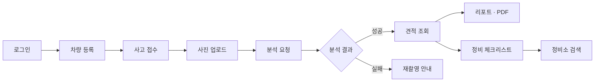

# 주요 기능

## 목적

저장소 루트 `README.md` 의 기능 상태표와 실제 코드·설정을 대조해, **무엇이 구현됐고 무엇이 운영에서
켜져 있는지** 를 구분해 정리한다. "구현됨" 과 "동작함" 은 다른 문제다 — 이 프로젝트는 기능 대부분을
환경변수 스위치로 켜고 끈다.

## 현재 구현

### 사용자 핵심 경로 (화면까지 연결됨)

| 기능 | 상태 | 스위치 · 근거 |
| --- | --- | --- |
| 소셜 로그인 · 회원 · 약관 | 구현 · 화면 연동 | 카카오/구글 OAuth2, 세션은 Redis. `config/SecurityConfig.java` |
| 차량 등록 · 목록 | 구현 · 화면 연동 | `vehicle_model` 마스터 기반 |
| 사고 접수 · 사진 업로드 | 구현 · 화면 연동 | S3 presigned. 버킷 미설정이면 503 |
| AI 분석 요청 · 콜백 수신 | 구현 · **운영에서 켜짐** | `ANALYSIS_REQUEST_WORKER_ENABLED=true` |
| 분석 결과 · 견적 조회 · 리포트 | 구현 · 화면 연동 | `EstimateView.vue` · `ReportView.vue` |
| 견적 PDF | 구현 · **운영에서 켜짐** | `ESTIMATE_PDF_ENABLED=true` |
| LLM 리포트 요약 · 체크리스트 | 구현 · **운영에서 켜짐** | `ESTIMATE_NARRATIVE_WORKER_ENABLED` · `REPAIR_CHECKLIST_WORKER_ENABLED` |
| 체크리스트 화면 | 구현 · 화면 연동 | `stores/checklist.js` 를 세 화면이 공유 |
| 정비소 검색 | 구현 · 카카오 지도 SDK 직접 연동 | `ShopsView.vue` 가 브라우저에서 SDK 호출 |

### AI 서버 기능

| 엔드포인트 | 상태 | 비고 |
| --- | --- | --- |
| `POST /inference` | 구현 | YOLO 2모델 → 표준화 결과 |
| `POST /search` | 구현 | ROI 임베딩 + pgvector. `FEATURE_PIPELINE_VERSION_ID` 없으면 503 |
| `POST /estimate` | 구현 | 수리 사례 DB 조회. `DATABASE_URL` 없거나 실패면 503 |
| `POST /analyze` | 구현 · 운영 실경로 | 셋을 이어 실행하고 콜백 1회 |
| `GET /health` | 구현 | 토큰 없이 열림 |

운영은 `/analyze` 만 노출하고 나머지 셋은 내부망 전용이다
(`Docs/AI/AI 서버 API 명세.md` 의 제약 6번).

### 구현됐으나 이번 범위에서 제외된 기능

루트 `README.md` 가 명시적으로 "범위 제외" 로 적은 것들이다. **코드가 없는 게 아니라 켜지 않았다.**

| 기능 | 상태 | 켜려면 필요한 것 |
| --- | --- | --- |
| 견적서 검증 (OCR → 판정 → 리포트) | 백엔드 101개 파일 완성 | `DOCUMENT_STORAGE_PROVIDER` · `ESTIMATE_OCR_PROVIDER` 선택 + 업로드 화면 |
| 검증 결과 PDF | 생성기·한글 폰트·워커 완성, 테스트 3건 | 위 견적서 검증과 함께 |
| 정비소 질문 | API·스키마·LLM 워커 완성 | 화면. 정비 체크리스트와 목적이 겹쳐 하나로 합침 |
| 관리자 마스터 · 규칙 관리 | API 34개 완성 | 관리자 UI |
| 사진 품질 판정 | 구현 · 꺼짐 | `app.image-quality.enabled=true` |

`estimatevalidation` 패키지가 101개 파일로 백엔드에서 가장 큰 도메인인데 운영에서 꺼져 있다는 것이
이 프로젝트의 특징이다 ([패키지 구조](../03_백엔드/패키지_구조.md)).

## 동작 흐름

사용자가 실제로 밟는 경로다. 상세는 [서비스 데이터 흐름](../01_전체_아키텍처/서비스_데이터_흐름.md)에 있다.

## 주요 구성 요소

| 구성 요소 | 위치 |
| --- | --- |
| 화면 25개 | `frontend/src/views/` |
| 도메인 패키지 18개 | `backend/src/main/java/com/ssafy/a307/` |
| AI 추론 서버 | `AI/server/app/` |
| 오프라인 파이프라인 | `pipeline/jobs/` |

## 설정 및 실행 방법

기능 스위치는 모두 환경변수다. 전체 목록은 [환경변수 목록](../07_인프라/환경변수_목록.md)에 있다.
저장소 기본값은 대부분 `false` 이고, 운영 컨테이너가 `-e` 또는 `--env-file` 로 켠다.

## 오류 및 예외 처리

- 버킷 미설정 → 업로드 API `503`
- `GMS_KEY` 없음 → LLM 기능 `503`
- `FEATURE_PIPELINE_VERSION_ID` 없음 → AI `/search` `503 PIPELINE_NOT_CONFIGURED`
- 분석 실패 → `analysis_job.failure_reason` 에 코드 저장, 화면이 코드로 문구 결정

## 관련 소스코드

- `README.md:135~154` — 기능 상태표 원본
- `backend/src/main/resources/application.properties` — 스위치 기본값
- `frontend/src/views/` — 화면 25개
- `AI/server/app/api/routes.py` — AI 엔드포인트 5개

## 근거 자료

- 저장소 루트 `README.md` 기능 상태표
- `backend/src/main/resources/application.properties` 의 환경변수 참조 35곳
- 이 세션에서 직접 조회한 운영 `/health` 응답

## 확인 필요 항목

- **범위 제외 결정의 공식 기록** — README 본문 외에 회의록·Jira 결정 기록을 확인하지 못함
- **사진 품질 판정을 끈 이유** — `app.image-quality.enabled=false` 의 배경을 확인하지 못함
