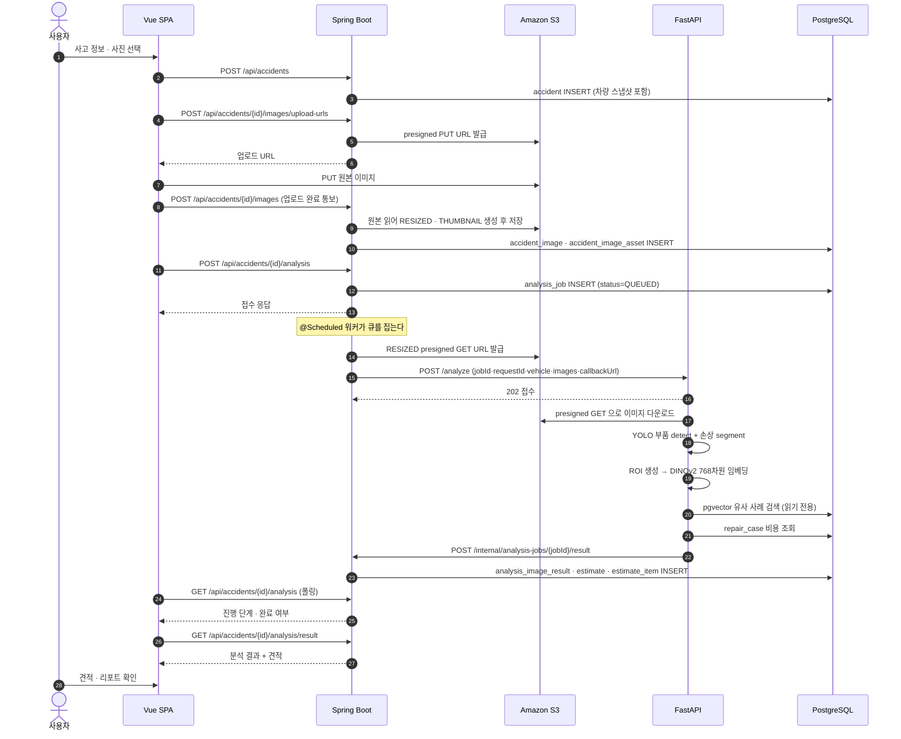
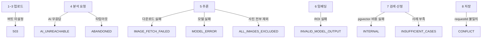

# 서비스 데이터 흐름

## 목적

사진 한 장이 견적이 되기까지의 10단계를 단계별 담당·데이터·실패 지점과 함께 정리한다.
이 문서가 프로젝트 전체를 이해하는 기준선이다.

## 동작 흐름 (전체)

## 단계별 상세

### 1. 사용자가 프론트엔드에서 이미지와 사고 정보를 입력

| 항목 | 내용 |
| --- | --- |
| 담당 | `frontend/src/views/UploadView.vue`, `frontend/src/views/ClaimVehicleView.vue` |
| 입력 데이터 | 차량 선택, 사고 일자·설명, 사진 파일 |
| 실패 지점 | 파일 형식·용량 초과 |
| 오류 처리 | 프론트 검증 후 업로드 시도. 서버는 `accident_image_asset.ck_aia_size` 로 20MB 상한 |

### 2. 프론트엔드가 백엔드 API를 호출

| 항목 | 내용 |
| --- | --- |
| 담당 | `frontend/src/lib/api.js` (axios) |
| 요청 | `POST /api/accidents` |
| 응답 | `accidentId` |
| 저장 | `accident` 행. 차량 정보를 **스냅샷으로 복사** (`snapshot_model_id` 등) |
| 실패 지점 | 인증 만료 (401), 유효성 실패 (400) |
| 오류 처리 | `ErrorCode.UNAUTHORIZED` · `INVALID_REQUEST` |
| 소스 | `backend/src/main/java/com/ssafy/a307/accident/controller/AccidentController.java` |

차량 정보를 참조가 아니라 스냅샷으로 복사하는 이유는, 사용자가 나중에 차량을 수정·삭제해도
그때 분석한 조건이 그대로 남아야 하기 때문이다(`AnalysisRequestPayload.Vehicle.from(Accident)` 가
`snapshot*` 필드를 읽는다).

### 3. 원본 이미지가 S3에 업로드

| 항목 | 내용 |
| --- | --- |
| 담당 | `AccidentImageController.issueUploadUrls` → 브라우저가 직접 PUT |
| 요청 | `POST /api/accidents/{accidentId}/images/upload-urls` |
| 응답 | presigned PUT URL 목록 |
| 저장 | S3 staging 버킷 (`STORAGE_STAGING_BUCKET`) |
| 실패 지점 | 버킷 미설정, presigned 만료 |
| 오류 처리 | 버킷 미설정 시 `503` |
| 소스 | `backend/src/main/java/com/ssafy/a307/accident/controller/AccidentImageController.java:44` |

**파일 바이트가 백엔드를 통과하지 않는다.** 브라우저가 S3에 직접 올린다.

업로드가 끝나면 `POST /api/accidents/{accidentId}/images` 로 완료를 통보하고, 백엔드가 그때
원본을 읽어 `RESIZED` · `THUMBNAIL` 변형을 만든다. 변형은 `accident_image_asset` 에 행으로 쌓인다
(`variant` CHECK 는 `ORIGINAL` · `RESIZED` · `THUMBNAIL` · `BLURRED` 4종).

`BLURRED` 는 값만 남아 있고 **만드는 코드가 없다.** `ImageVariant.java:26~35` 에 2026-09-10에
MVP 범위 밖으로 정리했다고 적혀 있다.

### 4. 백엔드가 AI 서버에 분석을 요청

| 항목 | 내용 |
| --- | --- |
| 담당 | `analysis/request/AnalysisRequestWorker.java` (`@Scheduled` 폴링) |
| 요청 | `POST {AI_SERVER_URL}/analyze` |
| 요청 본문 | `jobId`, `requestId`, `vehicle{modelId·manufacturer·modelName·carClass·modelYear}`, `images[]`, `callbackUrl` |
| 이미지 변형 | `ImageVariant.RESIZED` (`AnalysisRequestPayload.ANALYSIS_VARIANT`) |
| 응답 | `202` 접수 |
| 저장 | `analysis_job.status = PROCESSING`, `request_id` 기록 |
| 실패 지점 | AI 서버 무응답, 타임아웃 |
| 오류 처리 | `AI_UNREACHABLE`, `processing-timeout` 초과 시 `ABANDONED` (`AnalysisRequestWorker.java:98`) |

`images[].url` 은 **RESIZED 변형의 presigned GET URL** 이다. AI 서버는 S3 자격증명을 갖지 않는다.

### 5. AI 서버가 부품 탐지와 손상 영역 분석 수행

| 항목 | 내용 |
| --- | --- |
| 담당 | `AI/server/app/services/inference_service.py` |
| 모델 2종 | part = `vehicle-part-detection` (32 클래스), damage = `vehicle-damage-segmentation` (4 클래스) |
| 손상 클래스 | `Scratched` · `Separated` · `Crushed` · `Breakage` |
| 출력 | 이미지별 `excluded` · `exclusionReason` · `detections[]` |
| 실패 지점 | 이미지 다운로드 실패, 모델 실행 실패, 모델 출력 형식 오류 |
| 오류 처리 | `IMAGE_FETCH_FAILED` · `MODEL_ERROR` · `INVALID_MODEL_OUTPUT` |

부품과 손상을 **같은 이미지 안에서 기하학적으로 짝짓는다** (`shared/vision/damage_part_pairing.py`).
짝을 찾으면 `PAIRED` · `STRICT`, 못 찾으면 `UNPAIRED` · `VECTOR_ONLY` 다
(`shared/vision/normalizer.py:135~175`).

### 6. 탐지 결과를 ROI 또는 임베딩으로 변환

| 항목 | 내용 |
| --- | --- |
| 담당 | `AI/server/app/services/embedding_service.py`, `shared/vision/roi.py`, `shared/vision/dinov2.py` |
| ROI 규칙 | 손상 bbox/polygon 기준 20% padding → 224px letterbox |
| 임베딩 | `facebook/dinov2-base` revision `f9e44c81…` 의 `pooler_output` 768차원, ImageNet mean/std 후 L2 정규화 |
| 저장 | **질의 벡터는 저장하지 않는다.** 요청 메모리에서만 쓴다 |
| 실패 지점 | ROI 생성 실패, 임베딩 실패 |
| 오류 처리 | `QueryEmbeddingError` → `INVALID_MODEL_OUTPUT` (`retryable: false`) |

corpus 벡터만 `repair_case_roi_embedding` 에 저장돼 있다. 같은 `shared/vision` 코드로 만들어졌기
때문에 질의와 corpus가 같은 공간에 놓인다.

### 7. 유사 사례를 검색하고 예상 견적을 산정

| 항목 | 내용 |
| --- | --- |
| 담당 | `AI/server/app/services/search_service.py`, `estimate_service.py` |
| 검색 | pgvector HNSW 인덱스 `ix_roi_hnsw` (`vector_cosine_ops`) |
| 필터 | `STRICT` = partCode + damageType, `VECTOR_ONLY` = damageType |
| 완화 단계 | `MODEL` → `PRICE_TIER` → `ALL` (`fallbackStage`) |
| 산정 | `repair_case` · `repair_case_item` 에서 비용 분포 계산 |
| 실패 지점 | pgvector 오류, 비용 데이터 없음 |
| 오류 처리 | `VectorSearchError` · `CostRepositoryError` → `INTERNAL` (`retryable: true`) |

산정 불가일 때는 `nonEstimableReason` 이 붙는다 — `PART_NOT_RESOLVED` · `NO_DAMAGE_DETECTED` ·
`INSUFFICIENT_CASES`.

### 8. 분석 결과와 견적을 데이터베이스에 저장

| 항목 | 내용 |
| --- | --- |
| 담당 | `analysis/callback/AnalysisCallbackService.java`, `AnalysisResultPersister.java` |
| 요청 | `POST /internal/analysis-jobs/{jobId}/result` + `X-Request-Id` 헤더 |
| 멱등성 | 헤더와 본문 `requestId` 일치 확인 → 이미 끝난 작업이면 저장 생략 후 200 |
| 저장 | `analysis_image_result`, `estimate`, `estimate_item` |
| 실패 지점 | requestId 불일치, jobId 불일치, 없는 작업 |
| 오류 처리 | `INVALID_REQUEST` · `CONFLICT` · `NOT_FOUND` |

AI가 콜백을 1·5·20초 간격 최대 3회 재시도하므로 멱등성이 필수다.
`AnalysisCallbackService` 클래스 javadoc이 이유를 적었다 — "막지 않으면 사용자는 분석을 한 번
했는데 견적 버전이 네 개가 된다".

모든 사진이 제외되면 `job.markFailed(ALL_IMAGES_EXCLUDED)` 로 작업을 실패시킨다
(`AnalysisCallbackService.java:126~128`). 판정식은 `!imageResults.isEmpty() && allMatch(excluded)` 다.

### 9. 백엔드가 결과를 프론트엔드에 반환

| 항목 | 내용 |
| --- | --- |
| 담당 | `AnalysisProgressController.java`, `AnalysisResultController.java` |
| 진행 조회 | `GET /api/accidents/{accidentId}/analysis` |
| 결과 조회 | `GET /api/accidents/{accidentId}/analysis/result` |
| 폴링 | `AnalyzingView.vue` 가 `POLL_MS = 2000` 으로 2초마다 |
| 실패 지점 | 남의 사고 조회 (403/404) |
| 오류 처리 | 소유자 검사 후 `FORBIDDEN` · `NOT_FOUND` |

### 10. 사용자가 분석 결과와 견적을 확인

| 항목 | 내용 |
| --- | --- |
| 담당 | `EstimateView.vue`, `ReportView.vue`, `ChecklistView.vue` |
| 표시 | 금액 3종(min·median·max), 항목별 근거, 손상 부위 오버레이 |
| 파생 기능 | 견적 PDF, LLM 리포트 요약, 정비 체크리스트 |
| 실패 화면 | `AnalyzingView.vue` 의 `FAIL_TEXT` 매핑이 코드별 문구 결정 |

`estimate_item.ref_condition` (JSONB)에 `fallbackStage` · `costDistribution` ·
`refYearFrom/To` · `repairMethodReason` · `referencedCaseIds` 가 들어가, 화면이 "왜 이 금액인가"를
보여 줄 수 있다.

## 실패 지점 요약

## 관련 소스코드

- `frontend/src/views/UploadView.vue` · `AnalyzingView.vue` · `EstimateView.vue`
- `frontend/src/lib/api.js`
- `backend/src/main/java/com/ssafy/a307/accident/controller/AccidentImageController.java`
- `backend/src/main/java/com/ssafy/a307/analysis/request/AnalysisRequestWorker.java`
- `backend/src/main/java/com/ssafy/a307/analysis/request/AnalysisRequestPayload.java`
- `backend/src/main/java/com/ssafy/a307/analysis/callback/AnalysisCallbackService.java`
- `AI/server/app/services/analysis_service.py` · `inference_service.py` · `search_service.py`
- `shared/vision/normalizer.py` · `roi.py` · `dinov2.py`

## 근거 자료

- 소스코드 직접 확인 (위 목록)
- `Docs/Api/AI 연동 계약 (백엔드 ↔ AI 서버).md`
- `Docs/AI/AI 서버 API 명세.md`

## 확인 필요 항목

- **RESIZED 생성 시점** — 업로드 완료 통보 시점에 동기로 만드는지 별도 워커인지 소스에서 단정할 근거를 더 확인해야 함 (`추정`: 완료 통보 처리 중 생성)
- **분석 요청 API의 정확한 요청 본문** — `POST /api/accidents/{accidentId}/analysis` 의 파라미터를 상세 확인하지 못함
- **폴링 종료 조건과 최대 시간** — `AnalyzingView.vue` 의 상세 로직을 전부 확인하지 못함
