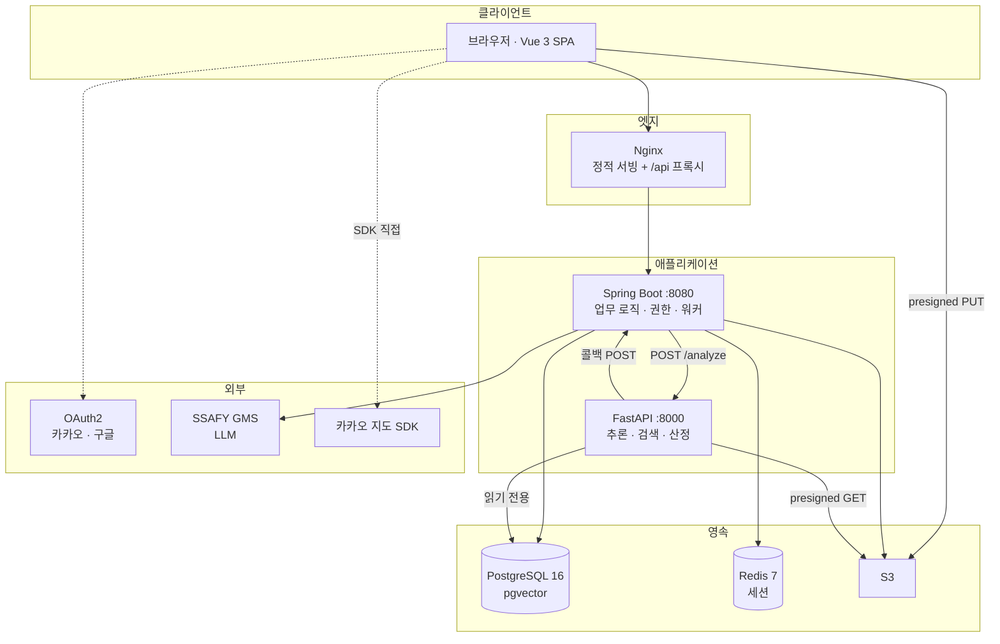
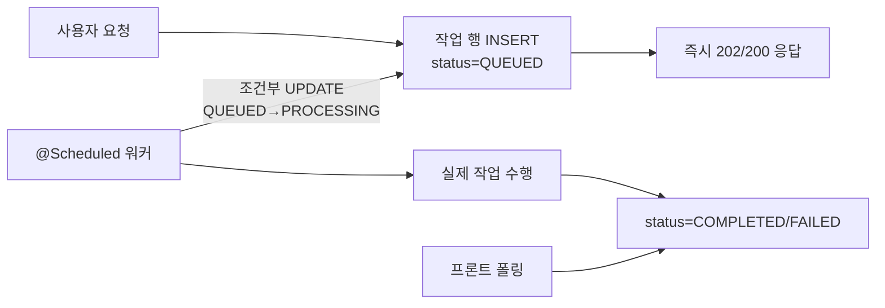

# 시스템 아키텍처

## 목적

세 애플리케이션과 저장소가 어떤 경계로 나뉘고 서로 무엇을 주고받는지 정리한다.

## 현재 구현

### 계층 구분

### 경계 규칙

코드에서 확인되는 경계 규칙 네 가지다.

1. **AI 서버는 DB를 읽기만 한다.** `AI/server/README.md` 와 `app/infrastructure/` 구성에서
   쓰기 경로가 없다. 결과는 백엔드 콜백으로 전달하고, 저장은 백엔드가 한다.
2. **AI 서버는 이미지를 직접 가진 적이 없다.** 백엔드가 presigned GET URL을 만들어 주고
   AI는 그 URL로 내려받는다 (`AI/server/app/infrastructure/image_fetcher.py`).
3. **AI 서버 내부 엔드포인트는 인증 토큰을 요구한다.** `X-Internal-Token` 헤더
   (`AI/server/app/api/routes.py` 의 `Depends(authenticated)`). `/health` 만 열려 있다.
4. **백엔드는 `/internal/**` 을 외부에 닫는다.** 단 하나 예외가 AI 콜백 경로다.
   `SecurityConfig.java:108` 이 `POST /internal/analysis-jobs/*/result` 만 `permitAll()` 로 열고,
   `:111` 이 나머지 `/internal/**` 과 `/inference/**` 를 `denyAll()` 한다.

### 비동기 구조

백엔드는 **요청을 받아 큐에 넣고 즉시 응답**한 뒤, 스케줄러 워커가 뒤에서 처리한다.
큐는 별도 미들웨어가 아니라 **PostgreSQL 테이블**이다.

이 구조를 쓰는 워커가 확인된 것만 여섯 종이다.

| 워커 | 스위치 환경변수 | 타임아웃 설정 키 |
| --- | --- | --- |
| 분석 요청 | `ANALYSIS_REQUEST_WORKER_ENABLED` | `app.analysis-request.processing-timeout` |
| 견적 산출 | `ESTIMATE_WORKER_ENABLED` | `app.estimate-worker.processing-timeout` (PT10M) |
| 견적 요약(LLM) | `ESTIMATE_NARRATIVE_WORKER_ENABLED` | `app.estimate-narrative.processing-timeout` (PT5M) |
| 정비 체크리스트(LLM) | `REPAIR_CHECKLIST_WORKER_ENABLED` | `app.repair-checklist.processing-timeout` (PT5M) |
| 정비소 질문(LLM) | `REPAIR_QUESTION_WORKER_ENABLED` | `app.repair-question.processing-timeout` (PT5M) |
| 검증 PDF | `VALIDATION_PDF_ENABLED` | `app.validation-pdf.processing-timeout` (PT10M) |

모두 `processing-timeout` 이 지난 `PROCESSING` 행을 고아로 보고 종결하는 규칙을 갖는다.
`application.properties` 주석이 이를 명시한다.

## 주요 구성 요소

| 구성 요소 | 책임 | 소스 |
| --- | --- | --- |
| Nginx | 정적 서빙, `/api` 프록시 | 저장소에 설정 없음 |
| Spring Boot | 인증·권한, 업무 로직, 워커, 저장 | `backend/src/main/java/com/ssafy/a307/` |
| FastAPI | YOLO 추론, 벡터 검색, 견적 산출 | `AI/server/app/` |
| PostgreSQL | 업무 데이터 + corpus + 작업 큐 | `Docs/Erd/A307_ddl_final.sql` |
| Redis | 세션 | `spring-boot-starter-session-data-redis` |
| S3 | 이미지 객체 | `software.amazon.awssdk:s3` |

## 설정 및 실행 방법

[실행 및 테스트](../03_백엔드/실행_및_테스트.md) · [실행 및 빌드](../02_프론트엔드/실행_및_빌드.md) 참고.

## 오류 및 예외 처리

경계마다 실패 처리가 다르다.

| 경계 | 실패 시 |
| --- | --- |
| 브라우저 → 백엔드 | `common/exception/GlobalExceptionHandler` 가 `ErrorCode` 8종으로 응답 |
| 백엔드 → AI | 워커가 `analysis_job.failure_reason` 에 코드 기록 |
| AI → 백엔드 콜백 | AI가 1·5·20초 간격 최대 3회 재시도. 백엔드는 `requestId` 로 멱등 처리 |
| 백엔드 → DB | `ddl-auto=validate` 이므로 스키마 불일치는 **기동 자체가 실패** |

## 관련 소스코드

- `backend/src/main/java/com/ssafy/a307/config/SecurityConfig.java` — 경계 규칙
- `backend/src/main/java/com/ssafy/a307/analysis/` — 분석 도메인 60파일
- `AI/server/app/api/routes.py` — AI 엔드포인트
- `AI/server/app/services/analysis_service.py` — 오케스트레이션
- `backend/src/main/resources/application.properties` — 워커 타임아웃

## 근거 자료

- 소스코드 직접 확인
- `.gitlab-ci.yml` 배포 구성

## 확인 필요 항목

- **Nginx 프록시 규칙** — `/api` 를 백엔드로 넘기는 설정을 저장소에서 확인하지 못함. 프론트가
  `VITE_API_BASE_URL` 로 절대 주소를 쓰는지 같은 오리진을 쓰는지는 CI 변수 값에 달려 있고 그 값도 확인하지 못함
- **Redis 운영 배치** — 어느 박스에 있는지 확인하지 못함
