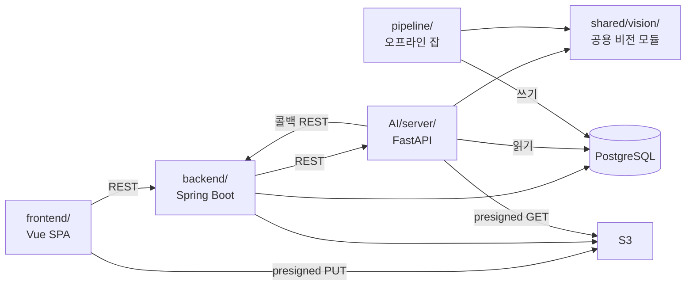
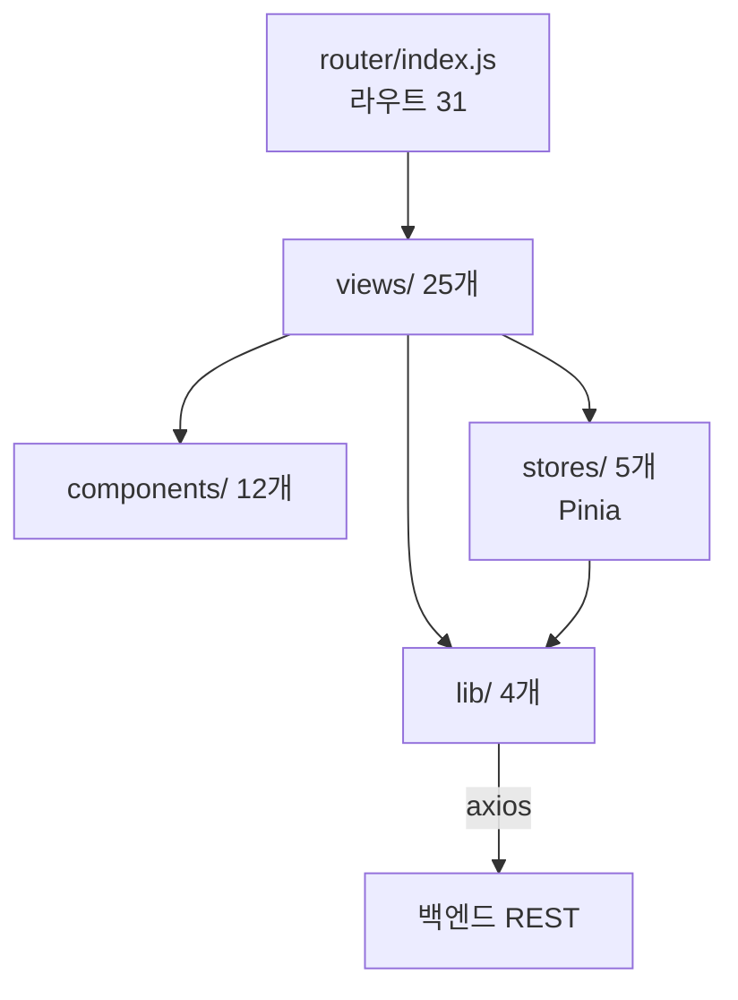
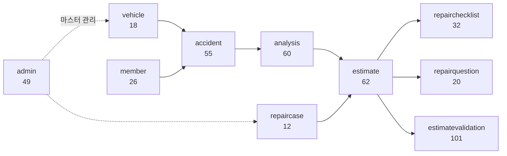

# 컴포넌트 관계

## 목적

각 구성 요소가 누구에게 의존하고 누구를 모르는지 정리한다. 의존 방향이 곧 변경 파급 범위다.

## 현재 구현

### 의존 방향

### 핵심 관계 네 가지

**1. `shared/vision` 이 AI 서버와 파이프라인의 공통 조상이다.**

`AI/server/README.md` 가 이유를 적었다 — "batch 적재와 실시간 분석에서 같은 판정을 보장하기 위해
부품/손상 코드·ROI 매칭·정규화 규칙만 `shared/vision` 의 공용 도메인 기준을 참조한다."

오프라인에서 만든 corpus 벡터와 실시간 질의 벡터가 같은 전처리(20% padding, 224px letterbox,
ImageNet 정규화, L2)를 거쳐야 코사인 유사도가 의미를 갖는다. 전처리가 갈라지면 검색이 조용히
망가진다 — 오류가 나지 않고 결과만 틀린다.

| `shared/vision` 모듈 | 책임 |
| --- | --- |
| `catalog.py` | 부품 32종 · 손상 4종의 표준 코드와 원본 라벨 매핑 |
| `damage_part_pairing.py` | 같은 이미지 안에서 손상 ↔ 부품 기하 매칭 |
| `normalizer.py` | 표준 스키마로 정규화, `pairStatus` · `searchability` 결정 |
| `roi.py` | ROI 박스 계산, letterbox, 품질 판정 |
| `dinov2.py` | DINOv2 임베딩 |
| `search_metadata.py` | 검색 메타데이터 구성 |

**2. AI 서버는 백엔드를 모른다 — 콜백 URL을 받아서 쓸 뿐이다.**

`AnalysisRequestPayload.callbackUrl` 을 요청에 담아 보내고, AI는 그 주소로 결과를 보낸다.
AI 서버 코드에 백엔드 호스트가 하드코딩된 곳이 없다. 이 덕분에 AI 서버를 여러 환경에 같은
이미지로 배포할 수 있다.

**3. AI 서버는 S3 자격증명을 갖지 않는다.**

백엔드가 presigned GET URL을 만들어 넘기고, AI는 그 URL을 HTTP로 내려받는다
(`AI/server/app/infrastructure/image_fetcher.py`). AI 박스가 털려도 S3 전체가 열리지 않는다.

**4. 백엔드는 AI 결과를 **믿되 검증한다**.**

`AnalysisCallbackRequest` 가 Bean Validation으로 형식을 검사하고,
`AnalysisResultPersister` 가 마스터에 없는 부위·중복 항목을 거른다.
`estimate.unresolved_parts` 주석이 그 정책을 적어 두었다.

### 프론트엔드 내부 관계

`lib/` 가 외부와 닿는 유일한 층이다.

| `lib` 파일 | 책임 |
| --- | --- |
| `api.js` | 백엔드 REST 호출 |
| `kakao.js` | 카카오 지도 SDK |
| `estimatePdf.js` | 견적 PDF 관련 |
| `accidentDesc.js` | 사고 설명 문자열 조립 |

### 백엔드 내부 관계

18개 도메인 패키지 중 `common` · `config` 를 제외한 16개가 업무 도메인이다.
의존이 몰리는 지점은 `analysis` 와 `estimate` 다 — 분석 결과가 견적을 만들고, 견적이 리포트·
PDF·체크리스트·질문으로 퍼진다.

숫자는 패키지의 Java 파일 수다.

## 주요 구성 요소

| 구성 요소 | 진입점 |
| --- | --- |
| 프론트엔드 | `frontend/src/main.js` |
| 백엔드 | `backend/src/main/java/com/ssafy/a307/BackendApplication.java` |
| AI 서버 | `AI/server/app/main.py` |
| 파이프라인 | `pipeline/jobs/**/*.py` (잡마다 독립 실행) |

## 설정 및 실행 방법

각 구성 요소는 독립 실행된다. 의존 순서는 데이터 저장소 → 백엔드 → AI 서버 → 프론트엔드다.

## 오류 및 예외 처리

- `shared/vision` 변경은 **AI 서버와 파이프라인 양쪽에 영향**을 준다. CI의 `deploy-ai` 잡이
  `shared/vision/**/*` 를 `changes` 감시 대상에 넣은 이유다.
- 백엔드 ↔ AI 계약 변경은 `Docs/Api/AI 연동 계약 (백엔드 ↔ AI 서버).md` 가 정본이며,
  백엔드 소스 7개 파일이 javadoc에서 이 경로를 인용한다.

## 관련 소스코드

- `shared/vision/` — 공용 비전 모듈 6개
- `AI/server/app/adapters/yolo_adapter.py` — AI 서버 소유 어댑터
- `backend/src/main/java/com/ssafy/a307/analysis/contract/` — 계약 정의
- `frontend/src/lib/` — 외부 연동 4개

## 근거 자료

- 소스 디렉터리 구조와 파일 수 집계
- `AI/server/README.md` · `shared/README.md`
- `.gitlab-ci.yml` 의 `deploy-ai` `changes` 규칙

## 확인 필요 항목

- **`repaircase` 패키지의 정확한 역할** — 12개 파일의 책임 범위를 상세 확인하지 못함
- **`batch` · `audit` 패키지** — 각각 4개 · 5개 파일이며 상세 확인하지 못함
- **프론트 라우트 31개의 전체 목록** — `router/index.js` 전수 확인하지 못함
