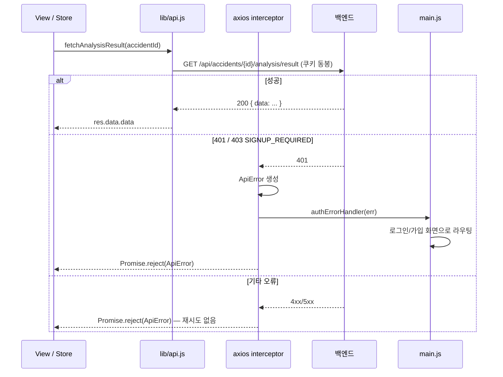

# API 연동

## 목적

프론트엔드가 백엔드와 통신하는 방식, 인증 처리, 오류 정규화 규칙을 정리한다.

## 현재 구현

### 공통 클라이언트

```js
// frontend/src/lib/api.js
export const API_BASE = (import.meta.env.VITE_API_BASE_URL || 'http://localhost:8080').replace(/\/$/, '')
export const http = axios.create({ baseURL: API_BASE, withCredentials: true, timeout: 10000 })
```

| 설정 | 값 | 이유 |
| --- | --- | --- |
| `baseURL` | `VITE_API_BASE_URL`, 없으면 `http://localhost:8080` | 빌드 시점 주입 |
| `withCredentials` | `true` | **필수.** 없으면 쿠키가 안 실려 보호 API가 전부 401 |
| `timeout` | 10000ms | 10초 |

### 인증 방식 — 세션 쿠키

파일 상단 주석이 명확하다.

> 인증은 소셜 로그인 + 서버 세션이다 — 토큰이 없고 SESSION(HttpOnly) 쿠키 하나로 인증된다.
> `withCredentials` 가 없으면 브라우저가 쿠키를 싣지 않아 보호 API 가 전부 401 이 된다.

**JWT를 쓰지 않는다.** 액세스 토큰·리프레시 토큰 처리 코드가 없다. HttpOnly 쿠키라
JS가 토큰을 만질 수 없고, XSS로 토큰이 유출될 경로도 없다.

### 오류 정규화

```js
export class ApiError extends Error {
  constructor(status, code, message) {
    super(message); this.name = 'ApiError'; this.status = status; this.code = code
  }
}
```

인터셉터가 서버 응답 `error.response.data.error` 에서 `{ code, message }` 를 꺼낸다.
꺼내지 못하면 상태 코드로 대체값을 만든다.

| 상황 | `code` | `message` |
| --- | --- | --- |
| 서버가 `error` 본문 제공 | 서버 값 | 서버 값 |
| `401` (본문 없음) | `UNAUTHORIZED` | 요청을 처리할 수 없어요. |
| 네트워크 실패 (`status === 0`) | `NETWORK_ERROR` | 서버에 연결할 수 없어요. |
| 그 외 | `UNKNOWN` | 요청을 처리할 수 없어요. |

### 재시도하지 않는다

```js
// 어떤 상태에도 자동 재시도하지 않는다 (특히 429)
```

`429 TOO_MANY_REQUESTS` 를 자동 재시도하면 상황을 악화시킨다. 재시도는 사용자 조작에 맡긴다.

### 인증 오류 전역 처리

```js
if (status === 401 || (status === 403 && code === 'SIGNUP_REQUIRED')) authErrorHandler?.(err)
```

`403 SIGNUP_REQUIRED` 가 401과 같이 묶인 것이 특징이다. **인증은 됐지만 가입이 안 끝난 상태**
(`ROLE_SIGNUP_PENDING`)를 뜻하며, 백엔드 `SecurityConfig` 의 역할 설계와 맞물린다
([인증과 권한](../03_백엔드/인증과_권한.md)).

### API 함수 목록

`api.js` 가 export 하는 함수 48개를 도메인별로 묶었다.

| 도메인 | 함수 |
| --- | --- |
| 인증·회원 | `loginUrl`, `fetchMe`, `fetchSignupContext`, `signup`, `logout`, `withdraw` |
| 프로필 | `fetchProfile`, `updateNickname`, `issueProfileImageUploadUrl`, `completeProfileImage`, `deleteProfileImage` |
| 차량 | `fetchVehicleModels`, `fetchMyVehicles`, `createVehicle`, `updateVehicleYear`, `deleteVehicle` |
| 사고 | `createAccident`, `fetchAccident`, `fetchMyAccidents`, `setAccidentHidden` |
| 사고 사진 | `issueAccidentImageUploadUrls`, `completeAccidentImages`, `fetchAccidentImages`, `deleteAccidentImage` |
| 분석 | `requestAnalysis`, `fetchAnalysisProgress`, `fetchAnalysisResult` |
| 견적 | `fetchEstimate`, `fetchEstimateReport`, `fetchAccidentEstimates` |
| 견적 PDF | `requestEstimatePdf`, `fetchEstimatePdfStatus`, `estimatePdfDownloadUrl` |
| 체크리스트 | `fetchRepairChecklistStatus`, `requestRepairChecklist`, `regenerateRepairChecklist`, `addRepairChecklistItem`, `updateRepairChecklistItem`, `deleteRepairChecklistItem`, `checkRepairChecklistItem`, `memoRepairChecklistItem` |
| 공용 | `uploadToPresignedUrl`, `http`, `onAuthError`, `API_BASE` |
| 상수 | `PROFILE_IMAGE_TYPES`, `PROFILE_IMAGE_MAX_BYTES`, `ACCIDENT_IMAGE_TYPES`, `ACCIDENT_IMAGE_MAX_BYTES` |

**`uploadToPresignedUrl` 만 `http` 인스턴스를 쓰지 않는다.** S3로 직접 PUT하는 함수라
세션 쿠키를 실으면 안 되기 때문으로 **추정**된다.

### 파일 제약 상수

```js
export const PROFILE_IMAGE_MAX_BYTES = 5 * 1024 * 1024   // 5MB
export const ACCIDENT_IMAGE_TYPES = ['image/jpeg', 'image/png']
export const ACCIDENT_IMAGE_MAX_BYTES = 20 * 1024 * 1024 // 20MB
```

주석에 "최종 판정은 서버" 라고 적혀 있고, 서버 설정 키(`app.accident-image.max-file-size-bytes`)를
함께 남겼다. **클라이언트 검증은 편의이고 신뢰 경계가 아니다.** 20MB는 DDL의
`accident_image_asset.ck_aia_size` (`file_size <= 20971520`)와 일치한다.

## 동작 흐름



## 주요 구성 요소

- `frontend/src/lib/api.js` — 전체 API 클라이언트
- `frontend/src/main.js` — `onAuthError` 훅 등록
- `frontend/.env.example` — `VITE_API_BASE_URL`

## 설정 및 실행 방법

`VITE_API_BASE_URL` 은 빌드 시점에 번들에 박힌다. CI가 `.env.production` 을 만들어 주입하고,
번들에 실제로 들어갔는지 `grep -rq "$VITE_API_BASE_URL" dist/assets/` 로 확인한다
([CI/CD 파이프라인](../08_배포_CICD/CICD_파이프라인.md)).

## 오류 및 예외 처리

위 정규화 표 참고. 백엔드 오류 코드 전체는 [오류코드](../06_API/오류코드.md)에 있다.

## 관련 소스코드

- `frontend/src/lib/api.js:1~40` — 클라이언트·인터셉터
- `frontend/src/lib/api.js:75` · `:246~247` — 파일 제약 상수
- `backend/src/main/java/com/ssafy/a307/config/SecurityConfig.java`

## 근거 자료

- `frontend/src/lib/api.js` 전문 상단부와 export 목록
- `Docs/Handover/김재원 담당 백엔드 API — FE 인수인계.md` (api.js 주석이 인용)

## 확인 필요 항목

- **`uploadToPresignedUrl` 의 구현** — `http` 인스턴스를 쓰지 않는지 확인하지 못함(추정)
- **`VITE_API_BASE_URL` 운영 값** — GitLab CI 변수라 저장소에서 확인할 수 없음
- **CORS 동작** — 같은 오리진인지 크로스 오리진인지는 위 값에 달려 있어 확인하지 못함
