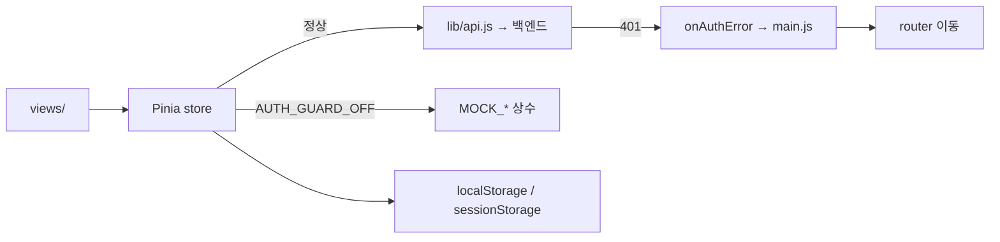

# 상태관리

## 목적

Pinia 스토어 5개의 책임과 브라우저 저장소 사용 규칙을 정리한다.

## 현재 구현

### 스토어 5개

모두 Options API 형식(`state` · `getters` · `actions`)으로 정의돼 있다.

| 스토어 | 파일 | 책임 | 의존하는 `lib/api` 함수 |
| --- | --- | --- | --- |
| `auth` | `stores/auth.js` | 로그인 상태, 프로필, 로그아웃 | `fetchMe`, `fetchProfile`, `logout` |
| `accidents` | `stores/accidents.js` | 사고 이력 목록, 숨김 처리 | `fetchMyAccidents`, `setAccidentHidden` |
| `vehicles` | `stores/vehicles.js` | 내 차량, 차량 모델 마스터 | `fetchMyVehicles`, `fetchVehicleModels`, `createVehicle`, `updateVehicleYear`, `deleteVehicle` |
| `checklist` | `stores/checklist.js` | 정비 체크리스트 생성·항목 조작 | 체크리스트 API 8종 |
| `app` | `stores/app.js` | 공통 체크리스트 기본값 등 앱 전역 상태 | (없음) |

`app.js` 만 API를 부르지 않는다. 기본 체크리스트 항목을 코드에 들고 있다 —
"견적서 서면 수령 · 항목별 금액 확인", "부품 등급(순정·OEM·재생·중고)·부품 번호 확인" 등.

### 목업 모드 — `VITE_AUTH_GUARD=off`

`accidents.js` · `vehicles.js` · `checklist.js` 가 `AUTH_GUARD_OFF` 를 `router` 에서 가져와,
켜져 있으면 목업 데이터를 쓴다.

```js
// frontend/src/stores/accidents.js
// 서버 목록 모양 그대로의 프로토타입 목업
// (VITE_AUTH_GUARD=off 로 백엔드 없이 화면을 볼 때만)
const MOCK_ACCIDENTS = () => [ ... ]
```

**백엔드 없이 화면만 보기 위한 장치다.** 목업 데이터가 서버 응답 모양을 그대로 따라가므로
스토어 로직을 바꾸지 않고 전환된다.

목업에 들어 있는 필드가 서버 계약을 역으로 알려 준다.

```
accidentId, vehicleId, vehicleInputType, modelId, manufacturer, modelName,
vehicleType, carClass, modelYear, createdAt, status, hiddenAt, imageCount,
thumbnailUrl, thumbnailExpiresAt, estimateId,
estimatedCostMin, estimatedCostMedian, estimatedCostMax, checklistStatus
```

`status: 'ESTIMATED'`, `checklistStatus: 'COMPLETED'` 같은 상태값도 확인된다.

### 브라우저 저장소 사용

| 키 | 저장소 | 용도 | 근거 |
| --- | --- | --- | --- |
| `noka.auth.next` | sessionStorage | 로그인 뒤 돌아갈 경로 | `auth.js` |
| `noka.socialName.{memberId}` | (미확인) | 소셜이 준 이름 보관 | `auth.js` |
| `noka.checklistCats.{memberId}` | localStorage | 체크리스트 카테고리 접힘 상태 | `checklist.js` |

키 접두사가 전부 `noka.` 다 — 서비스명이 `노카` 임을 뒷받침하는 또 다른 근거다.

`auth.js` 주석이 `noka.auth.next` 가 필요한 이유를 적었다 — "서버가 OAuth 성공 후 항상 FE `/` 로
보내므로 세션 스토리지에 잠시 보관한다."

`noka.socialName` 은 **서버 계약의 공백을 FE가 메우는 장치**다. 주석에 그렇게 적혀 있다.

> 가입 때 소셜(카카오·구글)이 준 이름. 서버는 가입 뒤 이 값을 버리므로
> (`GET /api/auth/signup` 에만 있음) FE 가 회원 ID 별로 보관한다.
> 서버 응답에 `socialName` 이 생기면 그 값이 우선한다 — 그때 FE 수정 없이 전환된다.

`checklist.js` 의 `readCats` / `writeCats` 는 `try/catch` 로 감싸 저장소가 없어도
"이 세션에서만 유지" 되도록 한다.

### 중복 호출 방지

`auth.js` 에 `let inflight = null` 이 있다. 같은 인증 조회가 동시에 여러 번 나가지 않도록
진행 중인 Promise를 재사용하는 패턴으로 **추정**된다.

## 동작 흐름



## 주요 구성 요소

- `frontend/src/stores/` 5개 파일
- `frontend/src/router/index.js` 의 `AUTH_GUARD_OFF` export
- `frontend/src/data/checklists.js` — 체크리스트 목업

## 설정 및 실행 방법

목업 모드는 `VITE_AUTH_GUARD=off` 환경변수로 켠다. `frontend/.env.example` 에는 이 키가 없고
`VITE_API_BASE_URL` · `VITE_KAKAO_JS_KEY` 둘만 있다.

## 오류 및 예외 처리

- 저장소 접근 실패는 `try/catch` 로 삼키고 기본값을 쓴다 (`checklist.js`)
- 인증 오류는 스토어가 아니라 `api.js` 인터셉터가 전역 처리한다

## 관련 소스코드

- `frontend/src/stores/auth.js` · `accidents.js` · `vehicles.js` · `checklist.js` · `app.js`
- `frontend/src/lib/api.js` — 인터셉터와 `onAuthError`

## 근거 자료

- 스토어 파일 상단 주석과 import 구문
- `frontend/.env.example`

## 확인 필요 항목

- **`VITE_AUTH_GUARD` 가 `.env.example` 에 없다** — 문서화되지 않은 개발용 스위치로 보이며, 운영 빌드에서 켜질 가능성을 확인하지 못함
- **`noka.socialName` 의 저장소 종류** — localStorage인지 sessionStorage인지 확인하지 못함
- **`inflight` 의 정확한 동작** — 중복 호출 방지로 추정했으나 구현 전체를 확인하지 못함
- **각 스토어의 state 필드 전체** — `grep` 으로 `state`/`getters`/`actions` 존재만 확인했고 내부 필드는 전수 확인하지 못함
