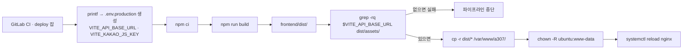

# 실행 및 빌드

## 목적

프론트엔드를 로컬에서 띄우고 운영 번들을 만드는 방법을 정리한다.

## 현재 구현

### npm 스크립트

```json
// frontend/package.json
"scripts": {
  "dev": "vite --host",
  "dev:https": "vite --host --mode https",
  "build": "vite build",
  "preview": "vite preview --host"
}
```

| 스크립트 | 용도 |
| --- | --- |
| `dev` | 개발 서버 (포트 5173, `--host` 로 LAN 노출) |
| `dev:https` | 자체 서명 인증서 https 개발 서버 |
| `build` | 운영 번들 → `frontend/dist/` |
| `preview` | 빌드 결과 미리보기 |

### `dev:https` 가 있는 이유

`vite.config.js` 주석에 적혀 있다.

> `npm run dev:https` (mode=https) 로 실행하면 자체 서명 인증서로 https 개발 서버를 띄운다.
> 휴대폰에서 LAN IP 로 접속할 때 현재 위치(Geolocation)를 쓰려면 https 가 필요하다.

정비소 검색(`ShopsView`)이 현재 위치를 쓰는데, 브라우저 Geolocation API는 보안 컨텍스트
(https 또는 localhost)에서만 동작한다. 휴대폰에서 `192.168.x.x:5173` 으로 접속하면 http라
위치를 못 받는다. 그래서 `@vitejs/plugin-basic-ssl` 을 개발 의존성으로 넣었다.

### Vite 설정

```js
// frontend/vite.config.js
export default defineConfig(({ mode }) => ({
  plugins: [vue(), ...(mode === 'https' ? [basicSsl()] : [])],
  resolve: { alias: { '@': fileURLToPath(new URL('./src', import.meta.url)) } },
  server: { port: 5173 },
}))
```

| 설정 | 값 |
| --- | --- |
| 별칭 | `@` → `./src` |
| 포트 | 5173 |
| https 플러그인 | `mode === 'https'` 일 때만 |

### 환경변수

`frontend/.env.example` 에 두 개가 있다.

| 변수 | 용도 |
| --- | --- |
| `VITE_API_BASE_URL` | 백엔드 API 주소. 없으면 `http://localhost:8080` |
| `VITE_KAKAO_JS_KEY` | 카카오 지도 SDK JavaScript 키 |

코드에서만 확인되고 `.env.example` 에 없는 변수가 하나 있다.

| 변수 | 용도 | 확인 위치 |
| --- | --- | --- |
| `VITE_AUTH_GUARD` | `off` 면 목업 모드 | `stores/accidents.js` 등이 쓰는 `AUTH_GUARD_OFF` |

**`VITE_` 접두사가 붙은 값은 번들에 그대로 박혀 브라우저로 나간다.** `.gitlab-ci.yml` 주석이
이를 명시하고, 그래서 이 둘만 CI 변수에 둔다고 적었다 — "어차피 번들에 박혀 브라우저로 나가는
값이라 비밀이 아니다."

카카오 **JavaScript 키**는 공개돼도 되는 종류다(도메인 제한으로 보호). REST API 키
(`KAKAO_REST_API_KEY`)는 백엔드 환경변수이며 이쪽에 없다.

## 동작 흐름 (운영 빌드)



CI가 `.env.production` 을 직접 만든다.

```sh
printf 'VITE_API_BASE_URL=%s\nVITE_KAKAO_JS_KEY=%s\n' "$VITE_API_BASE_URL" "$VITE_KAKAO_JS_KEY" > .env.production
```

그리고 **번들에 값이 실제로 들어갔는지 검사**한다.

```sh
grep -rq "$VITE_API_BASE_URL" dist/assets/ || { echo "번들에 API 주소가 없다. .env 우선순위를 확인하라."; exit 1; }
```

Vite의 `.env` 우선순위 때문에 값이 덮여 잘못된 주소로 빌드되는 사고를 막는 검사다.
빌드는 성공하는데 앱이 엉뚱한 서버를 부르는 실패는 배포 후에야 드러나기 때문이다.

## 설정 및 실행 방법

### 로컬 개발

```
cd frontend
cp .env.example .env
npm ci
npm run dev
```

휴대폰 실기기 테스트(위치 기능 포함):

```
npm run dev:https
```

백엔드 없이 화면만 보려면 `.env` 에 `VITE_AUTH_GUARD=off` 를 추가한다.

### 운영 빌드

```
cd frontend
npm ci
npm run build
```

산출물은 `frontend/dist/` 다. 배포는 CI가 `/var/www/a307/` 로 복사한다.

## 오류 및 예외 처리

| 증상 | 원인 | 확인 |
| --- | --- | --- |
| 모든 보호 API가 401 | `withCredentials` 미적용 또는 크로스 오리진 쿠키 차단 | `api.js` 설정, CORS |
| 위치 기능 동작 안 함 | http 로 접속 | `npm run dev:https` 사용 |
| 빌드는 되는데 API 주소가 다름 | `.env` 우선순위 | CI의 `grep` 검사가 잡는다 |
| 카카오 지도 안 뜸 | `VITE_KAKAO_JS_KEY` 미설정·도메인 미등록 | 카카오 개발자 콘솔 |

## 관련 소스코드

- `frontend/package.json` — 스크립트·의존성
- `frontend/vite.config.js` — 별칭·포트·https
- `frontend/.env.example` — 환경변수 이름
- `.gitlab-ci.yml` — 운영 빌드 절차

## 근거 자료

- 빌드 설정 파일 직접 확인
- `.gitlab-ci.yml` 의 `deploy` 잡 명령

## 확인 필요 항목

- **`VITE_API_BASE_URL` 운영 값** — GitLab CI 변수라 저장소에서 확인할 수 없음. [보안 정보 제외] 대상은 아니나 값 자체를 모름
- **Node.js 버전** — `package.json` 에 `engines` 가 없고 CI에도 Node 버전 지정이 없어 확인하지 못함
- **`VITE_AUTH_GUARD` 의 정확한 판정 문자열** — `off` 로 추정하나 `router/index.js` 의 비교식을 확인하지 못함
