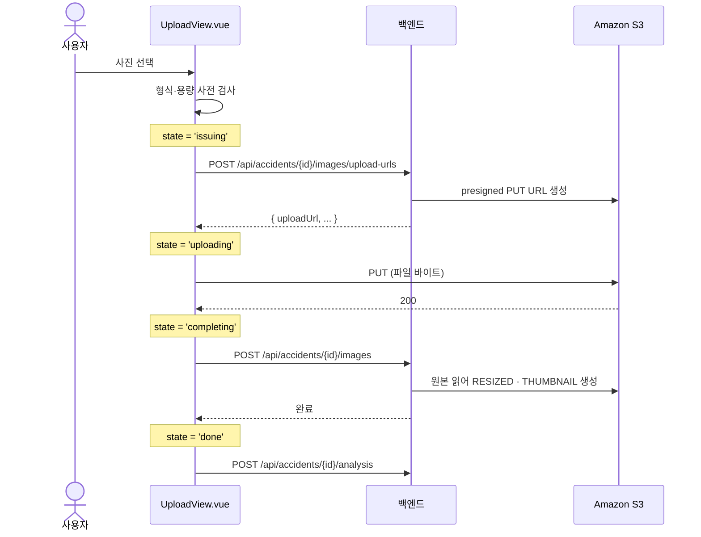

# 이미지 업로드 흐름

## 목적

사용자가 사진을 고른 뒤 분석 요청까지 프론트엔드가 밟는 단계를 정리한다. 이 경로는 백엔드를
거치지 않고 브라우저가 S3에 직접 올리는 3단계 구조라 실패 지점이 여러 개다.

## 현재 구현

### 3단계 업로드



### 상태 기계

`UploadView.vue` 가 `photo` 라는 `reactive` 객체로 상태를 관리한다.

| `photo.state` | 의미 |
| --- | --- |
| `issuing` | presigned URL 발급 요청 중 |
| `uploading` | S3로 PUT 중 |
| `completing` | 백엔드에 완료 통보 중 |
| `done` | 완료. 분석 요청 가능 |

```js
const busy = computed(() => ['issuing', 'uploading', 'completing'].includes(photo.state))
const canAnalyze = computed(() => photo.state === 'done' && !!accidentId.value)
```

`busy` 인 동안 버튼을 잠그고, `done` 이면서 `accidentId` 가 있을 때만 분석 버튼이 열린다.

### 한 장 체계

```js
// 서버에 있는 이 사고의 이미지 id — 한 장 체계라 새로 올릴 때 지운다
const existingIds = ref([])
```

**사고 1건당 사진 1장**이다. 새로 올리면 기존 이미지를 삭제한다.

이 결정의 배경은 Jira `S15P21A307-519` 에 남아 있다 — "촬영 가이드를 1컷으로 축소 — 각도 어휘
9종은 유지". 각도 코드 체계(`angle_code`)는 스키마에 남아 있지만 실제로는 한 장만 쓴다.

다만 백엔드 API는 **복수형**이다(`upload-urls`, `completeAccidentImages`,
`issueAccidentImageUploadUrls`). 여러 장을 받을 수 있게 만들어 두고 화면에서 한 장으로 제한한
것으로 **추정**된다.

### 사전 검사

```js
export const ACCIDENT_IMAGE_TYPES = ['image/jpeg', 'image/png']
export const ACCIDENT_IMAGE_MAX_BYTES = 20 * 1024 * 1024 // 최종 판정은 서버
```

JPEG·PNG만, 20MB 이하. 주석이 "최종 판정은 서버" 라고 못박았다 —
클라이언트 검사는 사용자 편의이고 신뢰 경계가 아니다.

### 미리보기

```js
// 방금 고른 파일은 로컬 미리보기가 빠르다(§5-2)
const previewSrc = computed(() => photo.previewUrl || photo.serverUrl)
```

방금 고른 파일은 로컬 Object URL로 즉시 보여 주고, 서버에서 온 것은 presigned GET URL을 쓴다.

### 재진입 처리

```js
const accidentId = ref(Number(route.query.accidentId) || null)
// 진입 시점 기준 — 새 접수 중 사고가 생겨도 뒤로가기는 가이드로
const fromHistory = !!accidentId.value
```

사고 이력에서 들어온 경우와 새로 접수하는 경우를 구분해 뒤로가기 동작을 다르게 한다.
`fromHistory` 를 `ref` 가 아니라 **진입 시점 상수**로 잡은 것이 요점이다 — 접수 중에
`accidentId` 가 생겨도 뒤로가기는 가이드 화면으로 간다.

기존 이미지는 `uploadState === 'COMPLETED'` 인 것 중 마지막을 고른다.

```js
const done = imgs.filter((i) => i.uploadState === 'COMPLETED')
const latest = done[done.length - 1]
```

## 오류 및 예외 처리

실패 종류에 따라 버튼 문구를 바꾼다.

```js
const retryLabel = computed(() =>
  (photo.retrySame || photo.code === 'NETWORK' || photo.code === 'STORAGE'
    ? '다시 시도' : '다른 사진 선택'))
```

| 실패 코드 | 버튼 | 뜻 |
| --- | --- | --- |
| `NETWORK` | 다시 시도 | 같은 사진으로 재시도 가능 |
| `STORAGE` | 다시 시도 | 저장소 일시 장애 |
| 그 외 | 다른 사진 선택 | 이 사진으로는 안 된다 |

저장소 장애는 별도 플래그로 관리한다 — `const storageDown = ref(false)`.

치명적 오류는 `fatal` 로 분리해 화면 전체를 대체한다.

| 실패 지점 | 원인 | 화면 처리 |
| --- | --- | --- |
| presigned 발급 | 버킷 미설정 → `503` | `storageDown` |
| S3 PUT | 네트워크·만료 | `NETWORK` → 다시 시도 |
| 완료 통보 | 서버 오류 | 코드별 분기 |
| 사고 조회 | 없음·권한 | `fatal` |

## 주요 구성 요소

| 구성 요소 | 역할 |
| --- | --- |
| `UploadView.vue` | 상태 기계·검사·미리보기 |
| `api.js` 의 `issueAccidentImageUploadUrls` | presigned 발급 |
| `api.js` 의 `uploadToPresignedUrl` | S3 PUT |
| `api.js` 의 `completeAccidentImages` | 완료 통보 |
| `api.js` 의 `deleteAccidentImage` | 기존 사진 삭제 |

## 설정 및 실행 방법

특별한 설정이 없다. 백엔드의 `STORAGE_STAGING_BUCKET` 이 비어 있으면 발급 단계에서 `503` 이다.

## 관련 소스코드

- `frontend/src/views/UploadView.vue`
- `frontend/src/lib/api.js:246~247` — 파일 제약
- `backend/src/main/java/com/ssafy/a307/accident/controller/AccidentImageController.java:44`

## 근거 자료

- `UploadView.vue` 의 상태·computed 정의와 주석
- `api.js` 의 export 함수·상수

## 확인 필요 항목

- **`§5-2` 가 가리키는 문서** — `previewSrc` 주석의 참조 대상을 특정하지 못함
- **`uploadState` 값 전체** — `COMPLETED` 외 다른 값을 확인하지 못함
- **복수 업로드 지원 여부** — API가 복수형이지만 화면이 한 장으로 제한한 이유를 코드에서 단정하지 못함(추정)
- **실패 코드 `NETWORK` · `STORAGE` 의 설정 지점** — `photo.code` 에 값을 넣는 구간을 전수 확인하지 못함
