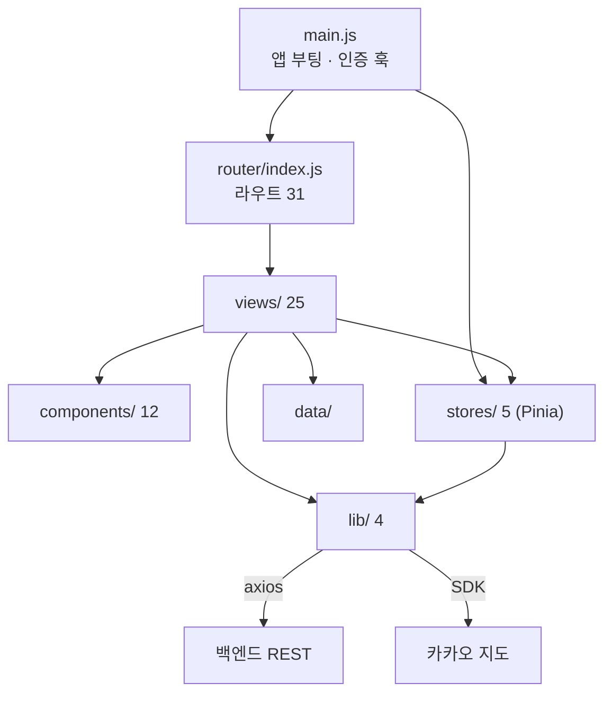

# 프론트엔드 구조

## 목적

`frontend/` 디렉터리의 구성과 각 층의 책임을 정리한다.

## 현재 구현

### 디렉터리

```
frontend/
├─ index.html
├─ package.json            의존성 5 + 개발 의존성 3
├─ vite.config.js          별칭 @ → ./src, 포트 5173, https 모드
├─ .env.example            VITE_API_BASE_URL · VITE_KAKAO_JS_KEY
├─ public/
└─ src/
   ├─ main.js              앱 진입점. 인증 오류 훅 연결
   ├─ App.vue
   ├─ router/index.js      라우트 31개
   ├─ views/               화면 25개
   ├─ components/          공용 컴포넌트 12개
   ├─ stores/              Pinia 스토어 5개
   ├─ lib/                 외부 연동 4개
   ├─ data/                정적 데이터·상수
   └─ assets/
```

`frontend/dist/` 와 `frontend/node_modules/` 는 빌드 산출물·의존성이라 조사 대상에서 제외했다.

### 층 구조



**`lib/` 가 외부와 닿는 유일한 층이다.** 화면과 스토어는 `lib` 을 통해서만 네트워크를 쓴다.

### 공용 컴포넌트 12개

| 컴포넌트 | 용도(파일명 기준) |
| --- | --- |
| `Screen.vue` | 화면 공통 레이아웃 |
| `AppHeader.vue` | 상단 헤더 |
| `BottomSheet.vue` | 하단 시트 |
| `AccidentCard.vue` · `AccidentRow.vue` | 사고 이력 표시 |
| `CheckBox.vue` · `CheckItem.vue` | 체크리스트 항목 |
| `Toast.vue` | 알림 |
| `Avatar.vue` | 프로필 이미지 |
| `LogoMark.vue` · `GoogleMark.vue` | 로고·구글 공식 로고 |
| `DevSidebar.vue` | 개발용 사이드바 |

`GoogleMark.vue` 는 2026-09-18 커밋 `a0c6b04` 에서 "구글 로그인 아이콘을 글자 G 에서 공식 4색
로고로 교체"하며 들어왔다.

`DevSidebar.vue` 는 이름상 개발 전용이다. **운영 빌드에 포함되는지는 확인하지 못했다.**

## 동작 흐름

앱 부팅 시 `main.js` 가 인증 오류 훅을 연결한다. `api.js` 의 인터셉터가 `401` 또는
`403 SIGNUP_REQUIRED` 를 만나면 이 훅을 호출하고, `main.js` 가 라우팅으로 연결한다.
화면마다 401 처리를 반복하지 않기 위한 구조다.

## 주요 구성 요소

| 층 | 파일 수 | 대표 파일 |
| --- | --- | --- |
| 화면 | 25 | `UploadView.vue`, `AnalyzingView.vue`, `EstimateView.vue` |
| 컴포넌트 | 12 | `Screen.vue`, `AppHeader.vue` |
| 스토어 | 5 | `auth.js`, `accidents.js`, `checklist.js`, `vehicles.js`, `app.js` |
| 라이브러리 | 4 | `api.js`, `kakao.js`, `estimatePdf.js`, `accidentDesc.js` |

## 설정 및 실행 방법

[실행 및 빌드](실행_및_빌드.md) 참고.

## 오류 및 예외 처리

`api.js` 가 서버 오류를 `ApiError { status, code, message }` 로 정규화한다.

```js
// frontend/src/lib/api.js
export class ApiError extends Error {
  constructor(status, code, message) { ... }
}
```

규칙 두 가지가 주석에 적혀 있다.

- `401` 은 본문이 없어 `status` 로만 판단한다
- **어떤 상태에도 자동 재시도하지 않는다 (특히 429)**

## 관련 소스코드

- `frontend/src/main.js`
- `frontend/src/router/index.js`
- `frontend/src/lib/api.js`
- `frontend/vite.config.js`
- `frontend/package.json`

## 근거 자료

- 디렉터리 구조 직접 확인
- `frontend/src/lib/api.js` 주석

## 확인 필요 항목

- **`DevSidebar.vue` 의 운영 노출 여부** — 조건부 렌더링 여부를 확인하지 못함
- **`data/` 디렉터리 내용** — 파일 목록을 전수 확인하지 못함
- **컴포넌트별 상세 책임** — 파일명과 사용처로만 추정했고 내부 구현은 확인하지 못함
