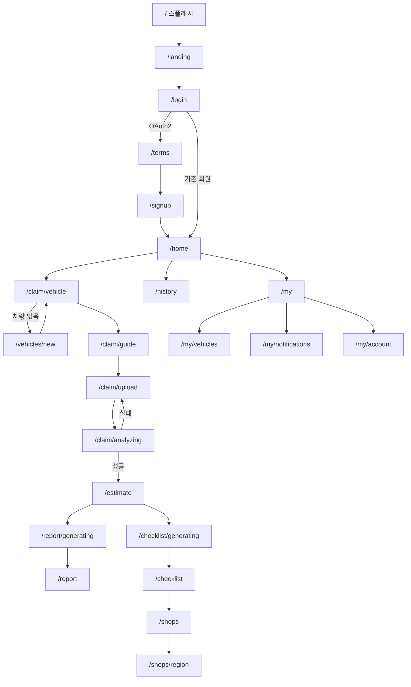

# 화면과 기능

## 목적

화면 25개와 라우트 31개가 어떤 사용자 흐름을 이루는지 정리한다.

## 현재 구현

### 라우트 31개

`frontend/src/router/index.js` 에서 읽은 경로 전체다.

| 경로 | 화면(추정 매핑) | 흐름 단계 |
| --- | --- | --- |
| `/` | `SplashView.vue` | 진입 |
| `/landing` | `LandingView.vue` | 진입 |
| `/login` | `LoginView.vue` | 인증 |
| `/signup` | (가입 처리) | 인증 |
| `/terms`, `/terms/service`, `/terms/privacy`, `/terms/docs` | `TermsView.vue`, `TermsDocView.vue`, `TermsDocsView.vue` | 약관 |
| `/home` | `HomeView.vue` | 메인 |
| `/claim/vehicle` | `ClaimVehicleView.vue` | 사고 접수 ① 차량 |
| `/vehicles/new` | `VehicleNewView.vue` | 차량 등록 |
| `/claim/guide` | `GuideView.vue` | 사고 접수 ② 촬영 안내 |
| `/claim/upload` | `UploadView.vue` | 사고 접수 ③ 사진 |
| `/claim/analyzing` | `AnalyzingView.vue` | 분석 대기 |
| `/estimate` | `EstimateView.vue` | 견적 |
| `/report/generating` | `ReportGeneratingView.vue` | 리포트 생성 대기 |
| `/report` | `ReportView.vue` | 리포트 |
| `/checklist/generating` | `ChecklistGeneratingView.vue` | 체크리스트 생성 대기 |
| `/checklist` | `ChecklistView.vue` | 체크리스트 |
| `/checklists` | `ChecklistsView.vue` | 체크리스트 목록 |
| `/shops` | `ShopsView.vue` | 정비소 검색 |
| `/shops/region` | `RegionView.vue` | 지역 선택 |
| `/history` | `HistoryView.vue` | 사고 이력 |
| `/my` | `MyPageView.vue` | 마이페이지 |
| `/my/vehicles` | `VehiclesView.vue` | 내 차량 |
| `/my/notifications` | `NotificationsView.vue` | 알림 |
| `/my/account` | `AccountView.vue` | 계정 |
| `/:pathMatch(.*)*` | (404 처리) | 폴백 |

경로 목록에 `/terms` · `/login` · `/home` 이 두 번씩 나타난다. **리다이렉트 정의로 추정**되며
정확한 구조는 확인하지 못했다.

라우트 31개 대 화면 25개의 차이는 리다이렉트·별칭 때문으로 보인다.

### 사용자 흐름



### 대기 화면이 3개인 이유

`/claim/analyzing` · `/report/generating` · `/checklist/generating` 셋 다 **비동기 작업 대기**
화면이다. 백엔드가 작업을 큐에 넣고 즉시 응답하므로, 프론트가 폴링으로 완료를 기다린다.

`AnalyzingView.vue` 의 폴링 주기는 `POLL_MS = 2000` (2초)다.

### 분석 실패 문구 매핑

`AnalyzingView.vue` 가 서버 `failureReason` 코드를 한국어 문구로 바꾼다. `photo: true` 인 사유는
같은 사진으로 다시 해도 결과가 같으므로 재촬영으로 이끈다.

| 코드 | 문구 | 재촬영 |
| --- | --- | --- |
| `ALL_IMAGES_EXCLUDED` | 올린 사진이 모두 분석에서 제외됐어요. 차량 전체와 손상 부위가 잘 보이도록 다시 촬영해 주세요. | O |
| `NO_IMAGE` | 분석할 사진이 없어요. 사진을 먼저 올려 주세요. | O |
| `IMAGE_FETCH_FAILED` | 사진을 불러오지 못했어요. 잠시 후 다시 시도해 주세요. | X |
| `MODEL_ERROR` | AI 분석 중 오류가 발생했어요. | X |
| `INVALID_MODEL_OUTPUT` | AI 분석 결과를 처리하지 못했어요. | X |
| `INTERNAL` | AI 서버에 일시적인 문제가 있어요. | X |
| `AI_UNREACHABLE` | AI 서버에 연결할 수 없어요. | X |
| `STORAGE_UNAVAILABLE` | 사진 저장소에 연결할 수 없어요. | X |
| `ABANDONED` | 분석이 제한 시간 안에 끝나지 않았어요. | X |

제외된 사진별 사유도 표시한다 — `EXCLUDE_REASON` 이 `NOT_VEHICLE` → "차량이 아닌 사진",
`RATIO_BELOW_THRESHOLD` → "차량이 너무 작게 찍힌 사진" 으로 매핑한다.

### 산정 불가 표시

`EstimateView.vue:270` 과 `ReportView.vue:186` 이 `nonEstimableReason` 을 화면에 보여 준다.

```
{{ est.nonEstimableReason || '참조할 수리 사례가 부족해 금액을 계산하지 못했어요.' }}
```

**코드값이 그대로 노출된다.** `INSUFFICIENT_CASES` 같은 영문 코드가 사용자에게 보일 수 있다.

## 주요 구성 요소

| 화면 그룹 | 파일 |
| --- | --- |
| 진입·인증 | `SplashView`, `LandingView`, `LoginView`, `TermsView`, `TermsDocView`, `TermsDocsView` |
| 사고 접수 | `ClaimVehicleView`, `GuideView`, `UploadView`, `AnalyzingView` |
| 결과 | `EstimateView`, `ReportGeneratingView`, `ReportView` |
| 체크리스트 | `ChecklistGeneratingView`, `ChecklistView`, `ChecklistsView` |
| 정비소 | `ShopsView`, `RegionView` |
| 마이 | `HomeView`, `HistoryView`, `MyPageView`, `VehiclesView`, `VehicleNewView`, `NotificationsView`, `AccountView` |

## 설정 및 실행 방법

[실행 및 빌드](실행_및_빌드.md) 참고.

## 오류 및 예외 처리

위 실패 문구 매핑 외에, 전역 인증 오류는 `api.js` 인터셉터 → `main.js` 훅 → 라우팅으로 처리한다.

## 관련 소스코드

- `frontend/src/router/index.js`
- `frontend/src/views/AnalyzingView.vue:20~50` — 실패 문구 매핑
- `frontend/src/views/EstimateView.vue:270`
- `frontend/src/views/ReportView.vue:186`

## 근거 자료

- 라우트 경로 추출 (`grep "path:"`)
- `AnalyzingView.vue` 의 `FAIL_TEXT` · `EXCLUDE_REASON` 상수

## 확인 필요 항목

- **라우트 ↔ 화면 컴포넌트 매핑** — 경로와 파일명으로 추정했고, `router/index.js` 의 `component` 선언을 전수 확인하지 못함
- **중복 경로 3건(`/terms` · `/login` · `/home`)** — 리다이렉트로 추정되나 확인하지 못함
- **라우트 가드** — 인증 필요 경로 보호 방식을 확인하지 못함
- **`nonEstimableReason` 한국어 매핑 부재** — 의도인지 미구현인지 확인하지 못함
