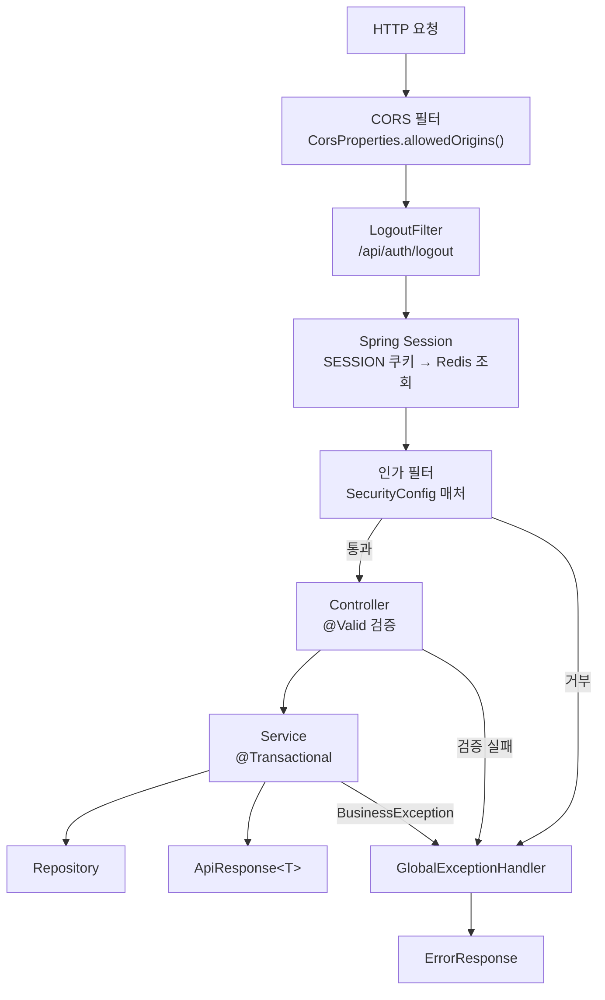
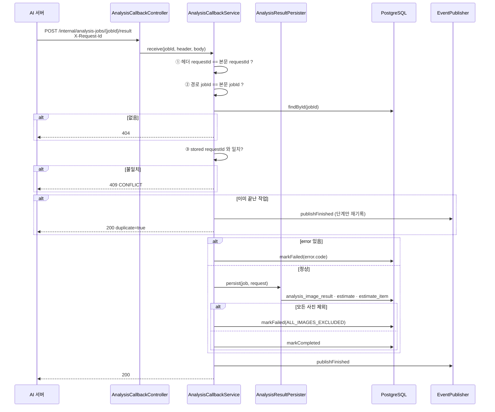

# API 처리 흐름

## 목적

HTTP 요청 하나가 백엔드 안에서 거치는 경로를 필터부터 응답까지 정리한다.

## 현재 구현

### 요청 처리 경로



`LogoutFilter` 가 인가 필터보다 앞에 있다. `SecurityConfig.java:41~42` 주석이 이를 명시한다 —
로그아웃 경로가 `PUBLIC_PATHS` 에 없어도 도달한다.

### 인가 매처 순서

`SecurityConfig.java:108~117` 의 순서가 중요하다. 위에서부터 먼저 걸린다.

| 순서 | 매처 | 정책 |
| --- | --- | --- |
| 1 | `POST /internal/analysis-jobs/*/result` | `permitAll()` — AI 콜백. **Security 만 통과시키고 인증은 컨트롤러가 `X-Internal-Token` 으로 한다** |
| 2 | `/internal/**`, `/inference/**` | `denyAll()` — 나머지 내부 경로 차단 |
| 3 | `PUBLIC_PATHS` | `permitAll()` |
| 4 | `API_DOC_PATHS` | `permitAll()` — Swagger |
| 5 | `/api/admin/**` | `hasRole("ADMIN")` |
| 6 | `anyRequest()` | `hasAnyRole("USER", "ADMIN")` |

1번과 2번의 순서가 설계의 핵심이다. **콜백 하나만 열고 나머지 내부 경로를 전부 닫는다.**
순서가 바뀌면 콜백도 막혀 AI 결과가 영영 도착하지 않는다.

6번이 `authenticated()` 가 아닌 이유도 주석에 있다 — 가입 대기 세션(`ROLE_SIGNUP_PENDING`)도
인증은 된 상태라 `authenticated()` 로는 걸러지지 않는다.

### 공개 경로

```java
private static final String[] PUBLIC_PATHS = {
    "/oauth2/authorization/**",
    "/login/oauth2/code/**",
    "/api/auth/signup",
    "/api/guides/checklist",
    "/api/guides/shooting",
    "/actuator/health",
    "/error"
};
```

가이드 2종이 공개다 — 로그인 전에도 촬영 방법을 볼 수 있게 한 것으로 **추정**된다.

`/actuator/health` 만 열려 있다. `application.properties:75` 가
`management.endpoints.web.exposure.include=health` 로 나머지 actuator 엔드포인트를 닫는다.

### 공통 응답 형식

컨트롤러가 전부 `ApiResponse<T>` 로 감싼다. 프론트의 `api.js` 가
`const data = (res) => res.data.data` 로 꺼내는 것이 그 증거다.

```
성공: { "data": { ... } }
실패: { "error": { "code": "...", "message": "..." } }
```

### 비동기 API 패턴

작업형 API는 세 개가 한 벌이다.

| 역할 | 예 (체크리스트) |
| --- | --- |
| 요청 | `requestRepairChecklist` |
| 상태 조회 | `fetchRepairChecklistStatus` |
| 결과 조회 | 상태 응답에 포함 |

분석도 같다 — `requestAnalysis` · `fetchAnalysisProgress` · `fetchAnalysisResult`.
견적 PDF도 같다 — `requestEstimatePdf` · `fetchEstimatePdfStatus` · `estimatePdfDownloadUrl`.

**요청은 즉시 응답하고 프론트가 폴링한다.** 서버가 결과를 밀어 주는 경로(WebSocket·SSE)는
확인되지 않았다.

### 소유자 검사

사고·견적·체크리스트는 남의 것을 보면 안 된다. `AnalysisCallbackService` 의 "없는 작업도 404"
주석이 정책을 보여 준다.

> 토큰을 통과한 뒤이므로 존재 여부를 알려도 되지만, 굳이 다른 문구를 주어 jobId 를 훑을
> 단서를 남기지 않는다.

`api.js` 주석도 "남의 견적은 404" 라고 적었다. **403이 아니라 404를 준다** — 존재 여부 자체를
숨기는 방식이다.

### AI 콜백 인증은 2중이다

`SecurityConfig` 가 `permitAll()` 로 여는 것은 Spring Security 단계뿐이다. 실제 인증은
컨트롤러가 한다.

```java
// AnalysisCallbackController.java:49, :64, :68
public static final String TOKEN_HEADER = "X-Internal-Token";
...
if (!internalApi.matches(token)) { ... }
```

클래스 javadoc이 방어 2겹을 명시한다.

> `X-Internal-Token` 공유 비밀과 **네트워크 차단**(사설 IP) 두 겹으로 막는다.

토큰 값은 `app.internal-api.token=${INTERNAL_API_TOKEN:}` 으로 주입되며, AI 서버가 보내는
값(`AI_INTERNAL_TOKEN`)과 같아야 한다. 백엔드가 AI를 부를 때도 같은 헤더를 쓴다
(`AiAnalysisClient.java:23`).

이 컨트롤러는 **공통 래퍼 `ApiResponse` 를 쓰지 않는다.** javadoc이 이유를 적었다 —
"그 래퍼는 프론트와의 계약이고, 이쪽은" 다른 상대(AI 서버)와의 계약이기 때문이다.

## 동작 흐름 (분석 콜백 상세)

가장 복잡한 경로다.



검증 3단계와 멱등 처리가 저장보다 **앞에** 있다. 이유는 클래스 javadoc에 있다 — AI가 최대 3회
재시도하므로, 막지 않으면 "사용자는 분석을 한 번 했는데 견적 버전이 네 개가 된다."

저장을 상태 변경보다 먼저 하는 순서도 의도된 것이다.

> 저장이 먼저다. 상태를 COMPLETED 로 옮긴 뒤 저장이 실패하면 같은 트랜잭션이라 둘 다
> 되돌아가지만, 순서를 이렇게 두면 읽는 사람이 "완료 = 결과가 있다" 로 읽을 수 있다.

## 주요 구성 요소

| 구성 요소 | 파일 |
| --- | --- |
| 보안 설정 | `config/SecurityConfig.java` |
| 전역 예외 | `common/exception/GlobalExceptionHandler.java` |
| 콜백 수신 | `analysis/callback/AnalysisCallbackController.java` · `AnalysisCallbackService.java` |
| 결과 적재 | `analysis/callback/AnalysisResultPersister.java` |

## 설정 및 실행 방법

`CORS_ALLOWED_ORIGINS` 로 허용 오리진을 정한다. `config/CorsProperties.java` 가 읽는다.

## 오류 및 예외 처리

[예외처리](예외처리.md) 참고.

## 관련 소스코드

- `backend/src/main/java/com/ssafy/a307/config/SecurityConfig.java:63~125`
- `backend/src/main/java/com/ssafy/a307/analysis/callback/AnalysisCallbackService.java`
- `backend/src/main/resources/application.properties:75`

## 근거 자료

- `SecurityConfig.java` 매처 선언 순서
- `AnalysisCallbackService.java` javadoc·인라인 주석
- `frontend/src/lib/api.js` 의 응답 파싱

## 확인 필요 항목

- **`ApiResponse` 클래스 정의** — 정확한 필드 구조를 확인하지 못함(프론트 파싱으로 역추정)
- **소유자 검사 구현 위치** — 서비스마다 개별인지 공통 컴포넌트인지 확인하지 못함
- **`X-Internal-Token` 비교 방식** — `internalApi.matches(token)` 이 상수 시간 비교인지 확인하지 못함
