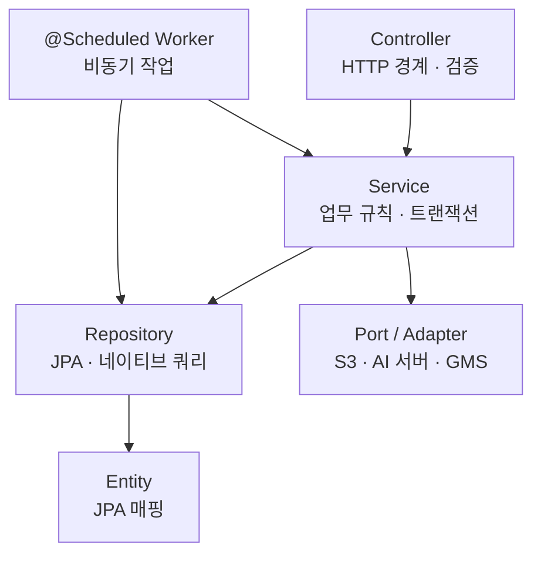
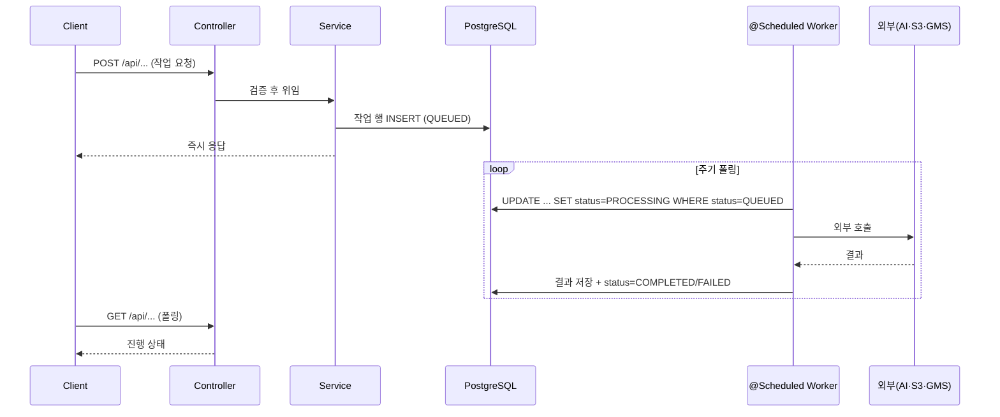

# 백엔드 아키텍처

## 목적

Spring Boot 애플리케이션의 구조 원칙과 계층 구성을 정리한다.

## 현재 구현

### 규모

| 항목 | 값 |
| --- | --- |
| `src/main` Java 파일 | 519 |
| `src/test` Java 파일 | 144 |
| 도메인 패키지 | 18 |
| 컨트롤러 | 33 |
| HTTP 매핑 | 98 |
| Spring Boot | 4.1.1 |
| Java | 21 |

### 패키지 배치 — 도메인 우선

`com.ssafy.a307` 아래를 **계층이 아니라 도메인으로** 먼저 나눈다.

```
com.ssafy.a307/
├─ BackendApplication.java
├─ accident/          사고·사고 사진
├─ admin/             관리자 마스터·규칙
├─ analysis/          AI 분석 작업·콜백·결과
├─ audit/             감사 로그
├─ auth/              인증·가입
├─ batch/             배치 실행 이력
├─ common/            공통 (예외·응답·저장소 포트)
├─ config/            보안·CORS·OpenAPI
├─ estimate/          견적·리포트·PDF·요약
├─ estimatevalidation/ 견적서 검증 (OCR → 판정 → 리포트)
├─ guide/             촬영·체크 가이드
├─ location/          정비소 위치
├─ member/            회원·프로필·약관
├─ repaircase/        수리 사례 조회
├─ repairchecklist/   정비 체크리스트
├─ repairquestion/    정비소 확인 질문
├─ review/            사고 데이터 검수
└─ vehicle/           차량·차량 모델
```

각 도메인 안에 `controller` · `service` · `repository` · `entity` · `dto` 를 둔다.
`analysis` 처럼 큰 도메인은 `callback` · `request` · `contract` · `event` · `domain` 을 더 나눈다.

### 계층



### 비동기 워커 계층

이 프로젝트의 특징이다. HTTP 요청은 작업을 **큐에 넣고 즉시 응답**하고, `@Scheduled` 워커가
뒤에서 처리한다. 큐는 메시지 브로커가 아니라 **PostgreSQL 테이블**이다.

| 워커 | 처리 대상 | 스위치 |
| --- | --- | --- |
| 분석 요청 | `analysis_job` | `ANALYSIS_REQUEST_WORKER_ENABLED` |
| 견적 산출 | `estimate` | `ESTIMATE_WORKER_ENABLED` |
| 견적 요약 (LLM) | `estimate_narrative` | `ESTIMATE_NARRATIVE_WORKER_ENABLED` |
| 정비 체크리스트 (LLM) | `repair_checklist` | `REPAIR_CHECKLIST_WORKER_ENABLED` |
| 정비소 질문 (LLM) | `repair_question` | `REPAIR_QUESTION_WORKER_ENABLED` |
| 견적 PDF | `estimate_report` | `ESTIMATE_PDF_ENABLED` |
| 검증 PDF | `estimate_validation_report` | `VALIDATION_PDF_ENABLED` |

공통 규칙 세 가지가 `application.properties` 주석에 적혀 있다.

1. 조건부 `UPDATE` 로 `QUEUED → PROCESSING` 을 옮긴다 (동시 두 워커가 같은 행을 집지 못한다)
2. `processing-timeout` 이 지난 `PROCESSING` 행은 **고아로 보고 종결**한다
3. 반복 실패 건은 되돌리지 않고 `ABANDONED` 로 끝낸다 — "영영 실패하는 건이 매 주기 GMS
   크레딧을 태운다" (`EstimateNarrativeFailure.java:24`)

3번이 중요하다. LLM 호출은 돈이 들기 때문에 무한 재시도를 금지했다.

### 이벤트 사용

`analysis` 패키지에 `event` 가 있다. `AnalysisCallbackService` 가 결과를 저장한 뒤
`AnalysisJobFinishedEvent` 를 발행하고, 리스너가 단계 기록을 쓴다.

분리한 이유가 javadoc에 있다.

> 여기서 직접 쓰지 않는다. 같은 트랜잭션에서 쓰면 단계 기록 실패가 분석 결과까지 되돌리고,
> `REQUIRES_NEW` 로 먼저 쓰면 결과보다 단계가 먼저 보인다.

### 포트/어댑터

외부 연동은 인터페이스(포트)와 구현(어댑터)으로 나눈다. 확인된 예다.

| 포트 | 구현 대상 |
| --- | --- |
| `AccidentImageStoragePort` | S3 |
| `AiAnalysisClient` | AI 서버 |
| `LlmEstimateOcrAdapter` | GMS(LLM) |

`DOCUMENT_STORAGE_PROVIDER` 가 `s3` / 로컬을 고르는 구조도 같은 패턴이다.

## 동작 흐름



## 주요 구성 요소

| 구성 요소 | 위치 |
| --- | --- |
| 진입점 | `BackendApplication.java` |
| 보안 설정 | `config/SecurityConfig.java` |
| 전역 예외 처리 | `common/exception/GlobalExceptionHandler.java` |
| 공통 응답 | `common/` 의 `ApiResponse` |
| 설정 키 | `src/main/resources/application.properties` |

## 설정 및 실행 방법

[실행 및 테스트](실행_및_테스트.md) 참고.

## 오류 및 예외 처리

[예외처리](예외처리.md) 참고.

## 관련 소스코드

- `backend/src/main/java/com/ssafy/a307/` — 18개 도메인 패키지
- `backend/src/main/resources/application.properties` — 워커 설정
- `backend/build.gradle` — 의존성

## 근거 자료

- 패키지 구조·파일 수 집계
- `application.properties` 주석
- `analysis/callback/AnalysisCallbackService.java` javadoc

## 확인 필요 항목

- **`batch` · `audit` 패키지의 역할** — 각 4개·5개 파일이며 상세 확인하지 못함
- **워커 폴링 주기** — `fixedDelay` 값을 전수 확인하지 못함
- **트랜잭션 경계 규칙** — `@Transactional` 사용 패턴을 전수 확인하지 못함
