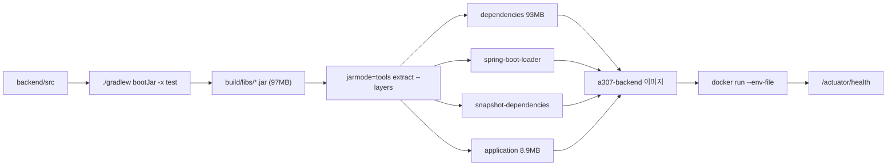

# 실행 및 테스트

## 목적

백엔드를 로컬에서 띄우고 테스트하는 방법, 빌드 산출물 구조를 정리한다.

## 현재 구현

### 로컬 실행 순서

**1단계 — 데이터 저장소**

```bash
docker compose up -d
```

PostgreSQL(pgvector) + Redis만 뜬다. 애플리케이션은 들어 있지 않다.

| 컨테이너 | 포트(호스트) | 기본 계정 |
| --- | --- | --- |
| `a307-db` | `127.0.0.1:5432` | `a307` / [보안 정보 제외] |
| `a307-redis` | `127.0.0.1:6379` | 없음 |

포트를 `127.0.0.1` 에만 묶는다. `docker-compose.yml` 주석이 이유를 적었다 —
`"5432:5432"` 라고 쓰면 모든 인터페이스에 열려 같은 공유기의 다른 기기에서도 접근할 수 있다.

기본 계정 정보가 저장소에 있어도 되는 이유도 적혀 있다 — 포트가 로컬에만 묶여 있고,
운영 DB는 이 파일을 쓰지 않기 때문이다.

**2단계 — DDL 자동 적용**

컨테이너 첫 기동에만 `docker-entrypoint-initdb.d` 가 실행된다. 파일명 순서대로다.

| 순서 | 파일 |
| --- | --- |
| 01 | `Docs/Erd/A307_ddl_final.sql` |
| 02 | `Docs/Erd/vehicle_model_seed.sql` |
| 03 | `Docs/Erd/A307_part_code_seed.sql` |
| 04 | `pipeline/sql/003_aihub_staging.sql` |

**🔴 DDL이 바뀌면 마운트만으로는 반영되지 않는다.** `docker-compose.yml` 주석:

> `docker compose down -v` 로 볼륨을 지우고 다시 올려야 한다. 로컬 DB 가 낡아서
> `ddl-auto=validate` 가 실패하는 사고가 이미 한 번 있었으니, DDL 커밋을 pull 하면
> 이 절차를 밟는다.

**3단계 — 환경변수**

Spring Boot는 `.env` 를 읽지 않는다. IntelliJ 실행 구성의 Environment variables에 넣는다.

```
DB_USERNAME · DB_PASSWORD · KAKAO_CLIENT_ID · KAKAO_CLIENT_SECRET · INTERNAL_API_TOKEN ...
```

전체 목록은 [환경변수 목록](../07_인프라/환경변수_목록.md)에 있다. 값은 [보안 정보 제외].

**4단계 — 애플리케이션**

```bash
cd backend
./gradlew bootRun
```

### 테스트

```bash
cd backend
./gradlew test
```

| 항목 | 값 |
| --- | --- |
| 테스트 파일 | 144개 |
| 테스트 케이스 | **1,677건** |
| 실패 | 0 |
| 오류 | 0 |
| 건너뜀 | 40 |

위 수치는 이 조사 시점에 `./gradlew test` 를 직접 실행해 `build/test-results/test/*.xml` 을
집계한 값이다.

테스트 DB는 **H2 인메모리**다.

```gradle
testRuntimeOnly 'com.h2database:h2'
```

로컬 PostgreSQL 없이 돌리기 위한 선택이다. 대가가 있다 — H2와 PostgreSQL의 SQL 차이 때문에
실제 문제가 테스트를 통과하는 경우가 있다. Jira 기록이 그 사례를 보여 준다.

| 이슈 | 내용 |
| --- | --- |
| `S15P21A307-512` | H2 시드 한글이 깨진다 — `spring.sql.init.encoding` 미지정 |
| `S15P21A307-511` | `repair_case` 테스트가 정본 스키마와 어긋난다 — NOT NULL 위반 |

테스트용 스키마가 따로 있다 — `backend/src/test/resources/schema-h2.sql`.

### 특정 테스트만 실행

```bash
./gradlew test --tests '*AnalysisCallbackApiTest*'
```

```bash
./gradlew compileJava compileTestJava
```

### 빌드

```bash
cd backend
./gradlew bootJar -x test
```

산출물은 `backend/build/libs/*.jar` 다. `-plain.jar` 가 아닌 부트 jar를 쓴다.

**jar 크기 실측** (`backend/Dockerfile` 주석):

| 구성 | 크기 |
| --- | --- |
| 전체 boot jar | 97MB |
| dependencies | 93MB |
| application | 8.9MB |

application이 8.9MB로 큰 이유는 PDF 한글 폰트 NotoSansKR 5.9MB 때문이다.

### 컨테이너 이미지

```bash
cd backend && ./gradlew bootJar -x test
cd .. && docker build -t a307-backend:latest -f backend/Dockerfile .
```

**빌드 컨텍스트가 저장소 루트다.** `backend/` 에서 빌드하면 깨진다.

레이어드 jar로 4개 레이어(dependencies · spring-boot-loader · snapshot-dependencies ·
application)로 쪼개, 코드만 바뀌면 실제 전송이 97MB → 8.9MB로 준다.

```bash
docker run -d --name a307-backend -p 8080:8080 \
  --env-file /etc/a307/backend.env \
  --restart unless-stopped \
  a307-backend:latest
```

**⚠️ 실행 전에 마이그레이션을 먼저 적용한다.** `ddl-auto=validate` 라서 스키마가 어긋나면
그 API만이 아니라 **앱 전체가 기동하지 않는다.**

### 런타임 설정

```dockerfile
ENV JAVA_OPTS="-XX:MaxRAMPercentage=75.0 -XX:+ExitOnOutOfMemoryError -Djava.awt.headless=true"
```

| 옵션 | 이유 (Dockerfile 주석) |
| --- | --- |
| `MaxRAMPercentage=75.0` | `-Xmx` 고정 안 함 — 인스턴스 스펙이 바뀌어도 이미지를 다시 만들지 않기 위해 |
| `ExitOnOutOfMemoryError` | OOM 뒤 반쯤 죽은 채로 살아 있으면 헬스체크는 통과하는데 요청만 실패한다 |
| `java.awt.headless=true` | PDF·이미지 처리에 AWT 사용 |

컨테이너는 root가 아닌 `uid 1001` 로 돈다.

### 헬스체크

```dockerfile
HEALTHCHECK --interval=30s --timeout=3s --start-period=90s --retries=3 \
  CMD curl -sf http://localhost:8080/actuator/health || exit 1
```

주석이 한계를 명시한다 — **"기동했다" 까지만 보증한다.** 어댑터가 없어도 UP이 뜨므로
기능 확인은 별도 체크리스트로 한다.

## 동작 흐름 (빌드 → 실행)



## 주요 구성 요소

- `backend/build.gradle` — 빌드·의존성
- `backend/Dockerfile` — 2단계 이미지 빌드
- `backend/src/main/resources/application.properties`
- `backend/src/test/resources/application.properties` · `schema-h2.sql`
- `docker-compose.yml` — 로컬 저장소

## 오류 및 예외 처리

| 증상 | 원인 | 조치 |
| --- | --- | --- |
| 기동 즉시 실패, 스키마 오류 | `ddl-auto=validate` 불일치 | 마이그레이션 적용 또는 `docker compose down -v` 후 재기동 |
| `Could not resolve placeholder` | 환경변수 누락 | `--env-file` 경로·오타 확인 |
| 테스트 한글 깨짐 | `spring.sql.init.encoding` | `S15P21A307-512` 참고 |
| PDF 생성만 500 | 폰트·AWT 모듈 없음 | 베이스 이미지 확인 (Dockerfile 주석) |

## 관련 소스코드

- `backend/build.gradle`
- `backend/Dockerfile`
- `docker-compose.yml`
- `backend/src/test/resources/schema-h2.sql`

## 근거 자료

- 이 조사에서 직접 실행한 `./gradlew test` (1,677건 통과)
- `backend/Dockerfile` · `docker-compose.yml` 주석
- Jira `S15P21A307-511` · `-512`

## 확인 필요 항목

- **건너뛴 테스트 40건의 내용** — 어떤 테스트가 왜 `@Disabled` 인지 확인하지 못함
- **테스트 커버리지** — JaCoCo 등 측정 도구 설정이 없어 확인하지 못함
- **통합 테스트와 단위 테스트 구분** — 태그·소스셋 분리가 없어 구분하지 못함
