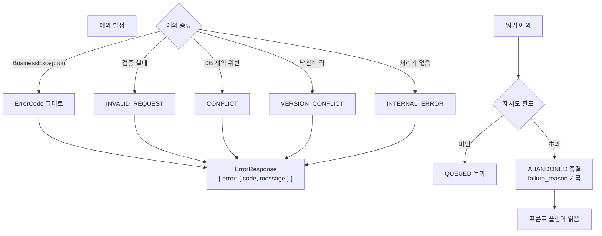

# 예외처리

## 목적

오류를 응답으로 바꾸는 규칙과 도메인별 예외 분기를 정리한다.

## 현재 구현

### 공통 오류 코드 8종

```java
// common/exception/ErrorCode.java
INVALID_REQUEST(HttpStatus.BAD_REQUEST),
UNAUTHORIZED(HttpStatus.UNAUTHORIZED),
FORBIDDEN(HttpStatus.FORBIDDEN),
NOT_FOUND(HttpStatus.NOT_FOUND),
CONFLICT(HttpStatus.CONFLICT),
TOO_MANY_REQUESTS(HttpStatus.TOO_MANY_REQUESTS),
SERVICE_UNAVAILABLE(HttpStatus.SERVICE_UNAVAILABLE),
INTERNAL_ERROR(HttpStatus.INTERNAL_SERVER_ERROR);
```

**코드가 8개뿐이다.** 도메인마다 코드를 늘리지 않고 HTTP 상태에 대응하는 최소 집합을 쓴다.
구체 사유는 `message` 로 전달한다.

### 전역 핸들러

`common/exception/GlobalExceptionHandler.java` 가 잡는 예외다.

| `@ExceptionHandler` | 변환 결과 |
| --- | --- |
| `BusinessException` | 예외가 들고 있는 `ErrorCode` |
| `AccidentImageValidationException` | `INVALID_REQUEST` |
| `AdminOperationException` | `AdminErrorCode` 별 상태 |
| `OptimisticLockingFailureException` | `AdminErrorCode.VERSION_CONFLICT` |
| `KakaoLocalException` | (전용 처리) |
| `DataIntegrityViolationException` | `CONFLICT` |
| `MissingServletRequestParameterException` | `INVALID_REQUEST` + `"{이름} 파라미터가 필요합니다."` |
| `MethodArgumentNotValidException` | `INVALID_REQUEST` + 검증 메시지 |
| `HttpMessageNotReadableException` | `INVALID_REQUEST` |

`DataIntegrityViolationException → CONFLICT` 매핑이 의미 있다. DB 유니크 제약 위반을 500이
아니라 409로 돌려준다 — 부분 UNIQUE 인덱스로 중복 작업을 막는 구조와 맞물린다.

`OptimisticLockingFailureException` 은 관리자 마스터 동시 수정 대비다.

### 도메인 전용 오류 코드

공통 8종과 별개로 도메인이 자체 코드를 갖는 경우가 있다.

| 도메인 | 코드 집합 | 위치 |
| --- | --- | --- |
| 관리자 | `AdminErrorCode` (`VERSION_CONFLICT` 등) | `admin/AdminErrorCode.java` |
| 인증 | `LoginFailureReason` | `auth/LoginFailureReason.java` |
| 분석 요청 | `AnalysisRequestFailure` (`ABANDONED` 등) | `analysis/request/AnalysisRequestFailure.java` |
| 견적 검증 | `EstimateValidationFailure` | `estimatevalidation/service/` |
| 견적 요약 | `EstimateNarrativeFailure` (`ABANDONED`) | `estimate/narrative/` |

### 비동기 작업의 오류 — 응답이 아니라 컬럼

워커가 처리하는 작업은 HTTP 응답으로 실패를 알릴 수 없다. **DB 컬럼에 사유를 적고**
프론트가 폴링으로 읽는다.

| 테이블 | 컬럼 | 값 예시 |
| --- | --- | --- |
| `analysis_job` | `failure_reason` VARCHAR(50) | `ALL_IMAGES_EXCLUDED` · `MODEL_ERROR` · `ABANDONED` |
| `estimate` | `non_estimable_reason` VARCHAR(100) | `PART_NOT_RESOLVED` · `INSUFFICIENT_CASES` |
| `estimate_report` | (상태 컬럼) | PDF 생성 실패 |

`analysis_job.failure_reason` 은 두 출처가 섞인다 — AI가 준 `error.code` 와 백엔드가 판정한 값이다.
`AnalysisCallbackService.java:42~51` 주석이 그 구분을 명시했고, "컬럼이 `VARCHAR(50)` 이므로
길이를 넘지 않는다" 는 점까지 적었다.

**한글 문안을 코드에 넣지 않는다.**

> 한글 문안을 넣지 않는다. 사용자에게 보일 문구는 화면이 이 코드를 보고 정한다.

그래서 `AnalyzingView.vue` 의 `FAIL_TEXT` 가 코드 → 문구 매핑을 갖는다.

### 반복 실패는 되돌리지 않는다

`EstimateNarrativeFailure.java:24~27` 주석:

> 영영 실패하는 건이 매 주기 GMS 크레딧을 태운다

그래서 재시도 한도를 넘으면 `ABANDONED` 로 **종결**한다. 큐에 되돌리지 않는다.
`analysis_job.retry_count` 도 `CHECK (retry_count BETWEEN 0 AND 3)` 으로 상한이 걸려 있다.

LLM 호출에 돈이 드는 구조라 무한 재시도가 금전 손실이 된다.

### 저장 실패를 삼키는 경우

전부 실패시키지 않고 일부를 포기하는 판단이 있다.

```java
// AnalysisResultPersister.refCondition()
// 직렬화에 실패해도 저장을 멈추지 않는다. 근거 한 줄 때문에 금액을 통째로 잃는 것보다
// 근거가 비어 있는 편이 낫다 — 읽는 쪽(RefConditionReader)이 같은 판단을 한다.
```

```java
// AccidentImageDownloadUrls.presign()
log.warn("썸네일 조회 URL 발급 실패 key={}", s3Key, e);
```

썸네일 URL 발급 실패도 예외로 올리지 않고 로그만 남긴다.

`AnalysisImageResult` 는 `exclusionReason` 이 길면 잘라 넣는다 — "제외 사유 문자열이 길다는
이유로 분석 [결과를 잃지 않는다]".

## 동작 흐름



## 주요 구성 요소

- `common/exception/ErrorCode.java` — 공통 8종
- `common/exception/BusinessException.java` — 업무 예외
- `common/exception/GlobalExceptionHandler.java` — `@RestControllerAdvice`
- 도메인별 `*Failure` · `*ErrorCode` enum

## 설정 및 실행 방법

설정 불필요. 워커 재시도 한도·타임아웃은
[환경변수 목록](../07_인프라/환경변수_목록.md)과 `application.properties` 에 있다.

## 오류 및 예외 처리

이 문서 전체가 해당 내용이다. AI 서버 쪽 오류는
[백엔드 ↔ AI 서버 API](../06_API/백엔드_AI서버_API.md), 코드 전체 목록은
[오류코드](../06_API/오류코드.md)에 있다.

## 관련 소스코드

- `backend/src/main/java/com/ssafy/a307/common/exception/ErrorCode.java`
- `backend/src/main/java/com/ssafy/a307/common/exception/GlobalExceptionHandler.java`
- `backend/src/main/java/com/ssafy/a307/analysis/callback/AnalysisCallbackService.java:42~51`
- `backend/src/main/java/com/ssafy/a307/estimate/narrative/EstimateNarrativeFailure.java`
- `backend/src/main/java/com/ssafy/a307/analysis/entity/AnalysisImageResult.java:77~91`

## 근거 자료

- 소스 직접 확인 (`@ExceptionHandler` 9개)
- enum 정의와 javadoc

## 확인 필요 항목

- **`ErrorResponse` 정확한 필드** — 프론트 파싱(`data.error.code` · `.message`)으로 역추정했고 클래스 정의를 확인하지 못함
- **처리기가 없는 예외의 기본 동작** — `Exception.class` 핸들러 존재 여부를 확인하지 못함
- **`TOO_MANY_REQUESTS` 발생 지점** — 코드는 정의됐으나 어디서 던지는지 확인하지 못함
- **`KakaoLocalException` 처리 상세** — 변환 결과를 확인하지 못함
