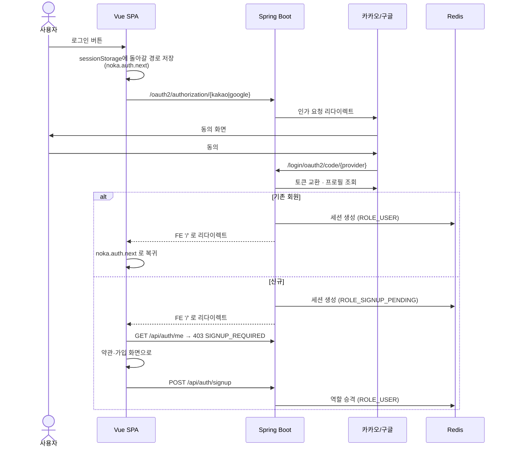

# 인증과 권한

## 목적

로그인 방식, 세션 관리, 역할 체계를 정리한다.

## 현재 구현

### 소셜 로그인 전용

```java
// config/SecurityConfig.java:98
.formLogin(form -> form.disable())
```

**아이디·비밀번호 로그인이 없다.** `member` 테이블에 비밀번호 컬럼도 없다.
제공자는 카카오·구글 둘이다 (`KAKAO_CLIENT_ID` · `GOOGLE_CLIENT_ID` 환경변수).

이 선택의 효과:

- 비밀번호를 저장·해싱·재설정할 필요가 없다
- 비밀번호 유출 경로가 원천적으로 없다
- 대신 소셜 제공자 장애 시 로그인이 전면 불가능하다

### 세션 기반 인증 (JWT 아님)

토큰이 없다. `SESSION` (HttpOnly) 쿠키 하나로 인증된다.
`frontend/src/lib/api.js` 주석이 이를 명시한다.

```properties
# backend/src/main/resources/application.properties
spring.session.data.redis.namespace=a307:session
spring.session.data.redis.repository-type=indexed
server.servlet.session.timeout=30m
```

| 항목 | 값 |
| --- | --- |
| 저장소 | Redis |
| 네임스페이스 | `a307:session` |
| repository-type | `indexed` |
| 타임아웃 | 30분 |

Boot 4 마이그레이션 함정이 주석에 기록돼 있다.

> `spring.session.store-type` 은 Boot 4 에서 없어진 키다(메타데이터에 존재하지 않음).
> 네임스페이스 키도 4.0 부터 `spring.session.data.redis.*` 로 옮겨졌다. 옛 이름은
> deprecation level=error 라 조용히 무시되고, 세션이 기본 네임스페이스(`spring:session`)에 쌓인다.

`repository-type=indexed` 를 쓰면 부팅 시 `notify-keyspace-events` 를 `CONFIG SET` 으로 켠다
(`docker-compose.yml` 주석). 기본 설정 Redis는 이를 허용한다.

JWT 대비 특징:

| | 세션 (현재) | JWT |
| --- | --- | --- |
| 무효화 | 즉시 가능 (Redis 삭제) | 만료까지 유효 |
| 상태 | Redis 의존 | 무상태 |
| XSS 토큰 탈취 | HttpOnly라 불가 | localStorage 보관 시 가능 |
| 수평 확장 | Redis 공유 필요 | 자유 |

### 역할 3종

| 역할 | 부여 시점 | 접근 범위 |
| --- | --- | --- |
| `ROLE_SIGNUP_PENDING` | 소셜 인증 성공, 가입 미완료 | `/api/auth/signup` 만 |
| `ROLE_USER` | 가입 완료 | 일반 API |
| `ROLE_ADMIN` | (부여 경로 미확인) | `/api/admin/**` 포함 전체 |

가입 대기 상태가 독립 역할인 것이 설계 요점이다. `SecurityConfig.java:115~117` 주석:

> `authenticated()` 를 쓰면 안 된다. 가입 대기 세션(`ROLE_SIGNUP_PENDING`)도 [인증은 된 상태다]

그래서 `anyRequest().hasAnyRole("USER", "ADMIN")` 으로 명시했다.

프론트도 이를 안다 — `api.js` 인터셉터가 `403 SIGNUP_REQUIRED` 를 `401` 과 같이 묶어
인증 오류 훅으로 보낸다.

### 로그인 흐름



서버가 OAuth 성공 후 **항상 FE 루트(`/`)로 보낸다.** 그래서 프론트가 돌아갈 경로를
`sessionStorage` 에 따로 보관한다 (`stores/auth.js` 주석).

### 로그아웃과 탈퇴

```java
// SecurityConfig.java:42
private static final String LOGOUT_PATH = "/api/auth/logout";
```

`LogoutFilter` 가 인가 필터보다 앞이라 `PUBLIC_PATHS` 에 없어도 도달한다.
`logoutUrl()` 대신 매처를 직접 준 이유도 주석에 있다 — "csrf 를 끈 상태에서 `logoutUrl()` 만
쓰면" 문제가 생긴다.

세션 쿠키 이름을 상수로 공개한 이유:

> 탈퇴(`DELETE /api/members/me`)도 같은 쿠키를 지워야 해서 공개한다. 쿠키 이름을 두 군데
> 적으면 한쪽만 바뀌었을 때 탈퇴 후 쿠키가 남는다.

### CSRF 비활성화

```java
.csrf(csrf -> csrf.disable())
```

SPA + 쿠키 세션 조합에서 CSRF를 끈 것은 **위험 요소다**. `SameSite` 쿠키 속성이나
CORS 오리진 제한에 의존하게 된다. [보안 점검표](../09_보안/보안_점검표.md)에 분리해 기록했다.

### CORS

```java
.cors(Customizer.withDefaults())
...
c.setAllowedOrigins(corsProperties.allowedOrigins());
```

`CORS_ALLOWED_ORIGINS` 환경변수가 `config/CorsProperties.java` 로 들어간다.
와일드카드가 아니라 **목록 지정**이다 — `withCredentials: true` 와 `*` 는 브라우저가
허용하지 않으므로 구조적으로 목록이어야 한다.

## 주요 구성 요소

| 구성 요소 | 파일 |
| --- | --- |
| 보안 설정 | `config/SecurityConfig.java` |
| CORS 속성 | `config/CorsProperties.java` |
| 세션 정책 | `auth/AuthSessionPolicy.java` |
| 로그인 실패 사유 | `auth/LoginFailureReason.java` |
| 인증 주체 | `auth/principal/` |
| 성공·실패 핸들러 | `auth/handler/` |

## 설정 및 실행 방법

필요한 환경변수 (이름만, 값은 [보안 정보 제외]):

```
KAKAO_CLIENT_ID · KAKAO_CLIENT_SECRET
GOOGLE_CLIENT_ID · GOOGLE_CLIENT_SECRET
CORS_ALLOWED_ORIGINS
FRONTEND_BASE_URL
```

로컬은 IntelliJ 실행 구성의 Environment variables에 넣는다 (`docker-compose.yml` 주석).

## 오류 및 예외 처리

| 상황 | 응답 |
| --- | --- |
| 세션 없음/만료 | `401` (본문 없음) |
| 가입 미완료 | `403 SIGNUP_REQUIRED` |
| 관리자 API에 일반 사용자 | `403` |
| 남의 리소스 조회 | `404` (존재 은폐) |

## 관련 소스코드

- `backend/src/main/java/com/ssafy/a307/config/SecurityConfig.java`
- `backend/src/main/java/com/ssafy/a307/auth/`
- `backend/src/main/resources/application.properties:13~29`
- `frontend/src/stores/auth.js`

## 근거 자료

- `SecurityConfig.java` 선언과 주석
- `application.properties` 세션 설정과 주석
- `frontend/src/lib/api.js` · `stores/auth.js` 주석

## 확인 필요 항목

- **`ROLE_ADMIN` 부여 경로** — 코드에서 관리자 승격 방법을 확인하지 못함
- **`SameSite` 쿠키 속성** — CSRF를 끈 상태의 보완책인지 확인하지 못함
- **세션 고정 공격 방어** — `sessionManagement` 설정을 확인하지 못함
- **동시 세션 제한** — 설정 여부를 확인하지 못함
