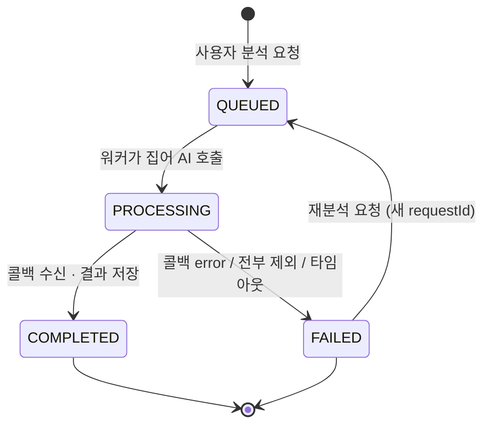
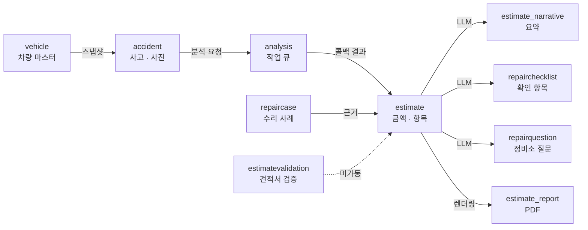

# 주요 도메인

## 목적

업무적으로 핵심이 되는 도메인 6개의 책임·상태 모델·연결 관계를 정리한다.

## 현재 구현

### 1. `accident` — 사고와 사진

| 항목 | 내용 |
| --- | --- |
| 테이블 | `accident`, `accident_image`, `accident_image_asset` |
| 핵심 개념 | 차량 정보를 **스냅샷으로 복사** (`snapshot_model_id` · `snapshot_manufacturer` 등) |
| 이미지 변형 | `ORIGINAL` · `RESIZED` · `THUMBNAIL` · `BLURRED` |

차량을 FK로 참조하지 않고 스냅샷으로 복사한다. 사용자가 나중에 차량을 수정·삭제해도 그때
분석한 조건이 남아야 하기 때문이다. `AnalysisRequestPayload.Vehicle.from(Accident)` 가
`snapshot*` 필드만 읽는 것이 증거다.

`BLURRED` 는 **값만 있고 만드는 코드가 없다.** `ImageVariant.java` 주석이 2026-09-10에 MVP 범위
밖으로 정리했다고 적었고, 값을 지우지 않는 이유도 적었다 — DDL의 `ck_aia_var` 가 네 값을
허용하므로 enum에서 빼면 스키마와 어긋난다.

사고 이력은 삭제가 아니라 **숨김**이다 (`accident.hidden_at`, `setAccidentHidden` API).
커밋 `c23e2bb` "사고 이력을 목록에서 감출 수 있게 한다 (S15P21A307-554)" 가 근거다.

### 2. `analysis` — 분석 작업

| 항목 | 내용 |
| --- | --- |
| 테이블 | `analysis_job`, `analysis_stage`, `analysis_image_result` |
| 상태 | `QUEUED` → `PROCESSING` → `COMPLETED` / `FAILED` |
| 재시도 | `retry_count` (0~3, CHECK 제약) |

`analysis_job.request_id` 가 멱등 키다. AI가 콜백을 최대 3회 재시도하므로, 같은 `requestId` 로
두 번째 콜백이 오면 저장을 생략하고 200을 준다.

`failure_reason` 은 `VARCHAR(50)` 이고 두 출처가 섞인다.

| 출처 | 값 예시 |
| --- | --- |
| AI가 보낸 `error.code` | `IMAGE_FETCH_FAILED` · `MODEL_ERROR` · `INVALID_MODEL_OUTPUT` · `INTERNAL` |
| 백엔드가 판정 | `ALL_IMAGES_EXCLUDED` · `AI_UNREACHABLE` · `ABANDONED` · `NO_IMAGE` |

`AnalysisCallbackService.java:42~51` 주석이 이 구분을 명시했다 — "AI 가 보내는 `error.code` 와
같은 자리에 들어가지만 **출처가 다르다** — 이것은 백엔드가 판정한 값이다."

### 3. `estimate` — 견적

| 항목 | 내용 |
| --- | --- |
| 테이블 | `estimate`, `estimate_item`, `estimate_notice`, `estimate_narrative`, `estimate_report` |
| 금액 | `total_min` · `total_median` · `total_max` (단일 값이 아니다) |
| 버전 | `uk_est UNIQUE (job_id, version)` — 재분석 시 버전이 늘어난다 |
| 등급 | `confidence_grade` ∈ `HIGH` · `MEDIUM` · `LOW` (NULL 허용) |

**부분 견적**을 지원한다. `unresolved_parts` (JSONB)에 산정하지 못해 총액에서 뺀 부위를
`[{partCode, damageType, reason}]` 로 담는다. DDL 주석이 정책을 적었다 — 마스터에 없는 부위,
`items[]` 와 겹치는 부위, 중복은 수신 계층이 거른다.

항목별 근거는 `estimate_item.ref_condition` (JSONB)에 들어간다.

| 필드 | 내용 |
| --- | --- |
| `fallbackStage` | `MODEL` · `PRICE_TIER` · `ALL` — 검색 완화 단계 |
| `costDistribution` | `p25` · `median` · `p75` |
| `refYearFrom` / `refYearTo` | 참조 사례 연도 범위 |
| `repairMethodReason` | 수리 방식 후보와 사유 코드 |
| `referencedCaseIds` | 참조한 `repair_case` ID 목록 |

`refYearFrom/To` 는 계약상 견적 레벨 값인데 항목마다 복사한다. javadoc이 이유를 적었다 —
"화면이 항목을 펼칠 때마다 '몇 년도 사례를 봤나' 를 보여 줘야 하고, 견적 응답을 한 번 더 부르게
만들 이유가 없다."

`ref_condition` 직렬화가 실패해도 저장을 멈추지 않는다 — "근거 한 줄 때문에 금액을 통째로
잃는 것보다 근거가 비어 있는 편이 낫다."

`repair_method` 는 `coating` · `sheet_metal` · `exchange` · `repair` 4종이다.

### 4. `repairchecklist` — 정비 체크리스트

| 항목 | 내용 |
| --- | --- |
| 테이블 | `repair_checklist`, `repair_checklist_item`, `repair_checklist_common_item` |
| 생성 | 공통 항목(마스터) + LLM 생성 항목 |
| 조작 | 추가·수정·삭제·재생성·체크·메모 |

"공통 확인 항목 마스터" 가 따로 있어 LLM이 실패해도 기본 항목은 나온다
(Jira `S15P21A307-462` · `-463`).

### 5. `estimatevalidation` — 견적서 검증 (운영 미가동)

| 항목 | 내용 |
| --- | --- |
| 테이블 | `estimate_validation`, `estimate_validation_item`, `estimate_validation_rule`, `estimate_validation_report`, `estimate_validation_question` |
| 흐름 | 견적서 업로드 → OCR 판독 → 규칙 판정 → 리포트·질문 생성 |
| 규모 | 101개 파일 (백엔드 최대) |
| 상태 | 구현 완료 · 이번 범위 제외 |

확인된 구성 요소 — `EstimateValidationEngine`, `ValidationFlag`, `RepairShopQuestionGenerator`,
`EstimateOcrPrompt`, `LlmEstimateOcrAdapter`, `OcrExtractionParser`.

### 6. `admin` — 마스터·규칙 관리 (화면 미구현)

| 항목 | 내용 |
| --- | --- |
| 관리 대상 | `part_code`, `part_name_mapping`, `vehicle_model`, `repair_method_rule`, `estimate_validation_rule` |
| API | 34개 |
| 동시성 | `OptimisticLockingFailureException` → `AdminErrorCode.VERSION_CONFLICT` |

낙관적 락을 쓴다. `GlobalExceptionHandler:79` 가 충돌을 전용 코드로 응답한다.

## 동작 흐름 (도메인 연결)

## 주요 구성 요소

위 각 절의 테이블·클래스 참고.

## 설정 및 실행 방법

도메인별 스위치는 [환경변수 목록](../07_인프라/환경변수_목록.md)에 있다.

## 오류 및 예외 처리

- 분석 실패: `analysis_job.failure_reason` (위 표)
- 산정 불가: `estimate.non_estimable_reason` — `PART_NOT_RESOLVED` · `NO_DAMAGE_DETECTED` · `INSUFFICIENT_CASES`
- 관리자 동시 수정: `VERSION_CONFLICT`

## 관련 소스코드

- `backend/src/main/java/com/ssafy/a307/analysis/callback/AnalysisCallbackService.java`
- `backend/src/main/java/com/ssafy/a307/analysis/callback/AnalysisResultPersister.java`
- `backend/src/main/java/com/ssafy/a307/accident/entity/ImageVariant.java`
- `backend/src/main/java/com/ssafy/a307/estimate/entity/Estimate.java`
- `Docs/Erd/A307_ddl_final.sql`

## 근거 자료

- 소스 javadoc·주석
- `Docs/Erd/A307_ddl_final.sql` 의 테이블 정의와 주석
- Git 커밋 메시지 (`c23e2bb` 등)

## 확인 필요 항목

- **`repair_cost_stat` 테이블의 사용처** — 사전 집계 테이블로 보이나 어느 코드가 쓰는지 확인하지 못함
- **`estimate_notice` 의 구체 내용** — 고지 문구 저장으로 추정
- **`damaged_part` 테이블과 `estimate_item` 의 관계** — FK는 확인했으나 채우는 경로를 확인하지 못함
- **재분석 시 버전 증가 규칙** — `uk_est (job_id, version)` 는 확인했으나 증가 로직을 확인하지 못함
