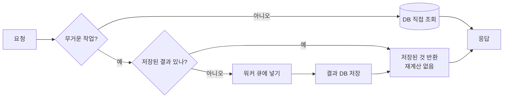

# 캐싱 전략

## 목적

이 프로젝트의 캐싱 사용 실태를 사실대로 기록한다. **결론부터: 애플리케이션 캐시가 없다.**

## 현재 구현

### 조사 결과 — 캐시 코드 0건

다음 패턴을 `backend/src/main` 전체에서 검색했고 **일치 항목이 없었다.**

```
RedisTemplate · @Cacheable · @CacheEvict · CacheManager
ListOperations · ValueOperations
```

`@EnableCaching` 도 확인되지 않았다.

### Redis는 세션 전용이다

Redis가 의존성에 있고 컨테이너도 뜨지만, 용도는 하나다.

```gradle
implementation 'org.springframework.boot:spring-boot-starter-data-redis'
implementation 'org.springframework.boot:spring-boot-starter-session-data-redis'
```

```properties
spring.data.redis.host=localhost
spring.data.redis.port=6379
spring.session.data.redis.namespace=a307:session
spring.session.data.redis.repository-type=indexed
server.servlet.session.timeout=30m
```

`docker-compose.yml` 주석이 용도를 못박는다.

> 세션 저장소라 유실돼도 재로그인으로 끝나지만, 컨테이너를 올릴 때마다 전원 로그아웃되는 것을
> 막으려면 볼륨이 있는 편이 낫다.

`spring-boot-starter-data-redis` 는 `session-data-redis` 의 전제 의존성으로 들어간 것으로
**추정**된다. 직접 쓰는 코드가 없다.

### 캐시 대신 쓰는 것들

캐시는 없지만 반복 비용을 줄이는 장치는 있다.

**1. 사전 집계 테이블 — `repair_cost_stat`**

`Docs/AI/견적 산출 입출력 형식.md` 가 "운영 안정화 단계(`repair_cost_stat` 사전 집계)" 를
언급한다. 매 요청마다 `repair_case` 를 집계하는 대신 미리 계산해 두는 구조다.
다만 **현재 이 테이블을 읽는 코드를 확인하지 못했다.**

**2. 결과 영속화 — 재계산 금지**

LLM 산출물(요약·체크리스트·질문)과 PDF는 모두 테이블에 저장된다.
같은 요청이 다시 오면 재생성하지 않고 저장된 것을 준다.

| 산출물 | 저장 테이블 |
| --- | --- |
| 견적 요약 | `estimate_narrative` |
| 정비 체크리스트 | `repair_checklist`, `repair_checklist_item` |
| 정비소 질문 | `repair_question`, `repair_question_item` |
| 견적 PDF | `estimate_report` |

Jira `S15P21A307-529` "리포트와 견적 PDF 에 체크리스트 산정 근거 연결 — **LLM 재호출 없이**"
가 이 정책을 명시한다. 이것이 사실상의 캐시다 — **영속 캐시**이고 만료가 없다.

**3. 프로세스 내 모델 캐시 (AI 서버)**

`UltralyticsRunner` 가 로드한 YOLO 모델을 `dict[Path, Any]` 에 들고 있다.

```python
# AI/server/app/adapters/ultralytics_yolo.py
def _model(self, spec: ModelSpec) -> Any:
    if spec.weights not in self._models:
        self._models[spec.weights] = YOLO(str(spec.weights))
    return self._models[spec.weights]
```

지연 로드 + 프로세스 캐시다. `/health` 의 `modelsLoaded` 가 이 캐시 상태를 그대로 보고한다.
DINOv2 가중치는 아예 **Docker 이미지에 구워** 두고 `HF_HUB_OFFLINE=1` 로 돌린다.

**4. HTTP 클라이언트 재사용**

프론트가 `axios.create()` 로 인스턴스 하나를 만들어 재사용한다.

**5. 중복 요청 억제**

`frontend/src/stores/auth.js` 의 `let inflight = null` 이 동시 인증 조회를 합치는 것으로
**추정**된다.

### 캐시가 없어도 되는 이유 (추정)

| 근거 | 설명 |
| --- | --- |
| 조회 부하가 낮다 | 사용자당 사고 건수가 적고 목록 페이지 크기가 20 |
| 무거운 작업은 이미 비동기 | AI 분석·LLM·PDF는 워커가 처리하고 결과를 영속화 |
| 마스터 데이터가 작다 | `vehicle_model` 51건, `part_code` 32종 |
| 정합성 우선 | 관리자가 마스터를 고치면 즉시 반영돼야 한다 |

`vehicle_model` 51건 같은 마스터를 캐싱하면 관리자 수정 후 무효화 처리가 필요해진다.
JPA 1차 캐시와 DB 자체 캐시로 충분하다고 판단한 것으로 **추정**된다.

## 동작 흐름



## 주요 구성 요소

| 구성 요소 | 역할 |
| --- | --- |
| Redis | 세션 저장소 (캐시 아님) |
| `estimate_narrative` 등 | LLM 결과 영속 저장 = 사실상 캐시 |
| `UltralyticsRunner._models` | AI 서버 프로세스 내 모델 캐시 |
| Docker 이미지 내 DINOv2 | 빌드 타임 가중치 내장 |

## 설정 및 실행 방법

캐시 설정이 없다. Redis 접속 정보만 필요하다 — `spring.data.redis.host` · `port`.

## 오류 및 예외 처리

Redis가 죽으면 **세션이 사라져 전원 로그아웃**된다. 캐시가 아니므로 "캐시 미스 후 DB 조회"
같은 폴백이 없다. 데이터 손실은 없지만 로그인은 다시 해야 한다.

## 관련 소스코드

- `backend/src/main/resources/application.properties:13~29` — Redis 세션 설정
- `backend/build.gradle` — Redis 의존성
- `docker-compose.yml` — Redis 컨테이너와 주석
- `AI/server/app/adapters/ultralytics_yolo.py:27~40` — 모델 캐시

## 근거 자료

- `grep -rn "RedisTemplate|@Cacheable|@CacheEvict|CacheManager|ListOperations|ValueOperations" backend/src/main` → **0건**
- 의존성·설정 파일 직접 확인

## 확인 필요 항목

- **`repair_cost_stat` 사용 여부** — 테이블은 DDL에 있으나 읽는 코드를 확인하지 못함
- **JPA 2차 캐시** — `hibernate.cache.*` 설정을 확인하지 못함(미사용 추정)
- **Nginx 정적 파일 캐시 헤더** — 설정 파일이 저장소에 없어 확인하지 못함
- **`spring-boot-starter-data-redis` 를 직접 명시한 이유** — 전제 의존성 추정이며 확인하지 못함
