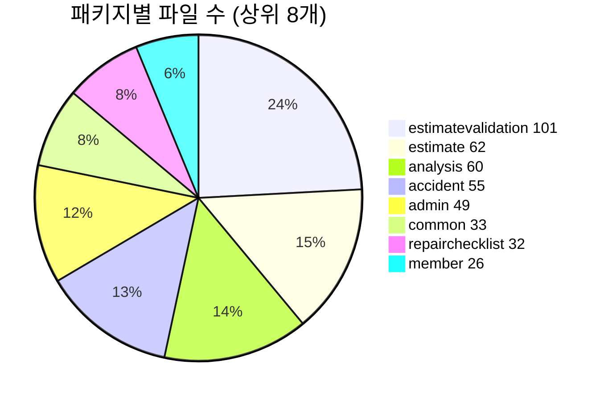
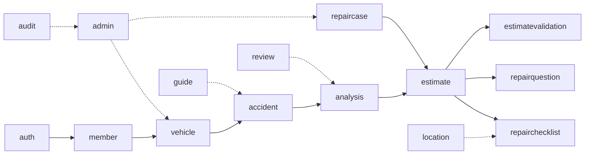

# 패키지 구조

## 목적

도메인 패키지 18개의 크기와 책임을 정리한다. 파일 수는 그 도메인에 쏟은 노력의 척도다.

## 현재 구현

### 패키지별 파일 수 (`src/main` 기준)

| 패키지 | 파일 수 | 책임 |
| --- | --: | --- |
| `estimatevalidation` | **101** | 견적서 검증 — OCR 판독 → 규칙 판정 → 리포트 |
| `estimate` | 62 | 견적 산출·조회·리포트·PDF·LLM 요약 |
| `analysis` | 60 | AI 분석 작업 큐·콜백 수신·결과 조회 |
| `accident` | 55 | 사고 접수·사진 업로드·변형 생성 |
| `admin` | 49 | 관리자 마스터 데이터·규칙 관리 |
| `common` | 33 | 예외·공통 응답·저장소 포트 |
| `repairchecklist` | 32 | 정비 체크리스트 생성·항목 관리 |
| `member` | 26 | 회원·프로필·약관 동의 |
| `repairquestion` | 20 | 정비소 확인 질문 생성 |
| `vehicle` | 18 | 차량·차량 모델 마스터 |
| `auth` | 13 | 소셜 로그인·가입 |
| `repaircase` | 12 | 수리 사례 조회 |
| `location` | 11 | 정비소 위치 |
| `guide` | 10 | 촬영·확인 가이드 |
| `audit` | 5 | 감사 로그 |
| `batch` | 4 | 배치 실행 이력 |
| `review` | 4 | 사고 데이터 검수 |
| `config` | 3 | 보안·CORS·OpenAPI |
| **합계** | **519** | |

### 크기가 말해 주는 것



**`estimatevalidation` 이 가장 큰데 운영에서 꺼져 있다.** 101개 파일 — 전체 `src/main` 의 19% 다.
루트 `README.md` 가 "구현 완료 · 이번 범위 제외" 로 적었고, 켜려면 셋이 더 필요하다고 명시했다.

| 필요한 것 | 환경변수·조건 |
| --- | --- |
| 문서 저장소 선택 | `DOCUMENT_STORAGE_PROVIDER` |
| OCR 벤더 선택 | `ESTIMATE_OCR_PROVIDER` |
| 견적서 업로드 화면 | 프론트엔드 미구현 |

`admin` 49개 파일도 비슷하다 — API 34개는 완성했으나 관리자 UI가 없다.

즉 **백엔드 파일의 약 30%가 화면 없이 대기 중**이다. 이것은 결함이 아니라 명시된 범위 결정이다.

### 도메인 안 구조

`analysis` 패키지가 가장 세분화돼 있다.

```
analysis/
├─ callback/     AI 결과 수신 (AnalysisCallbackService · AnalysisResultPersister)
├─ contract/     백엔드↔AI 계약 정의
├─ controller/   진행·결과 조회 API
├─ domain/       도메인 규칙
├─ dto/          응답 DTO
├─ entity/       JPA 엔티티
├─ event/        AnalysisJobFinishedEvent
├─ repository/   JPA + 네이티브 쿼리
├─ request/      AI 요청 워커·페이로드
└─ service/      결과 적재·진행 조회
```

`callback` 과 `request` 를 나눈 것이 요점이다 — **나가는 요청과 들어오는 콜백이 다른 방향의
경계**라 같은 패키지에 두지 않았다.

다른 도메인은 대체로 `controller` · `service` · `repository` · `entity` · `dto` 표준형이다.

### `common` 패키지

| 구성 | 내용 |
| --- | --- |
| `exception/` | `ErrorCode`, `BusinessException`, `GlobalExceptionHandler` |
| `storage/` | `ObjectStorageProperties` |
| 공통 응답 | `ApiResponse<T>` — 컨트롤러가 전부 이 타입으로 감싼다 |

### 테스트 배치

`src/test` 144개 파일이 같은 패키지 구조를 따른다. 확인된 테스트 클래스 예시다.

- `analysis/AnalysisCallbackApiTest`, `AnalysisProgressServiceTest`, `AnalysisResultApiTest`
- `estimatevalidation/domain/EstimateValidationEngineTest`, `RepairShopQuestionGeneratorTest`
- `admin/AdminMasterDataTest`, `AdminPartNameMappingIntegrityTest`
- `repairchecklist/RepairChecklistAutoRequestTest`
- `review/AccidentReviewDetectionTest`

테스트는 H2 인메모리 DB를 쓴다 (`testRuntimeOnly 'com.h2database:h2'`).

## 동작 흐름

패키지 사이 호출 방향이다. 굵은 흐름은 사고 → 분석 → 견적 → 파생이다.



점선은 참조·보조 관계다.

## 주요 구성 요소

위 표 참고.

## 설정 및 실행 방법

패키지 구조 자체는 설정이 필요 없다. 도메인별 기능 스위치는
[환경변수 목록](../07_인프라/환경변수_목록.md)에 있다.

## 오류 및 예외 처리

`common/exception` 이 전역 처리한다. [예외처리](예외처리.md) 참고.

## 관련 소스코드

- `backend/src/main/java/com/ssafy/a307/` — 전체
- `backend/src/test/java/com/ssafy/a307/` — 테스트 144개

## 근거 자료

- `find backend/src/main/java/com/ssafy/a307/<패키지> -name '*.java' | wc -l` 집계
- 디렉터리 구조 직접 확인
- 루트 `README.md` 기능 상태표 (범위 제외 근거)

## 확인 필요 항목

- **`batch` 패키지 4개 파일의 역할** — `batch_job_execution` 테이블과 연관된 것으로 추정되나 확인하지 못함
- **`audit` 5개 파일** — `audit_log` 테이블 기록으로 추정. 무엇을 기록하는지 확인하지 못함
- **`review` 4개 파일** — `accident_review` 테이블 기반 검수 기능. 화면 연동 여부 확인하지 못함
- **패키지별 테스트 커버리지** — 측정 도구 설정이 없어 확인하지 못함
