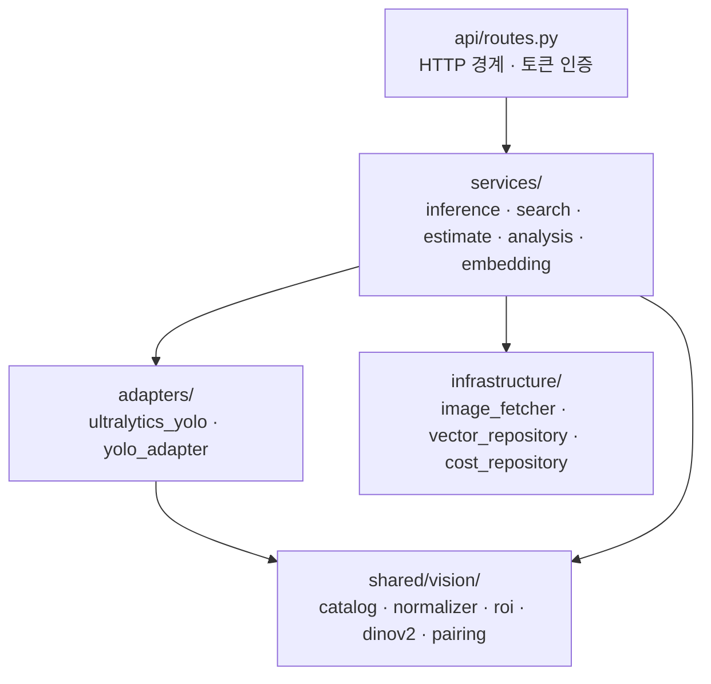

# AI 서버 구조

## 목적

`AI/server/` FastAPI 애플리케이션의 계층 구성과 경계를 정리한다.

## 현재 구현

### 디렉터리

```
AI/
├─ models/
│  ├─ base/yolo26n-seg.pt          학습 시작 가중치 (6.7MB)
│  ├─ damage/damage_best-60ep.pt   손상 세그멘테이션 (23.3MB)
│  └─ part/damage_part_best-35ep.pt 부품 (23.4MB)
├─ training/
│  ├─ prepare_dataset.py           AI-Hub → YOLO 데이터셋 변환
│  └─ train.py                     학습
├─ tools/
│  ├─ export_yolo_json.py
│  └─ infer_visual.py              추론 결과 시각화
├─ requirements.txt
└─ server/
   ├─ Dockerfile
   ├─ requirements.txt
   ├─ README.md
   ├─ app/
   │  ├─ main.py                   FastAPI 앱
   │  ├─ api/routes.py             엔드포인트 5개
   │  ├─ core/
   │  │  ├─ bootstrap.py           저장소 루트를 sys.path 에 추가
   │  │  ├─ config.py              환경변수 → Settings
   │  │  └─ security.py            X-Internal-Token 검증
   │  ├─ schemas/contracts.py      요청·응답 DTO (pydantic)
   │  ├─ services/                 오케스트레이션 6개
   │  ├─ adapters/                 YOLO 실행·결과 변환
   │  └─ infrastructure/           이미지·DB·벡터 게이트웨이
   └─ tests/                       9개 테스트 파일
```

### 계층

`AI/server/README.md` 가 원칙을 적었다 — "FastAPI는 외부 HTTP 경계만 맡고, YOLO 호출·검색·견적은
`app/services/`의 일반 함수로 연결한다."



### 서비스 6개

| 서비스 | 책임 |
| --- | --- |
| `inference_service` | 이미지 다운로드 → YOLO 2모델 → 표준화 결과 |
| `embedding_service` | detection → ROI → DINOv2 768차원 벡터 |
| `search_service` | 벡터로 pgvector 검색, `STRICT`/`VECTOR_ONLY` 분기 |
| `estimate_service` | 검색 결과 → 비용 분포 → 견적 |
| `estimate_config` | 최소 사례 수 등 산정 상수 |
| `analysis_service` | 위 넷을 이어 실행하고 콜백 1회 |

### 인프라 3개

| 모듈 | 책임 |
| --- | --- |
| `image_fetcher` | presigned GET URL로 이미지 다운로드 |
| `vector_repository` | pgvector 검색 (`MODEL` → `PRICE_TIER` → `ALL` 완화) |
| `cost_repository` | `repair_case` · `repair_case_item` 비용 조회 |

### 어댑터 2개

| 모듈 | 책임 |
| --- | --- |
| `ultralytics_yolo` | Ultralytics 결과 → 모델 개발자 raw JSON 계약 |
| `yolo_adapter` | raw JSON → 검증 → 부품·손상 매칭 → 표준 스키마 |

**계약이 2단계로 나뉜 것이 요점이다.** `ultralytics_yolo` 는 라이브러리 형식만 바꾸고 도메인
코드를 모른다. `yolo_adapter` 가 버전별 클래스 맵·라벨 검증·기하 매칭을 맡는다.
`yolo_adapter.py` 모듈 docstring이 이를 명시한다 — "The model contract deliberately contains
no domain codes."

### `bootstrap.py` 가 있는 이유

AI 서버가 `shared.vision` 을 import 하려면 저장소 루트가 `sys.path` 에 있어야 한다.
`bootstrap.py` 가 `parents[4]` 로 루트를 찾아 넣는다.

이 때문에 Docker 이미지도 **디렉터리 구조를 그대로 유지**해야 한다.
`AI/server/Dockerfile` 주석:

> 컨테이너 안에서도 `<루트>/AI/server/app/...` 과 `<루트>/shared/...` 구조를 유지해야 한다.
> 평평하게 복사하면 둘 다 깨진다.

### 설정 (`core/config.py`)

`Settings` 는 frozen dataclass이고 모두 환경변수에서 읽는다.

| 필드 | 환경변수 | 기본값 |
| --- | --- | --- |
| `internal_token` | `AI_INTERNAL_TOKEN` | `""` |
| `pipeline_version_id` | `FEATURE_PIPELINE_VERSION_ID` | `0` |
| `analysis_profile` | `ANALYSIS_PROFILE` | `production` |
| `inference_concurrency` | `MAX_INFERENCE_CONCURRENCY` | `1` |
| `model_imgsz` | `YOLO_IMAGE_SIZE` | `960` |
| `part_weights` | `PART_MODEL_WEIGHTS` | `AI/models/part/damage_part_best-35ep.pt` |
| `damage_weights` | `DAMAGE_MODEL_WEIGHTS` | `AI/models/damage/damage_best-60ep.pt` |
| `part_model_version` | `PART_MODEL_VERSION` | `35ep` |
| `damage_model_version` | `DAMAGE_MODEL_VERSION` | `60ep` |
| `database_url` | `DATABASE_URL` | `""` |
| `embedding_model_name` | `EMBEDDING_MODEL_NAME` | `facebook/dinov2-base` |
| `embedding_model_revision` | `EMBEDDING_MODEL_REVISION` | `f9e44c81…` |
| `embedding_model_version` | `EMBEDDING_MODEL_VERSION` | `f9e44c8-pooler-pad20-lb224gray` |
| `search_top_k` | `SEARCH_TOP_K` | `20` |

파일 첫 줄이 정책을 적었다 — "secrets never live in the repository."

`has_required_runtime_config` 는 `internal_token` 이 있고 `pipeline_version_id > 0` 일 때만 참이다.

### 엔드포인트 5개

| 메서드 | 경로 | 인증 | 용도 |
| --- | --- | --- | --- |
| GET | `/health` | 없음 | 설정·모델 준비 상태 |
| POST | `/inference` | `X-Internal-Token` | YOLO 2모델 → 표준화 결과 |
| POST | `/search` | `X-Internal-Token` | ROI 임베딩 + pgvector Top-K |
| POST | `/estimate` | `X-Internal-Token` | 비용 산정 |
| POST | `/analyze` | `X-Internal-Token` | 오케스트레이션 + 콜백 1회 |

운영은 `/analyze` 만 노출한다. 나머지 셋은 개발 프로필·내부망 전용이다
(`Docs/AI/AI 서버 API 명세.md` 제약 6번).

### `/health` 응답

```json
{
  "status": "ok",
  "modelsLoaded": false,
  "embeddingModelLoaded": false,
  "dbReachable": true,
  "configured": true,
  "analysisProfile": "production",
  "embeddingConfigured": true,
  "partWeightsPresent": true,
  "damageWeightsPresent": true
}
```

**`modelsLoaded: false` 가 정상이다.** YOLO·DINOv2는 지연 로드라 첫 추론 때 올라온다.
`.gitlab-ci.yml` 주석이 이를 명시하고, 기동 판정에 `status` 와 `configured` 를 쓴다.

### 동시성

`MAX_INFERENCE_CONCURRENCY` 기본값이 `1` 이다. uvicorn 워커도 1개다.

`AI/server/Dockerfile` 주석:

> 워커를 늘리지 않는 이유 — 모델이 프로세스마다 메모리에 올라가고
> `MAX_INFERENCE_CONCURRENCY` 기본값이 1 이다.

동기 작업(`model.predict`, `cost_repository.calculate`)은 `asyncio.to_thread` 로 빼
이벤트 루프를 막지 않는다.

## 동작 흐름

[추론 파이프라인](추론_파이프라인.md) 참고.

## 주요 구성 요소

위 표 참고.

## 설정 및 실행 방법

```powershell
pip install -r AI/requirements.txt -r AI/server/requirements.txt
$env:AI_INTERNAL_TOKEN = "<백엔드와 합의한 내부 토큰>"
$env:FEATURE_PIPELINE_VERSION_ID = "<활성 feature_pipeline_version ID>"
$env:DATABASE_URL = "postgresql://<읽기전용 계정>:<password>@<host>:5432/<db>"
uvicorn app.main:app --app-dir AI/server --host 0.0.0.0 --port 8000 --reload
```

컨테이너는 `--reload` 를 쓰지 않는다.

## 오류 및 예외 처리

| 상황 | 응답 |
| --- | --- |
| 토큰 불일치 | `401` |
| `pipeline_version_id <= 0` | `503 PIPELINE_NOT_CONFIGURED` |
| 이미지 다운로드 실패 | `404 IMAGE_FETCH_FAILED` |
| 모델 실행 실패 | `500 MODEL_ERROR` |
| 모델 출력 형식 오류 | `422 INVALID_MODEL_OUTPUT` |
| `DATABASE_URL` 없음/조회 실패 | `503 COST_DATA_UNAVAILABLE` |
| 검색·견적 미주입 | `501 ANALYSIS_ORCHESTRATOR_NOT_IMPLEMENTED` |

## 관련 소스코드

- `AI/server/app/api/routes.py`
- `AI/server/app/core/config.py`
- `AI/server/app/core/bootstrap.py`
- `AI/server/README.md`
- `AI/server/Dockerfile`

## 근거 자료

- 소스 직접 확인
- `AI/server/README.md`
- 이 조사에서 직접 조회한 운영 `/health` 응답

## 확인 필요 항목

- **`app/main.py` 의 앱 조립 방식** — 의존성 주입 구조를 전수 확인하지 못함
- **`AI/tools/` 두 스크립트의 사용 빈도** — 개발 보조 도구로 추정
- **`MAX_INFERENCE_CONCURRENCY` 운영 값** — 기본 1이나 운영 env 값을 저장소에서 확인할 수 없음
