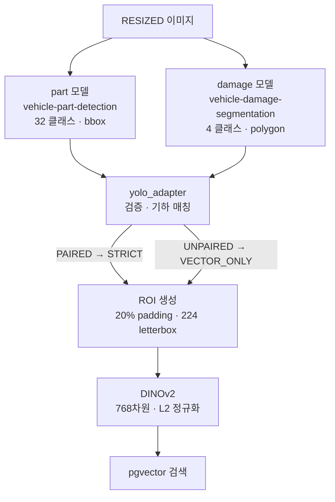

# 모델 구성

## 목적

사용하는 모델 3종의 역할·클래스·파일을 정리하고, 확인된 불일치를 기록한다.

## 현재 구현

### 모델 파일

| 파일 | 크기 | 역할 |
| --- | --- | --- |
| `AI/models/base/yolo26n-seg.pt` | 6,719,965 B | 학습 시작 가중치 |
| `AI/models/damage/damage_best-60ep.pt` | 23,350,934 B | 손상 세그멘테이션 |
| `AI/models/part/damage_part_best-35ep.pt` | 23,412,694 B | 부품 |
| (Docker 이미지 내장) | — | `facebook/dinov2-base` 임베딩 |

가중치가 **Git에 직접 추적된다**. `.gitignore` 에 `*.pt` 제외 규칙이 없다.

### 1. 부품 모델

| 항목 | 값 |
| --- | --- |
| API 이름 | `vehicle-part-detection` |
| API task | `detect` |
| 버전 | `35ep` (`PART_MODEL_VERSION`) |
| 클래스 | 32종 |

클래스 32종은 `shared/vision/catalog.py` 의 `PARTS` 와 **정확히 일치한다**
(이 조사에서 가중치를 직접 로드해 `model.names` 를 대조했다).

```
A pillar(L/R) · C pillar(L/R) · Bonnet · Roof · Trunk lid · Undercarriage
Windshield · Rear windshield
Front/Rear bumper
Front/Rear door(L/R) · Front/Rear fender(L/R) · Front/Rear Wheel(L/R)
Head lights(L/R) · Rear lamp(L/R) · Rocker panel(L/R) · Side mirror(L/R)
```

좌우를 구분한다(`(L)` · `(R)`). B pillar는 없다.

### 🔴 부품 모델의 task 불일치

**확인된 사실**: `damage_part_best-35ep.pt` 를 직접 로드하면 `task=segment` 다.
그런데 서버는 이 모델을 `api_task="detect"` 로 선언한다.

```python
# AI/server/app/services/inference_service.py
self._part = ModelSpec("part", "vehicle-part-detection", settings.part_model_version,
                       "detect", settings.part_weights)
```

`AI/server/README.md` 가 이를 알고 있고 임시 조치라고 적었다.

> `damage_part_best-35ep.pt`는 현재 **segmentation** 가중치다. 서버 adapter는 bbox만 읽어
> API에는 `detect` 결과로 내보내지만, **운영 전에는 명세대로 학습한 part detection 가중치로
> 교체해야 한다.** 이 호환 처리는 모델의 출력 계약을 바꾸는 것이 아니라 기존 가중치를
> 로컬 smoke test에만 사용할 수 있게 하는 임시 경계다.

`ultralytics_yolo.py` 가 `spec.api_task == "segment"` 일 때만 마스크를 읽으므로, 부품은
바운딩 박스만 쓰고 세그멘테이션은 버린다. `yolo_adapter._validate_prediction` 은
`task == "detect"` 이면 `segmentation` 이 `null` 이어야 한다고 검증한다.

**저장소에 교체용 detection 가중치가 없다.** 이 위험은
[모델 성능과 한계](모델_성능과_한계.md)에 다시 정리했다.

### 2. 손상 모델

| 항목 | 값 |
| --- | --- |
| API 이름 | `vehicle-damage-segmentation` |
| API task | `segment` |
| 버전 | `60ep` (`DAMAGE_MODEL_VERSION`) |
| 클래스 | 4종 |

클래스 4종도 `shared/vision/catalog.py` 의 `DAMAGES` 와 일치한다.

| 원본 라벨 | 표준 코드 |
| --- | --- |
| `Breakage` | `BREAKAGE` |
| `Crushed` | `CRUSHED` |
| `Scratched` | `SCRATCHED` |
| `Separated` | `SEPARATED` |

세그멘테이션이라 폴리곤을 낸다. 이 폴리곤이 ROI 생성과 화면 오버레이에 쓰인다.

### 3. 임베딩 모델

| 항목 | 값 |
| --- | --- |
| 모델 | `facebook/dinov2-base` |
| revision | `f9e44c814b77203eaa57a6bdbbd535f21ede1415` |
| 출력 | `pooler_output` 768차원 |
| 버전 문자열 | `f9e44c8-pooler-pad20-lb224gray` |

**revision을 해시로 고정한다.** 태그가 아니라 커밋 해시라 모델이 바뀌지 않는다.
Docker 이미지 빌드 시 가중치를 구워 넣고 런타임에 `HF_HUB_OFFLINE=1` 로 돈다.

버전 문자열이 전처리까지 담고 있다 — `pooler`(출력 종류) · `pad20`(20% 패딩) ·
`lb224`(224px letterbox) · `gray`. 활성 `embedding_model_version` 이 이 값과 맞지 않으면
**검색을 거부한다** (`AI/server/README.md`). 전처리가 다른 벡터끼리 비교하는 사고를 막는 장치다.

### 실행 설정

```python
# AI/server/app/adapters/ultralytics_yolo.py
result = model.predict(source=str(image_path), imgsz=self._image_size,
                       save=False, verbose=False)[0]
```

| 설정 | 값 |
| --- | --- |
| `imgsz` | 960 (`YOLO_IMAGE_SIZE`) |
| `conf` | 미지정 → Ultralytics 기본값 0.25 |
| `device` | 자동 (`torch.cuda.is_available()`), 배포는 CPU |

**신뢰도 임계값을 명시하지 않는다.** Ultralytics 기본 0.25가 적용된다.

### 모델 로딩

지연 로드 + 프로세스 캐시다.

```python
def _model(self, spec: ModelSpec) -> Any:
    if not spec.weights.is_file():
        raise ModelRunError(f"model weights not found: {spec.weights}")
    if spec.weights not in self._models:
        from ultralytics import YOLO
        self._models[spec.weights] = YOLO(str(spec.weights))
    return self._models[spec.weights]
```

`ultralytics` import도 함수 안에 있다 — 모듈 로드 시점에 무거운 의존성을 끌어오지 않는다.

## 동작 흐름



## 주요 구성 요소

- `AI/server/app/services/inference_service.py` — `ModelSpec` 선언
- `AI/server/app/adapters/ultralytics_yolo.py` — 실행
- `AI/server/app/adapters/yolo_adapter.py` — 검증·매칭
- `shared/vision/catalog.py` — 클래스 표준 코드
- `shared/vision/dinov2.py` — 임베딩

## 설정 및 실행 방법

가중치 경로는 기본값을 쓰거나 `PART_MODEL_WEIGHTS` · `DAMAGE_MODEL_WEIGHTS` 로 바꾼다.
`/health` 의 `partWeightsPresent` · `damageWeightsPresent` 로 파일 존재를 확인할 수 있다.

## 오류 및 예외 처리

| 상황 | 예외 |
| --- | --- |
| 가중치 파일 없음 | `ModelRunError: model weights not found` |
| ultralytics 미설치 | `ModelRunError: ultralytics is not installed` |
| 추론 중 예외 | `ModelRunError: {key} model execution failed` |
| segment 모델이 마스크 없이 박스만 반환 | `ModelRunError: damage segmentation model returned boxes without masks` |
| 알 수 없는 클래스명 | `NormalizationError: unknown {kind} class_name` |
| 클래스 맵 불일치 | `NormalizationError: class map mismatch` |

## 관련 소스코드

- `AI/server/app/services/inference_service.py:22~25`
- `AI/server/app/adapters/ultralytics_yolo.py:42~80`
- `AI/server/app/adapters/yolo_adapter.py:28~29` — `PART_RAW_TO_CODE` · `DAMAGE_RAW_TO_CODE`
- `AI/server/README.md:41~44` — task 불일치 경고

## 근거 자료

- 가중치 파일을 직접 로드해 `model.names` · `model.task` 확인 (이 조사에서 수행)
- `shared/vision/catalog.py` 의 `PARTS` · `DAMAGES` 대조
- `AI/server/README.md`

## 확인 필요 항목

- **교체용 part detection 가중치** — 저장소에 없음. 언제 교체할지 확인하지 못함
- **각 모델의 학습 성능 지표** — mAP 등 측정값을 저장소에서 확인하지 못함
- **`yolo26n-seg.pt` 의 출처** — Ultralytics 공식 사전학습 가중치로 추정
- **`gray` 전처리** — 버전 문자열에 있으나 `dinov2.py` 에서 그레이스케일 변환을 확인하지 못함
