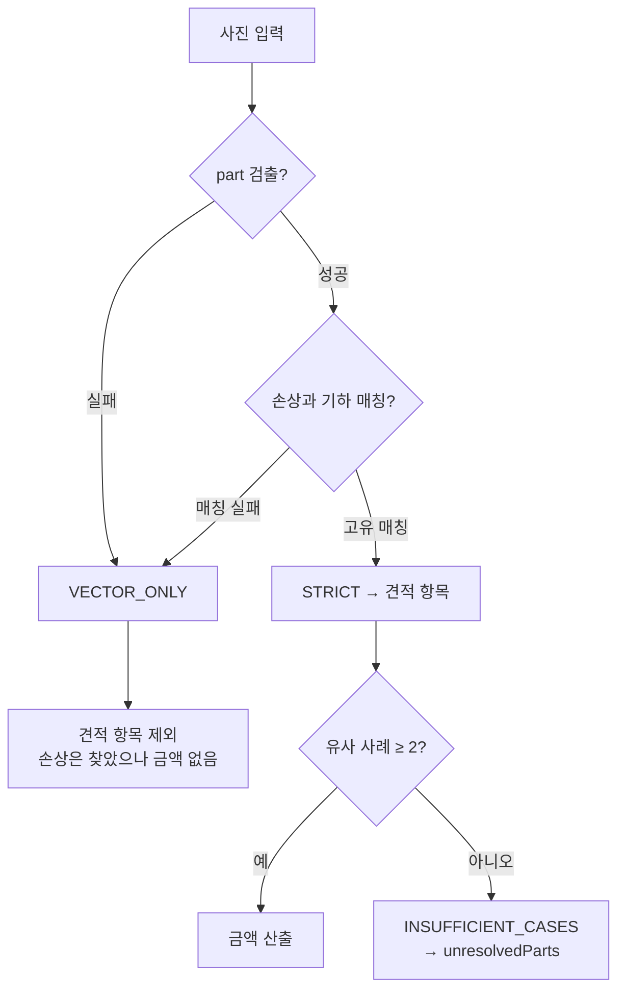

# 모델 성능과 한계

## 목적

확인된 성능 지표와 **알려진 한계**를 사실대로 기록한다.
근거 없는 수치는 적지 않는다.

## 현재 구현

### 성능 지표 — 확인하지 못함

저장소에 mAP·precision·recall 같은 **모델 성능 지표가 없다.**

| 찾아본 곳 | 결과 |
| --- | --- |
| `AI/artifacts/training/` | 디렉터리 없음 (`.gitignore` 대상으로 추정) |
| `AI/` 하위 결과 파일 | 없음 |
| `Docs/AI/` | 평가 결과 문서를 확인하지 못함 |
| 커밋 메시지 | 성능 수치 언급 없음 |

`train.py` 가 `plots=True` 로 학습 그래프를 남기고 `model.val()` 을 돌리지만, 산출물이
저장소에 없다.

**따라서 이 문서에 정확도 수치를 적지 않는다.**

### 🔴 한계 1 — 부품 모델이 detection 가중치가 아니다

가장 큰 위험이다. `AI/server/README.md` 가 명시한다.

> `damage_part_best-35ep.pt`는 현재 **segmentation** 가중치다. 서버 adapter는 bbox만 읽어
> API에는 `detect` 결과로 내보내지만, **운영 전에는 명세대로 학습한 part detection 가중치로
> 교체해야 한다.**

이 조사에서 가중치를 직접 로드해 `task=segment` 를 확인했다. **저장소에 교체용 detection
가중치가 없다.**

영향: 부품 인식 정확도가 명세가 상정한 수준인지 검증되지 않았다.
부품을 못 붙이면 검출은 `VECTOR_ONLY` 가 되고, `VECTOR_ONLY` 는 견적 항목이 되지 못한다.

### 🔴 한계 2 — 부품이 불확실하면 견적에서 빠진다

설계된 동작이지 결함이 아니지만, 결과적 한계다.

`Docs/AI/이미지 입력 및 검색 corpus 결정사항.md`:

> 검증되지 않은 행은 `partCode = null`로 남기고 `VECTOR_ONLY`로 처리한다.
> **부품을 틀리게 부여하는 것보다 null이 견적 안전성 측면에서 낫다.**

> 견적 항목은 `searchability: STRICT`인 결과만 사용한다.

**안전을 위해 정확도를 포기한 선택이다.** 손상은 찾았는데 부품을 못 붙이면 그 손상은 금액에
반영되지 않는다.

### 🔴 한계 3 — 데모 입력이 제한적이다

같은 문서:

> 데모 입력은 `damage` 스타일(손상 부위 중심의 가까운 사진)로 사용한다.
> 다만 **임의의 모든 부품을 지원한다고 설명하지 않고**, 현재 모델 결과가 안정적인 부품
> (우선 범퍼)과 `STRICT` 결과가 나오는 사례를 중심으로 시연한다.

pairing 비교 결과도 기록돼 있다 — **STRICT 11개, VECTOR_ONLY 6개**.
표본이 작아 일반화할 수 없지만, 약 35%가 부품 미확정이었다는 뜻이다.

### 한계 4 — 손상 유형이 4종뿐이다

`Scratched` · `Separated` · `Crushed` · `Breakage`.

실제 사고 손상은 이보다 다양하다(찌그러짐 정도, 도장 벗겨짐, 유리 파손 등).
4종으로 뭉뚱그리면 같은 유형 안에서 수리비 편차가 크다.

### 한계 5 — 수리 방식을 단정할 수 없다

`Docs/AI/이미지 입력 및 검색 corpus 결정사항.md`:

> `Scratched`는 `coating`으로 비교적 확정 가능하지만, `Separated`, `Crushed`, `Breakage`는
> `repair/exchange` 또는 `sheet_metal/exchange`처럼 후보가 여러 개일 수 있다.
> **손상 유형만으로 수리 방식을 단정하지 않고**, 현재 계약의 후보/미확정 정책을 따른다.

그래서 `estimate_item.ref_condition.repairMethodReason` 에 후보와 사유 코드를 남긴다.

### 한계 6 — 부품 정답 라벨이 불완전하다

같은 문서:

> 한 annotation의 `repair` 배열에 여러 부품이 함께 들어가는 경우가 많다. 따라서 `repair`를
> 해당 damage bbox의 부품 정답으로 그대로 복사하면 안 된다.
> `repair`는 image/사고 단위의 부품 후보 또는 수리 후보로 취급한다.

원천 데이터셋 라벨이 손상 단위가 아니라 사고 단위라, 손상↔부품 정답 쌍을 직접 만들 수 없다.
그래서 기하 매칭으로 추정한다.

### 한계 7 — GPU가 없다

배포 인스턴스에 GPU가 없어 CPU로 돈다 (`AI/server/Dockerfile` 주석).
정확도는 같고 **지연만 늘어난다.**

`MAX_INFERENCE_CONCURRENCY=1`, uvicorn 워커 1개라 **동시 분석이 직렬화**된다.
모델이 프로세스마다 메모리에 올라가서 워커를 늘릴 수 없다.

### 한계 8 — 첫 요청이 느리다

YOLO·DINOv2가 지연 로드다. `/health` 의 `modelsLoaded` 가 재기동 직후 `false` 인 이유다.
컨테이너를 재생성하면 첫 사용자가 모델 로딩 시간을 부담한다.

### 성능 관련 확인된 사실

수치로 확인된 것은 corpus 규모뿐이다 (2026-09-21 운영 DB 직접 조회).

| 항목 | 건수 |
| --- | --: |
| `repair_case` | 93,964 |
| `repair_case_image` | 337,966 |
| `repair_case_damage_feature` (v1) | 205,977 |
| `repair_case_damage_feature` (v2) | 851,516 |
| `repair_case_roi_embedding` | 720,668 |
| v2 검색 가능 임베딩 | 711,073 |
| `model_id` 가 채워진 사례 | 80,919 / 93,964 (86.1%) |

`Docs/Architecture/분석 응답 시간 측정 (S15P21A307-159).md` 가 응답 시간 측정을 다루지만,
**이 조사에서 그 수치를 문서로 확인하지 못했다.**

## 동작 흐름 (한계가 드러나는 지점)

## 주요 구성 요소

- `AI/server/README.md:41~44` — 가중치 교체 필요 경고
- `Docs/AI/이미지 입력 및 검색 corpus 결정사항.md` — 정책·한계
- `AI/server/app/services/estimate_config.py` — `MIN_CASE_COUNT`

## 설정 및 실행 방법

성능 개선 여지로 확인되는 것들이다.

| 항목 | 현재 | 개선 방향 |
| --- | --- | --- |
| part 가중치 | segmentation 전용 | detection 모델로 교체 |
| 추론 장치 | CPU | GPU 인스턴스 |
| 동시성 | 1 | GPU + 워커 증설 |
| 손상 클래스 | 4종 | 세분화 |

## 오류 및 예외 처리

한계로 인한 결과는 오류가 아니라 **정상 응답**으로 나간다.

| 상황 | 응답 |
| --- | --- |
| 부품 미확정 | `partCode: null`, 견적 항목 제외 |
| 사례 부족 | `unresolvedParts` 에 `INSUFFICIENT_CASES` |
| 손상 미검출 | `nonEstimableReason: NO_DAMAGE_DETECTED` |

## 관련 소스코드

- `AI/server/README.md`
- `Docs/AI/이미지 입력 및 검색 corpus 결정사항.md`
- `AI/server/app/services/estimate_config.py`
- `shared/vision/damage_part_pairing.py`

## 근거 자료

- 가중치 직접 로드 확인 (`task=segment`)
- 결정사항 문서의 pairing 비교(STRICT 11 / VECTOR_ONLY 6)
- 운영 DB 직접 조회 (corpus 건수)

## 확인 필요 항목

- **mAP·precision·recall 등 모델 성능 지표** — 현재 작업공간에서 근거를 확인하지 못함
- **실제 견적 정확도** — 실제 수리비와 비교한 평가 결과를 확인하지 못함
- **분석 응답 시간 실측값** — `Docs/Architecture/분석 응답 시간 측정 (S15P21A307-159).md` 가 있으나 내용을 확인하지 못함
- **STRICT 비율의 대표성** — 표본 17건이라 일반화 불가
- **CPU 추론 지연 실측** — 확인하지 못함
