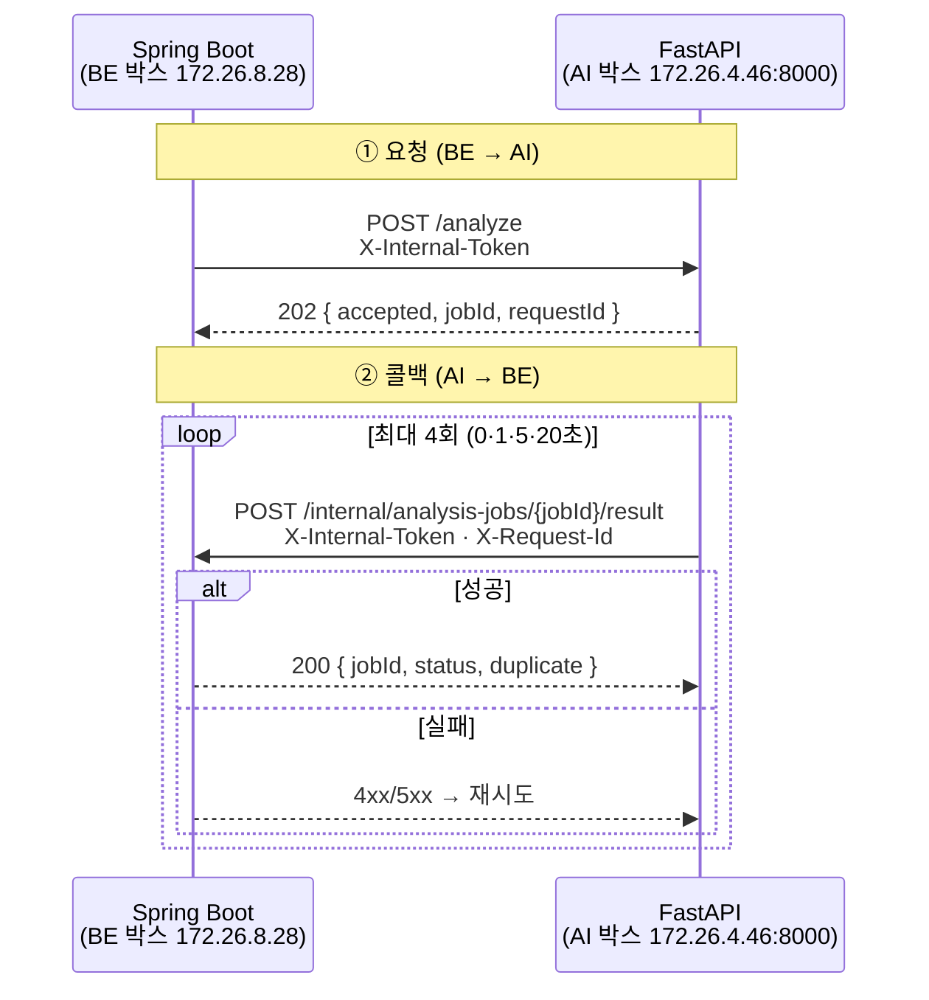

# 백엔드 ↔ AI 서버 통신

## 목적

두 서버 사이의 계약·인증·재시도·멱등성 규칙을 정리한다.

## 현재 구현

### 통신 2방향



**양방향 모두 `X-Internal-Token` 을 쓴다.** 백엔드는 `AiAnalysisClient.TOKEN_HEADER`,
AI 서버는 `AnalysisCallbackController.TOKEN_HEADER` — 같은 헤더 이름, 같은 공유 비밀이다.

값은 각각 `AI_INTERNAL_TOKEN` (AI) / `INTERNAL_API_TOKEN` (BE) 환경변수로 주입된다.
[보안 정보 제외].

### ① 분석 요청 — `POST /analyze`

```java
// backend/.../analysis/request/AnalysisRequestPayload.java
public record AnalysisRequestPayload(
        Long jobId, String requestId, Vehicle vehicle,
        List<Image> images, String callbackUrl) {
    public static final ImageVariant ANALYSIS_VARIANT = ImageVariant.RESIZED;
    public record Vehicle(Long modelId, String manufacturer, String modelName,
                          String carClass, Integer modelYear) { ... }
}
```

| 필드 | 내용 |
| --- | --- |
| `jobId` | `analysis_job.job_id` |
| `requestId` | 멱등 키. 재분석하면 새로 발급 |
| `vehicle.modelId` | `vehicle_model.model_id` — `MODEL` 검색 단계 입력 |
| `vehicle.carClass` | `Compact` 처럼 **데이터셋 표기 그대로**. 열거형 이름이 아니다 |
| `images[].url` | RESIZED 변형의 presigned GET URL |
| `callbackUrl` | 결과를 보낼 주소 |

`Vehicle.from(Accident)` 가 `snapshot*` 필드만 읽는다 — 분석 당시 차량 정보를 고정한다.

`carClass` 주석이 중요하다 — 데이터셋 표기를 그대로 쓴다. 코드 안에서 enum으로 바꾸면
corpus의 값과 어긋나 검색이 0건이 된다.

응답은 `202` 접수다. **결과가 아니다.**

```json
{ "accepted": true, "jobId": 12, "requestId": "req-12" }
```

### ② 결과 콜백 — `POST /internal/analysis-jobs/{jobId}/result`

성공 본문의 주요 필드다.

| 필드 | 내용 |
| --- | --- |
| `requestId` · `jobId` | 멱등·대조용 |
| `modelVersion` | `part-35ep/damage-60ep` 형식. 최대 50자 |
| `pipelineVersionId` | 사용한 feature pipeline 버전 |
| `estimable` | 산정 가능 여부 |
| `nonEstimableReason` | `PART_NOT_RESOLVED` · `NO_DAMAGE_DETECTED` · `INSUFFICIENT_CASES` |
| `confidenceGrade` | `HIGH` · `MEDIUM` · `LOW` · `null` |
| `totals` | `{ min, median, max }` |
| `refCaseTotal` · `refYearFrom` · `refYearTo` | 참조 사례 수·연도 범위 |
| `items[]` | 견적 항목 |
| `unresolvedParts[]` | 산정 못한 부위 |
| `imageResults[]` | 이미지별 제외 여부·detection |
| `error` | 실패일 때만. 성공이면 `null` |

실패 본문은 `error` 에 코드가 들어간다.

```json
{ "error": { "code": "MODEL_ERROR", "message": "모델 실행 실패", "retryable": true } }
```

**`error.code` 는 4종뿐이다.**

| 코드 | `retryable` | 발생 |
| --- | --- | --- |
| `IMAGE_FETCH_FAILED` | `true` | presigned URL 다운로드 실패 |
| `MODEL_ERROR` | `true` | YOLO 실행 실패 |
| `INVALID_MODEL_OUTPUT` | `false` | 출력 형식 오류·ROI 임베딩 실패 |
| `INTERNAL` | `true` | 검색·비용 조회 실패 |

검색·비용 실패가 `INTERNAL` 로 뭉뚱그려지는 것은 계약이 4종만 허용하기 때문이다.

### 멱등성 — 3단계 검증

AI가 최대 4회 보내므로 백엔드가 중복을 막아야 한다.
`AnalysisCallbackService.receive()` 가 순서대로 본다.

| 순서 | 검사 | 실패 시 |
| --- | --- | --- |
| 1 | 헤더 `X-Request-Id` == 본문 `requestId` | `400 INVALID_REQUEST` |
| 2 | 경로 `jobId` == 본문 `jobId` | `400 INVALID_REQUEST` |
| 3 | 작업 존재 | `404 NOT_FOUND` |
| 4 | 저장된 `requestId` 와 일치 | `409 CONFLICT` |
| 5 | 이미 끝난 작업 | `200 duplicate=true`, 저장 생략 |

1번이 필요한 이유가 주석에 있다 — "헤더와 본문이 다르면 어느 쪽을 멱등 키로 쓸지 알 수 없다.
하나를 골라 진행하면 다음 재시도에서 다른 쪽이 키가 되어 중복 방지가 무너진다."

4번은 **철 지난 콜백 차단**이다 — 재분석으로 새 `requestId` 가 발급된 뒤 이전 시도의 콜백이
늦게 도착하는 경우다. "철 지난 결과로 최신 견적을 덮지 않는다."

`stored` 가 `null` 이면 받아들인다. 분석 요청 경로가 아직 없던 시기의 호환 처리이며,
주석이 "156 이 붙으면 이 분기는 자연히 닫힌다" 고 적었다.

### 재시도 간격

```python
# AI/server/app/services/analysis_service.py
CALLBACK_RETRY_DELAYS = (0, 1, 5, 20)
```

최초 즉시 + 1초 + 5초 + 20초 = 최대 4회, 총 26초 안에 끝난다.

### 네트워크 경계

| 항목 | 값 |
| --- | --- |
| BE → AI | `AI_SERVER_URL` (AI 박스 사설 IP:8000) |
| AI → BE | `ANALYSIS_CALLBACK_BASE_URL` (BE 박스 사설 IP:8080) |

`.gitlab-ci.yml` 주석이 이유를 적었다 — "8080 을 127.0.0.1 에만 묶으면 AI 박스에서 닿지 못한다."
그래서 백엔드 컨테이너가 `-p 127.0.0.1:8080:8080` 과 `-p 172.26.8.28:8080:8080` 둘 다 연다.

AI 컨테이너는 `-p 172.26.4.46:8000:8000` 으로 **사설 IP에만** 연다. 공인 인터페이스에
8000을 열지 않는다.

`AnalysisCallbackController` javadoc이 방어 2겹을 명시한다 — "`X-Internal-Token` 공유 비밀과
**네트워크 차단**(사설 IP) 두 겹으로 막는다."

### 경로 이름이 비슷한 두 API

javadoc이 혼동을 경고한다.

| 경로 | 용도 |
| --- | --- |
| `POST /internal/analysis-jobs/{jobId}/result` | AI → BE 콜백 (내부) |
| `GET /api/analysis-jobs/{jobId}/result` | 사용자 조회 (공개) |

접두사(`/internal` vs `/api`)와 메서드로 구분된다. `SecurityConfig` 가 `/internal/**` 을
`denyAll()` 하되 콜백 하나만 `permitAll()` 로 여는 구조와 맞물린다.

## 주요 구성 요소

| 구성 요소 | 파일 |
| --- | --- |
| 요청 페이로드 | `backend/.../analysis/request/AnalysisRequestPayload.java` |
| 요청 클라이언트 | `backend/.../analysis/request/AiAnalysisClient.java` |
| 요청 워커 | `backend/.../analysis/request/AnalysisRequestWorker.java` |
| 콜백 수신 | `backend/.../analysis/callback/AnalysisCallbackController.java` |
| 콜백 처리 | `backend/.../analysis/callback/AnalysisCallbackService.java` |
| 콜백 DTO | `backend/.../analysis/callback/AnalysisCallbackRequest.java` |
| AI 오케스트레이션 | `AI/server/app/services/analysis_service.py` |

## 설정 및 실행 방법

| 변수 | 위치 |
| --- | --- |
| `AI_SERVER_URL` | 백엔드 env |
| `ANALYSIS_CALLBACK_BASE_URL` | 백엔드 env |
| `INTERNAL_API_TOKEN` | 백엔드 env |
| `AI_INTERNAL_TOKEN` | AI 서버 env |

두 토큰 값이 같아야 한다. [보안 정보 제외]

## 오류 및 예외 처리

위 오류 코드 표와 멱등성 표 참고. 백엔드가 판정하는 실패는
[주요 도메인](../03_백엔드/주요_도메인.md)의 `failure_reason` 표에 있다.

## 관련 소스코드

- `Docs/Api/AI 연동 계약 (백엔드 ↔ AI 서버).md` — 계약 정본
- `Docs/Api/AI 서버 오류·재시도 처리 명세.md` — 중복 방지 정본
- 위 주요 구성 요소 표의 파일들

## 근거 자료

- 소스 javadoc·주석
- `Docs/Api/` 계약 문서 2건
- `.gitlab-ci.yml` 네트워크 설정

## 확인 필요 항목

- **`ANALYSIS_CALLBACK_BASE_URL` 운영 값** — 환경변수라 저장소에서 확인할 수 없음
- **콜백 4회 실패 후 AI 서버 동작** — 로그만 남기는지 확인하지 못함
- **백엔드 → AI 요청 타임아웃** — `AiAnalysisClient` 설정을 확인하지 못함
- **`modelVersion` 50자 초과 시 처리** — 잘라내는지 거부하는지 확인하지 못함
