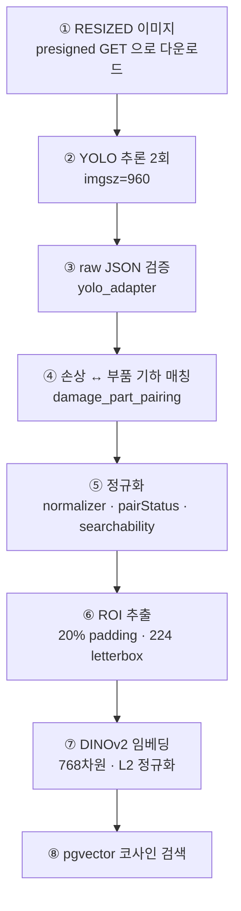
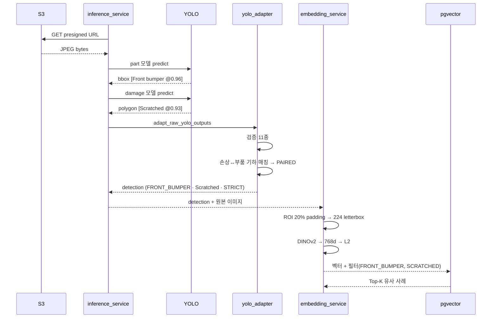

# 이미지 분석 과정

## 목적

사진 한 장이 검색 가능한 벡터가 되기까지의 변환을 단계별로 정리한다.
[추론 파이프라인](추론_파이프라인.md)이 전체 흐름이라면, 이 문서는 이미지 한 장의 내부 변환이다.

## 현재 구현

### 변환 단계



### ① 이미지 입력

| 항목 | 값 |
| --- | --- |
| 변형 | `RESIZED` (`AnalysisRequestPayload.ANALYSIS_VARIANT`) |
| 경로 | presigned GET URL |
| 저장 | 임시 디렉터리, 처리 후 삭제 |

**원본이 아니라 리사이즈본을 쓴다.** 긴 변 기준 축소 + EXIF 제거된 버전이다
(`ImageVariant.java`). 원본을 그대로 쓰면 다운로드가 느리고 EXIF에 위치 정보가 남는다.

### ② YOLO 추론

두 모델을 같은 이미지에 순차로 돌린다.

| 모델 | 출력 |
| --- | --- |
| part (`detect`) | bbox 목록 (32 클래스) |
| damage (`segment`) | bbox + 폴리곤 (4 클래스) |

`ultralytics_yolo.run()` 이 결과를 raw JSON 계약으로 바꾼다.

```json
{
  "model": { "name": "...", "version": "...", "task": "detect|segment" },
  "image": { "image_id": "501", "original_width": 1600, "original_height": 1200 },
  "predictions": [
    { "detection_id": "part-001", "class_id": 0, "class_name": "Front bumper",
      "confidence": 0.96, "bbox": { "format": "xyxy", "coordinates": [0,0,200,200] },
      "segmentation": null }
  ]
}
```

`detection_id` 는 `f"{spec.key}-{index+1:03d}"` 형식이다 (`part-001`, `damage-001`).

`original_width`/`height` 는 `result.orig_shape` 에서 가져온다 — `imgsz=960` 으로 추론해도
좌표는 **원본 크기 기준**으로 돌아온다.

### ③ 검증

[추론 파이프라인](추론_파이프라인.md)의 검증 표 참고. 11가지를 본다.

### ④ 손상 ↔ 부품 매칭

`shared/vision/damage_part_pairing.damage_part_roi_rows` 가 담당한다.
손상 하나마다 같은 이미지의 부품 전체와 대조해 **고유한 매칭**이 있는지 본다.

```python
for damage_annotation in damage_annotations:
    document = {"annotations": [damage_annotation, *part_annotations]}
    rows.append(damage_part_roi_rows(document)[0])
```

중요한 점: **부품이 0개여도 손상은 버리지 않는다.** `part_ref` 가 `None` 이면
`part=None` 으로 남는다.

### ⑤ 정규화

`shared/vision/normalizer.normalize_inference` 가 표준 스키마로 바꾼다.

```python
# shared/vision/normalizer.py:135~175
pair_status = str(raw.get("part_match_status") or ("PAIRED" if part_code else "UNPAIRED"))
if pair_status == "PAIRED" and not part_code: raise NormalizationError(...)
if pair_status != "PAIRED" and part_code: raise NormalizationError(...)
...
"searchability": "STRICT" if pair_status == "PAIRED" else "VECTOR_ONLY"
```

출력 detection 한 건의 모양이다.

| 필드 | 설명 |
| --- | --- |
| `detectionId` | `{imageId}:damage:{damage detection_id}` |
| `partCode` | 표준 부품 코드 또는 `null` |
| `partRawLabel` | 모델 원본 라벨 |
| `damageType` | 손상 영문명 (`Scratched` 등) |
| `damageRawLabel` | 모델 원본 라벨 |
| `pairStatus` | `PAIRED` / `UNPAIRED` |
| `searchability` | `STRICT` / `VECTOR_ONLY` |
| `confidence` | `{ part, damage }` |
| `geometry` | 좌표계·bbox·폴리곤·면적 |

`detectionId` 에 이미지 ID를 접두사로 넣어 여러 장을 섞어도 충돌하지 않게 했다.

### ⑥ ROI 추출

`shared/vision/roi.py` 가 담당한다.

| 규칙 | 값 | 근거 |
| --- | --- | --- |
| 패딩 | 20% (`PAD_RATIO`) | `AI/server/README.md` |
| 출력 크기 | 224px letterbox (`INPUT_SIZE`) | 동일 |
| 최소 변 | `MIN_SIDE` | `roi.py` 상수 |
| 최대 종횡비 | `MAX_ASPECT` | `roi.py` 상수 |

`roi.py` 가 내보내는 상수·함수를 보면 품질 판정도 포함한다.

```
QUALITY_GOOD · QUALITY_INVALID · QUALITY_LOW_CONFIDENCE · QUALITY_PARTIAL_PART
feature_quality · is_closeup · part_clipped · roi_quality
```

`PART_CLIP_RULE_VERSION` · `PART_LINK_RULE_VERSION` · `MASK_RULE_VERSION` ·
`PREPROCESSING_VERSION` 처럼 **규칙마다 버전 상수**가 있다. 규칙이 바뀌면 버전이 올라가고,
corpus와 질의가 같은 버전인지 확인할 수 있다.

letterbox를 쓰는 이유는 **종횡비를 유지**하기 위해서다. 단순 리사이즈하면 긴 스크래치가
찌그러져 다른 모양이 된다.

### ⑦ DINOv2 임베딩

| 단계 | 내용 |
| --- | --- |
| 모델 | `facebook/dinov2-base` revision `f9e44c81…` |
| 출력 | `pooler_output` 768차원 |
| 정규화 | ImageNet mean/std 적용 후 L2 |
| 배치 | 한 이미지의 검색 가능 detection을 한 번에 |

```python
IMAGENET_MEAN = (0.485, 0.456, 0.406)
IMAGENET_STD = (0.229, 0.224, 0.225)
EMBEDDING_DIMENSION = 768
```

L2 정규화하면 코사인 유사도가 내적과 같아져 pgvector `vector_cosine_ops` 검색이 정확해진다.

**질의 벡터는 저장하지 않는다.** `AI/server/README.md` — "업로드 query 벡터는 요청 메모리에서만
사용하고 corpus 벡터만 DB에 저장한다." 사용자 사진의 특징 벡터가 DB에 남지 않는다.

### ⑧ 검색

| `searchability` | 필터 |
| --- | --- |
| `STRICT` | `partCode` + `damageType` + 차량 완화 단계 |
| `VECTOR_ONLY` | `damageType` + 차량 완화 단계 |

차량 완화 단계는 `MODEL` → `PRICE_TIER` → `ALL` 이다.

## 동작 흐름 (한 장의 예)

범퍼 스크래치 사진 한 장을 넣었을 때다.



## 주요 구성 요소

| 구성 요소 | 파일 |
| --- | --- |
| 이미지 다운로드 | `AI/server/app/infrastructure/image_fetcher.py` |
| YOLO 실행 | `AI/server/app/adapters/ultralytics_yolo.py` |
| 검증·매칭 | `AI/server/app/adapters/yolo_adapter.py` |
| 기하 매칭 | `shared/vision/damage_part_pairing.py` |
| 정규화 | `shared/vision/normalizer.py` |
| ROI | `shared/vision/roi.py` |
| 임베딩 | `shared/vision/dinov2.py` |
| 임베딩 서비스 | `AI/server/app/services/embedding_service.py` |

## 설정 및 실행 방법

`YOLO_IMAGE_SIZE` (기본 960)만 조정 가능하다. ROI 규칙은 상수라 코드 수정이 필요하다 —
바꾸면 corpus를 다시 만들어야 한다.

## 오류 및 예외 처리

| 단계 | 실패 | 코드 |
| --- | --- | --- |
| ① | 다운로드 실패 | `IMAGE_FETCH_FAILED` |
| ② | 모델 실행 실패 | `MODEL_ERROR` |
| ③~⑤ | 검증 실패 | `INVALID_MODEL_OUTPUT` |
| ⑥~⑦ | ROI·임베딩 실패 | `INVALID_MODEL_OUTPUT` (`retryable: false`) |
| ⑧ | pgvector 오류 | `INTERNAL` |

## 관련 소스코드

- `shared/vision/roi.py` — ROI·품질 규칙
- `shared/vision/dinov2.py` — 임베딩
- `shared/vision/normalizer.py:135~175` — pairStatus 불변식
- `AI/server/app/adapters/yolo_adapter.py:165~239`

## 근거 자료

- 소스 직접 확인
- `AI/server/README.md` 의 ROI·임베딩 설명

## 확인 필요 항목

- **`roi.py` 의 구체 상수값** — `PAD_RATIO` 등 이름은 확인했으나 일부 수치를 전수 확인하지 못함
- **품질 판정(`QUALITY_*`)이 온라인 추론에 쓰이는지** — corpus 적재 전용인지 확인하지 못함
- **`gray` 전처리** — 임베딩 버전 문자열에 있으나 코드에서 확인하지 못함
- **`is_closeup` 사용처** — 함수는 있으나 호출 지점을 확인하지 못함
