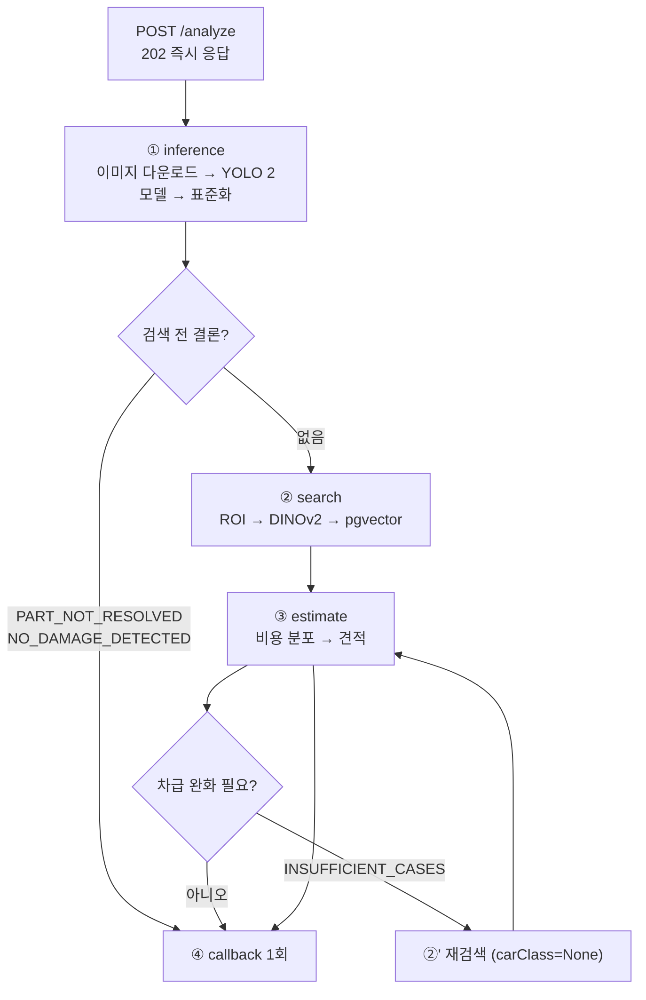

# 추론 파이프라인

## 목적

`POST /analyze` 요청 하나가 AI 서버 안에서 거치는 전 과정을 정리한다.

## 현재 구현

### 4단계 오케스트레이션

`AI/server/app/services/analysis_service.py` 의 `run()` 이 전체를 잇는다.



**어느 단계에서 끊기든 콜백 하나로 끝난다.** `run()` docstring이 이유를 적었다 —
"계약상 중간 통보가 없으므로, 어느 단계에서 끊기든 백엔드가 작업의 끝을 알 수 있도록"이다.

### ① 추론 (`inference_service.infer`)

이미지마다 순차 처리한다.

```python
for image in images:
    image_path = await download_image(image.url, target_dir, image.image_id)
    part_raw, part_map = await asyncio.to_thread(self._runner.run, self._part, image_path, image.image_id)
    damage_raw, damage_map = await asyncio.to_thread(self._runner.run, self._damage, image_path, image.image_id)
    normalized = await asyncio.to_thread(adapt_raw_yolo_outputs, part_raw, damage_raw, ...)
```

- 임시 디렉터리(`tempfile.TemporaryDirectory(prefix="a307-ai-")`)에 받고 끝나면 지운다
- 동기 호출(`model.predict`)은 `asyncio.to_thread` 로 빼 이벤트 루프를 막지 않는다
- 두 모델을 **순차** 실행한다 (병렬 아님)

출력 형식:

```json
{
  "models": { "part": {...}, "damage": {...} },
  "normalization": {
    "schemaVersion": "1.2.0",
    "workRuleVersion": "damage-default-v1",
    "pipelineVersionId": 2
  },
  "imageResults": [ { "imageId": ..., "excluded": ..., "detections": [...] } ]
}
```

### 검증과 매칭 (`yolo_adapter`)

raw 출력을 그대로 믿지 않는다. `_validate_raw` 가 확인하는 것들이다.

| 검사 | 실패 시 |
| --- | --- |
| `model.task` 가 기대값과 같은가 | `NormalizationError` |
| `image_id` 가 백엔드 `imageId` 와 같은가 | `NormalizationError` |
| 원본 크기가 양수인가 | `NormalizationError` |
| part·damage 출력의 이미지 크기가 같은가 | `NormalizationError` |
| `class_id` → `class_name` 맵이 일치하는가 | `NormalizationError` |
| bbox가 이미지 안에 있는가 | `NormalizationError` |
| confidence가 0~1인가 | `NormalizationError` |
| `detect` 는 `segmentation: null` 인가 | `NormalizationError` |
| `segment` 는 폴리곤이 있는가 | `NormalizationError` |
| `detection_id` 가 중복되지 않는가 | `NormalizationError` |
| 클래스명이 카탈로그에 있는가 | `NormalizationError` |

**이미지 ID를 대조하는 것이 특징이다.** 모델이 엉뚱한 이미지 결과를 돌려주는 상황을 잡는다.

매칭은 손상 하나마다 같은 이미지의 부품 전체와 대조한다.

```python
for damage_annotation in damage_annotations:
    document = {"annotations": [damage_annotation, *part_annotations]}
    rows.append(damage_part_roi_rows(document)[0])
```

결과는 두 갈래다.

| `part_match_status` | `pairStatus` | `searchability` | `partCode` |
| --- | --- | --- | --- |
| `PAIRED` | `PAIRED` | `STRICT` | 부품 코드 |
| 그 외 | `UNPAIRED` | `VECTOR_ONLY` | `null` |

`yolo_adapter.adapt_raw_yolo_outputs` docstring이 정책을 명시한다 — "A damage prediction
without a unique same-image part match is intentionally retained with `part=None` and
`searchability=VECTOR_ONLY`." **버리지 않는다.**

`shared/vision/normalizer.py:140~142` 가 불변식을 강제한다 — `PAIRED` 인데 부품 코드가 없거나,
`PAIRED` 가 아닌데 부품 코드가 있으면 예외다.

### 검색 전 조기 종료 (`_pre_search_reason`)

검색·비용 조회는 DB 왕복이므로, 결과가 정해진 경우 건너뛴다.

| 조건 | `nonEstimableReason` |
| --- | --- |
| `imageResults` 가 비었거나 전부 `excluded` | `PART_NOT_RESOLVED` |
| 남은 이미지에 detection이 하나도 없음 | `NO_DAMAGE_DETECTED` |

### ② 검색 (`search_service.search`)

```python
searchable_detections = [d for d in image_result.get("detections", [])
                         if d.get("searchability") != "EXCLUDED"]
vectors = await asyncio.to_thread(self._embedding_service.embed_detections, image, searchable_detections)
```

- 한 이미지의 검색 가능한 detection들을 **한 번의 DINOv2 배치**로 임베딩한다
- `part_code` 는 `searchability == "STRICT"` 일 때만 필터에 넣는다
- 결과를 `strict` (부품별 병합)와 `vectorOnly` 로 나눠 반환한다

완화 단계는 `vector_repository` 가 맡는다 — `MODEL` → `PRICE_TIER` → `ALL`.
`vector_repository.py` 주석이 정책을 적었다 — "A missing tier skips the `PRICE_TIER` stage
rather than guessing one."

### ③ 산정 (`estimate_service.calculate`)

```python
estimate = await asyncio.to_thread(
    self._estimate_service.calculate,
    EstimateRequest(vehicle=request.vehicle, parts=search["parts"]),
)
```

`parts` 만 넘긴다 — `STRICT` 결과만 견적 항목이 된다. `VECTOR_ONLY` 는 제외다.
`Docs/AI/이미지 입력 및 검색 corpus 결정사항.md` 가 근거다 — "`VECTOR_ONLY`는 부품 코드가
확정되지 않은 결과이므로 견적 항목으로 만들지 않는다."

최소 사례 수는 `estimate_config.MIN_CASE_COUNT = 2` 다. 미달이면 `INSUFFICIENT_CASES` 로
`unresolvedParts` 에 들어간다.

### 차급 완화 재검색

```python
if _should_relax_car_class(request, estimate):
    relaxed_vehicle = request.vehicle.model_copy(update={"car_class": None})
    # 재검색 + 재산정
```

조건은 세 가지가 모두 참일 때다 — `car_class` 가 있고, `estimable is False` 이고,
`nonEstimableReason == INSUFFICIENT_CASES`.

주석이 범위를 한정한다 — "차급 필터가 검색 결과를 만들었더라도, 비용 정책을 통과한 사례가
최소 표본에 못 미치면 견적을 만들 수 없다. **이때만** 차급을 ALL로 완화해 재검색·재산정한다."

### ④ 콜백

```python
CALLBACK_RETRY_DELAYS = (0, 1, 5, 20)
```

최초 전송 + 1·5·20초 간격 재시도 = **최대 4회 시도**다.

`X-Request-Id` 헤더를 실어 보내고, 백엔드가 이를 멱등 키로 쓴다.

### 프로필 2종

| `ANALYSIS_PROFILE` | 동작 |
| --- | --- |
| `production` (기본) | 추론 → 검색 → 견적 전 과정 |
| `mock` | 실제 추론은 하되 검색·견적을 건너뛰고 `estimable: false` 로 콜백 |

`mock` 은 검색 corpus나 비용 데이터가 없는 환경에서 **백엔드 연동만 시험**하기 위한 경로다.
클래스 docstring이 이를 적었다.

## 오류 및 예외 처리

`run()` 의 `except` 절이 예외를 계약상 4개 코드로 좁힌다.

| 예외 | `error.code` | `retryable` |
| --- | --- | --- |
| `ImageFetchError` | `IMAGE_FETCH_FAILED` | `true` |
| `ModelRunError` | `MODEL_ERROR` | `true` |
| `QueryEmbeddingError` | `INVALID_MODEL_OUTPUT` | `false` |
| `ValueError` | `INVALID_MODEL_OUTPUT` | `false` |
| `VectorSearchError` · `CostRepositoryError` | `INTERNAL` | `true` |

`QueryEmbeddingError` 가 `retryable: false` 인 이유가 주석에 있다 — "같은 입력으로 다시 해도
같다."

검색·비용 실패가 `INTERNAL` 인 이유는 계약이 4종만 허용하기 때문이다
(`AI/server/README.md`).

## 관련 소스코드

- `AI/server/app/services/analysis_service.py` — `run()`, `_pre_search_reason`, `_should_relax_car_class`
- `AI/server/app/services/inference_service.py`
- `AI/server/app/services/search_service.py`
- `AI/server/app/adapters/yolo_adapter.py`
- `AI/server/app/infrastructure/vector_repository.py`
- `shared/vision/normalizer.py` · `damage_part_pairing.py`

## 근거 자료

- 소스 직접 확인
- `Docs/AI/이미지 입력 및 검색 corpus 결정사항.md`
- `Docs/Api/AI 연동 계약 (백엔드 ↔ AI 서버).md`

## 확인 필요 항목

- **`searchability == "EXCLUDED"` 가 생기는 경로** — 필터는 있으나 그 값을 설정하는 코드를 확인하지 못함
- **`MAX_INFERENCE_CONCURRENCY` 가 실제로 적용되는 지점** — 설정은 읽으나 사용처를 확인하지 못함
- **`workRuleVersion: "damage-default-v1"` 의 의미** — 상수로 박혀 있고 근거를 확인하지 못함
- **콜백 4회가 모두 실패했을 때** — AI 서버 쪽 최종 처리를 확인하지 못함
