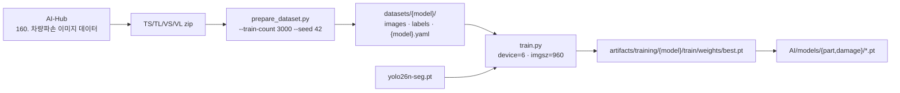

# 학습 및 데이터셋

## 목적

모델 학습에 쓴 데이터셋과 학습 스크립트를 정리한다.

## 현재 구현

### 원천 데이터셋 — AI-Hub 차량파손 이미지 데이터

```python
# AI/training/prepare_dataset.py:13
BASE = ROOT / "160. 차량파손 이미지 데이터" / "01.데이터"
```

`160.` 번호와 `1.Training` / `2.Validation` 구조는 **AI-Hub 공개 데이터셋의 표준 배치**다.
데이터 자체는 저장소에 없고, `AI/` 아래 경로에 풀어 두는 것을 전제로 한다.

### 데이터셋 2종

`prepare_dataset.py` 의 `CFG` 가 둘을 정의한다.

| 모델 | 라벨 필드 | Training | Validation |
| --- | --- | --- | --- |
| `damage` | `damage` | `TS_damage.zip` / `TL_damage.zip` | `VS_damage.zip` / `VL_damage.zip` |
| `damage_part` | `part` | `TS_damage_part.zip` / `TL_damage_part.zip` | `VS_damage_part.zip` / `VL_damage_part.zip` |

`TS`/`VS` 는 원천데이터(이미지), `TL`/`VL` 은 라벨링데이터(JSON)다.
**zip을 풀지 않고 직접 읽는다** (`parse_split(lbl_zip, img_zip, ...)`).

`damage_part` 데이터셋은 `part` 필드를 쓴다 — 같은 사진에 손상과 부품 라벨이 함께 있고,
모델마다 다른 필드를 읽는 구조다.

### 데이터셋 변환

```
python AI/training/prepare_dataset.py --model damage --train-count 3000 --val-count 300 --seed 42
```

| 인자 | 기본값 | 의미 |
| --- | --- | --- |
| `--model` | (필수) | `damage` 또는 `damage_part` |
| `--train-count` | 3000 | 학습 샘플 수 |
| `--val-count` | 300 | 검증 샘플 수 |
| `--seed` | 42 | 샘플링 시드 |
| `--out` | `datasets` | 출력 디렉터리 |

**전체가 아니라 표본 3,300장을 쓴다.** 시드를 고정해 재현 가능하게 했다.

변환 과정은 AI-Hub JSON의 `segmentation` 폴리곤을 YOLO 형식으로 옮기는 것이다
(`iter_polygons`, `write_split`). 이미지 크기는 `image_size(img_bytes, json_img)` 로
확인한다 — JSON에 적힌 값과 실제 바이트를 함께 본다.

### 학습

```
python AI/training/train.py --model damage --epochs 20 --imgsz 960
```

| 인자 | 기본값 |
| --- | --- |
| `--model` | (필수) `damage` / `damage_part` |
| `--epochs` | 20 |
| `--imgsz` | 960 |
| `--batch` | -1 (자동) |
| `--weights` | `AI/models/base/yolo26n-seg.pt` |

```python
model.train(
    data=str(data), epochs=args.epochs, imgsz=args.imgsz, batch=args.batch,
    device=6, val=False,
    project=str(ROOT / "artifacts" / "training" / args.model),
    name="train", plots=True, exist_ok=True,
)
model.val(data=str(data), imgsz=args.imgsz, device=6)
```

특징 세 가지.

1. **`device=6` 이 하드코딩돼 있다.** GPU 7번 장치를 지정한다 — 여러 GPU가 달린 공용
   학습 서버를 전제로 한 값이다. 다른 환경에서 그대로 돌리면 실패한다.
2. **`val=False` 후 별도 `model.val()`** — 학습 중 검증을 끄고 끝난 뒤 한 번 돌린다.
3. **가중치 로드 실패 시 자동 대체하지 않는다.**

```python
print("--weights로 유효한 YOLO segmentation 초기 가중치를 지정하세요. 자동 대체하지 않고 종료합니다.")
```

조용히 다른 가중치로 학습해 "왜 성능이 이상하지"가 되는 상황을 막는 처리다.

### 배포된 가중치와 학습 인자의 관계

| 배포 파일 | 이름이 말하는 것 |
| --- | --- |
| `damage_best-60ep.pt` | `damage` 모델, 60 epoch |
| `damage_part_best-35ep.pt` | `damage_part` 모델, 35 epoch |

`train.py` 기본값은 20 epoch인데 배포본은 60·35다. **기본값이 아닌 인자로 학습했다**는 뜻이다.
`best.pt` 를 골라 이름을 바꿔 넣은 것으로 **추정**된다.

`imgsz=960` 은 학습과 추론(`YOLO_IMAGE_SIZE` 기본 960)이 일치한다.

### 검색 corpus 데이터

모델 학습과 별개로, 유사 사례 검색용 corpus가 있다. 같은 AI-Hub 데이터셋을 쓰되
`pipeline/jobs/corpus/` 가 처리한다.

| 항목 | 값 (2026-09-21 운영 기준) |
| --- | --- |
| `repair_case` | 39,676건 |
| `repair_case_image` | 168,297건 |
| `repair_case_damage_feature` (v1) | 205,977건 |
| `repair_case_damage_feature` (v2) | 347,086건 |
| `repair_case_roi_embedding` | 304,114건 |

상세는 [데이터 파이프라인](../05_데이터/데이터_파이프라인.md)에 있다.

## 동작 흐름



## 주요 구성 요소

| 파일 | 역할 |
| --- | --- |
| `AI/training/prepare_dataset.py` | AI-Hub zip → YOLO 데이터셋 |
| `AI/training/train.py` | Ultralytics 학습·검증 |
| `AI/tools/infer_visual.py` | 추론 결과 시각화 |
| `AI/tools/export_yolo_json.py` | 결과 JSON 내보내기 |
| `AI/models/base/yolo26n-seg.pt` | 학습 시작 가중치 |

## 설정 및 실행 방법

1. AI-Hub 데이터셋을 `AI/160. 차량파손 이미지 데이터/01.데이터/` 에 배치
2. `python AI/training/prepare_dataset.py --model damage`
3. `python AI/training/train.py --model damage --epochs 60`
4. 결과 `best.pt` 를 `AI/models/damage/` 로 복사

GPU 환경이 다르면 `train.py` 의 `device=6` 을 고쳐야 한다.

## 오류 및 예외 처리

| 상황 | 처리 |
| --- | --- |
| 가중치 로드 실패 | 안내 후 종료. 자동 대체하지 않음 |
| 데이터셋 zip 없음 | 파일 접근 오류 |
| GPU 6번 없음 | Ultralytics 장치 오류 |

## 관련 소스코드

- `AI/training/prepare_dataset.py`
- `AI/training/train.py`
- `pipeline/jobs/corpus/` — 검색 corpus 적재

## 근거 자료

- 학습 스크립트 직접 확인
- 가중치 파일명 (`60ep` · `35ep`)
- 이 조사에서 직접 조회한 운영 DB 건수

## 확인 필요 항목

- **실제 학습 하이퍼파라미터** — `60ep` · `35ep` 외 batch·lr 등 실제 사용값을 기록한 문서를 확인하지 못함
- **학습 성능 지표(mAP 등)** — `artifacts/training/` 이 저장소에 없어 확인하지 못함
- **데이터셋 표본 3,300장이 최종값인지** — 기본값이며 실제 사용값을 확인하지 못함
- **`device=6` 학습 환경** — 어느 장비인지 확인하지 못함
- **AI-Hub 데이터셋 라이선스·이용 조건** — 저장소에 명시 문서가 없음
