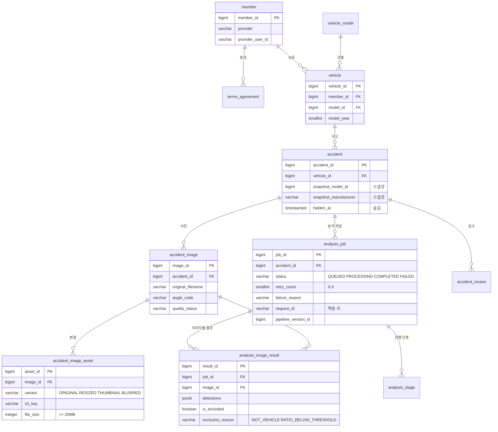
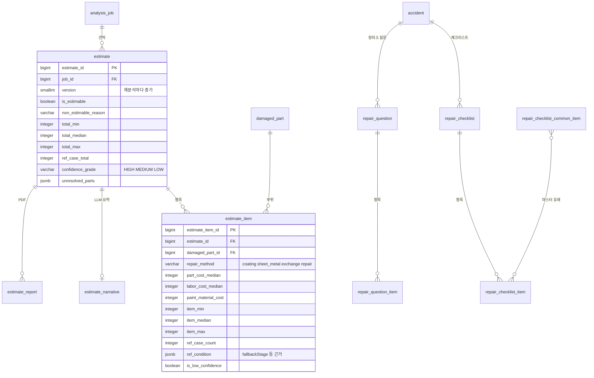
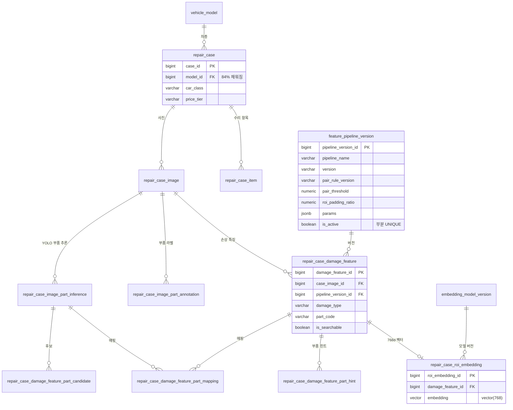
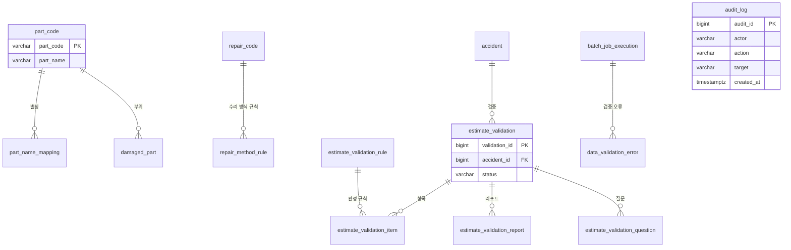
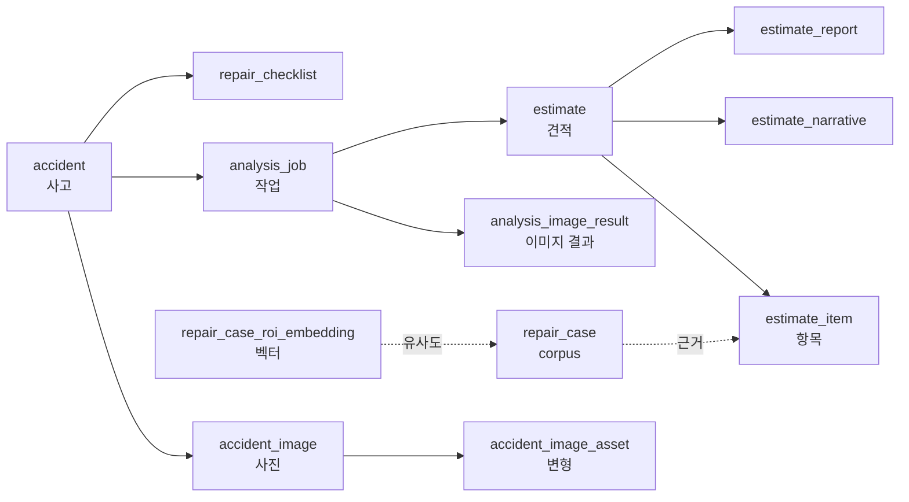

# ERD

## 목적

테이블 관계를 Mermaid ER 다이어그램으로 나타낸다. 47개를 한 장에 담으면 읽을 수 없으므로
**그룹별로 나눈다**. 전체 개요는 [diagrams/ERD.md](../diagrams/ERD.md)에 있다.

## 현재 구현

### ① 회원 · 사고 · 분석

### ② 견적 · 파생 기능

### ③ 수리 사례 corpus · 벡터 검색

### ④ 마스터 · 견적서 검증 · 운영

## 동작 흐름 (데이터가 흐르는 방향)

## 주요 구성 요소

- `Docs/Erd/A307_ddl_final.sql` — 정본 DDL
- `Docs/Erd/바른견적_ERD.png` — 기존 ERD 이미지
- `Docs/backend-db/erd.md` · `erd.mmd` · `erd.svg` — 별도 ERD 자료

## 설정 및 실행 방법

ERD 도구로 보려면 정본 DDL을 import 한다. `vector(768)` 타입을 지원하지 않는 도구에서는
해당 컬럼을 별도 처리해야 한다.

## 오류 및 예외 처리

해당 없음 (구조 문서).

## 관련 소스코드

- `Docs/Erd/A307_ddl_final.sql`
- `backend/src/main/java/com/ssafy/a307/*/entity/` — JPA 엔티티

## 근거 자료

- 정본 DDL의 `CREATE TABLE` · `REFERENCES` 선언
- 컬럼·제약 조건 직접 확인

## 확인 필요 항목

- **일부 관계의 카디널리티** — FK 선언으로 방향은 확인했으나 1:1 / 1:N 구분을 일부 추정으로 표기함
- **`damaged_part` 의 생성 경로** — `estimate_item` 이 참조하지만 채우는 코드를 확인하지 못함
- **`repair_checklist_common_item` ↔ `repair_checklist_item` 관계** — 마스터 유래로 추정
- **`audit_log` 의 컬럼 전체** — 인덱스 이름으로 역추정했고 정의를 전수 확인하지 못함
- **`estimate_validation` 계열 FK** — 상세 관계를 전수 확인하지 못함
