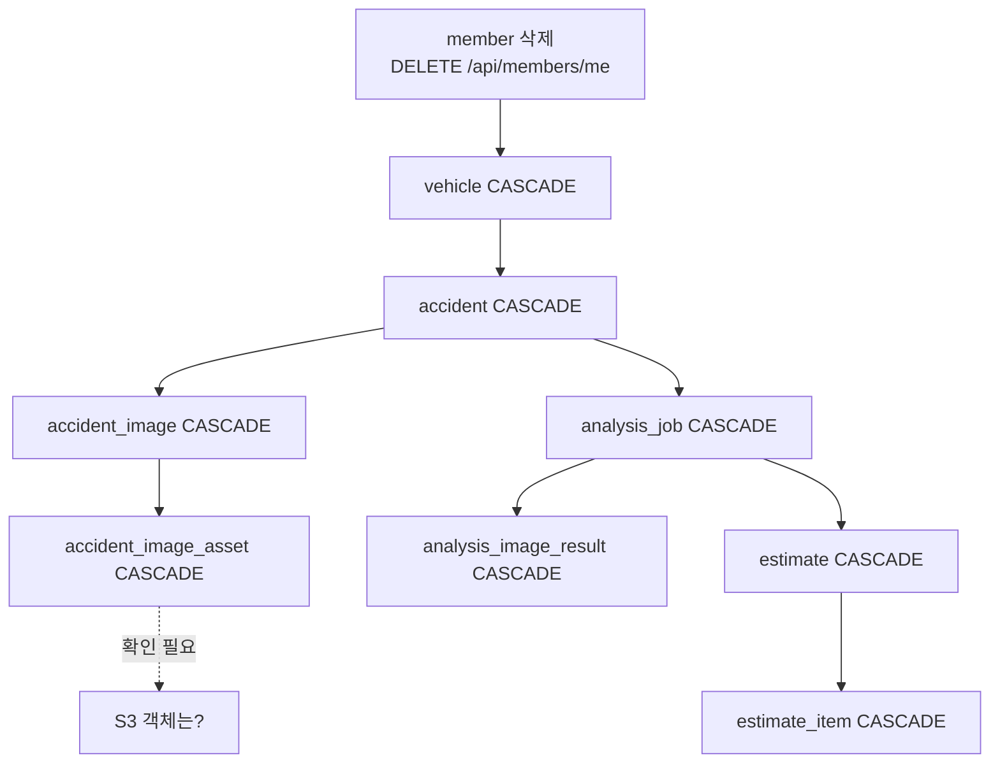

# 데이터 보존 정책

## 목적

어떤 데이터를 얼마나 남기고, 삭제 요청에 어떻게 대응하는지 코드에서 확인되는 범위로 정리한다.

## 현재 구현

### 삭제 방식 2종

**1. 물리 삭제 + CASCADE**

대부분의 FK가 `ON DELETE CASCADE` 다.

```sql
accident_id BIGINT NOT NULL REFERENCES accident(accident_id) ON DELETE CASCADE
image_id    BIGINT NOT NULL REFERENCES accident_image(image_id) ON DELETE CASCADE
job_id      BIGINT NOT NULL REFERENCES analysis_job(job_id) ON DELETE CASCADE
estimate_id BIGINT NOT NULL REFERENCES estimate(estimate_id) ON DELETE CASCADE
```

사고를 지우면 사진·변형·분석 작업·결과·견적·항목이 한꺼번에 사라진다.
**회원 탈퇴 시 개인정보를 남기지 않기 위한 구조**로 보인다.

**2. 논리 삭제 (숨김)**

사고 이력은 지우지 않고 감춘다.

| 컬럼 | 테이블 |
| --- | --- |
| `hidden_at` | `accident` |

API는 `setAccidentHidden` 이고, 커밋 `c23e2bb` 가 "사고 이력을 **목록에서 감출 수 있게**
한다 (S15P21A307-554)" 라고 적었다. 프론트에 "건별 되돌리기" 도 있다 (커밋 `344171c`).

**사용자가 실수로 지워도 복구할 수 있게** 한 선택이다.

### 이미지 보존

| 변형 | 보존 | 용도 |
| --- | --- | --- |
| `ORIGINAL` | 손대지 않고 그대로 | EXIF 포함 |
| `RESIZED` | 축소, **EXIF 제거** | AI 분석 |
| `THUMBNAIL` | 축소, **EXIF 제거** | 목록·미리보기 |
| `BLURRED` | **생성 안 함** | (범위 제외) |

`ImageVariant.java` 주석 그대로다. 원본은 EXIF를 남기고, 파생본에서는 지운다.
EXIF에 촬영 위치가 들어 있을 수 있어, 외부로 나가는 변형에서 제거하는 것은 타당한 처리다.

다만 **원본에는 EXIF가 남는다.** 원본은 S3에만 있고 사용자에게 직접 노출되지 않는 것으로
**추정**되나, 보존 기간 정책은 확인하지 못했다.

### 사고 사진 한 장 체계

`UploadView.vue` 주석 — "서버에 있는 이 사고의 이미지 id — **한 장 체계라 새로 올릴 때 지운다**".

새 사진을 올리면 이전 사진을 삭제한다. 누적되지 않는다.

### 사용자 질의 벡터는 저장하지 않는다

`AI/server/README.md`:

> 업로드 query 벡터는 **요청 메모리에서만 사용하고** corpus 벡터만 DB에 저장한다.

사용자 사진에서 뽑은 768차원 특징 벡터가 DB에 남지 않는다. 임시 파일도 마찬가지다 —
`tempfile.TemporaryDirectory(prefix="a307-ai-")` 컨텍스트가 끝나면 지워진다.

### 견적 버전 누적

```sql
CONSTRAINT uk_est UNIQUE (job_id, version)
```

재분석하면 `version` 이 늘어나고 **이전 버전이 남는다.** 화면은 최신 하나만 보여 주지만
이력이 쌓인다.

`AnalysisCallbackService` javadoc이 이 설계의 위험을 언급한다 — 멱등성을 막지 않으면
"사용자는 분석을 한 번 했는데 견적 버전이 네 개가 된다. 화면은 최신 하나만 보여 주므로
사용자는 모르지만, 이력을 열면 같은 값이 네 줄 쌓여 있다."

### 감사 로그

`audit_log` 테이블이 있고 인덱스 4개가 붙어 있다.

```
ix_audit_actor · ix_audit_target · ix_audit_created · ix_audit_action
```

`created_at` 인덱스가 있는 것으로 보아 **기간별 조회·정리**를 염두에 둔 것으로 **추정**된다.
보존 기간 설정은 확인하지 못했다.

### 세션

| 항목 | 값 |
| --- | --- |
| 저장소 | Redis (`a307:session` 네임스페이스) |
| 타임아웃 | 30분 (`server.servlet.session.timeout=30m`) |
| 볼륨 | `a307-redisdata` |

30분 후 자동 만료다. 볼륨을 둔 이유는 "컨테이너를 올릴 때마다 전원 로그아웃되는 것을 막으려면"
이다 (`docker-compose.yml` 주석).

### corpus 데이터

`repair_case` 계열 39,676건은 AI-Hub 공개 데이터셋에서 파생된 것이라 **개인정보가 아니다**.
`Docs/AI/이미지 입력 및 검색 corpus 결정사항.md` — "유사 사례 데이터셋에는 가릴 대상 자체가
없다 — **이미 비식별된** 한 종류만 제공된다."

2026-09-21 이관에서 `TRUNCATE ... CASCADE` 로 통째로 교체했다. **사용자 데이터와 분리돼 있어**
가능했던 작업이다.

### 백업

운영 DB 백업 절차는 [백업과 복구](../10_운영/백업과_복구.md)에 있다.
2026-09-21 이관 전 `pg_dump -Fc --data-only` 덤프를 떴다는 기록이 있다.

## 동작 흐름 (삭제 전파)



**S3 객체 삭제가 DB CASCADE로 따라가지 않는다.** `accident_image_asset` 행이 지워져도
S3 객체는 남는다. 별도 정리 경로가 있는지 확인하지 못했다.

## 주요 구성 요소

- `Docs/Erd/A307_ddl_final.sql` — CASCADE 선언
- `backend/src/main/java/com/ssafy/a307/accident/entity/ImageVariant.java`
- `backend/src/main/resources/application.properties` — 세션 타임아웃
- `frontend/src/views/UploadView.vue` — 한 장 체계

## 설정 및 실행 방법

보존 기간을 설정하는 환경변수는 확인되지 않았다.

## 오류 및 예외 처리

CASCADE 삭제 중 실패는 트랜잭션 롤백으로 처리된다.

## 관련 소스코드

- DDL의 `ON DELETE CASCADE` 선언 전체
- `accident.hidden_at` 관련 API (`setAccidentHidden`)

## 근거 자료

- DDL 직접 확인
- 소스 주석
- Git 커밋 `c23e2bb` · `344171c`

## 확인 필요 항목

- **S3 객체 정리 경로** — DB 행 삭제 시 S3 객체를 지우는 코드를 확인하지 못함. **개인정보 잔존 위험**
- **원본 이미지 보존 기간** — 정책을 확인하지 못함
- **`audit_log` 보존 기간** — 정리 잡을 확인하지 못함
- **견적 버전 누적 상한** — 무제한인지 확인하지 못함
- **개인정보 처리방침 문서** — `TermsDocView.vue` 가 있으나 실제 문안을 확인하지 못함
- **법정 보존 의무** — 해당 여부를 확인하지 못함
