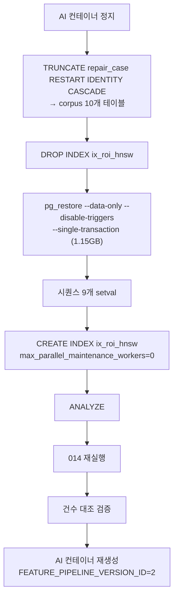
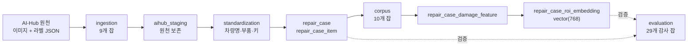

# 데이터 파이프라인

## 목적

`pipeline/` 의 오프라인 잡이 AI-Hub 원천 데이터를 검색 가능한 corpus로 바꾸는 과정을 정리한다.

## 현재 구현

### 구성

```
pipeline/
├─ sql/               마이그레이션 002~015 (14개)
├─ jobs/
│  ├─ ingestion/      9  원천 적재
│  ├─ corpus/         10 검색 corpus 구축
│  ├─ estimates/      5  견적 라벨 추출·매핑
│  ├─ evaluation/     29 감사·평가
│  └─ quality/        2  품질 검사
├─ standardization/   표준화 (차량명·부품·저장키)
└─ validation/        견적 규칙 검증
```

`evaluation` 이 29개로 가장 많다. **데이터를 만드는 것보다 검증하는 코드가 많다.**

### 마이그레이션 14개

| 파일 | 내용 |
| --- | --- |
| `002_repair_case_item_contract` | 수리 항목 계약 |
| `003_aihub_staging` | AI-Hub 원천 보존 스테이징 |
| `004_repair_case_item_line_type` | 항목 행 구분 |
| `005_repair_case_image_storage_key` | 이미지 저장 키 |
| `006_damage_search_corpus` | 검색 corpus 기반 |
| `007_damage_feature_layer` | 손상 특징 계층 |
| `008_damage_type_standard_code` | 손상 표준 코드 |
| `009_repair_case_image_stable_storage_key` | 안정 저장 키 |
| `010_damage_repair_hint` | 수리 힌트 |
| `011_damage_pipeline_v2` | **파이프라인 v2** |
| `012_vehicle_price_tier` | 차량 수리비대 |
| `013_vehicle_price_tier_estimated` | 수리비대 추정 |
| `014_repair_case_price_tier_backfill` | 사례에 수리비대 채우기 |
| `015_yolo_part_candidates` | YOLO 부품 후보 |

`001` 이 없다 — 정본 DDL(`Docs/Erd/A307_ddl_final.sql`)이 그 역할을 한다.

`pipeline/sql/003_aihub_staging.sql` 은 `docker-compose.yml` 이 로컬 초기화에도 마운트한다.

### 표준화 계층

| 모듈 | 역할 |
| --- | --- |
| `standardization/vehicle_names.py` + `vehicle_name_alias.json` | 차량명 표기 통일 |
| `standardization/estimate_items.py` | 견적 항목 표준화 |
| `standardization/storage_keys.py` | 저장 키 규칙 |
| `validation/estimate_rules.py` | 견적 규칙 검증 |

각 모듈에 테스트가 붙어 있다 (`test_*.py` 6개). `fixtures/` 도 있다.

원천 데이터 표기가 제각각이라(같은 차종을 다르게 적는 등) 별칭 사전으로 통일한다.

### corpus 구축 잡 10개

| 잡 | 역할 |
| --- | --- |
| `analyze_damage_part_pairing.py` | 손상↔부품 매칭 품질 분석 |
| `build_case_query_manifest.py` | 질의 매니페스트 |
| `build_case_split_manifests.py` | split 매니페스트 |
| `build_label_path_index.py` | 라벨 경로 인덱스 |
| `build_search_sample_sql.py` | 검색 표본 SQL |
| `load_roi_embeddings.py` | **ROI 임베딩 적재** |
| `validate_category_id_integrity.py` | 카테고리 ID 무결성 |
| `validate_search_readiness.py` | 검색 준비 상태 검증 |
| `verify_search_sample.py` | 표본 검증 |

**매니페스트 → 검증 → 적재 → 재검증** 순서다. 적재 전후로 검증이 두 번 들어간다.

테스트도 8개 있다 (`corpus/tests/`).

### 평가 잡 29개

파일명이 무엇을 보는지 말해 준다.

```
audit_damage_type_work_method_compatibility.py   손상유형↔수리방식 양립성
audit_estimate_method_stratification.py          수리방식 층화
audit_estimate_reference_count_accuracy.py       참조 사례 수 정확도
audit_full_source_estimate_supply.py             원천 견적 공급량
audit_part_price_reference_coverage.py           부품가 참조 커버리지
audit_repair_case_item_part_cost_coverage.py     항목 부품비 커버리지
```

`audit_estimate_reference_count_accuracy.py` 는 2026-09-20 커밋 `52161c9` 로 들어왔다 —
"참조 사례 수 정확도 평가 job 과 검증 결과 문서를 추가한다 (S15P21A307-556)".

### 파이프라인 v1 → v2

`011_damage_pipeline_v2.sql` 이 v2를 도입했다. 같은 테이블
(`repair_case_damage_feature`)에 `pipeline_version_id` 로 구분해 **두 버전이 공존**한다.

| 버전 | feature 수 (운영 2026-09-21) |
| --- | --: |
| v1 | 205,977 |
| v2 | 347,086 |

AI 서버는 `FEATURE_PIPELINE_VERSION_ID` 환경변수로 어느 쪽을 쓸지 고른다.
롤백이 환경변수 한 줄이다.

### 2026-09-21 v2 corpus 운영 이관 (실측 기록)

이 조사 중에 수행된 작업이다. 절차와 결과를 사실대로 남긴다.



검증 결과 (전부 일치):

| 항목 | 건수 |
| --- | --: |
| `repair_case` | 39,676 |
| `repair_case_image` | 168,297 |
| `repair_case_damage_feature` v1 | 205,977 |
| `repair_case_damage_feature` v2 | 347,086 |
| `repair_case_roi_embedding` | 304,114 |

**핵심 성과**: `repair_case.model_id` 가 33,379/39,676 (84%) 채워졌다.
이전에는 0건이라 검색이 `MODEL` · `PRICE_TIER` 단계를 타지 못하고 전부 `ALL` 로 떨어졌다.

`014` 재실행은 `UPDATE 0` 이었다 — 덤프가 이미 `price_tier` 를 담고 있었다.
`mismatch 0` · `missing 0` 으로 확인됐다.

**주의사항 3가지**가 이 작업에서 확인됐다.

1. `TRUNCATE ... CASCADE` 는 corpus 10개 테이블만 건드린다. 그 바깥에서 참조하는 테이블은
   0건이라 `accident` · `analysis_job` · `estimate` 는 안전하다. 다만
   `estimate_item.ref_condition.referencedCaseIds` 는 FK 없는 JSONB라 **기존 견적의
   사례 링크가 깨진다.**
2. `--disable-triggers` 로 FK 검사를 끄고 넣으므로 **건수 대조가 유일한 안전장치**다.
3. HNSW 인덱스 재생성은 `/dev/shm` 64MB 제약에 걸린다.
   `max_parallel_maintenance_workers=0` 으로 병렬을 꺼야 한다.

### `shared/vision` 공유

파이프라인과 AI 서버가 같은 `shared/vision` 을 쓴다. 이유는
[컴포넌트 관계](../01_전체_아키텍처/컴포넌트_관계.md)에 있다 — 오프라인 corpus 벡터와
온라인 질의 벡터가 같은 전처리를 거쳐야 코사인 유사도가 의미를 갖는다.

## 동작 흐름 (전체)



## 주요 구성 요소

| 구성 요소 | 위치 |
| --- | --- |
| 마이그레이션 | `pipeline/sql/002~015` |
| 적재 잡 | `pipeline/jobs/ingestion/` |
| corpus 잡 | `pipeline/jobs/corpus/` |
| 평가 잡 | `pipeline/jobs/evaluation/` |
| 표준화 | `pipeline/standardization/` |
| 검증 | `pipeline/validation/` |

## 설정 및 실행 방법

잡마다 독립 실행되는 Python 스크립트다. `argparse` 로 인자를 받는다.
원천 데이터셋 경로(`--dataset-root`)를 지정하는 방식이다.

파이프라인 산출물(`pipeline/manifests/`)은 `.gitignore` 대상이다 —
"원천 데이터와 함께 저장소 밖에 보관한다."

## 오류 및 예외 처리

| 상황 | 처리 |
| --- | --- |
| 원천 데이터 없음 | 잡 실패 |
| 무결성 위반 | `validate_*` 잡이 잡아낸다 |
| 적재 중단 | `--single-transaction` 으로 전체 롤백 |
| 스키마 미적용 | CI `migration-guard` 가 배포를 멈춘다 |

`data_validation_error` 테이블과 `batch_job_execution` 테이블이 실행 이력·오류를 남긴다.

## 관련 소스코드

- `pipeline/sql/` — 마이그레이션 14개
- `pipeline/jobs/corpus/load_roi_embeddings.py`
- `pipeline/standardization/vehicle_names.py`
- `shared/vision/` — 공용 전처리

## 근거 자료

- 디렉터리·파일 직접 확인
- 2026-09-21 운영 이관 실측 (이 조사에서 수행)
- Git 커밋 메시지 (`52161c9` 등)

## 확인 필요 항목

- **각 잡의 실행 순서와 의존 관계** — 파일명으로 추정했고 오케스트레이션 스크립트를 확인하지 못함
- **`ingestion` 9개 잡의 상세** — 파일 목록만 확인함
- **파이프라인 실행 주기** — 수동 실행으로 추정. 스케줄러 설정을 확인하지 못함
- **v1 → v2 변경 내용** — `011_damage_pipeline_v2.sql` 의 구체적 변경을 확인하지 못함
- **`pipeline/jobs/corpus/load_roi_embeddings.py` 의 추적 상태** — Git 미추적 상태로 확인됨
