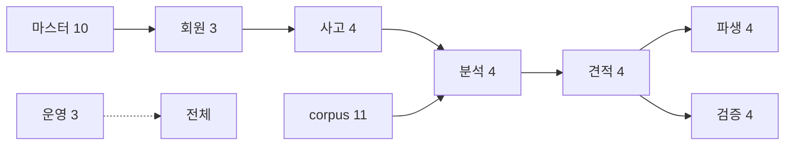

# 데이터베이스 구조

## 목적

PostgreSQL 스키마 전체의 구성 원칙과 테이블 그룹을 정리한다.

## 현재 구현

### 기본 정보

| 항목 | 값 |
| --- | --- |
| DBMS | PostgreSQL 16 |
| 확장 | pgvector (`CREATE EXTENSION vector`) |
| 정본 DDL | `Docs/Erd/A307_ddl_final.sql` |
| 테이블 수 | **47** |
| 스키마 관리 | `ddl-auto=validate` + 사람이 적용하는 마이그레이션 |

### 테이블 그룹 8개

| 그룹 | 테이블 | 수 |
| --- | --- | --: |
| 마스터 | `part_code`, `part_name_mapping`, `vehicle_model`, `repair_code`, `repair_method_rule`, `estimate_validation_rule`, `repair_checklist_common_item`, `estimate_notice`, `embedding_model_version`, `feature_pipeline_version` | 10 |
| 회원 | `member`, `terms_agreement`, `vehicle` | 3 |
| 사고 | `accident`, `accident_image`, `accident_image_asset`, `accident_review` | 4 |
| 분석 | `analysis_job`, `analysis_stage`, `analysis_image_result`, `damaged_part` | 4 |
| 수리 사례 corpus | `repair_case`, `repair_case_item`, `repair_case_image`, `repair_case_damage_feature`, `repair_case_roi_embedding`, `repair_case_image_part_annotation`, `repair_case_damage_feature_part_hint`, `repair_case_image_part_inference`, `repair_case_damage_feature_part_mapping`, `repair_case_damage_feature_part_candidate`, `repair_cost_stat` | 11 |
| 견적 | `estimate`, `estimate_item`, `estimate_narrative`, `estimate_report` | 4 |
| 견적서 검증 | `estimate_validation`, `estimate_validation_item`, `estimate_validation_report`, `estimate_validation_question` | 4 |
| 파생 기능 | `repair_checklist`, `repair_checklist_item`, `repair_question`, `repair_question_item` | 4 |
| 운영 | `batch_job_execution`, `data_validation_error`, `audit_log` | 3 |

corpus 그룹이 11개로 가장 크다. 검색 품질을 위해 중간 산출물을 모두 테이블로 남긴 결과다.

### 설계 원칙

**1. 변형을 컬럼이 아니라 행으로 둔다**

```sql
CREATE TABLE accident_image_asset (
    image_id BIGINT NOT NULL REFERENCES accident_image(image_id) ON DELETE CASCADE,
    variant  VARCHAR(20) NOT NULL,
    s3_key   VARCHAR(500) NOT NULL,
    ...
    CONSTRAINT uk_aia UNIQUE (image_id, variant),
    CONSTRAINT ck_aia_var CHECK (variant IN ('ORIGINAL','RESIZED','THUMBNAIL','BLURRED'))
);
```

DDL 주석 — "원본·리사이즈·썸네일·블러를 행으로. **변형이 늘어도 컬럼 불변**".

**2. 진행 단계도 행으로**

`analysis_stage` 주석 — "화면의 4단계 체크리스트. **단계가 늘어도 스키마 불변**".

**3. 스냅샷으로 시점을 고정한다**

`accident` 가 차량 정보를 `snapshot_*` 로 복사한다. 사용자가 차량을 고쳐도 분석 당시 조건이
남는다.

**4. 작업 큐를 테이블로 둔다**

상태 컬럼 + 부분 UNIQUE 인덱스로 중복 작업을 막는다.

```sql
CREATE UNIQUE INDEX ux_job_inflight ON analysis_job (...)
    WHERE status IN ('QUEUED','PROCESSING');
```

같은 패턴이 **7곳**에 있다 (`grep -c "WHERE status IN ('QUEUED','PROCESSING')"` → 7).
진행 중인 작업이 있으면 같은 대상에 새 작업을 넣을 수 없다. 애플리케이션 락 없이 DB가 보장한다.

**5. 활성 버전을 부분 UNIQUE로 강제한다**

```sql
CREATE UNIQUE INDEX ux_fpv_active ON feature_pipeline_version (is_active) WHERE is_active;
CREATE UNIQUE INDEX ux_emv_active ON embedding_model_version (is_active) WHERE is_active;
```

`is_active = true` 인 행이 **하나뿐**임을 DB가 보장한다.

**6. 근거를 JSONB로 남긴다**

| 테이블.컬럼 | 내용 |
| --- | --- |
| `analysis_image_result.detections` | AI가 준 detection 배열 그대로 |
| `estimate_item.ref_condition` | 산정 근거 스냅샷 |
| `estimate.unresolved_parts` | 산정 못한 부위 |
| `feature_pipeline_version.params` | 파이프라인 파라미터 |

`detections` 주석 — "AI 가 준 `detections[]` 를 키 이름·구조 그대로 넣는다. **구조를 DDL 로
강제하지 않는다** — 검증은 수신 계층이 한다."

**7. CHECK 제약으로 값을 좁힌다**

DDL 전체에 CHECK 제약이 많다. 예시다.

```sql
CONSTRAINT ck_aj_status CHECK (status IN ('QUEUED','PROCESSING','COMPLETED','FAILED'))
CONSTRAINT ck_aj_retry  CHECK (retry_count BETWEEN 0 AND 3)
CONSTRAINT ck_air_reason CHECK (exclusion_reason IS NULL
                          OR exclusion_reason IN ('NOT_VEHICLE','RATIO_BELOW_THRESHOLD'))
CONSTRAINT ck_ei_method CHECK (repair_method IN ('coating','sheet_metal','exchange','repair'))
CONSTRAINT ck_est_grade CHECK (confidence_grade IS NULL OR confidence_grade IN ('HIGH','MEDIUM','LOW'))
CONSTRAINT ck_aia_size  CHECK (file_size IS NULL OR file_size <= 20971520)
```

**애플리케이션 enum과 DB CHECK가 쌍을 이룬다.** `ImageVariant` 주석이 그 결합을 명시했다 —
"정본 DDL 의 `ck_aia_var` 가 네 값을 허용하므로 enum 에서 빼면 스키마와 어긋난다."

### 벡터 컬럼

```sql
embedding vector(768) NOT NULL
```

`repair_case_roi_embedding` 에 하나뿐이다. 768은 DINOv2-base의 `pooler_output` 차원이다.

DDL 주석 — "embedding 컬럼이 `vector(768)` 고정이므로 현재는 768만 허용."

### 인덱스

40개 이상이 정의돼 있다. 성격별로 나뉜다.

| 성격 | 예 |
| --- | --- |
| FK 조회 | `ix_img_accident`, `ix_ei_estimate`, `ix_rcimg_case` |
| 큐 폴링 | `ix_job_queue`, `ix_er_queue`, `ix_en_queue`, `ix_ev_queue`, `ix_evr_queue` |
| 검색 필터 | `ix_rc_class`, `ix_rc_model`, `ix_rcdf_damage`, `ix_rcdf_part` |
| 벡터 | `ix_roi_hnsw` |
| 감사 | `ix_audit_actor`, `ix_audit_target`, `ix_audit_created`, `ix_audit_action` |
| 부분 UNIQUE | `ux_job_inflight`, `ux_fpv_active`, `ux_emv_active` |

큐 폴링 인덱스가 워커마다 따로 있는 것이 특징이다 — 워커가 매 주기 `WHERE status='QUEUED'`
를 돌기 때문이다.

### HNSW 인덱스 주의사항

DDL이 실측 경고를 남겼다.

```sql
-- 주의: 대량 적재 전에 만들면 INSERT 가 느려집니다 (실측 11.4만건 65초).
--       초기 backfill 은 인덱스 없이 적재한 뒤 이 문을 실행하세요.
CREATE INDEX ix_roi_hnsw ON repair_case_roi_embedding
    USING hnsw (embedding vector_cosine_ops);
```

2026-09-21 v2 corpus 이관에서 이 절차를 실제로 따랐다 —
[데이터 파이프라인](데이터_파이프라인.md) 참고.

## 동작 흐름



## 주요 구성 요소

| 파일 | 내용 |
| --- | --- |
| `Docs/Erd/A307_ddl_final.sql` | 정본 DDL 47 테이블 |
| `Docs/Erd/vehicle_model_seed.sql` | 차량 모델 시드 |
| `Docs/Erd/A307_part_code_seed.sql` | 부품 코드 시드 |
| `pipeline/sql/002~015` | 파이프라인 증분 마이그레이션 14건 |
| `Docs/Erd/migrations/` | 백엔드 스키마 마이그레이션 11건 + `check-applied.sql` |
| `backend/src/test/resources/schema-h2.sql` | 테스트용 H2 스키마 |

## 설정 및 실행 방법

로컬은 `docker compose up -d` 가 첫 기동에 DDL·시드를 자동 적용한다.
운영은 사람이 적용하고 CI 가드가 확인한다 — [배포 절차](../08_배포_CICD/배포_절차.md) 참고.

## 오류 및 예외 처리

| 상황 | 결과 |
| --- | --- |
| 스키마 불일치 | `ddl-auto=validate` → **백엔드 전체 기동 실패** |
| CHECK 위반 | `DataIntegrityViolationException` → `409 CONFLICT` |
| 부분 UNIQUE 위반 | 중복 작업 차단 (의도된 동작) |

## 관련 소스코드

- `Docs/Erd/A307_ddl_final.sql`
- `pipeline/sql/`
- `docker-compose.yml` — initdb 마운트

## 근거 자료

- DDL 직접 확인 (`CREATE TABLE` 47개, 인덱스 40개 이상)
- DDL 인라인 주석

## 확인 필요 항목

- **운영 DB의 실제 테이블 수** — `015` 까지 적용됐으나 DDL 정본과 완전히 일치하는지 대조하지 못함
- **`repair_cost_stat` 사용처** — 테이블은 있으나 읽는 코드를 확인하지 못함
- **인덱스 전체 목록** — 40개까지 확인했고 그 이후를 전수 확인하지 못함
- **파티셔닝·아카이빙** — 설정을 확인하지 못함(미사용 추정)
