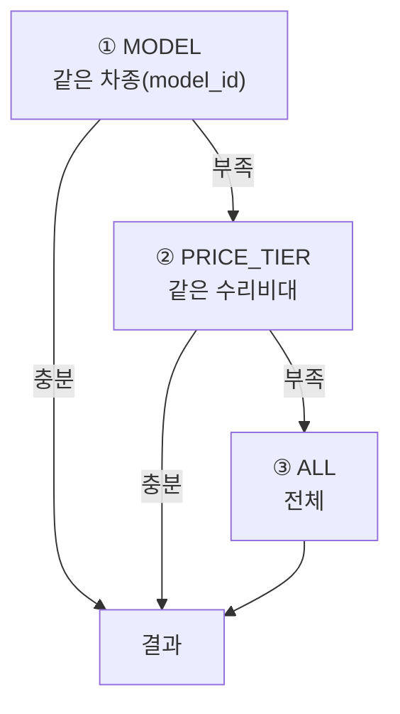
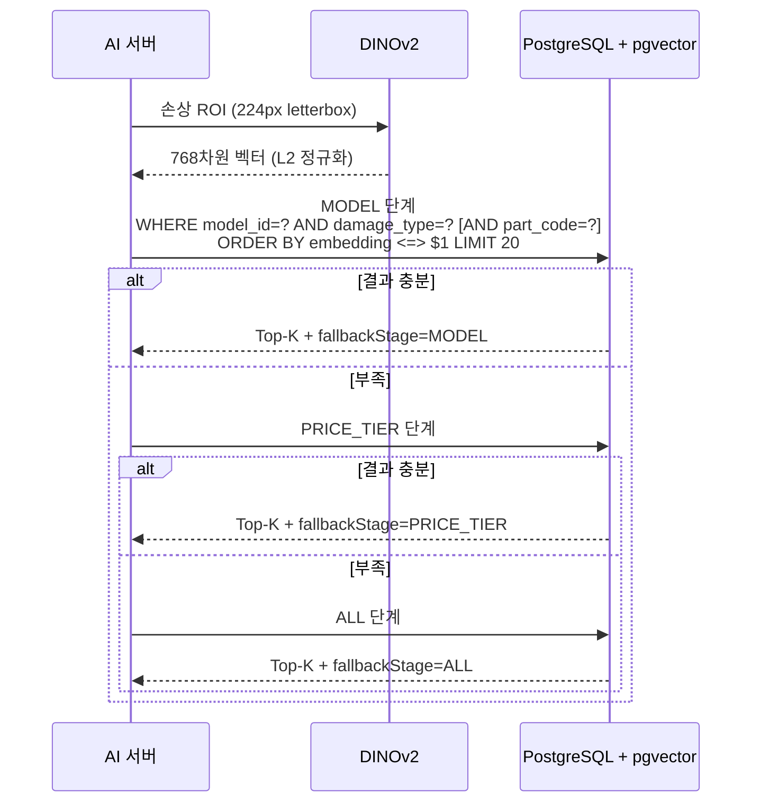

# 벡터 검색

## 목적

pgvector를 이용한 유사 사례 검색의 구조와 완화 전략을 정리한다.

## 현재 구현

### 구성

| 항목 | 값 |
| --- | --- |
| 확장 | pgvector (`pgvector/pgvector:pg16` 이미지) |
| 벡터 차원 | 768 (`vector(768)`) |
| 인덱스 | HNSW |
| 연산자 클래스 | `vector_cosine_ops` (코사인 거리) |
| 인덱스 이름 | `ix_roi_hnsw` |
| 대상 테이블 | `repair_case_roi_embedding` |
| Top-K | `SEARCH_TOP_K` 기본 20 |

```sql
CREATE INDEX ix_roi_hnsw ON repair_case_roi_embedding
    USING hnsw (embedding vector_cosine_ops);
```

파라미터(`m`, `ef_construction`)를 지정하지 않아 **pgvector 기본값**을 쓴다.

임베딩이 L2 정규화돼 있어 코사인 유사도가 내적과 같아진다.

### 검색 대상은 손상 ROI다

**차량 전체 사진이 아니라 손상 부위 잘라낸 것**을 비교한다.
`Docs/AI/이미지 입력 및 검색 corpus 결정사항.md`:

> 현재 온라인 query 임베딩은 이미 damage detection의 bbox/polygon으로 ROI를 만든다.
> 즉 query vector의 대상은 damage다.

### 메타데이터 필터

벡터 유사도만 쓰지 않는다. 필터를 함께 건다.

```text
STRICT:      partCode + damageType + 차량 조건
VECTOR_ONLY: damageType + 차량 조건
```

`search_service.py` 구현이다.

```python
part_code=(str(part_code) if searchability == "STRICT" and part_code else None)
```

`VECTOR_ONLY` 는 부품 코드를 필터에 넣지 않는다 — 부품이 확정되지 않았기 때문이다.

### 완화 단계 3종

차량 조건을 좁은 것부터 시도하고, 결과가 부족하면 푼다.



결과의 `fallbackStage` 에 어느 단계에서 나왔는지 기록되고, `estimate_item.ref_condition` 에
저장돼 화면이 "얼마나 비슷한 사례인가"를 보여 줄 수 있다.

`vector_repository.py` 주석이 단계 건너뛰기 규칙을 적었다.

> A missing tier skips the `PRICE_TIER` stage rather than guessing one

`price_tier` 가 없으면 추측하지 않고 그 단계를 건너뛴다.

### 차급 완화 (별도 단계)

위 3단계와 별개로, 견적 산정이 실패하면 `carClass` 를 풀고 재검색한다.

```python
# analysis_service.py
if _should_relax_car_class(request, estimate):
    relaxed_vehicle = request.vehicle.model_copy(update={"car_class": None})
```

조건은 세 가지 모두 참일 때다 — `car_class` 가 있고, `estimable is False` 이고,
`nonEstimableReason == INSUFFICIENT_CASES`.

**검색 결과가 없어서가 아니라 비용 정책을 통과한 사례가 부족할 때만** 푼다.

### corpus 규모 (2026-09-21 운영 실측)

| 항목 | 건수 |
| --- | --: |
| `repair_case` | 93,964 |
| `repair_case_image` | 337,966 |
| `repair_case_damage_feature` (pipeline v1) | 205,977 |
| `repair_case_damage_feature` (pipeline v2) | 851,516 |
| `repair_case_roi_embedding` | 720,668 |
| v2 이면서 `is_searchable` 인 임베딩 | 711,073 |
| `model_id` 가 채워진 `repair_case` | 80,919 (86.1%) |

임베딩(720,668)이 feature 합계(1,057,493)보다 적다. **품질 기준을 통과한 ROI만 임베딩**하기
때문이다 (`is_searchable`).

### 파이프라인 버전 2개

`feature_pipeline_version` 에 v1·v2가 있고, AI 서버가 `FEATURE_PIPELINE_VERSION_ID` 환경변수로
고른다. **`is_active` 컬럼을 읽지 않는다** — 환경변수가 결정한다.

**2026-09-26 운영 기준 v2가 활성이다**(`FEATURE_PIPELINE_VERSION_ID=2`). 검색 대상은 v2
searchable 임베딩 711,073건, 사고 기준 84,642건이다. v1 임베딩 9,595건은 초기 표본 적재분이
남은 것으로 현재 검색에 쓰이지 않는다.

| 버전 | feature 수 |
| --- | --: |
| v1 | 205,977 |
| v2 | 851,516 |

두 버전이 **같은 테이블에 공존**한다. 롤백하려면 환경변수만 되돌리면 된다.

### 임베딩 모델 버전 검증

`embedding_model_version` 테이블과 `ux_emv_active` 부분 UNIQUE 인덱스가 활성 버전 하나를
보장한다. `AI/server/README.md`:

> 활성 `embedding_model_version`이 이 모델명·버전과 일치하지 않으면 **검색을 거부한다.**

전처리가 다른 벡터끼리 비교하는 사고를 막는 장치다. 버전 문자열
`f9e44c8-pooler-pad20-lb224gray` 가 모델 revision·출력·패딩·letterbox를 모두 담는다.

### 인덱스 생성 주의사항

DDL 주석이 실측값을 남겼다.

```sql
-- 주의: 대량 적재 전에 만들면 INSERT 가 느려집니다 (실측 11.4만건 65초).
--       초기 backfill 은 인덱스 없이 적재한 뒤 이 문을 실행하세요.
```

2026-09-21 v2 corpus 이관에서 실제로 이 절차를 따랐다 — 인덱스를 **지우고** 적재한 뒤
다시 만들었다.

그때 추가로 확인된 제약이 있다. **컨테이너의 `/dev/shm` 이 64MB라 HNSW 병렬 빌드가 실패한다.**

```
ERROR: could not resize shared memory segment to 2144374176 bytes: No space left on device
```

pgvector의 병렬 빌드는 `maintenance_work_mem` 크기만큼 공유 메모리를 `/dev/shm` 에 잡는다.
`SET max_parallel_maintenance_workers=0` 으로 병렬을 끄면 프로세스 전용 메모리를 쓰므로
해결된다. 단일 스레드라 2026-09-21 이관 당시 304,114건 기준 30분~1시간이 걸렸다.

## 동작 흐름



## 주요 구성 요소

| 구성 요소 | 파일 |
| --- | --- |
| 벡터 게이트웨이 | `AI/server/app/infrastructure/vector_repository.py` |
| 검색 서비스 | `AI/server/app/services/search_service.py` |
| 임베딩 서비스 | `AI/server/app/services/embedding_service.py` |
| 공용 임베딩 | `shared/vision/dinov2.py` |
| 검색 메타데이터 | `shared/vision/search_metadata.py` |
| corpus 적재 | `pipeline/jobs/corpus/load_roi_embeddings.py` |

## 설정 및 실행 방법

| 환경변수 | 기본값 | 용도 |
| --- | --- | --- |
| `FEATURE_PIPELINE_VERSION_ID` | `0` | 사용할 파이프라인 버전. 0이면 `503` |
| `SEARCH_TOP_K` | `20` | Top-K |
| `EMBEDDING_MODEL_NAME` | `facebook/dinov2-base` | |
| `EMBEDDING_MODEL_REVISION` | `f9e44c81…` | |
| `EMBEDDING_MODEL_VERSION` | `f9e44c8-pooler-pad20-lb224gray` | |
| `DATABASE_URL` | `""` | AI 서버 읽기 전용 계정 |

## 오류 및 예외 처리

| 상황 | 결과 |
| --- | --- |
| `FEATURE_PIPELINE_VERSION_ID <= 0` | `503 PIPELINE_NOT_CONFIGURED` |
| 임베딩 모델 버전 불일치 | 검색 거부 |
| pgvector 오류 | `VectorSearchError` → 콜백 `INTERNAL` (`retryable: true`) |
| ROI 임베딩 실패 | `QueryEmbeddingError` → `INVALID_MODEL_OUTPUT` (`retryable: false`) |
| HNSW 인덱스 없음 | 순차 스캔. 오류는 없고 느려진다 |

## 관련 소스코드

- `Docs/Erd/A307_ddl_final.sql:1096~1099` — HNSW 인덱스와 주의사항
- `AI/server/app/infrastructure/vector_repository.py`
- `AI/server/app/services/search_service.py:32~68`
- `AI/server/app/services/analysis_service.py` — `_should_relax_car_class`

## 근거 자료

- DDL·소스 직접 확인
- 2026-09-21 운영 DB 직접 조회 (건수)
- 같은 날 HNSW 인덱스 재생성 실측 (`/dev/shm` 제약)

## 확인 필요 항목

- **HNSW 파라미터 튜닝** — `m` · `ef_construction` 기본값을 쓰며 조정 검토 기록을 확인하지 못함
- **`ef_search` 런타임 설정** — 검색 정확도/속도 조정값을 확인하지 못함
- **검색 응답 시간 실측** — "2초" 기준이 언급되나 측정 결과를 확인하지 못함
- **완화 단계 전환 기준 건수** — "결과가 부족하면" 의 정확한 임계값을 확인하지 못함
