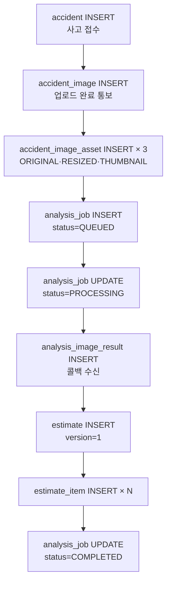

# 테이블 명세

## 목적

핵심 테이블의 컬럼·제약을 정리한다. 47개 전체가 아니라 **업무 흐름의 중심이 되는 것들**을 담았다.
전체는 `Docs/Erd/A307_ddl_final.sql` 이 정본이다.

## 현재 구현

### `accident_image` — 사고 사진

| 컬럼 | 타입 | 제약 | 설명 |
| --- | --- | --- | --- |
| `image_id` | BIGSERIAL | PK | |
| `accident_id` | BIGINT | FK → `accident`, CASCADE | |
| `original_filename` | VARCHAR(255) | NOT NULL | |
| `angle_code` | VARCHAR(20) | | 촬영 각도 (어휘 9종) |
| `quality_status` | VARCHAR(20) | NOT NULL, DEFAULT `'PASS'` | `PASS` / `WARN` |
| `quality_reason` | VARCHAR(100) | | |
| `created_at` | TIMESTAMPTZ | NOT NULL, DEFAULT now() | |

`quality_status` 가 `PASS`/`WARN` 둘뿐이다 — **품질 불량으로 업로드를 거부하지 않는다.**
경고만 남긴다. 판정 기능 자체는 `app.image-quality.enabled=false` 로 꺼져 있다.

### `accident_image_asset` — 사진 변형

| 컬럼 | 타입 | 제약 |
| --- | --- | --- |
| `asset_id` | BIGSERIAL | PK |
| `image_id` | BIGINT | FK → `accident_image`, CASCADE |
| `variant` | VARCHAR(20) | NOT NULL, CHECK 4종 |
| `s3_key` | VARCHAR(500) | NOT NULL |
| `width` / `height` | SMALLINT | |
| `file_size` | INTEGER | CHECK `<= 20971520` (20MB) |

```sql
CONSTRAINT uk_aia UNIQUE (image_id, variant)
```

**이미지당 변형 하나씩**이다. DDL 주석이 `OVERLAY` 를 제외한 이유를 적었다.

> `OVERLAY` 제외: (job × image)마다 생성되므로 이미지당 1개 제약과 충돌.
> 재분석 시 `uk_aia` 위반이 **실측으로 확인됨** → `analysis_image_result.s3_key_overlay` 로 이관

실제 운영에서 부딪힌 문제를 기록으로 남긴 사례다.

### `analysis_job` — 분석 작업

| 컬럼 | 타입 | 제약 | 설명 |
| --- | --- | --- | --- |
| `job_id` | BIGSERIAL | PK | |
| `accident_id` | BIGINT | FK, CASCADE | |
| `status` | VARCHAR(20) | NOT NULL, DEFAULT `'QUEUED'`, CHECK | `QUEUED` `PROCESSING` `COMPLETED` `FAILED` |
| `retry_count` | SMALLINT | NOT NULL, DEFAULT 0, CHECK 0~3 | |
| `failure_reason` | VARCHAR(50) | | AI 코드 또는 BE 판정값 |
| `model_version` | VARCHAR(50) | | `part-35ep/damage-60ep` |
| `request_id` | VARCHAR(64) | | 멱등 키 |
| `pipeline_version_id` | BIGINT | **FK 없음** | |
| `started_at` / `finished_at` / `created_at` | TIMESTAMPTZ | | |

`pipeline_version_id` 에 FK를 걸지 않은 이유가 주석에 있다.

> FK 를 걸지 않는다 — `feature_pipeline_version` 은 파이프라인이 따로 적재한다.

오프라인 파이프라인과 온라인 서비스의 생명주기가 달라 참조 무결성을 강제하지 않았다.

`request_id` 는 "작업당 하나이며 재분석 시 덮어쓴다".

### `analysis_image_result` — 이미지별 분석 결과

| 컬럼 | 타입 | 제약 |
| --- | --- | --- |
| `result_id` | BIGSERIAL | PK |
| `job_id` | BIGINT | FK → `analysis_job`, CASCADE |
| `image_id` | BIGINT | FK → `accident_image`, CASCADE |
| `s3_key_overlay` | VARCHAR(500) | **쓰지 않음** (2026-09-11 오버레이 폐기) |
| `detections` | JSONB | AI detection 배열 원형 |
| `is_excluded` | BOOLEAN | NOT NULL, DEFAULT FALSE |
| `exclusion_reason` | VARCHAR(50) | CHECK `NOT_VEHICLE` / `RATIO_BELOW_THRESHOLD` |

```sql
CONSTRAINT uk_air UNIQUE (job_id, image_id)
```

`detections` 를 JSONB로 둔 이유 — "AI 가 준 `detections[]` 를 키 이름·구조 그대로 넣는다.
**구조를 DDL 로 강제하지 않는다** — 검증은 수신 계층이 한다."

### `estimate` — 견적

| 컬럼 | 타입 | 제약 |
| --- | --- | --- |
| `estimate_id` | BIGSERIAL | PK |
| `job_id` | BIGINT | FK → `analysis_job`, CASCADE |
| `version` | SMALLINT | NOT NULL, DEFAULT 1 |
| `is_estimable` | BOOLEAN | NOT NULL, DEFAULT TRUE |
| `non_estimable_reason` | VARCHAR(100) | |
| `labor_rate` | INTEGER | |
| `total_hq` | NUMERIC(7,2) | 표준 작업시간 |
| `total_min` / `total_median` / `total_max` | INTEGER | |
| `ref_case_total` | INTEGER | |
| `confidence_grade` | VARCHAR(10) | CHECK NULL 또는 `HIGH`/`MEDIUM`/`LOW` |
| `unresolved_parts` | JSONB | |
| `created_at` | TIMESTAMPTZ | NOT NULL |

```sql
CONSTRAINT uk_est UNIQUE (job_id, version)
```

**금액이 3개다.** 단일 값이 아니라 범위를 준다 — 과거 사례의 분포를 그대로 보여 주는 설계다.

`unresolved_parts` 주석:

> 부분 견적에서 산정하지 못해 총액에서 뺀 부위. AI 가 준 `unresolvedParts[]` 를
> `[{partCode, damageType, reason}]` 모양 그대로 넣되, 마스터에 없는 부위·`items[]` 와
> 겹치는 부위·중복은 수신 계층이 거른다. **이 열 이전 견적은 NULL** (S15P21A307-534).

### `estimate_item` — 견적 항목

| 컬럼 | 타입 | 제약 |
| --- | --- | --- |
| `estimate_item_id` | BIGSERIAL | PK |
| `estimate_id` | BIGINT | FK, CASCADE |
| `damaged_part_id` | BIGINT | FK → `damaged_part`, CASCADE |
| `repair_method` | VARCHAR(20) | NOT NULL, CHECK 4종 |
| `standard_hq` | NUMERIC(6,2) | |
| `part_cost_median` | INTEGER | |
| `labor_cost_median` | INTEGER | |
| `paint_material_cost` | INTEGER | **0 아닌 NULL** |
| `item_min` / `item_median` / `item_max` | INTEGER | NOT NULL |
| `ref_case_count` | INTEGER | NOT NULL |
| `ref_condition` | JSONB | NOT NULL |
| `is_low_confidence` | BOOLEAN | NOT NULL, DEFAULT FALSE |

`paint_material_cost` 주석이 NULL과 0의 구분을 설명한다.

> 도장 재료비. 리포트가 공임과 나눠 보여 주며 `repair_case_item` 과 표현을 맞춘다.
> **도장이 없는 작업에는 값이 없다** — 0 으로 채우면 "도장했는데 0원" 과 구분되지 않는다.

`repair_method` 4종: `coating` (도장) · `sheet_metal` (판금) · `exchange` (교환) · `repair` (수리).

### `feature_pipeline_version` — 파이프라인 버전

| 컬럼 | 타입 | 제약 |
| --- | --- | --- |
| `pipeline_version_id` | BIGSERIAL | PK |
| `pipeline_name` | VARCHAR(100) | NOT NULL |
| `version` | VARCHAR(50) | NOT NULL |
| `pair_rule_version` | VARCHAR(50) | NOT NULL |
| `pair_threshold` | NUMERIC(3,2) | NOT NULL |
| `roi_padding_ratio` | NUMERIC(3,2) | |
| `params` | JSONB | |
| `is_active` | BOOLEAN | NOT NULL, DEFAULT FALSE |

```sql
CONSTRAINT uk_fpv UNIQUE (pipeline_name, version)
CREATE UNIQUE INDEX ux_fpv_active ON feature_pipeline_version (is_active) WHERE is_active;
```

**전처리 규칙을 데이터로 기록한다.** `pair_rule_version` · `pair_threshold` ·
`roi_padding_ratio` 가 corpus를 만들 때 쓴 규칙을 남긴다. 규칙이 바뀌면 새 버전을 만들고,
질의와 corpus의 버전이 같은지 확인할 수 있다.

2026-09-21 기준 운영에 v1·v2 두 행이 있고, AI 서버가 `FEATURE_PIPELINE_VERSION_ID` 로
어느 버전을 쓸지 고른다. **`is_active` 를 읽지 않는다** — 환경변수가 우선이다.

### `repair_case_roi_embedding` — 벡터

| 컬럼 | 타입 | 제약 |
| --- | --- | --- |
| `roi_embedding_id` | BIGSERIAL | PK |
| `damage_feature_id` | BIGINT | FK |
| `embedding` | **vector(768)** | NOT NULL |

```sql
CREATE INDEX ix_roi_hnsw ON repair_case_roi_embedding USING hnsw (embedding vector_cosine_ops);
```

`uk_roi` UNIQUE 제약도 있다. 2026-09-21 운영 기준 720,668행.

### `repair_case` — 수리 사례

| 컬럼(확인분) | 설명 |
| --- | --- |
| `case_id` | PK |
| `model_id` | 차종 FK. 운영 80,919/93,964 (86.1%) 채워짐 |
| `car_class` | 차급 |
| `price_tier` | 수리비대. `014` 마이그레이션이 채운다 |

`price_tier` 는 검색 완화 단계 `MODEL` → `PRICE_TIER` → `ALL` 의 중간 단계에 쓰인다.

## 동작 흐름

각 테이블에 행이 생기는 시점이다.



## 주요 구성 요소

`Docs/Erd/A307_ddl_final.sql` 이 정본이다.

## 설정 및 실행 방법

[데이터베이스 구조](데이터베이스_구조.md) 참고.

## 오류 및 예외 처리

CHECK·UNIQUE 위반은 `DataIntegrityViolationException` → `409 CONFLICT` 로 변환된다.

## 관련 소스코드

- `Docs/Erd/A307_ddl_final.sql`
- `backend/src/main/java/com/ssafy/a307/*/entity/`

## 근거 자료

- DDL 직접 확인 (컬럼·타입·제약·주석)
- 운영 DB 조회 (건수)

## 확인 필요 항목

- **`accident` 테이블의 전체 컬럼** — `snapshot_*` 존재는 확인했으나 전수 확인하지 못함
- **`member` · `terms_agreement` 컬럼** — 확인하지 못함
- **`repair_case` 전체 컬럼** — 검색에 쓰이는 일부만 확인함
- **`damaged_part` 컬럼과 생성 경로** — 확인하지 못함
- **`repair_cost_stat` 컬럼** — 확인하지 못함
