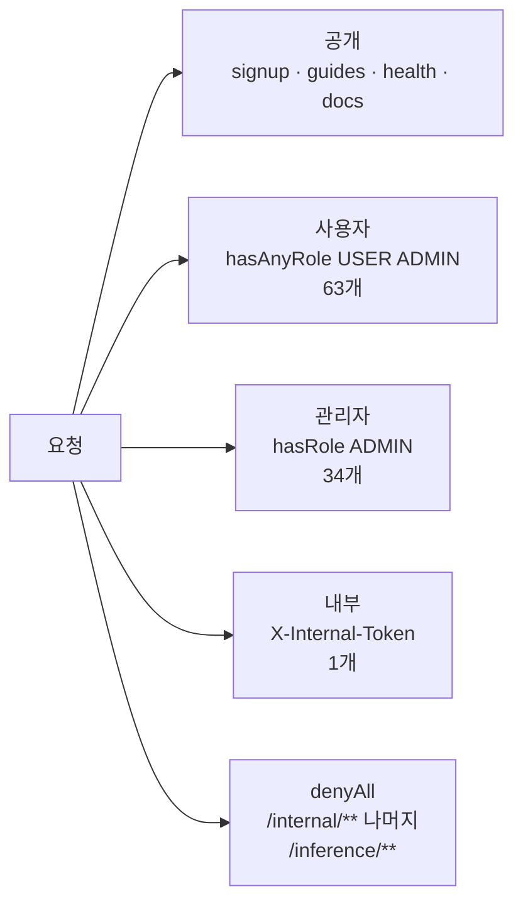

# API 전체 목록

## 목적

백엔드가 노출하는 HTTP 엔드포인트 **98개** 전체를 나열한다. 소스의
`@RequestMapping` + `@*Mapping` 을 기계적으로 추출한 결과다.

## 현재 구현

### 도메인별 분포

| 도메인 | 엔드포인트 수 | 화면 연동 |
| --- | --: | --- |
| `admin` | 34 | ✗ 화면 미구현 |
| `accident` | 9 | ✓ |
| `estimatevalidation` | 9 | ✗ 범위 제외 |
| `repairchecklist` | 8 | ✓ |
| `estimate` | 7 | ✓ |
| `location` | 6 | 일부 (카카오 SDK 직접 연동으로 대체) |
| `member` | 6 | ✓ |
| `analysis` | 5 | ✓ |
| `vehicle` | 5 | ✓ |
| `auth` | 3 | ✓ |
| `guide` | 2 | ✓ |
| `repaircase` | 2 | ✓ |
| `repairquestion` | 2 | ✗ 범위 제외 |
| **합계** | **98** | |

**34개(35%)가 관리자 API인데 화면이 없다.** 견적서 검증 9개 + 정비소 질문 2개까지
더하면 45개(46%)가 화면 없이 대기 중이다.

### 사용자 API

#### 인증 (`auth`)

| 메서드 | 경로 | 인증 |
| --- | --- | --- |
| GET | `/api/auth/me` | 세션 |
| GET | `/api/auth/signup` | `ROLE_SIGNUP_PENDING` |
| POST | `/api/auth/signup` | 공개 (`PUBLIC_PATHS`) |

OAuth2 경로(`/oauth2/authorization/**`, `/login/oauth2/code/**`)와 로그아웃
(`/api/auth/logout`)은 Spring Security가 제공한다.

#### 회원 (`member`)

| 메서드 | 경로 |
| --- | --- |
| GET | `/api/members/me` |
| PATCH | `/api/members/me` |
| DELETE | `/api/members/me` |
| POST | `/api/members/me/profile-image/upload-url` |
| PUT | `/api/members/me/profile-image` |
| DELETE | `/api/members/me/profile-image` |

프로필 이미지도 사고 사진과 같은 **presigned URL 3단계**다.

#### 차량 (`vehicle`)

| 메서드 | 경로 |
| --- | --- |
| GET | `/api/vehicle-models` |
| POST | `/api/vehicles` |
| GET | `/api/vehicles/me` |
| PATCH | `/api/vehicles/{vehicleId}` |
| DELETE | `/api/vehicles/{vehicleId}` |

#### 사고 (`accident`)

| 메서드 | 경로 |
| --- | --- |
| POST | `/api/accidents` |
| GET | `/api/accidents/me` |
| GET | `/api/accidents/{accidentId}` |
| PATCH | `/api/accidents/{accidentId}/hidden` |
| PUT | `/api/accidents/{accidentId}/actual-cost` |
| GET | `/api/accidents/{accidentId}/cost-comparison` |
| POST | `/api/accidents/{accidentId}/images/upload-urls` |
| POST | `/api/accidents/{accidentId}/images` |
| GET | `/api/accidents/{accidentId}/images` |
| DELETE | `/api/accidents/{accidentId}/images/{imageId}` |

`actual-cost` · `cost-comparison` 은 **실제 수리비를 입력받아 예측과 비교**하는 경로다.
프론트 연동은 확인하지 못했다.

#### 분석 (`analysis`)

| 메서드 | 경로 |
| --- | --- |
| POST | `/api/accidents/{accidentId}/analysis` |
| GET | `/api/accidents/{accidentId}/analysis` |
| GET | `/api/accidents/{accidentId}/analysis/result` |
| POST | `/api/accidents/{accidentId}/analysis/retry` |
| GET | `/api/accidents/{accidentId}/estimates` |

#### 견적 (`estimate`)

| 메서드 | 경로 |
| --- | --- |
| GET | `/api/estimates/{estimateId}` |
| GET | `/api/estimates/{estimateId}/report` |
| GET | `/api/estimates/{estimateId}/basis` |
| GET | `/api/estimates/{estimateId}/similar-cases` |
| POST | `/api/estimates/{estimateId}/pdf` |
| GET | `/api/estimates/{estimateId}/pdf` |
| GET | `/api/estimates/{estimateId}/pdf/download` |

PDF는 **요청 → 상태 조회 → 다운로드** 3단계 비동기다.

#### 정비 체크리스트 (`repairchecklist`)

| 메서드 | 경로 |
| --- | --- |
| POST | `/api/accidents/{accidentId}/repair-checklist` |
| GET | `/api/accidents/{accidentId}/repair-checklist` |
| POST | `/api/accidents/{accidentId}/repair-checklist/regenerate` |
| POST | `/api/accidents/{accidentId}/repair-checklist/items` |
| PATCH | `/api/accidents/{accidentId}/repair-checklist/items/{itemId}` |
| DELETE | `/api/accidents/{accidentId}/repair-checklist/items/{itemId}` |
| PATCH | `/api/accidents/{accidentId}/repair-checklist/items/{itemId}/check` |
| PATCH | `/api/accidents/{accidentId}/repair-checklist/items/{itemId}/memo` |

체크와 메모를 **별도 엔드포인트**로 나눴다 — 하나가 실패해도 다른 하나가 살아 있다.

#### 수리 사례 · 정비소 (`repaircase`, `location`)

| 메서드 | 경로 |
| --- | --- |
| GET | `/api/repair-cases/{caseId}` |
| GET | `/api/repair-shops` |
| GET | `/api/locations/geocode` |
| GET | `/api/locations/reverse-geocode` |
| GET | `/api/locations/places` |
| GET | `/api/locations/places/category` |
| GET | `/api/locations/category-groups` |

`/api/repair-shops` 는 구현돼 있지만 화면이 카카오 지도 SDK를 직접 쓴다
(루트 `README.md`) — "서버 경유가 필요해질 때를 위해 남겨 두었다."

#### 가이드 (`guide`)

| 메서드 | 경로 | 인증 |
| --- | --- | --- |
| GET | `/api/guides/shooting` | **공개** |
| GET | `/api/guides/checklist` | **공개** |

로그인 전에도 볼 수 있다.

### 범위 제외 API

#### 견적서 검증 (`estimatevalidation`) — 9개

| 메서드 | 경로 |
| --- | --- |
| POST | `/api/estimate-validations` |
| GET | `/api/estimate-validations/me` |
| GET | `/api/estimate-validations/{validationId}` |
| DELETE | `/api/estimate-validations/{validationId}` |
| GET | `/api/estimate-validations/{validationId}/result` |
| GET | `/api/estimate-validations/{validationId}/questions` |
| GET | `/api/estimate-validations/{validationId}/pdf` |

#### 정비소 질문 (`repairquestion`) — 2개

| 메서드 | 경로 |
| --- | --- |
| POST | `/api/accidents/{accidentId}/repair-questions` |
| GET | `/api/accidents/{accidentId}/repair-questions` |

### 관리자 API 34개 (`/api/admin/**`, `hasRole("ADMIN")`)

| 대상 | 엔드포인트 |
| --- | --- |
| 부품 코드 | `POST`·`GET` `/part-codes`, `GET`·`PATCH` `/part-codes/{partCode}`, `PATCH` `/part-codes/{partCode}/status` |
| 부품명 매핑 | `GET`·`POST`·`PATCH`·`DELETE` `/part-name-mappings` |
| 차량 모델 | `POST`·`GET` `/vehicle-models`, `GET`·`PATCH` `/vehicle-models/{modelId}`, `PATCH` `/vehicle-models/{modelId}/status` |
| 수리 코드 | `GET` `/repair-codes`, `PATCH` `/repair-codes/{codeType}/{code}`, `PATCH` `.../status` |
| 수리 방식 규칙 | `POST`·`GET` `/repair-method-rules`, `GET`·`PATCH` `/{ruleId}`, `PATCH` `/{ruleId}/status` |
| 검증 규칙 | `GET`·`PATCH` `/estimate-validation-rules/current`, `GET` `/estimate-validation-rules/history` |
| 규칙 개요 | `GET` `/rules/overview`, `GET` `/rules/history` |
| 사고 검수 | `GET` `/accident-reviews`, `GET`·`PATCH` `/accident-reviews/{reviewId}` |
| 배치 작업 | `GET` `/batch-jobs`, `GET` `/batch-jobs/history`, `GET` `/batch-jobs/{executionId}` |
| 감사 로그 | `GET` `/audit-logs` |

마스터마다 `status` 전용 PATCH가 따로 있다 — **활성/비활성 전환**을 내용 수정과 분리했다.

### 내부 API 1개

| 메서드 | 경로 | 인증 |
| --- | --- | --- |
| POST | `/internal/analysis-jobs/{jobId}/result` | `X-Internal-Token` |

### 시스템 경로

| 경로 | 용도 |
| --- | --- |
| `/actuator/health` | 헬스체크 (공개) |
| `/swagger-ui/**`, `/v3/api-docs/**` | API 문서 (공개) |
| `/error` | 오류 (공개) |

## 동작 흐름

## 주요 구성 요소

- 컨트롤러 33개 (`backend/src/main/java/com/ssafy/a307/*/controller/`)
- Swagger UI — `/swagger-ui/index.html`
- `Docs/Api/API 명세서 (바른견적 2026-09-16 전수조사).md`

## 설정 및 실행 방법

로컬에서 Swagger UI로 확인할 수 있다 — `http://localhost:8080/swagger-ui/index.html`.
`springdoc-openapi-starter-webmvc-ui:3.1.0` 이 제공한다.

## 오류 및 예외 처리

[오류코드](오류코드.md) 참고.

## 관련 소스코드

- `backend/src/main/java/com/ssafy/a307/*/controller/*.java` — 33개
- `backend/src/main/java/com/ssafy/a307/config/SecurityConfig.java`
- `backend/src/main/java/com/ssafy/a307/config/OpenApiConfig.java`

## 근거 자료

`@RequestMapping` + `@(Get|Post|Put|Patch|Delete)Mapping` 정규식 추출로 98개를 집계했다.
기존 문서 `Docs/Api/API 명세서 (바른견적 2026-09-16 전수조사).md` 는 93건으로 적고 있어
**5건 차이가 있다** — 2026-09-16 이후 추가분으로 추정된다.

## 확인 필요 항목

- **요청·응답 스키마** — 경로와 메서드만 추출했고 DTO 상세는 [요청 응답 예시](요청_응답_예시.md)에 일부만 담음
- **`/api/accidents/{id}/actual-cost` · `cost-comparison` 화면 연동** — 프론트 `api.js` 에 대응 함수를 확인하지 못함
- **문서와 5건 차이** — 어느 5건인지 대조하지 못함
- **`/api/analysis-jobs/{jobId}/result`** — javadoc이 언급하는 공개 조회 API가 추출 목록에 없음. 경로가 바뀐 것으로 추정
