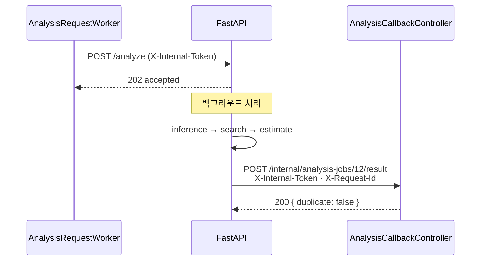

# 백엔드 ↔ AI 서버 API

## 목적

AI 서버가 노출하는 엔드포인트 5개와 백엔드가 받는 콜백 1개의 계약을 정리한다.

## 현재 구현

### AI 서버 엔드포인트 5개

| 메서드 | 경로 | 인증 | 운영 노출 |
| --- | --- | --- | --- |
| GET | `/health` | 없음 | ✓ |
| POST | `/inference` | `X-Internal-Token` | ✗ 내부망만 |
| POST | `/search` | `X-Internal-Token` | ✗ 내부망만 |
| POST | `/estimate` | `X-Internal-Token` | ✗ 내부망만 |
| POST | `/analyze` | `X-Internal-Token` | ✓ |

`Docs/AI/AI 서버 API 명세.md` 제약 6번 — "`/inference`·`/search`·`/estimate`는 개발 프로필·
내부망에서만 노출. 운영은 `/analyze`만 노출."

### `GET /health`

인증 없이 열려 있다. 응답 예시다.

```json
{
  "status": "ok",
  "modelsLoaded": false,
  "embeddingModelLoaded": false,
  "dbReachable": true,
  "configured": true,
  "analysisProfile": "production",
  "embeddingConfigured": true,
  "partWeightsPresent": true,
  "damageWeightsPresent": true
}
```

| 필드 | 의미 |
| --- | --- |
| `status` | 항상 `"ok"` (응답이 온다는 것 자체가 신호) |
| `modelsLoaded` | YOLO 2종이 프로세스 캐시에 있나. **기동 직후 false 가 정상** |
| `embeddingModelLoaded` | DINOv2 로드 여부 |
| `dbReachable` | DB 연결 가능 |
| `configured` | `AI_INTERNAL_TOKEN` 있고 `FEATURE_PIPELINE_VERSION_ID > 0` |
| `analysisProfile` | `production` / `mock` |
| `embeddingConfigured` | `DATABASE_URL` 설정 여부 |
| `partWeightsPresent` / `damageWeightsPresent` | 가중치 파일 존재 |

CI는 `status` · `configured` · `dbReachable` 셋으로 기동을 판정한다.
`modelsLoaded` 로 판정하지 않는다 — 지연 로드라 기동 직후 false다.

### `POST /analyze`

요청 (`AnalysisRequestPayload`):

```json
{
  "jobId": 12,
  "requestId": "req-12",
  "vehicle": {
    "modelId": 41,
    "manufacturer": "현대",
    "modelName": "아반떼",
    "carClass": "Compact",
    "modelYear": 2021
  },
  "images": [
    { "imageId": 501, "url": "https://<presigned GET URL>", "angleCode": null, "expiresAt": null }
  ],
  "callbackUrl": "http://172.26.8.28:8080/internal/analysis-jobs/12/result"
}
```

응답 `202`:

```json
{ "accepted": true, "jobId": 12, "requestId": "req-12" }
```

**접수 응답이지 결과가 아니다.** 결과는 콜백으로 온다.

`carClass` 는 `Compact` 처럼 **데이터셋 표기 그대로**다 — enum 이름이 아니다
(`AnalysisRequestPayload.Vehicle` javadoc).

`images[].url` 은 `RESIZED` 변형의 presigned GET URL이다.

### `POST /inference` (내부)

요청: `{ "images": [{ "imageId": ..., "url": "..." }] }` (최소 1장)

응답:

```json
{
  "models": {
    "part":   { "name": "vehicle-part-detection", "version": "35ep", "task": "detect" },
    "damage": { "name": "vehicle-damage-segmentation", "version": "60ep", "task": "segment" }
  },
  "normalization": {
    "schemaVersion": "1.2.0",
    "workRuleVersion": "damage-default-v1",
    "pipelineVersionId": 2
  },
  "imageResults": [
    {
      "imageId": 501, "width": 1600, "height": 1200,
      "excluded": false, "exclusionReason": null,
      "detections": [
        {
          "detectionId": "501:damage:damage-001",
          "partCode": "FRONT_BUMPER", "partRawLabel": "Front bumper",
          "damageType": "Scratched", "damageRawLabel": "Scratched",
          "pairStatus": "PAIRED", "searchability": "STRICT",
          "confidence": { "part": 0.96, "damage": 0.93 },
          "geometry": { "coordinateSystem": "...", "bboxFormat": "...", "bbox": [...],
                        "polygons": [...], "areaPx": ..., "areaRatio": ... }
        }
      ],
      "normalizationStats": { "detectionCount": 1, "droppedCount": 0, "dropReasons": [] }
    }
  ]
}
```

`exclusionReason` 은 `NOT_VEHICLE` 과 `RATIO_BELOW_THRESHOLD` 두 값만 허용된다
(백엔드 `ck_air_reason` CHECK 제약).

### `POST /search` (내부)

요청: `vehicle` + `images` + `imageResults`
응답: `{ "parts": [...], "vectorOnly": [...] }`

`parts` 는 `STRICT` 결과를 부품별로 병합한 것, `vectorOnly` 는 부품 미확정 결과다.
**`parts` 만 견적 항목이 된다.**

`FEATURE_PIPELINE_VERSION_ID` 가 0이면 `503 PIPELINE_NOT_CONFIGURED`.

### `POST /estimate` (내부)

요청: `{ "vehicle": ..., "parts": [...] }`
응답: `estimable` · `nonEstimableReason` · `confidenceGrade` · `totals` · `items` ·
`unresolvedParts`

`DATABASE_URL` 이 없거나 조회 실패면 `503 COST_DATA_UNAVAILABLE`.

### 콜백 `POST /internal/analysis-jobs/{jobId}/result`

**방향이 반대다** — AI가 백엔드를 부른다.

헤더:

| 헤더 | 용도 |
| --- | --- |
| `X-Internal-Token` | 공유 비밀 인증 |
| `X-Request-Id` | 멱등 키. 본문 `requestId` 와 같아야 함 |

성공 본문 주요 필드:

```json
{
  "requestId": "req-12",
  "jobId": 12,
  "modelVersion": "part-35ep/damage-60ep",
  "pipelineVersionId": 2,
  "estimable": true,
  "nonEstimableReason": null,
  "confidenceGrade": "MEDIUM",
  "totals": { "min": 300000, "median": 335500, "max": 380000 },
  "refCaseTotal": 2,
  "refYearFrom": 2021,
  "refYearTo": 2023,
  "items": [ ... ],
  "unresolvedParts": [],
  "imageResults": [ ... ],
  "error": null
}
```

실패 본문:

```json
{
  "requestId": "req-12", "jobId": 12,
  "pipelineVersionId": 2, "modelVersion": "unknown",
  "estimable": false,
  "error": { "code": "MODEL_ERROR", "message": "모델 실행 실패", "retryable": true }
}
```

응답 `200`:

```json
{ "jobId": 12, "status": "COMPLETED", "duplicate": false }
```

`duplicate: true` 면 같은 `requestId` 를 이미 처리해 저장하지 않았다는 뜻이다.

**이 응답은 `ApiResponse` 래퍼를 쓰지 않는다.** javadoc — "그 래퍼는 프론트와의 계약이고,
이쪽은" AI 서버와의 계약이다.

### 재시도

```python
CALLBACK_RETRY_DELAYS = (0, 1, 5, 20)
```

최초 + 1·5·20초 = 최대 4회.

## 동작 흐름



## 주요 구성 요소

| 구성 요소 | 파일 |
| --- | --- |
| AI 라우트 | `AI/server/app/api/routes.py` |
| AI 스키마 | `AI/server/app/schemas/contracts.py` |
| AI 토큰 검증 | `AI/server/app/core/security.py` |
| BE 요청 페이로드 | `backend/.../analysis/request/AnalysisRequestPayload.java` |
| BE 콜백 DTO | `backend/.../analysis/callback/AnalysisCallbackRequest.java` |

## 설정 및 실행 방법

| 변수 | 쪽 |
| --- | --- |
| `AI_SERVER_URL` | 백엔드 |
| `ANALYSIS_CALLBACK_BASE_URL` | 백엔드 |
| `INTERNAL_API_TOKEN` | 백엔드 |
| `AI_INTERNAL_TOKEN` | AI 서버 |
| `FEATURE_PIPELINE_VERSION_ID` | AI 서버 |
| `ANALYSIS_PROFILE` | AI 서버 |

## 오류 및 예외 처리

AI 서버 HTTP 상태:

| 상태 | 코드 |
| --- | --- |
| 401 | 토큰 불일치 |
| 404 | `IMAGE_FETCH_FAILED` |
| 422 | `INVALID_MODEL_OUTPUT` |
| 500 | `MODEL_ERROR` |
| 501 | `ANALYSIS_ORCHESTRATOR_NOT_IMPLEMENTED` |
| 503 | `PIPELINE_NOT_CONFIGURED` · `COST_DATA_UNAVAILABLE` |

콜백 `error.code` 4종: `IMAGE_FETCH_FAILED` · `INVALID_MODEL_OUTPUT` · `MODEL_ERROR` ·
`INTERNAL`.

## 관련 소스코드

- `Docs/Api/AI 연동 계약 (백엔드 ↔ AI 서버).md` — 계약 정본
- `Docs/Api/AI 서버 오류·재시도 처리 명세.md`
- `Docs/AI/AI 서버 API 명세.md`

## 근거 자료

- 소스 직접 확인
- 이 조사에서 직접 조회한 운영 `/health` 응답
- 계약 문서 3건

## 확인 필요 항목

- **`/search` · `/estimate` 요청 본문 정확한 스키마** — `contracts.py` 를 전수 확인하지 못함
- **`geometry.coordinateSystem` 값** — `PIXEL_XY` 로 추정
- **`normalizationStats.dropReasons`** — 값이 채워지는 경로를 확인하지 못함
- **`items[]` 항목 스키마** — 일부만 확인함
