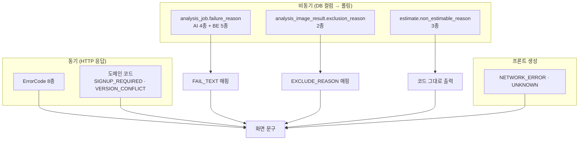

# 오류코드

## 목적

시스템에 존재하는 오류 코드를 출처별로 모은다. 같은 이름이 다른 의미로 쓰이는 곳이 있어
**어디서 나온 코드인지**를 함께 적는다.

## 현재 구현

### ① 백엔드 공통 (`ErrorCode`)

HTTP 응답 본문 `error.code` 에 들어간다.

| 코드 | HTTP | 의미 |
| --- | --: | --- |
| `INVALID_REQUEST` | 400 | 형식·검증 실패 |
| `UNAUTHORIZED` | 401 | 세션 없음·만료 |
| `FORBIDDEN` | 403 | 권한 없음 |
| `NOT_FOUND` | 404 | 없음 (**남의 리소스도 여기**) |
| `CONFLICT` | 409 | 중복·상태 충돌 |
| `TOO_MANY_REQUESTS` | 429 | 요청 과다 |
| `SERVICE_UNAVAILABLE` | 503 | 외부 의존 미설정·장애 |
| `INTERNAL_ERROR` | 500 | 처리되지 않은 오류 |

### ② 백엔드 도메인 코드

| 코드 | 출처 | 의미 |
| --- | --- | --- |
| `SIGNUP_REQUIRED` | 403 본문 | 가입 미완료 (`ROLE_SIGNUP_PENDING`) |
| `VERSION_CONFLICT` | `AdminErrorCode` | 관리자 마스터 동시 수정 (낙관적 락) |

### ③ 분석 작업 실패 사유 (`analysis_job.failure_reason`)

HTTP 응답이 아니라 **DB 컬럼**에 들어간다. 프론트가 폴링으로 읽는다.
`VARCHAR(50)` 제한이 있다.

출처가 둘로 나뉜다.

**AI 서버가 보낸 `error.code` (4종)**

| 코드 | `retryable` | 발생 |
| --- | --- | --- |
| `IMAGE_FETCH_FAILED` | `true` | presigned URL 다운로드 실패 |
| `MODEL_ERROR` | `true` | YOLO 실행 실패 |
| `INVALID_MODEL_OUTPUT` | `false` | 출력 형식 오류·ROI 임베딩 실패 |
| `INTERNAL` | `true` | 검색·비용 조회 실패 |

**백엔드가 판정한 값**

| 코드 | 발생 |
| --- | --- |
| `ALL_IMAGES_EXCLUDED` | 모든 사진이 제외됨 |
| `AI_UNREACHABLE` | AI 서버에 닿지 못함 |
| `ABANDONED` | `processing-timeout` 초과 |
| `NO_IMAGE` | 분석할 사진 없음 |
| `STORAGE_UNAVAILABLE` | 저장소 연결 실패 |

`AnalysisCallbackService.java:42~51` 주석이 구분을 명시한다 — "AI 가 보내는 `error.code` 와
같은 자리에 들어가지만 **출처가 다르다**."

### ④ 이미지 제외 사유 (`analysis_image_result.exclusion_reason`)

DB CHECK 제약으로 **2종만** 허용된다.

| 코드 | 화면 문구 |
| --- | --- |
| `NOT_VEHICLE` | 차량이 아닌 사진 |
| `RATIO_BELOW_THRESHOLD` | 차량이 너무 작게 찍힌 사진 |

```sql
CONSTRAINT ck_air_reason CHECK (exclusion_reason IS NULL
                          OR exclusion_reason IN ('NOT_VEHICLE','RATIO_BELOW_THRESHOLD'))
```

### ⑤ 산정 불가 사유 (`estimate.non_estimable_reason`)

**실패가 아니다.** 작업은 `COMPLETED` 로 끝난다.

| 코드 | 의미 |
| --- | --- |
| `PART_NOT_RESOLVED` | 사진이 전부 제외돼 부품을 확정할 수 없음 |
| `NO_DAMAGE_DETECTED` | 차는 찍혔으나 손상 미검출 |
| `INSUFFICIENT_CASES` | 유사 사례가 최소 표본(2)에 미달 |

`INSUFFICIENT_CASES` 는 `unresolvedParts[].reason` 에도 쓰인다 — 부분 견적에서 특정 부위만
산정하지 못한 경우다.

### ⑥ AI 서버 HTTP 오류

| 상태 | `detail.code` |
| --- | --- |
| 401 | (토큰 불일치) |
| 404 | `IMAGE_FETCH_FAILED` |
| 422 | `INVALID_MODEL_OUTPUT` |
| 500 | `MODEL_ERROR` |
| 501 | `ANALYSIS_ORCHESTRATOR_NOT_IMPLEMENTED` |
| 503 | `PIPELINE_NOT_CONFIGURED` |
| 503 | `COST_DATA_UNAVAILABLE` |

### ⑦ 프론트엔드 생성 코드

서버가 주지 않은 상황에 `api.js` 인터셉터가 만든다.

| 코드 | 상황 |
| --- | --- |
| `UNAUTHORIZED` | 401 인데 본문이 없을 때 |
| `NETWORK_ERROR` | `status === 0` (서버에 닿지 못함) |
| `UNKNOWN` | 본문도 없고 401도 아닐 때 |

`UploadView.vue` 는 업로드 실패를 `NETWORK` · `STORAGE` 로 자체 분류해 버튼 문구를 바꾼다.

### ⑧ 워커 실패 사유

| enum | 값 | 도메인 |
| --- | --- | --- |
| `AnalysisRequestFailure` | `ABANDONED` 등 | 분석 요청 |
| `EstimateNarrativeFailure` | `ABANDONED` 등 | 견적 요약 |
| `EstimateValidationFailure` | `ABANDONED` ("검증이 중단되었습니다. 다시 등록해 주세요.") | 견적서 검증 |
| `LoginFailureReason` | — | 로그인 |
| (PDF) | `FAILURE_ABANDONED` ("PDF 생성이 반복 실패해 중단되었습니다. 고객센터에 문의해 주세요.") | 견적 PDF |

PDF와 검증은 **한글 문구를 상수로 들고 있다.** 분석은 코드만 주고 화면이 문구를 정한다 —
정책이 도메인마다 다르다.

### 화면 문구 매핑

`AnalyzingView.vue` 의 `FAIL_TEXT` 가 코드 → 한국어를 맡는다. `photo: true` 는 재촬영으로
이끄는 사유다.

| 코드 | 문구 | 재촬영 |
| --- | --- | --- |
| `ALL_IMAGES_EXCLUDED` | 올린 사진이 모두 분석에서 제외됐어요… | O |
| `NO_IMAGE` | 분석할 사진이 없어요… | O |
| `IMAGE_FETCH_FAILED` | 사진을 불러오지 못했어요… | X |
| `MODEL_ERROR` | AI 분석 중 오류가 발생했어요… | X |
| `INVALID_MODEL_OUTPUT` | AI 분석 결과를 처리하지 못했어요… | X |
| `INTERNAL` | AI 서버에 일시적인 문제가 있어요… | X |
| `AI_UNREACHABLE` | AI 서버에 연결할 수 없어요… | X |
| `STORAGE_UNAVAILABLE` | 사진 저장소에 연결할 수 없어요… | X |
| `ABANDONED` | 분석이 제한 시간 안에 끝나지 않았어요… | X |
| (그 외) | 일시적인 문제일 수 있어요… | X |

**`nonEstimableReason` 에는 한국어 매핑이 없다.** `EstimateView.vue:270` ·
`ReportView.vue:186` 이 코드를 그대로 출력한다 — `INSUFFICIENT_CASES` 같은 영문이
사용자에게 보일 수 있다.

## 동작 흐름



## 주요 구성 요소

- `backend/.../common/exception/ErrorCode.java`
- `backend/.../admin/AdminErrorCode.java`
- `backend/.../analysis/request/AnalysisRequestFailure.java`
- `backend/.../estimate/narrative/EstimateNarrativeFailure.java`
- `backend/.../estimatevalidation/service/EstimateValidationFailure.java`
- `frontend/src/views/AnalyzingView.vue:20~50`
- `AI/server/app/services/analysis_service.py:25~27`

## 설정 및 실행 방법

해당 없음.

## 오류 및 예외 처리

처리 규칙은 [예외처리](../03_백엔드/예외처리.md)에 있다.

## 근거 자료

- enum 정의 직접 확인
- DDL CHECK 제약
- 프론트 상수 매핑

## 확인 필요 항목

- **`TOO_MANY_REQUESTS` 발생 지점** — 정의는 있으나 던지는 곳을 확인하지 못함
- **`LoginFailureReason` 값 목록** — 파일 존재만 확인함
- **`AnalysisRequestFailure` 전체 값** — `ABANDONED` 외 확인하지 못함
- **`nonEstimableReason` 한국어 매핑 부재** — 의도인지 미구현인지 확인하지 못함
- **`STORAGE_UNAVAILABLE` 발생 경로** — 프론트 매핑에는 있으나 백엔드에서 설정하는 곳을 확인하지 못함
