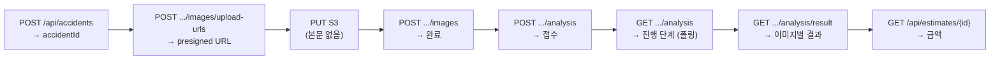

# 요청 · 응답 예시

## 목적

핵심 API의 실제 본문 모양을 보여 준다. 코드·테스트·목업에서 확인된 구조만 담았고,
지어낸 필드는 없다.

## 현재 구현

### 공통 래퍼

```json
// 성공
{ "data": { ... } }

// 실패
{ "error": { "code": "INVALID_REQUEST", "message": "..." } }
```

프론트가 `res.data.data` 로 꺼낸다 (`api.js`). 실패는 `error.code` · `error.message` 를 읽는다.

**예외**: `POST /internal/analysis-jobs/{jobId}/result` 응답은 래퍼를 쓰지 않는다.

### 사고 이력 목록 — `GET /api/accidents/me`

`stores/accidents.js` 의 목업이 서버 응답 모양을 그대로 따른다.

```json
{
  "data": {
    "items": [
      {
        "accidentId": 1,
        "vehicleId": 1,
        "vehicleInputType": "REGISTERED",
        "modelId": 14,
        "manufacturer": "현대",
        "modelName": "아반떼",
        "vehicleType": "SEDAN",
        "carClass": "Mid-size",
        "modelYear": 2021,
        "createdAt": "2026-09-19T...",
        "status": "ESTIMATED",
        "hiddenAt": null,
        "imageCount": 4,
        "thumbnailUrl": "...",
        "thumbnailExpiresAt": null,
        "estimateId": 1,
        "estimatedCostMin": 980000,
        "estimatedCostMedian": 1240000,
        "estimatedCostMax": 1620000,
        "checklistStatus": "COMPLETED"
      }
    ]
  }
}
```

| 필드 | 비고 |
| --- | --- |
| `vehicleInputType` | `REGISTERED` 등 |
| `status` | `ESTIMATED` 등 |
| `thumbnailUrl` · `thumbnailExpiresAt` | presigned GET URL과 만료 |
| `estimatedCost*` | 목록에서 바로 금액을 보여 주기 위해 견적 요약을 실음 |
| `checklistStatus` | 커밋 `b8c68bd` 로 추가 — "사고 목록에 체크리스트 상태를 실어 산정 불가 건이 빠지지 않게 한다" |

페이지 크기는 기본 20, 상한 100이다 (`stores/accidents.js` 주석).

### 차량 모델 목록 — `GET /api/vehicle-models`

```json
{
  "data": [
    { "modelId": 14, "manufacturer": "현대", "modelName": "아반떼",
      "vehicleType": "SEDAN", "carClass": "Mid-size" },
    { "modelId": 44, "manufacturer": "기아", "modelName": "쏘렌토",
      "vehicleType": "SUV", "carClass": "Full-size" }
  ]
}
```

`carClass` 는 `Compact` · `Mid-size` · `Full-size` 처럼 **데이터셋 표기**다.
운영 `vehicle_model` 은 51건이다.

### 사진 업로드 URL 발급 — `POST /api/accidents/{id}/images/upload-urls`

요청·응답 본문의 정확한 모양은 확인하지 못했다. 확인된 제약은 다음과 같다.

| 항목 | 값 |
| --- | --- |
| 허용 타입 | `image/jpeg` · `image/png` |
| 최대 크기 | 20MB (`20971520`) |
| 설정 키 | `app.accident-image.max-file-size-bytes` |

### AI 분석 요청 — `POST /analyze` (BE → AI)

```json
{
  "jobId": 12,
  "requestId": "req-12",
  "vehicle": { "modelId": 41, "carClass": "Compact" },
  "images": [{ "imageId": 501, "url": "https://example.test/image.jpg" }],
  "callbackUrl": "http://backend.test/internal/analysis-jobs/12/result"
}
```

(`AI/server/tests/test_analysis_service.py` 의 `_request()` 에서 가져온 실제 테스트 픽스처다.)

응답:

```json
{ "accepted": true, "jobId": 12, "requestId": "req-12" }
```

### AI 콜백 — 성공

```json
{
  "requestId": "req-12",
  "jobId": 12,
  "modelVersion": "part-35ep/damage-60ep",
  "pipelineVersionId": 3,
  "estimable": true,
  "nonEstimableReason": null,
  "confidenceGrade": "MEDIUM",
  "totals": { "min": 300000, "median": 335500, "max": 380000 },
  "refCaseTotal": 2,
  "refYearFrom": 2021,
  "refYearTo": 2023,
  "items": [
    {
      "partCode": "REAR_BUMPER",
      "damageType": "Scratched",
      "confidence": 0.93,
      "itemTotal": 335500,
      "refCaseCount": 2,
      "referencedCaseIds": [121381, 121414]
    }
  ],
  "unresolvedParts": [],
  "imageResults": [
    {
      "imageId": 501, "width": 1600, "height": 1200,
      "excluded": false, "exclusionReason": null,
      "detections": [
        {
          "detectionId": "501:damage:damage-001",
          "partCode": "REAR_BUMPER",
          "damageType": "Scratched",
          "pairStatus": "PAIRED",
          "searchability": "STRICT",
          "confidence": { "part": 0.96, "damage": 0.93 }
        }
      ]
    }
  ],
  "error": null
}
```

(`test_analysis_service.py` 의 `_damaged_image()` · `search_result` · `estimate_result`
픽스처에서 재구성했다.)

### AI 콜백 — 실패

```json
{
  "requestId": "req-12",
  "jobId": 12,
  "pipelineVersionId": 3,
  "modelVersion": "unknown",
  "estimable": false,
  "error": { "code": "MODEL_ERROR", "message": "모델 실행 실패", "retryable": true }
}
```

`modelVersion` 이 `"unknown"` 인 것은 추론 전에 실패했다는 뜻이다
(`analysis_service.UNKNOWN_MODEL_VERSION`).

### AI 콜백 — 사진 전부 제외

```json
{
  "imageResults": [
    { "imageId": 501, "excluded": true, "exclusionReason": "NOT_VEHICLE", "detections": [] }
  ],
  "estimable": false,
  "nonEstimableReason": "PART_NOT_RESOLVED",
  "error": null
}
```

백엔드가 `allImagesExcluded()` 로 판정해 `analysis_job.failure_reason = ALL_IMAGES_EXCLUDED`
로 실패 처리한다. 판정식은 `!imageResults.isEmpty() && allMatch(excluded)` 다.

### AI 콜백 — 손상 미검출

```json
{
  "imageResults": [
    { "imageId": 501, "excluded": false, "exclusionReason": null, "detections": [] }
  ],
  "estimable": false,
  "nonEstimableReason": "NO_DAMAGE_DETECTED",
  "error": null
}
```

**실패가 아니다.** 작업은 `COMPLETED` 로 끝나고 화면이 "손상을 찾지 못했어요"를 보여 준다.

### 콜백 응답

```json
{ "jobId": 12, "status": "COMPLETED", "duplicate": false }
```

중복 수신이면:

```json
{ "jobId": 12, "status": "COMPLETED", "duplicate": true }
```

### 견적 조회 — `GET /api/estimates/{estimateId}`

`api.js` javadoc이 구조를 적었다.

```
{ estimateId, jobId, version, estimable, nonEstimableReason, laborRate,
  totalHq, totalMin, totalMedian, totalMax, ... }
```

> `estimable=false` 면 금액이 전부 null 이고 `nonEstimableReason` 만 있다. 남의 견적은 404.

### 분석 진행 조회 — `GET /api/accidents/{id}/analysis`

`api.js` javadoc:

```
{ totalStages(4), doneStages, currentStage: PREPROCESS|DETECT|MATCH|ESTIMATE|null,
  stages[], excludedImages[] }
```

단계 4종: `PREPROCESS` → `DETECT` → `MATCH` → `ESTIMATE`.

### 분석 결과 조회 — `GET /api/accidents/{id}/analysis/result`

`api.js` javadoc:

```
{ images[{ imageId, angleCode, width, height, excluded, exclusionReason, detections[] }] }
```

주석에 `height` 가 "AI 가 분석한 축소본 픽셀 — bc67210" 이라고 적혀 있다.
**원본이 아니라 RESIZED 기준 좌표**다. 화면이 오버레이를 그릴 때 이 크기로 환산해야 한다.

## 동작 흐름



## 주요 구성 요소

- `frontend/src/lib/api.js` — 함수 javadoc에 응답 구조 기록
- `frontend/src/stores/accidents.js` · `vehicles.js` — 서버 모양 목업
- `AI/server/tests/test_analysis_service.py` — 테스트 픽스처
- `backend/src/test/java/com/ssafy/a307/analysis/AnalysisCallbackApiTest.java`

## 설정 및 실행 방법

Swagger UI(`/swagger-ui/index.html`)에서 실제 스키마를 볼 수 있다.

## 오류 및 예외 처리

[오류코드](오류코드.md) 참고.

## 근거 자료

- 프론트 목업 상수 (서버 응답 모양을 따르도록 작성됨)
- AI 서버 테스트 픽스처
- `api.js` 함수 javadoc

## 확인 필요 항목

- **업로드 URL 발급 요청·응답 정확한 본문** — DTO를 확인하지 못함
- **`POST /api/accidents` 요청 본문** — 필드 목록을 확인하지 못함
- **관리자 API 본문** — 34개 전부 확인하지 못함
- **목업이 현재 서버 응답과 일치하는지** — 작성 시점 기준이라 변경 가능성 있음
