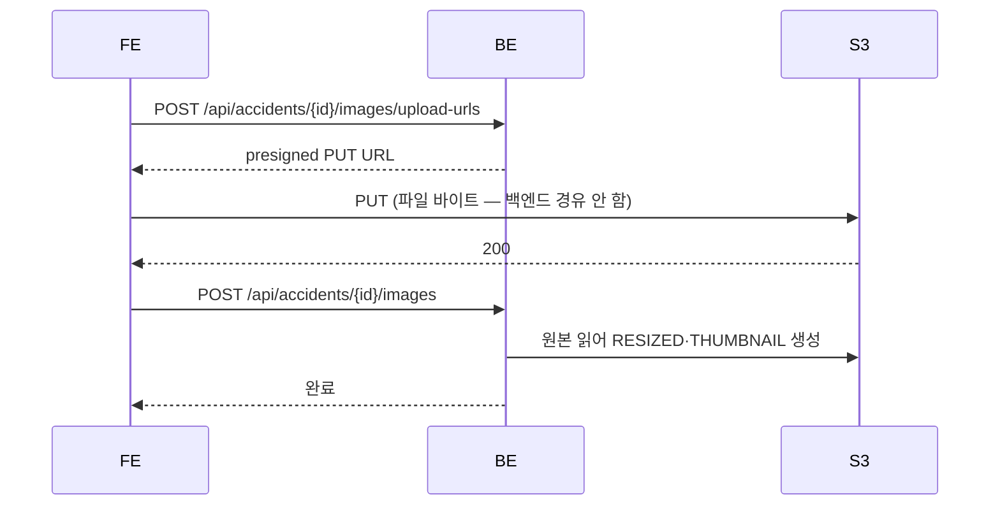

# 프론트엔드 ↔ 백엔드 API

## 목적

프론트가 실제로 호출하는 API만 추려, `lib/api.js` 함수와 백엔드 엔드포인트를 연결한다.
[API 전체 목록](API_전체_목록.md)이 서버가 가진 전부라면, 이 문서는 **실제로 쓰이는 것**이다.

## 현재 구현

### 호출 규약

| 항목 | 값 |
| --- | --- |
| 베이스 | `VITE_API_BASE_URL` |
| 인증 | `SESSION` HttpOnly 쿠키 (`withCredentials: true`) |
| 타임아웃 | 10초 |
| 성공 본문 | `{ "data": { ... } }` |
| 실패 본문 | `{ "error": { "code": "...", "message": "..." } }` |
| 재시도 | **없음** |

### 함수 ↔ 엔드포인트 대응

#### 인증·회원

| `api.js` 함수 | 메서드 | 경로 |
| --- | --- | --- |
| `loginUrl` | (리다이렉트) | `/oauth2/authorization/{provider}` |
| `fetchMe` | GET | `/api/auth/me` |
| `fetchSignupContext` | GET | `/api/auth/signup` |
| `signup` | POST | `/api/auth/signup` |
| `logout` | POST | `/api/auth/logout` |
| `fetchProfile` | GET | `/api/members/me` |
| `updateNickname` | PATCH | `/api/members/me` |
| `withdraw` | DELETE | `/api/members/me` |
| `issueProfileImageUploadUrl` | POST | `/api/members/me/profile-image/upload-url` |
| `completeProfileImage` | PUT | `/api/members/me/profile-image` |
| `deleteProfileImage` | DELETE | `/api/members/me/profile-image` |

#### 차량

| 함수 | 메서드 | 경로 |
| --- | --- | --- |
| `fetchVehicleModels` | GET | `/api/vehicle-models` |
| `fetchMyVehicles` | GET | `/api/vehicles/me` |
| `createVehicle` | POST | `/api/vehicles` |
| `updateVehicleYear` | PATCH | `/api/vehicles/{vehicleId}` |
| `deleteVehicle` | DELETE | `/api/vehicles/{vehicleId}` |

#### 사고·사진

| 함수 | 메서드 | 경로 |
| --- | --- | --- |
| `createAccident` | POST | `/api/accidents` |
| `fetchMyAccidents` | GET | `/api/accidents/me` |
| `fetchAccident` | GET | `/api/accidents/{accidentId}` |
| `setAccidentHidden` | PATCH | `/api/accidents/{accidentId}/hidden` |
| `issueAccidentImageUploadUrls` | POST | `/api/accidents/{accidentId}/images/upload-urls` |
| `completeAccidentImages` | POST | `/api/accidents/{accidentId}/images` |
| `fetchAccidentImages` | GET | `/api/accidents/{accidentId}/images` |
| `deleteAccidentImage` | DELETE | `/api/accidents/{accidentId}/images/{imageId}` |
| `uploadToPresignedUrl` | PUT | **S3 직접** (백엔드 아님) |

#### 분석·견적

| 함수 | 메서드 | 경로 |
| --- | --- | --- |
| `requestAnalysis` | POST | `/api/accidents/{accidentId}/analysis` |
| `fetchAnalysisProgress` | GET | `/api/accidents/{accidentId}/analysis` |
| `fetchAnalysisResult` | GET | `/api/accidents/{accidentId}/analysis/result` |
| `fetchAccidentEstimates` | GET | `/api/accidents/{accidentId}/estimates` |
| `fetchEstimate` | GET | `/api/estimates/{estimateId}` |
| `fetchEstimateReport` | GET | `/api/estimates/{estimateId}/report` |
| `requestEstimatePdf` | POST | `/api/estimates/{estimateId}/pdf` |
| `fetchEstimatePdfStatus` | GET | `/api/estimates/{estimateId}/pdf` |
| `estimatePdfDownloadUrl` | GET | `/api/estimates/{estimateId}/pdf/download` |

#### 정비 체크리스트

| 함수 | 메서드 | 경로 |
| --- | --- | --- |
| `fetchRepairChecklistStatus` | GET | `/api/accidents/{id}/repair-checklist` |
| `requestRepairChecklist` | POST | `/api/accidents/{id}/repair-checklist` |
| `regenerateRepairChecklist` | POST | `/api/accidents/{id}/repair-checklist/regenerate` |
| `addRepairChecklistItem` | POST | `/api/accidents/{id}/repair-checklist/items` |
| `updateRepairChecklistItem` | PATCH | `/api/accidents/{id}/repair-checklist/items/{itemId}` |
| `deleteRepairChecklistItem` | DELETE | `/api/accidents/{id}/repair-checklist/items/{itemId}` |
| `checkRepairChecklistItem` | PATCH | `/api/accidents/{id}/repair-checklist/items/{itemId}/check` |
| `memoRepairChecklistItem` | PATCH | `/api/accidents/{id}/repair-checklist/items/{itemId}/memo` |

### 프론트가 부르지 않는 백엔드 API

| 경로 | 이유 |
| --- | --- |
| `/api/admin/**` (34개) | 관리자 화면 미구현 |
| `/api/estimate-validations/**` (9개) | 견적서 검증 범위 제외 |
| `/api/accidents/{id}/repair-questions` (2개) | 정비소 질문 범위 제외 |
| `/api/repair-shops` | 카카오 지도 SDK 직접 연동으로 대체 |
| `/api/locations/**` (6개) | 동일 (일부만 사용 가능성, 확인 필요) |
| `/api/accidents/{id}/actual-cost` · `cost-comparison` | `api.js` 에 대응 함수 없음 |
| `/api/estimates/{id}/basis` · `similar-cases` | `api.js` 에 대응 함수 없음 |
| `/api/repair-cases/{caseId}` | `api.js` 에 대응 함수 없음 |
| `/api/guides/**` | `api.js` 에 대응 함수 없음 |
| `/api/accidents/{id}/analysis/retry` | `api.js` 에 대응 함수 없음 |

`api.js` 함수 48개 중 백엔드 호출은 약 38개다. 백엔드 엔드포인트 98개 중
**약 38개만 실제로 쓰인다.**

### 비동기 3종 폴링 패턴

| 작업 | 요청 | 상태 조회 | 결과 |
| --- | --- | --- | --- |
| 분석 | `POST .../analysis` | `GET .../analysis` | `GET .../analysis/result` |
| 견적 PDF | `POST .../pdf` | `GET .../pdf` | `GET .../pdf/download` |
| 체크리스트 | `POST .../repair-checklist` | `GET .../repair-checklist` | 상태 응답에 포함 |

**요청과 상태 조회가 같은 경로에 메서드만 다르다.** REST 관례에 맞고 경로가 늘지 않는다.

폴링 주기는 화면이 정한다 — `AnalyzingView.vue` 는 `POLL_MS = 2000`.

### 사진 업로드 3단계

프로필 이미지도 같은 3단계다 (`upload-url` → S3 PUT → `PUT /profile-image`).

## 주요 구성 요소

- `frontend/src/lib/api.js` — 함수 48개
- `backend/src/main/java/com/ssafy/a307/*/controller/`
- `Docs/Handover/김재원 담당 백엔드 API — FE 인수인계.md`

## 설정 및 실행 방법

`VITE_API_BASE_URL` 로 백엔드 주소를 지정한다. CORS 허용 오리진은 백엔드
`CORS_ALLOWED_ORIGINS` 와 맞아야 한다.

## 오류 및 예외 처리

| 상태 | 프론트 처리 |
| --- | --- |
| 401 | `onAuthError` → 로그인 화면 |
| 403 `SIGNUP_REQUIRED` | `onAuthError` → 가입 화면 |
| 403 (기타) | `ApiError` 반환 |
| 404 | `ApiError`. 남의 리소스도 404 |
| 503 | 저장소·LLM 미설정 |
| 네트워크 실패 | `code: NETWORK_ERROR` |

**어떤 상태에도 자동 재시도하지 않는다.**

## 관련 소스코드

- `frontend/src/lib/api.js`
- `frontend/src/views/AnalyzingView.vue` — 폴링
- `frontend/src/views/UploadView.vue` — 업로드 3단계

## 근거 자료

- `api.js` export 함수 목록
- 컨트롤러 매핑 추출 결과

## 확인 필요 항목

- **각 함수의 정확한 경로** — 함수명과 백엔드 경로를 의미로 대응시켰고, `api.js` 본문의 URL 문자열을 전수 대조하지 못함
- **`/api/locations/**` 사용 여부** — `lib/kakao.js` 가 SDK를 쓰는지 백엔드를 쓰는지 확인하지 못함
- **미사용 API 10여 개** — 의도적 예비인지 누락인지 확인하지 못함
- **요청 본문 스키마** — [요청 응답 예시](요청_응답_예시.md)에 일부만 담음
