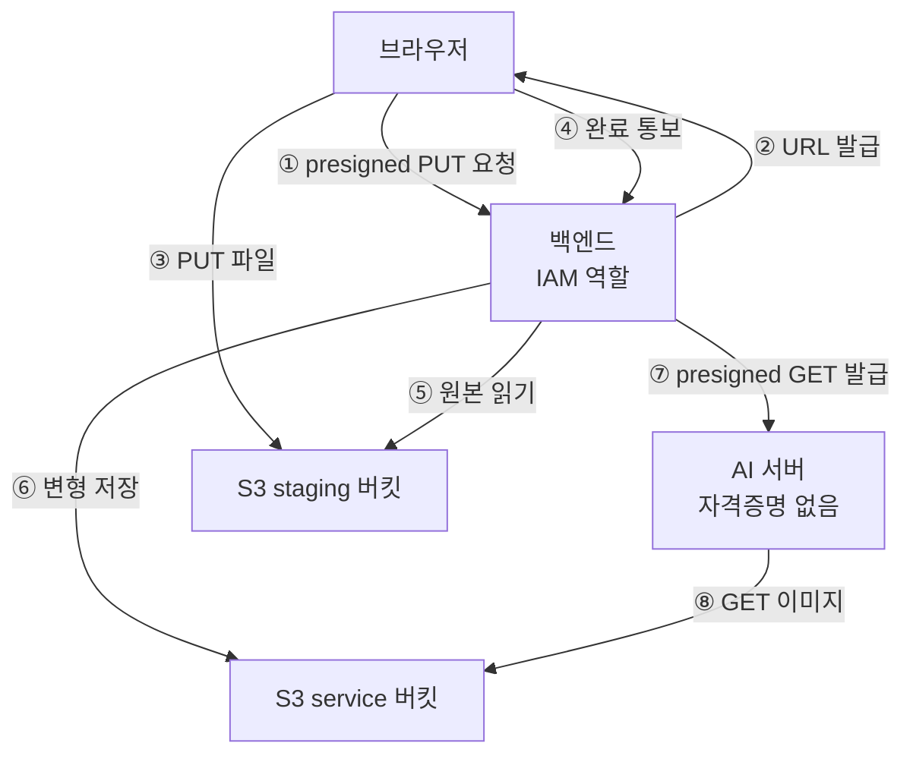

# AWS 구성

## 목적

사용하는 AWS 서비스와 자격증명 정책을 정리한다.

## 현재 구현

### 사용 서비스

| 서비스 | 용도 | 근거 |
| --- | --- | --- |
| **Amazon S3** | 이미지·문서 객체 저장 | `backend/build.gradle` 의 AWS SDK, `STORAGE_*_BUCKET` |
| 컴퓨팅 (EC2 또는 Lightsail) | 서버 2대 | 문서마다 표기가 다름 (아래) |

SDK는 **AWS SDK for Java v2** 다.

```gradle
implementation platform('software.amazon.awssdk:bom:2.29.52')
implementation 'software.amazon.awssdk:s3'
```

`build.gradle` 주석 — "presigner 는 별도 아티팩트가 아니라 s3 모듈에 들어 있다."

### 🔴 EC2 vs Lightsail — 문서끼리 다르다

루트 `README.md:176~177` 이 이 문제를 이미 기록했다.

> 배포 서버 종류(EC2/Lightsail)에 대해 문서끼리 서술이 다르다. **저장소에 IaC 가 없어
> 확인하지 못했다.**

| 표기 | 나오는 곳 |
| --- | --- |
| **EC2** | `SecurityConfig.java`, `AnalysisCallbackController.java`, `ObjectStorageProperties.java`, `S3AccidentImageStorage.java`, `S3DocumentStorage.java`, `ProfileImageProperties.java`, `S3ProfileImageStorage.java`, `Docs/AI/AI 서버 API 명세.md`, `Docs/Api/AI 연동 계약*.md`, `Docs/Architecture/*.md` |
| **Lightsail** | `AI/server/Dockerfile`, `Docs/Architecture/technology-architecture.md`, `Docs/README.md`, 루트 `README.md` |

**저장소에 IaC(Terraform·CloudFormation)가 없어** 어느 쪽인지 단정할 수 없다.
이 문서는 양쪽을 모두 기록하고 판단을 유보한다.

구분이 중요한 이유: **Lightsail에는 보안 그룹이 없다.** 방화벽 모델이 달라 네트워크 통제
방식이 바뀐다.

### 자격증명 — 기본 자격증명 체인

```gradle
// backend/build.gradle 주석
// 자격증명은 기본 체인(로컬 aws configure · 배포 EC2 IAM 역할)을 쓰므로
// 액세스 키를 설정 파일에 두지 않는다.
```

| 환경 | 자격증명 출처 |
| --- | --- |
| 로컬 | `~/.aws/credentials` (`aws configure`) |
| 배포 | 인스턴스 IAM 역할 |

**액세스 키를 코드·설정 파일에 두지 않는다.** `application.properties` 에도
`AWS_ACCESS_KEY_ID` 같은 키가 없다 — 참조하는 AWS 변수는 `AWS_REGION` 하나뿐이다.

배포에서 IAM 역할을 쓰면 키 순환·유출 관리가 필요 없다. **가장 안전한 방식이다.**

이 조사에서 로컬 `~/.aws` 자격증명으로 `aws s3 ls` 를 시도했더니 거부됐다.

```
AccessDenied: User: arn:aws:iam::<계정>:user/a307-dev is not authorized to perform:
s3:ListAllMyBuckets
```

**최소 권한 IAM 사용자**가 설정돼 있다는 증거다. 버킷 나열 권한조차 없다.

### 리전

| 항목 | 값 |
| --- | --- |
| 환경변수 | `AWS_REGION` |
| 로컬 설정 실측 | `ap-northeast-2` (서울) |

### 버킷 2개

```java
// common/storage/ObjectStorageProperties.java
@ConfigurationProperties(prefix = "app.object-storage")
```

| 속성 | 환경변수 | 용도 (javadoc) |
| --- | --- | --- |
| `stagingBucket` | `STORAGE_STAGING_BUCKET` | "업로드 격리용. 브라우저가 presigned PUT 으로 직접 올린다." |
| `serviceBucket` | `STORAGE_SERVICE_BUCKET` | "서비스 본문. 검증 통과본·프로필 이미지·견적서 원본·검증 PDF 가 여기 있다" |
| `region` | `AWS_REGION` | |

**업로드를 받는 버킷과 서비스하는 버킷을 나눴다.** 브라우저가 직접 쓰는 곳(staging)과
서비스가 읽는 곳(service)을 분리해, 검증 안 된 파일이 서비스 버킷에 들어가지 않게 한다.

프로필 이미지도 같은 구조다 — `PROFILE_IMAGE_STAGING_BUCKET` ·
`PROFILE_IMAGE_SERVICE_BUCKET`. `application.properties:330` 주석에 따르면
`app.object-storage.*` 와 같은 값을 쓸 수 있게 되어 있다.

`isConfigured()` 가 `region` · `stagingBucket` · `serviceBucket` 셋을 모두 요구한다.
하나라도 없으면 업로드 API가 `503` 이다.

### presigned URL

| 용도 | 방향 | 주체 |
| --- | --- | --- |
| 업로드 | PUT | 브라우저 |
| 분석 | GET | AI 서버 |
| 조회 | GET | 브라우저 (썸네일) |

유효 시간 설정 키가 있다 — `properties.downloadUrlValidity()`
(`AccidentImageDownloadUrls.java:71`). 실제 값은 확인하지 못했다.

## 동작 흐름



AI 서버는 **AWS 자격증명을 갖지 않는다.** presigned URL로만 접근한다.

## 주요 구성 요소

| 구성 요소 | 파일 |
| --- | --- |
| 저장소 속성 | `common/storage/ObjectStorageProperties.java` |
| 사고 이미지 S3 | `accident/image/S3AccidentImageStorage.java` |
| 프로필 이미지 S3 | `member/image/S3ProfileImageStorage.java` |
| 문서 S3 | `estimatevalidation/file/S3DocumentStorage.java` |
| 다운로드 URL | `accident/image/AccidentImageDownloadUrls.java` |
| 키 규칙 | `accident/image/AccidentImageKeys.java` |

## 설정 및 실행 방법

필요한 환경변수 (이름만):

```
AWS_REGION
STORAGE_STAGING_BUCKET · STORAGE_SERVICE_BUCKET
PROFILE_IMAGE_STAGING_BUCKET · PROFILE_IMAGE_SERVICE_BUCKET
```

로컬은 `aws configure` 로 자격증명을 설정한다.

## 오류 및 예외 처리

| 상황 | 결과 |
| --- | --- |
| 버킷 미설정 | 업로드 API `503` |
| presigned 만료 | 브라우저 PUT 실패 → `NETWORK` 재시도 |
| S3 장애 | `StorageUnavailable` → `503` |
| 썸네일 URL 발급 실패 | **예외 없이 로그만** (`AccidentImageDownloadUrls.java:74`) |

## 관련 소스코드

- `backend/build.gradle` — SDK·자격증명 주석
- `backend/src/main/java/com/ssafy/a307/common/storage/ObjectStorageProperties.java`
- `backend/src/main/java/com/ssafy/a307/accident/image/`

## 근거 자료

- 소스 javadoc·주석
- `aws configure get region` → `ap-northeast-2` (실측)
- `aws s3 ls` 거부 응답 (최소 권한 확인)
- 루트 `README.md:176`

## 확인 필요 항목

- **서버 종류 (EC2 / Lightsail)** — 현재 작업공간에서 근거를 확인하지 못함. IaC 없음
- **버킷 이름** — 환경변수라 저장소에서 확인할 수 없음
- **IAM 역할·정책 내용** — 확인하지 못함
- **presigned URL 유효 시간 실제 값** — 설정 키만 확인함
- **S3 버킷 정책·CORS 설정** — 브라우저 직접 PUT에 CORS가 필요하나 설정을 확인하지 못함
- **S3 수명 주기 정책** — 확인하지 못함
- **staging → service 승격 코드** — `copyObject` 호출을 찾지 못함. 승격 방식 확인 필요
