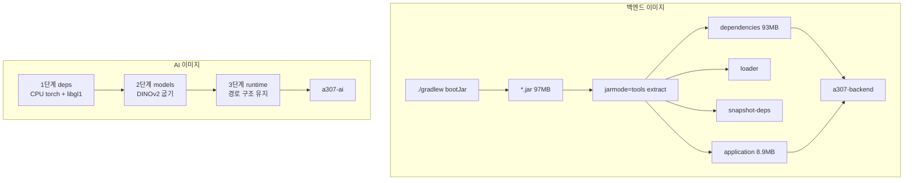

# Docker 구성

## 목적

이미지 2종과 로컬 compose 구성을 정리한다. 두 Dockerfile 모두 주석에 설계 근거가 남아 있다.

## 현재 구현

### 이미지 2종

| 이미지 | Dockerfile | 베이스 | 빌드 컨텍스트 |
| --- | --- | --- | --- |
| `a307-backend` | `backend/Dockerfile` | `eclipse-temurin:21-jre` | **저장소 루트** |
| `a307-ai` | `AI/server/Dockerfile` | `python:3.12-slim` | **저장소 루트** |

**둘 다 컨텍스트가 저장소 루트다.** 하위 디렉터리에서 빌드하면 깨진다.

### 백엔드 이미지 — 2단계 빌드

```dockerfile
FROM eclipse-temurin:21-jre AS extractor
COPY backend/build/libs/ ./libs/
RUN java -Djarmode=tools -jar "$JAR" extract --layers --launcher --destination extracted

FROM eclipse-temurin:21-jre
COPY --from=extractor --chown=a307:a307 /work/extracted/dependencies/          ./
COPY --from=extractor --chown=a307:a307 /work/extracted/spring-boot-loader/    ./
COPY --from=extractor --chown=a307:a307 /work/extracted/snapshot-dependencies/ ./
COPY --from=extractor --chown=a307:a307 /work/extracted/application/           ./
```

**안에서 Gradle을 돌리지 않는다.** 이유가 주석에 있다.

> 처음엔 멀티스테이지로 컨테이너 안에서 빌드했는데, 이 개발 환경에서는 컨테이너 egress 가
> 막혀 있어 Gradle 배포본·의존성을 받지 못했다(호스트는 되고 이미지 pull 도 되는데
> 컨테이너에서만 안 나간다).

미리 만든 jar를 쓰니 부수 효과가 더 컸다.

- 이미지 빌드가 수 초로 끝난다 (의존성 93MB를 다시 받지 않는다)
- 서버에서 빌드해도 Gradle 캐시가 필요 없다

**레이어를 나눈 이유**도 실측으로 적혀 있다.

| 구성 | 크기 |
| --- | --- |
| 전체 boot jar | 97MB |
| dependencies | 93MB |
| application | 8.9MB (PDF 한글 폰트 NotoSansKR 5.9MB 포함) |

한 덩이로 COPY하면 코드 한 줄만 고쳐도 97MB를 다시 민다. 레이어드 jar로 쪼개면 실제 전송이
**8.9MB** 로 준다.

Spring Boot 3.3+ 에서 `layertools` 가 없어져 `jarmode=tools` 를 쓴다.

**`apt-get` 을 쓰지 않는다.** 주석이 실측 확인 목록을 남겼다.

> 이 이미지(Ubuntu 26.04 기반)에 필요한 것이 이미 있다 — 실측 확인:
> `curl`(HEALTHCHECK 용), `libfreetype` · `libfontconfig` · `fc-list`, `java.desktop` 모듈
>
> 이 셋이 없으면 PDF 생성(openhtmltopdf-pdfbox)과 이미지 전처리(ImageIO·java.awt)가
> 런타임에 죽는다. **증상이 기동 실패가 아니라 "그 요청만 500" 이라 배포 후에야 드러난다.**
> 베이스 이미지를 바꿀 때는 위 셋이 있는지 다시 확인할 것.

런타임 설정:

```dockerfile
ENV TZ=Asia/Seoul
ENV LANG=C.UTF-8
ENV JAVA_OPTS="-XX:MaxRAMPercentage=75.0 -XX:+ExitOnOutOfMemoryError -Djava.awt.headless=true"
USER a307
EXPOSE 8080
HEALTHCHECK --interval=30s --timeout=3s --start-period=90s --retries=3 \
  CMD curl -sf http://localhost:8080/actuator/health || exit 1
```

`ExitOnOutOfMemoryError` 이유 — "OOM 뒤에 반쯤 죽은 채로 살아 있으면 헬스체크는 통과하는데
요청만 실패한다. 차라리 죽고 재시작되는 편이 낫다."

`mkdir -p /app/var/estimate-documents` 로 견적서 로컬 저장 경로를 만들고 쓰기 권한을 준다.

### AI 이미지 — 3단계 빌드

```
1단계 deps   : 의존성 설치 (CPU torch)
2단계 models : DINOv2 가중치를 이미지에 굽기
3단계 runtime: 실행
```

**디렉터리 구조를 그대로 유지한다.**

```dockerfile
COPY --chown=a307:a307 AI/models/damage/ ./AI/models/damage/
COPY --chown=a307:a307 AI/models/part/   ./AI/models/part/
COPY --chown=a307:a307 shared/           ./shared/
COPY --chown=a307:a307 AI/server/app/    ./AI/server/app/
```

이유가 주석에 있다.

> `app/core/bootstrap.py` 가 `REPO_ROOT = parents[4]` 로 저장소 루트를 찾아 `sys.path` 에
> 넣는다(`shared.vision` 임포트용). `app/core/config.py` 는 `AI_ROOT = parents[3]` 로 `AI/` 를
> 찾아 모델 가중치 기본 경로를 만든다. **평평하게 복사하면 둘 다 깨진다.**

**torch를 CPU 판으로 바꾼다.**

```dockerfile
RUN pip install --index-url https://download.pytorch.org/whl/cpu \
        torch==2.6.0 torchvision==0.21.0 \
 && grep -vE '^(torch|torchvision)==' /tmp/ai-requirements.txt > /tmp/ai-rest.txt \
 && pip install -r /tmp/ai-rest.txt -r /tmp/server-requirements.txt
```

> 배포 대상 인스턴스에는 GPU 가 없다. CUDA 휠을 넣으면 이미지가 6GB 를 넘는데 실제로는
> CPU 로 돈다. 결과는 같고 느릴 뿐이다.
> ※ GPU 인스턴스로 옮기면 이 블록을 되돌리고 `--index-url` 을 cu124 로 바꾼다.

**DINOv2 가중치를 굽는다.**

```dockerfile
FROM deps AS models
ENV HF_HOME=/opt/hf
RUN python -c "from transformers import AutoModel; \
  AutoModel.from_pretrained('facebook/dinov2-base', revision='f9e44c81...')"
```

> 런타임에 Hugging Face 에서 받게 두면 첫 요청이 느리고, 네트워크가 막히면 아예 죽는다.

런타임에 `HF_HUB_OFFLINE=1` 로 외부 접근을 막는다.

`libgl1` · `libglib2.0-0` 을 설치하는 이유 — "`opencv-python` 이 `libGL` 과 `glib` 를
링크한다. 없으면 import 에서 죽는다."

실행 설정:

```dockerfile
ENV PYTHONUNBUFFERED=1 PYTHONDONTWRITEBYTECODE=1
USER a307
EXPOSE 8000
HEALTHCHECK ... CMD curl -sf http://127.0.0.1:8000/health || exit 1
CMD ["uvicorn", "app.main:app", "--app-dir", "AI/server", "--host", "0.0.0.0", "--port", "8000"]
```

> `--reload` 를 쓰지 않는다. README 의 개발용 명령과 다른 점이다.
> 워커를 늘리지 않는 이유 — 모델이 프로세스마다 메모리에 올라가고
> `MAX_INFERENCE_CONCURRENCY` 기본값이 1 이다.

### 공통 원칙

| 원칙 | 두 이미지 모두 |
| --- | --- |
| 비-root 실행 | `uid 1001` 전용 계정 |
| 변경 빈도 낮은 것부터 COPY | 레이어 캐시 활용 |
| HEALTHCHECK 포함 | `curl -sf` |
| 컨텍스트는 저장소 루트 | |

### 로컬 compose

```yaml
services:
  db:    pgvector/pgvector:pg16  → 127.0.0.1:5432
  redis: redis:7-alpine          → 127.0.0.1:6379
volumes:
  a307-pgdata
  a307-redisdata
```

**애플리케이션은 들어 있지 않다.** 첫 줄 주석 — "IDE·gradle 로 띄우고 이 두 컨테이너에만 붙는다."

초기화 스크립트 4개를 `docker-entrypoint-initdb.d` 에 마운트한다 (DDL → 시드 → staging).
**데이터 디렉터리가 비어 있을 때만 실행**되므로, DDL이 바뀌면 `docker compose down -v` 가 필요하다.

헬스체크가 둘 다 있다 (`pg_isready`, `redis-cli ping`).

## 동작 흐름



## 주요 구성 요소

- `backend/Dockerfile`
- `AI/server/Dockerfile`
- `docker-compose.yml`

## 설정 및 실행 방법

```bash
# 백엔드
cd backend && ./gradlew bootJar -x test
cd .. && docker build -t a307-backend:latest -f backend/Dockerfile .

# AI
docker build -t a307-ai -f AI/server/Dockerfile .

# 로컬 인프라
docker compose up -d
```

## 오류 및 예외 처리

| 증상 | 원인 |
| --- | --- |
| AI 이미지에서 `import cv2` 실패 | `libgl1` 누락 |
| PDF 생성만 500 | 폰트 라이브러리·AWT 모듈 누락 |
| `shared.vision` import 실패 | 디렉터리 구조를 평평하게 복사함 |
| 첫 추론이 매우 느림 | 가중치를 런타임에 받음 (`HF_HUB_OFFLINE` 확인) |
| 백엔드 이미지 빌드 실패 | `bootJar` 를 먼저 안 돌림 |

## 관련 소스코드

- `backend/Dockerfile` · `AI/server/Dockerfile` · `docker-compose.yml`
- `AI/server/app/core/bootstrap.py` · `config.py` — 경로 계산

## 근거 자료

두 Dockerfile의 주석에 설계 근거와 실측값이 모두 기록돼 있다. 이 문서는 그것을 옮긴 것이다.

## 확인 필요 항목

- **이미지 실제 크기** — AI 이미지는 3.55GB (2026-09-21 `docker images` 실측). 백엔드는 확인하지 못함
- **베이스 이미지 버전 고정** — `eclipse-temurin:21-jre` · `python:3.12-slim` 에 다이제스트 고정이 없다. 재빌드 시 베이스가 바뀔 수 있음
- **이미지 레지스트리** — 로컬 빌드만 확인. 레지스트리 푸시가 없어 롤백이 서버의 로컬 이미지에 의존
- **`a307-db` 운영 컨테이너 생성 명령** — 저장소에 없음
