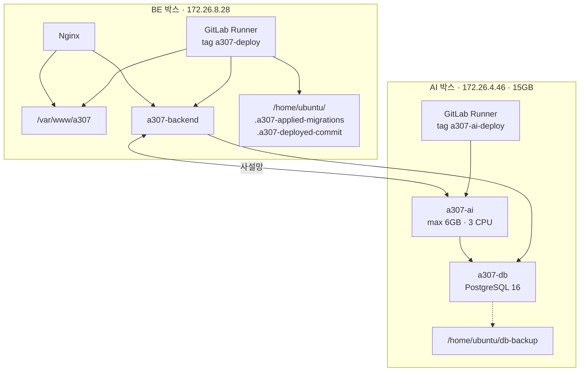

# EC2 구성

## 목적

컴퓨팅 인스턴스 2대의 역할·설치물·제약을 정리한다.

> **⚠️ 인스턴스 종류가 확정되지 않았다.** 문서마다 EC2와 Lightsail 표기가 섞여 있고
> 저장소에 IaC가 없다. 루트 `README.md:176` 이 이를 이미 기록했다.
> 이 문서는 명세의 폴더 이름을 따르되, 내용은 **"서버"** 로 적는다.
> 상세는 [AWS 구성](AWS_구성.md)에 있다.

## 현재 구현

### 서버 2대 역할

| | BE 박스 | AI 박스 |
| --- | --- | --- |
| 사설 IP | `172.26.8.28` | `172.26.4.46` |
| CI Runner 태그 | `a307-deploy` | `a307-ai-deploy` |
| Runner 실행 방식 | shell executor | shell executor |
| Nginx | ✓ | ✗ |
| 컨테이너 | `a307-backend` | `a307-ai`, `a307-db` |
| 공인 노출 | HTTP(S) | **없음** |

### BE 박스

| 항목 | 값 |
| --- | --- |
| 웹 루트 | `/var/www/a307` |
| 웹 루트 소유 | `ubuntu:www-data` |
| 백엔드 포트 | `127.0.0.1:8080`, `172.26.8.28:8080` |
| 헬스 URL | `http://127.0.0.1:8080/actuator/health` |
| 비밀값 파일 | `/etc/a307/backend.env` |
| 마이그레이션 원장 | `/home/ubuntu/.a307-applied-migrations` |
| 배포 마크 | `/home/ubuntu/.a307-deployed-commit` |

GitLab Runner가 이 박스에 shell executor로 설치돼 있어, **빌드와 배포를 같은 서버에서** 한다.
별도 빌드 서버가 없다.

원장 파일이 `/home/ubuntu` 에 있는 이유도 CI 주석에 있다 — "ubuntu 홈이라 Runner 가 쓸 수 있다."

포트를 두 개 여는 이유 — AI 박스에서 콜백이 와야 한다.

```
-p 127.0.0.1:8080:8080 -p 172.26.8.28:8080:8080
```

### AI 박스

| 항목 | 값 |
| --- | --- |
| AI 포트 | `172.26.4.46:8000` (사설 IP에만) |
| 헬스 URL | `http://172.26.4.46:8000/health` |
| 비밀값 파일 | `/etc/a307/ai.env` (권한 `-rw------- root root`) |
| DB 컨테이너 | `a307-db` |
| 백업 경로 | `/home/ubuntu/db-backup/` |
| 메모리 (실측) | 15GB, swap 0 |

CI 주석이 헬스 URL 함정을 적었다.

> 컨테이너를 `172.26.4.46` 에만 묶으므로 호스트의 `127.0.0.1:8000` 에는 아무것도 없다.
> 여기를 `127.0.0.1` 로 두면 서버가 멀쩡한데도 기동 확인이 30번 재시도 후 실패한다.

### 🔴 AI 박스의 메모리 제약

**운영 DB와 AI 모델이 같은 박스에 있다.** 이것이 가장 중요한 제약이다.

```
--memory=6g --memory-swap=6g --cpus=3
```

CI 주석:

> 메모리 상한은 선택이 아니다. 이 박스에는 PostgreSQL 이 같이 있고, 상한이 없으면 모델이
> 메모리를 먹다가 DB 를 끌고 내려간다. 그러면 BE 도 같이 죽는다 — `ddl-auto=validate` 라
> DB 가 없으면 재기동도 안 된다.

**swap이 0이라** 메모리가 넘치면 곧바로 OOM kill이다. 여유가 있어 보여도 순간 급증을 흡수할
완충이 없다.

15GB 중 AI 컨테이너가 최대 6GB를 쓰고, 나머지를 DB와 OS가 나눈다.

### 🔴 `/dev/shm` 64MB 제약

2026-09-21 HNSW 인덱스 재생성에서 확인된 사실이다.

```
ERROR: could not resize shared memory segment "/PostgreSQL.xxx" to 2144374176 bytes:
       No space left on device
```

`a307-db` 컨테이너의 `/dev/shm` 이 도커 기본값 **64MB** 다. pgvector의 HNSW 병렬 빌드가
`maintenance_work_mem` 크기만큼 공유 메모리를 여기에 잡으려다 실패한다.
**디스크가 아니라 `/dev/shm` 이다** — 박스 메모리가 14GB 남아 있어도 같은 오류가 난다.

해법: `SET max_parallel_maintenance_workers = 0` 으로 병렬 빌드를 끈다.
프로세스 전용 메모리를 쓰므로 `/dev/shm` 을 건드리지 않는다. 단일 스레드라
304,114건에 30분~1시간이 걸린다.

`--shm-size` 를 키우려면 `a307-db` 컨테이너를 다시 만들어야 하는데, 운영 DB가 그 안에 있어
택하지 않았다.

### 실행 사용자

| 대상 | 사용자 |
| --- | --- |
| SSH·Runner | `ubuntu` |
| 백엔드 컨테이너 프로세스 | `uid 1001` (`a307`) |
| AI 컨테이너 프로세스 | `uid 1001` (`a307`) |
| `/etc/a307/*.env` 소유 | `root` |

`ubuntu` 는 docker 그룹이다 — `docker rm` 이 sudo 없이 된다. 그러나 `/etc/a307/ai.env` 는
`0600 root:root` 라 `--env-file` 을 쓰려면 `sudo docker run` 이 필요하다.

docker 그룹 자체가 사실상 root 권한이므로 sudo를 붙여도 권한 경계가 새로 생기지는 않는다
(CI 주석도 같은 취지를 적었다).

## 동작 흐름



## 주요 구성 요소

- `.gitlab-ci.yml` — 두 박스의 배포 정의
- `Docs/Architecture/인프라 실행 교본.md`
- `Docs/Architecture/배포 준비 체크리스트.md`

## 설정 및 실행 방법

서버 프로비저닝 스크립트가 저장소에 없다. 수동 구성으로 **추정**된다.

컨테이너 재생성 (AI):

```bash
sudo docker rm -f a307-ai
sudo docker run -d --name a307-ai -p 172.26.4.46:8000:8000 \
  --env-file /etc/a307/ai.env \
  --memory=6g --memory-swap=6g --cpus=3 \
  --restart unless-stopped a307-ai:<태그>
```

## 오류 및 예외 처리

| 장애 | 영향 | 조치 |
| --- | --- | --- |
| AI 컨테이너 OOM | DB까지 위험 | 메모리 상한 유지 |
| DB 중단 | 백엔드 기동 불가 | DB 먼저 복구 |
| `/dev/shm` 부족 | 인덱스 생성 실패 | 병렬 빌드 끄기 |
| 디스크 부족 | 배포·restore 실패 | `df -h` 확인 |

**🔴 이 박스에서 치면 안 되는 명령**

```
docker system prune -a --volumes    → repair_case 가 사라진다
docker compose down -v              → 같은 이유
```

운영 DB가 이 박스에 있다. 이미지 정리는 `docker image prune -f` (dangling만)까지다.

## 관련 소스코드

- `.gitlab-ci.yml:39~55` — 변수 정의
- `.gitlab-ci.yml:240~` — `deploy-ai` 잡

## 근거 자료

- `.gitlab-ci.yml` 변수·주석
- 2026-09-21 AI 박스 직접 조회 (`free -g`, `df -h /dev/shm`, `ls -l /etc/a307/ai.env`)

## 확인 필요 항목

- **인스턴스 종류·스펙** — EC2/Lightsail 미확정. BE 박스 메모리·CPU 확인하지 못함
- **디스크 용량** — 확인하지 못함
- **OS 버전** — Ubuntu로 추정 (`ubuntu` 계정, `apt` 기반 이미지)
- **방화벽 규칙** — 보안 그룹 또는 ufw 설정을 확인하지 못함
- **서버 프로비저닝 절차** — IaC·스크립트가 없어 확인하지 못함
- **운영 Redis 위치** — 어느 박스인지 확인하지 못함
