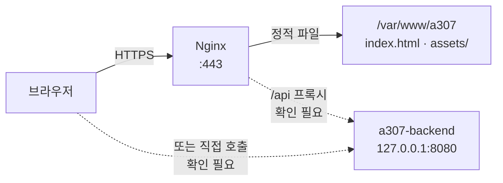

# Nginx 구성

## 목적

Nginx의 역할과 **저장소에서 확인할 수 없는 부분**을 명확히 구분해 기록한다.

## 현재 구현

### 🔴 Nginx 설정 파일이 저장소에 없다

```
find . -iname "*nginx*" -not -path "*/node_modules/*" -not -path "./.git/*"
→ (결과 없음)
```

`nginx.conf`, `sites-available/`, `default.conf` 등 **어떤 Nginx 설정 파일도 저장소에
존재하지 않는다.** 서버에서 직접 관리하는 것으로 **추정**된다.

따라서 이 문서의 대부분은 `확인 필요` 다. 아래는 **간접 증거로 확인된 사실만** 적는다.

### 확인된 사실

**1. Nginx가 설치돼 있고 CI가 reload 한다**

```sh
# .gitlab-ci.yml (deploy 잡)
sudo /usr/bin/systemctl reload nginx
```

절대 경로(`/usr/bin/systemctl`)를 쓴다 — sudoers에 이 명령만 허용했을 가능성이 있다.
`reload` 이지 `restart` 가 아니다. 무중단 설정 재적용이다.

**2. 웹 루트가 `/var/www/a307` 이다**

```sh
# .gitlab-ci.yml
WEB_ROOT: "/var/www/a307"
...
rm -rf "${WEB_ROOT:?}"/*
cp -r frontend/dist/* "$WEB_ROOT"/
chown -R ubuntu:www-data "$WEB_ROOT"
```

`${WEB_ROOT:?}` 의 `:?` 는 변수가 비었을 때 오류를 내는 bash 문법이다.
`rm -rf /*` 사고를 막는 방어다.

**3. 소유권이 `ubuntu:www-data` 다**

`www-data` 는 Debian/Ubuntu의 Nginx·Apache 실행 그룹이다.
Nginx 워커가 `www-data` 로 돌면서 파일을 읽는 구성으로 **추정**된다.

**4. 백엔드가 `127.0.0.1:8080` 에 열려 있다**

```
-p 127.0.0.1:8080:8080
```

외부에서 직접 못 들어온다. **Nginx가 프록시하는 구조**여야 한다.

**5. SPA 정적 파일을 서빙한다**

`frontend/dist/` 는 Vite 빌드 산출물(`index.html` + `assets/`)이다.

### 추정되는 구성

**아래는 모두 추정이며, 저장소에서 확인하지 못했다.**

```nginx
# 추정 — 실제 설정 파일을 확인하지 못함
server {
    listen 443 ssl;
    server_name <도메인>;           # 확인 필요

    root /var/www/a307;
    index index.html;

    location / {
        try_files $uri $uri/ /index.html;   # SPA 폴백 — 확인 필요
    }

    location /api {
        proxy_pass http://127.0.0.1:8080;   # 확인 필요
    }
}
```

SPA 폴백(`try_files ... /index.html`)이 없으면 `/estimate` 같은 경로를 새로고침했을 때
404가 난다. Vue Router가 history 모드라면 필요하다. **설정 여부를 확인하지 못했다.**

`/api` 프록시가 있는지도 확인하지 못했다. 프론트가 `VITE_API_BASE_URL` 로 **절대 주소**를
쓰기 때문에, 다른 오리진일 가능성도 있다. 그 경우 CORS가 관여한다.

### 판단 근거가 갈리는 지점

| 가정 | 근거 | 반증 |
| --- | --- | --- |
| Nginx가 `/api` 를 프록시한다 | 백엔드가 `127.0.0.1` 에만 열림 | `VITE_API_BASE_URL` 이 절대 주소 |
| 프론트와 API가 다른 오리진이다 | `CORS_ALLOWED_ORIGINS` 설정 존재 | 같은 오리진이면 CORS가 불필요 |

`CORS_ALLOWED_ORIGINS` 환경변수가 있고 `SecurityConfig` 가 이를 읽는다는 사실은,
**적어도 일부 상황에서 크로스 오리진 요청이 있다**는 뜻이다. 로컬 개발
(`localhost:5173` → `localhost:8080`)만을 위한 것일 수도 있다.

## 동작 흐름 (추정)



점선은 확인하지 못한 경로다.

## 주요 구성 요소

| 구성 요소 | 위치 | 상태 |
| --- | --- | --- |
| Nginx 설정 | 서버 (`/etc/nginx/`) | **저장소에 없음** |
| 웹 루트 | `/var/www/a307` | CI에서 확인 |
| TLS 인증서 | 서버 | 확인 필요 |

## 설정 및 실행 방법

배포 시 CI가 자동으로 한다.

```sh
rm -rf "${WEB_ROOT:?}"/*
cp -r frontend/dist/* "$WEB_ROOT"/
chown -R ubuntu:www-data "$WEB_ROOT"
sudo /usr/bin/systemctl reload nginx
```

**`rm -rf` 후 `cp` 라 그 사이에 접속하면 파일이 없다.** 짧지만 다운타임이 있다.
원자적 교체(심볼릭 링크 전환)를 쓰지 않는다.

## 오류 및 예외 처리

| 증상 | 추정 원인 |
| --- | --- |
| 새로고침 시 404 | SPA 폴백 미설정 |
| API 호출 CORS 오류 | `CORS_ALLOWED_ORIGINS` 불일치 |
| 배포 직후 짧은 502/404 | `rm -rf` → `cp` 사이 구간 |
| 정적 파일 권한 오류 | `chown` 실패 |

## 관련 소스코드

- `.gitlab-ci.yml` — `WEB_ROOT`, `systemctl reload nginx`
- `frontend/vite.config.js` — 빌드 설정
- `backend/src/main/java/com/ssafy/a307/config/CorsProperties.java`

## 근거 자료

- `.gitlab-ci.yml` 의 배포 명령
- 저장소 전체 검색 결과 (Nginx 설정 파일 0건)

## 확인 필요 항목

**이 문서 전체가 간접 증거에 기반한다.** 확인하지 못한 항목:

- **Nginx 설정 파일 전체** — 현재 작업공간에서 근거를 확인하지 못함
- **서버 도메인** — `server_name` 값
- **TLS 인증서** — 발급처·갱신 방식 (Let's Encrypt 추정)
- **SPA 폴백 설정** — `try_files` 여부
- **`/api` 프록시 여부** — 있는지, 경로가 무엇인지
- **정적 파일 캐시 헤더** — `Cache-Control` · `expires`
- **gzip/brotli 압축** — 설정 여부
- **업로드 크기 제한** — `client_max_body_size` (파일은 S3 직접 업로드라 불필요할 수 있음)
- **접근 로그 위치·형식**
- **Nginx 버전**
- **`www-data` 그룹 사용 여부** — 소유권 설정으로 추정
- **sudoers 설정** — `systemctl reload nginx` 만 허용하는지

**권고**: Nginx 설정을 저장소에 넣으면(`infra/nginx/` 등) 위 항목 대부분이 해소되고,
설정 변경 이력이 Git에 남는다.
