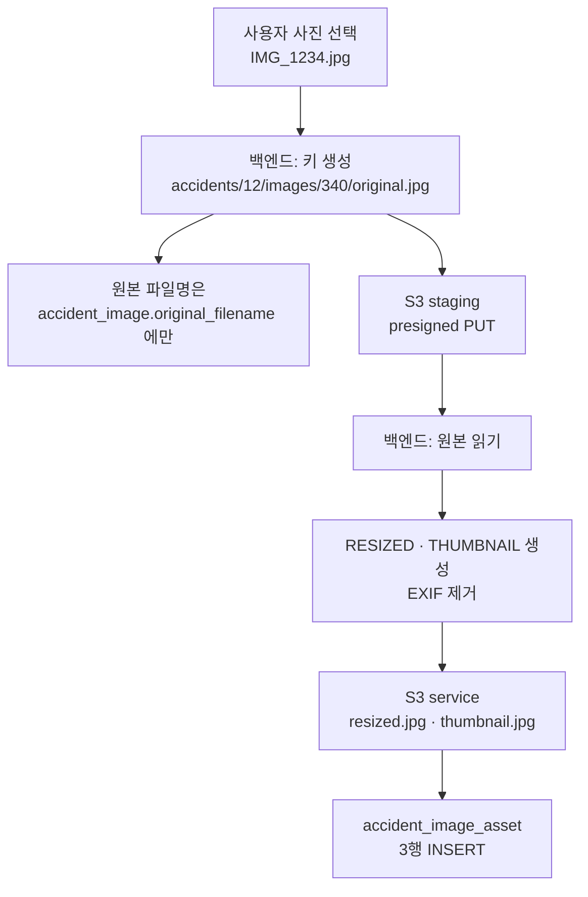

# S3 저장구조

## 목적

버킷 구성과 객체 키 규칙을 정리한다. 키 설계에 보안 판단이 들어 있어 그 근거도 함께 적는다.

## 현재 구현

### 버킷 2개 (+ 프로필용 2개)

| 속성 | 환경변수 | 용도 |
| --- | --- | --- |
| `stagingBucket` | `STORAGE_STAGING_BUCKET` | 업로드 격리. 브라우저가 presigned PUT으로 직접 올린다 |
| `serviceBucket` | `STORAGE_SERVICE_BUCKET` | 서비스 본문. 검증 통과본·프로필 이미지·견적서 원본·검증 PDF |
| (프로필) | `PROFILE_IMAGE_STAGING_BUCKET` | 프로필 업로드 격리 |
| (프로필) | `PROFILE_IMAGE_SERVICE_BUCKET` | 프로필 서비스 |

`application.properties:330` 주석에 따르면 프로필용은 `app.object-storage.*` 와 같은 값을
쓸 수 있다. 즉 **실제 버킷은 2개일 수 있다.**

버킷 이름은 환경변수라 저장소에서 확인할 수 없다. [보안 정보 제외]는 아니지만 값을 모른다.

### 키 규칙

```
accidents/{accidentId}/images/{imageId}/{variant}.{ext}
```

예시:

```
accidents/12/images/340/original.jpg
accidents/12/images/340/resized.jpg
accidents/12/images/340/thumbnail.jpg
```

`AccidentImageKeys.java` javadoc 첫 줄이 원칙을 못박는다.

> **키는 서버만 만든다** — 요청으로 받지 않는다.

### 키 설계 규칙 3가지

javadoc이 "규칙 세 가지가 의도적이다" 라고 적고 이유를 남겼다.

**1. 원본 파일명을 키에 넣지 않는다**

> 사용자 입력이 스토리지 경로에 들어가면 **경로 조작과 인코딩 문제**가 생긴다.
> 원본 파일명은 `accident_image.original_filename` 에만 둔다.

`../../etc/passwd` 같은 파일명이나 한글·이모지 파일명이 키에 들어가는 것을 원천 차단한다.

**2. variant 대소문자를 구분한다**

| 위치 | 표기 |
| --- | --- |
| S3 키 | 소문자 (`original`, `resized`, `thumbnail`) |
| DB `variant` 컬럼 | 대문자 (`ORIGINAL`, `RESIZED`, `THUMBNAIL`) |

키는 URL의 일부라 소문자가 관례이고, DB는 enum 상수명을 그대로 쓴다.

**3. ID 접두어로 일괄 처리가 가능하다**

> 사고·이미지 ID 로 접두어가 갈리므로 **사고 단위 일괄 삭제와 접근 제어를 접두어로 걸 수 있다.**

`accidents/12/` 접두어 하나로 그 사고의 모든 객체를 지우거나 IAM 정책을 걸 수 있다.

### 키 길이

```java
public static final int MAX_KEY_LENGTH = 500;
```

`accident_image_asset.s3_key VARCHAR(500)` 과 맞춘 값이다. javadoc이 여유를 계산해 두었다 —
"ID 가 19자리까지 커져도 100자를 넘지 않으므로 여유가 충분하다."

### 입력 검증

```java
if (accidentId <= 0) throw new IllegalArgumentException("accidentId must be positive");
if (imageId <= 0)    throw new IllegalArgumentException("imageId must be positive");
if (variant == null) throw new IllegalArgumentException("variant is required");
if (extension == null || extension.isBlank()) throw new IllegalArgumentException("extension is required");
```

`S3AccidentImageStorage.java:308` 에 역방향 검증도 있다.

```java
throw new IllegalArgumentException("storage key must end with /{variant}.{ext}");
```

키를 만들 때와 읽을 때 양쪽에서 형태를 확인한다.

### 객체 3종

| variant | 내용 | EXIF |
| --- | --- | --- |
| `original` | 사용자가 올린 원본 그대로 | 유지 |
| `resized` | 긴 변 기준 축소 (AI 분석용) | **제거** |
| `thumbnail` | 목록·미리보기용 축소 | **제거** |
| `blurred` | (생성 안 함) | — |

이미지 하나당 3개 객체가 생긴다. `uk_aia UNIQUE (image_id, variant)` 가 중복을 막는다.

### 접근 방식

| 주체 | 방식 | 권한 |
| --- | --- | --- |
| 브라우저 (업로드) | presigned PUT | 그 객체만, 한시적 |
| 브라우저 (조회) | presigned GET | 그 객체만, 한시적 |
| AI 서버 | presigned GET | 그 객체만, 한시적 |
| 백엔드 | SDK + IAM 역할 | 전체 |

**AWS 자격증명을 가진 것은 백엔드뿐이다.**

### 객체 크기 제한

| 항목 | 값 |
| --- | --- |
| 사고 이미지 | 20MB (`20971520`) |
| 프로필 이미지 | 5MB |
| DB CHECK | `ck_aia_size CHECK (file_size IS NULL OR file_size <= 20971520)` |

DB 제약과 애플리케이션 상수가 일치한다.

## 동작 흐름



## 주요 구성 요소

| 구성 요소 | 파일 |
| --- | --- |
| 키 규칙 | `accident/image/AccidentImageKeys.java` |
| 저장소 포트 | `accident/image/AccidentImageStoragePort.java` |
| S3 구현 | `accident/image/S3AccidentImageStorage.java` |
| 다운로드 URL | `accident/image/AccidentImageDownloadUrls.java` |
| 버킷 속성 | `common/storage/ObjectStorageProperties.java` |
| 프로필 이미지 | `member/image/S3ProfileImageStorage.java` |
| 문서 저장 | `estimatevalidation/file/S3DocumentStorage.java` |

## 설정 및 실행 방법

```
AWS_REGION
STORAGE_STAGING_BUCKET
STORAGE_SERVICE_BUCKET
PROFILE_IMAGE_STAGING_BUCKET
PROFILE_IMAGE_SERVICE_BUCKET
```

셋(`region`·`staging`·`service`)이 모두 있어야 `isConfigured()` 가 참이다.
하나라도 없으면 업로드 API가 `503`.

## 오류 및 예외 처리

| 상황 | 처리 |
| --- | --- |
| 버킷 미설정 | `503` |
| 키 형식 위반 | `IllegalArgumentException` |
| 객체 없음 | `unavailable("이미지 메타를 읽지 못했다", ...)` |
| 썸네일 URL 발급 실패 | **로그만 남기고 계속** |
| 업로드 실패 | 프론트가 `STORAGE` 로 분류 |

## 관련 소스코드

- `backend/src/main/java/com/ssafy/a307/accident/image/AccidentImageKeys.java`
- `backend/src/main/java/com/ssafy/a307/accident/image/S3AccidentImageStorage.java`
- `Docs/Erd/A307_ddl_final.sql` — `accident_image_asset`

## 근거 자료

- `AccidentImageKeys.java` javadoc (키 규칙과 설계 근거)
- `ObjectStorageProperties.java` javadoc (버킷 용도)
- DDL CHECK 제약

## 확인 필요 항목

- **실제 버킷 이름** — 환경변수라 확인할 수 없음
- **staging → service 승격 코드** — `copyObject` 호출을 찾지 못함. 두 버킷을 실제로 어떻게 나눠 쓰는지 확인 필요
- **프로필 이미지 키 규칙** — `S3ProfileImageStorage` 를 확인하지 못함
- **견적서 문서 키 규칙** — `S3DocumentStorage` 를 확인하지 못함
- **버킷 CORS 설정** — 브라우저 직접 PUT에 필요하나 설정을 확인하지 못함
- **객체 수명 주기·버전 관리** — 확인하지 못함
- **S3 객체 삭제 경로** — DB CASCADE가 S3까지 가지 않는다. [데이터 보존 정책](../05_데이터/데이터_보존_정책.md) 참고
