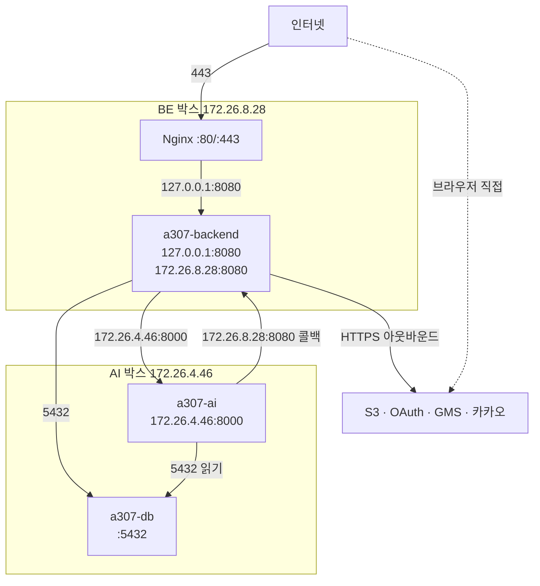

# 네트워크와 포트

## 목적

포트 바인딩과 통신 경로를 정리한다. 이 프로젝트는 **바인딩 주소로 접근을 통제**하므로
`0.0.0.0` 이냐 특정 IP냐가 보안 경계다.

## 현재 구현

### 포트 일람

| 서비스 | 포트 | 바인딩 | 노출 범위 | 근거 |
| --- | --: | --- | --- | --- |
| Nginx | 80 / 443 | (추정) `0.0.0.0` | 인터넷 | 확인 필요 |
| 백엔드 | 8080 | `127.0.0.1` + `172.26.8.28` | 로컬 + 사설망 | `.gitlab-ci.yml` |
| AI 서버 | 8000 | `172.26.4.46` | **사설망만** | `.gitlab-ci.yml` |
| PostgreSQL (운영) | 5432 | (확인 필요) | 사설망 | |
| PostgreSQL (로컬) | 5432 | `127.0.0.1` | 로컬만 | `docker-compose.yml` |
| Redis (로컬) | 6379 | `127.0.0.1` | 로컬만 | `docker-compose.yml` |
| Vite 개발 서버 | 5173 | `--host` 로 LAN | LAN | `vite.config.js` |

### 바인딩 결정과 그 이유

**백엔드 — 포트 2개를 여는 이유**

```sh
-p 127.0.0.1:8080:8080 -p 172.26.8.28:8080:8080
```

CI 주석:

> BE 박스 사설 IP. AI 서버가 결과 콜백(`/internal/analysis-jobs/*/result`)을 보낼 때 여기로
> 온다. **8080 을 127.0.0.1 에만 묶으면 AI 박스에서 닿지 못한다.**

Nginx는 `127.0.0.1` 로, AI 서버는 `172.26.8.28` 로 접근한다. 공인 인터페이스에는 열지 않는다.

**AI 서버 — 사설 IP에만**

```sh
-p 172.26.4.46:8000:8000
```

> 포트는 사설 IP 에만 묶는다. 공인 인터페이스에는 열지 않는다.

부작용이 하나 있고 주석이 경고한다.

> 컨테이너를 `172.26.4.46` 에만 묶으므로 호스트의 `127.0.0.1:8000` 에는 아무것도 없다.
> 여기를 `127.0.0.1` 로 두면 서버가 멀쩡한데도 기동 확인이 30번 재시도 후 실패한다.

그래서 CI 헬스체크 URL이 `http://172.26.4.46:8000/health` 다.

**로컬 compose — `127.0.0.1` 강제**

```yaml
- "127.0.0.1:${DB_PORT:-5432}:5432"
```

> `127.0.0.1` 로 묶는다. `"5432:5432"` 라고 쓰면 모든 인터페이스에 열려 같은 공유기에 붙은
> 다른 기기에서도 접근할 수 있다.

Redis도 같다 — "비밀번호 없이 뜨므로 외부 인터페이스에 열어두면 안 된다."

**이 값이 저장소에 있어도 되는 이유**도 적혀 있다 — 포트가 로컬에만 묶여 있고 운영 DB는
이 파일을 쓰지 않기 때문이다.

### 통신 경로



**인터넷에서 직접 닿는 것은 Nginx뿐이다.**

### 사설 IP 대역

`172.26.x.x` 는 RFC 1918 사설 대역이다. 두 박스가 같은 VPC/서브넷에 있다.

| 박스 | 사설 IP | 서브넷 |
| --- | --- | --- |
| BE | `172.26.8.28` | `172.26.8.0/x` (추정) |
| AI | `172.26.4.46` | `172.26.4.0/x` (추정) |

서브넷이 달라 보이지만 서로 통신한다 — 같은 VPC 안의 다른 서브넷이거나 더 큰
대역(`172.26.0.0/16`)일 것으로 **추정**된다.

### 아웃바운드

| 대상 | 주체 | 프로토콜 |
| --- | --- | --- |
| S3 | 백엔드 | HTTPS |
| 카카오·구글 OAuth2 | 백엔드 | HTTPS |
| 카카오 로컬 API | 백엔드 | HTTPS |
| SSAFY GMS | 백엔드 | HTTPS |
| S3 (presigned GET) | AI 서버 | HTTPS |
| Hugging Face | AI 서버 | **차단** (`HF_HUB_OFFLINE=1`) |

AI 서버는 런타임에 모델을 받지 않는다. 빌드 때 이미지에 구워 두고 오프라인으로 돈다.

`backend/Dockerfile` 주석이 이 환경의 특성을 적었다 — "이 개발 환경에서는 컨테이너 egress 가
막혀 있어" Gradle 의존성을 받지 못했다. **컨테이너 아웃바운드가 제한적**이라는 뜻인데,
S3·GMS 호출은 되는 것으로 보아 전면 차단은 아니다.

### 내부 API 보호 2겹

`AnalysisCallbackController` javadoc:

> `X-Internal-Token` 공유 비밀과 **네트워크 차단**(사설 IP) 두 겹으로 막는다.

| 겹 | 수단 |
| --- | --- |
| 1 | 사설 IP 바인딩 — 인터넷에서 못 닿음 |
| 2 | `X-Internal-Token` 헤더 검증 |

추가로 `SecurityConfig` 가 `/internal/**` 중 콜백 하나만 열고 나머지를 `denyAll()` 한다.

### SSH

| 항목 | 값 |
| --- | --- |
| 계정 | `ubuntu` |
| 포트 | 22 (추정) |
| 인증 | 키 기반 (`.pem`) |

## 주요 구성 요소

- `.gitlab-ci.yml` — 포트 바인딩 정의
- `docker-compose.yml` — 로컬 포트
- `frontend/vite.config.js` — 개발 서버 포트

## 설정 및 실행 방법

로컬 포트 충돌 시 루트에 `.env` 를 만들어 덮는다 (`.gitignore` 처리됨).

```
DB_PORT=15432
REDIS_PORT=16379
```

`docker-compose.yml` 주석이 경고한다 — "애플리케이션 쪽 `spring.datasource.url` ·
`spring.data.redis.port` 도 같이 맞춰야 한다."

## 오류 및 예외 처리

| 증상 | 원인 |
| --- | --- |
| AI 기동 확인 30회 실패 | 헬스 URL을 `127.0.0.1` 로 둠 |
| 콜백이 안 옴 | 백엔드가 사설 IP에 안 열림 |
| 로컬 compose 기동 실패 | 5432·6379 포트 충돌 |
| 휴대폰에서 개발 서버 접속 불가 | `--host` 누락 |

## 관련 소스코드

- `.gitlab-ci.yml:55` — `PRIVATE_IP`
- `.gitlab-ci.yml:258` — `AI_HEALTH`
- `docker-compose.yml`

## 근거 자료

- CI·compose 설정과 주석
- `AnalysisCallbackController` javadoc

## 확인 필요 항목

- **방화벽 규칙** — 보안 그룹 또는 ufw 설정을 확인하지 못함. 인스턴스 종류가 미확정이라 방화벽 모델도 미확정
- **Nginx 리슨 포트·TLS** — 설정 파일이 없어 확인하지 못함
- **운영 PostgreSQL 포트 바인딩** — `a307-db` 의 `-p` 설정을 확인하지 못함
- **운영 Redis 위치와 포트** — 확인하지 못함
- **VPC·서브넷 구성** — IaC가 없어 확인하지 못함
- **SSH 포트·접근 제한** — 확인하지 못함
- **아웃바운드 제한 범위** — 컨테이너 egress가 일부 막혀 있다는 주석만 있고 규칙을 확인하지 못함
