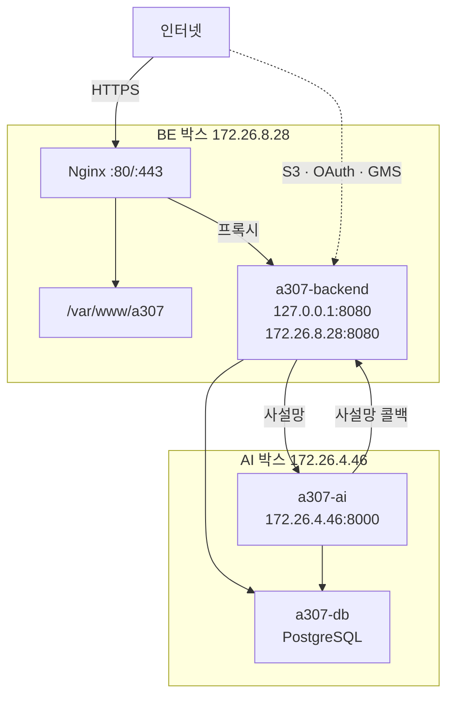

# 인프라 구성

## 목적

운영 환경을 이루는 서버·컨테이너·외부 서비스를 정리한다.

## 현재 구현

### 서버 2대

`.gitlab-ci.yml` 의 배포 잡 두 개가 서로 다른 Runner 태그를 쓰는 것으로 확인된다.

| | BE 박스 | AI 박스 |
| --- | --- | --- |
| Runner 태그 | `a307-deploy` | `a307-ai-deploy` |
| 사설 IP | `172.26.8.28` | `172.26.4.46` |
| Nginx | ✓ | ✗ |
| 프론트 정적 파일 | `/var/www/a307` | ✗ |
| 백엔드 컨테이너 | `a307-backend` | ✗ |
| AI 컨테이너 | ✗ | `a307-ai` |
| PostgreSQL | ✗ | `a307-db` |
| GitLab Runner | ✓ (shell executor) | ✓ |

**운영 DB가 AI 박스에 있다.** `.gitlab-ci.yml` 의 `deploy-ai` 잡 주석이 이를 전제로 한다.

> 🔴 메모리 상한은 선택이 아니다. 이 박스에는 PostgreSQL 이 같이 있고, 상한이 없으면 모델이
> 메모리를 먹다가 DB 를 끌고 내려간다. 그러면 BE 도 같이 죽는다.

AI 박스 실측 메모리는 **15GB** (`free -g` 기준, 2026-09-21). swap은 0이다.

### 컨테이너 3종

| 컨테이너 | 이미지 | 포트 바인딩 | 제한 |
| --- | --- | --- | --- |
| `a307-backend` | `a307-backend:{SHA}` | `127.0.0.1:8080` + `172.26.8.28:8080` | `MaxRAMPercentage=75` |
| `a307-ai` | `a307-ai:{SHA}` | `172.26.4.46:8000` | `--memory=6g --memory-swap=6g --cpus=3` |
| `a307-db` | PostgreSQL 16 + pgvector | (사설) | — |

백엔드가 포트를 **두 개** 여는 이유가 CI 주석에 있다 — "8080 을 127.0.0.1 에만 묶으면
AI 박스에서 닿지 못한다." AI가 콜백을 사설 IP로 보내기 때문이다.

AI 컨테이너는 **사설 IP에만** 8000을 연다. 공인 인터페이스에는 열지 않는다.

모든 컨테이너가 `--restart unless-stopped` 다.

### 외부 서비스

| 서비스 | 용도 | 설정 |
| --- | --- | --- |
| Amazon S3 | 이미지 객체 저장 | `STORAGE_STAGING_BUCKET` · `STORAGE_SERVICE_BUCKET` |
| 카카오 OAuth2 | 소셜 로그인 | `KAKAO_CLIENT_ID` · `KAKAO_CLIENT_SECRET` |
| 구글 OAuth2 | 소셜 로그인 | `GOOGLE_CLIENT_ID` · `GOOGLE_CLIENT_SECRET` |
| 카카오 로컬 API | 정비소 검색 (서버) | `KAKAO_REST_API_KEY` |
| 카카오 지도 SDK | 정비소 검색 (브라우저) | `VITE_KAKAO_JS_KEY` |
| SSAFY GMS | LLM 프록시 | `GMS_KEY` · `GMS_PROVIDER` · `GMS_MODEL` · `GMS_OPENAI_API` |

LLM은 OpenAI를 직접 부르지 않고 **SSAFY GMS 프록시**를 경유한다.
`.gitlab-ci.yml` 주석 기준 운영값은 `GMS_PROVIDER=OPENAI` · `GMS_MODEL=gpt-5.4` ·
`GMS_OPENAI_API=chat` 이다.

### 비밀값 배치

| 위치 | 내용 |
| --- | --- |
| `/etc/a307/backend.env` | 백엔드 비밀값 (DB·OAuth·AWS·GMS_KEY) |
| `/etc/a307/ai.env` | AI 서버 비밀값 (토큰·DATABASE_URL) |
| GitLab CI/CD Variables | `VITE_API_BASE_URL` · `VITE_KAKAO_JS_KEY` 둘뿐 |

CI 주석이 정책을 적었다.

> 백엔드 비밀값(DB·OAuth·AWS 키)은 서버의 `/etc/a307/backend.env` 에만 있고 컨테이너에
> `--env-file` 로 들어간다. CI 변수로 옮기면 파이프라인 로그·아티팩트·포크 MR 로 새어 나갈
> 경로가 늘어난다.

파일 권한은 `-rw------- root root` 다 (2026-09-21 실측). `ubuntu` 계정으로 `--env-file` 을
쓰려면 `sudo` 가 필요하다.

**모든 비밀값은 [보안 정보 제외]이며 이 문서에 적지 않는다.**

### 네트워크 구성



**AI 서버와 DB는 인터넷에 노출되지 않는다.** 사설 IP에만 바인딩한다.

### 로컬 개발 인프라

`docker-compose.yml` 이 PostgreSQL + Redis만 띄운다. 애플리케이션은 포함하지 않는다.

| 컨테이너 | 이미지 | 포트 |
| --- | --- | --- |
| `a307-db` | `pgvector/pgvector:pg16` | `127.0.0.1:5432` |
| `a307-redis` | `redis:7-alpine` | `127.0.0.1:6379` |

둘 다 `127.0.0.1` 에만 묶는다 — "같은 공유기에 붙은 다른 기기에서도 접근할 수 있다" 를 막기
위해서다.

이름이 운영과 같다(`a307-db`). 구분은 **계정**으로 한다 — 로컬 `a307`, 운영 `jaewon`.

## 동작 흐름

배포 흐름은 [배포 구조](../08_배포_CICD/배포_구조.md)에 있다.

## 주요 구성 요소

| 구성 요소 | 파일 |
| --- | --- |
| CI 배포 정의 | `.gitlab-ci.yml` |
| 백엔드 이미지 | `backend/Dockerfile` |
| AI 이미지 | `AI/server/Dockerfile` |
| 로컬 인프라 | `docker-compose.yml` |
| 기존 인프라 문서 | `Docs/Architecture/인프라 실행 교본.md`, `배포 준비 체크리스트.md` |

## 설정 및 실행 방법

로컬:

```bash
docker compose up -d
```

운영 배포는 `develop` 브랜치 머지로 자동 실행된다.

## 오류 및 예외 처리

| 장애 | 영향 |
| --- | --- |
| AI 컨테이너 중단 | 분석만 실패 (`AI_UNREACHABLE`). 나머지 기능은 동작 |
| DB 중단 | **백엔드까지 기동 불가** (`ddl-auto=validate`) |
| Redis 중단 | 전원 로그아웃. 데이터 손실 없음 |
| Nginx 중단 | 전체 접속 불가 |
| S3 장애 | 업로드·조회 실패 (`503`) |

DB가 AI 박스에 있어 **AI 박스 장애가 전체 장애**가 된다. 단일 실패 지점이다.

## 관련 소스코드

- `.gitlab-ci.yml`
- `backend/Dockerfile` · `AI/server/Dockerfile`
- `docker-compose.yml`

## 근거 자료

- CI·Dockerfile·compose 직접 확인
- 2026-09-21 AI 박스 직접 조회 (`free -g`, `docker ps`, 파일 권한)

## 확인 필요 항목

- **운영 Redis 위치** — 어느 박스에 있는지 저장소에서 확인하지 못함
- **서버 종류(EC2/Lightsail)** — 루트 `README.md:176` 이 "문서끼리 서술이 다르다. 저장소에 IaC 가 없어 확인하지 못했다" 고 명시
- **인스턴스 스펙** — AI 박스 메모리 15GB만 실측 확인. BE 박스는 확인하지 못함
- **백업 저장 위치** — `/home/ubuntu/db-backup/` 사용이 확인되나 외부 백업은 확인하지 못함
- **도메인·인증서** — `j15a307.p.ssafy.io` 형태의 SSAFY 도메인으로 추정되나 Nginx 설정이 없어 확인하지 못함
